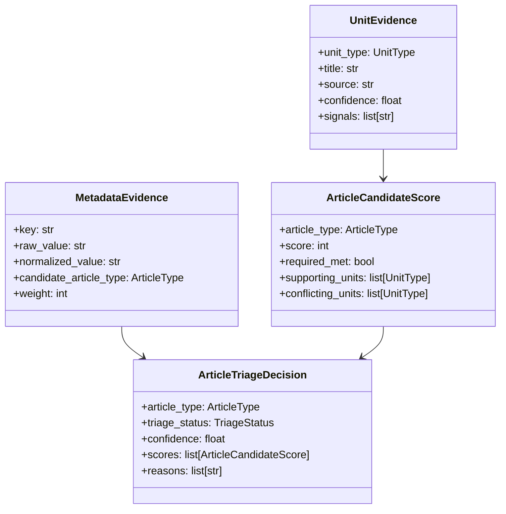
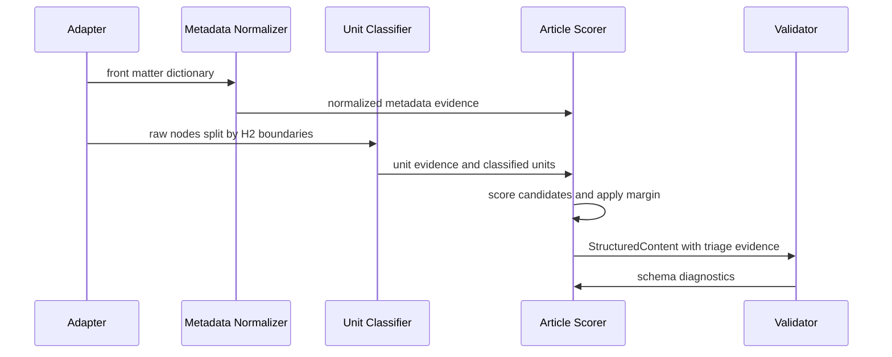

# Parse Assessment Implementation Update

## Purpose

This implementation note converts the findings in [`design/2026-06-28-assess/assess.md`](2026-06-28-assess/assess.md) into a generic parser update plan. The update must improve article triage for arbitrary Markdown content, not add optimized handling for the assessed Azure Stack sample.

## Problem Statement

The current parser preserves source structure well but over-selects `howto` as the article type. The assessment found that all six assessed documents were classified as `howto`, even when source metadata and document construction suggested `concept`, `overview`, `reference`, or generic `topic` content.

The current triage behavior is too sensitive to procedure-like signals. A small amount of procedural or navigation content, especially `Next steps` or action-oriented headings, can dominate the article decision even when the document is mostly conceptual, reference-like, or mixed.

The current model also separates readiness and compliance too loosely. Transform readiness can report `dita:ready` while schema validation reports `validation.valid: false`, so downstream consumers need a more explicit distinction between minimum transform prerequisites and semantic/schema confidence.

## Design Constraints

The parser must remain generic Markdown infrastructure. It may learn from the assessed corpus, but it must not hard-code Azure Stack, Microsoft Docs, product names, service names, or corpus-specific headings as privileged behavior.

The classifier must use generic evidence types. Metadata keys, metadata values, headings, section shapes, component populations, and unit populations can all contribute evidence, but each signal must be represented through a reusable abstraction.

The parser must remain loss-preserving. Unknown article and unit decisions must keep all content in the output model, emit diagnostics, and remain useful for XML serialization and RAG chunking.

The update must keep parser, model, and validation concerns separated. The parser should classify and record evidence; the model should define valid article/unit contracts; the validator should determine compliance.

## Goals

The update should reduce false `howto` classifications. A document should classify as `howto` only when procedure evidence is dominant enough to beat concept, reference, topic, and overview alternatives by a configured confidence margin.

The update should improve generic article triage from weak or namespaced metadata. Common metadata values such as `concept`, `conceptual`, `overview`, `reference`, `how-to`, `tutorial`, `task`, and `article` should be normalized without relying on one vendor's key names.

The update should improve unit classification for ordinary Markdown. Generic headings such as `cheat sheet`, `API version`, `requirements`, `tools`, `best practices`, `examples`, `configuration`, `parameters`, and `limits` should become evidence for reference, fact, principle, concept, or topic units as appropriate.

The update should classify pre-H2 content more usefully. Introductory paragraphs, applies-to notes, and opening summaries before the first H2 should become `introduction` when they are not strongly another unit type.

The update should expose triage evidence for debugging. A developer should be able to inspect why an article was classified, what competing article types scored, and what evidence caused the winning decision.

## Non-Goals

This update should not implement a natural-language classifier. The parser should continue using deterministic metadata, heading, and construction signals rather than semantic reading of arbitrary prose.

This update should not create special cases for the assessed files. Any new keyword, metadata alias, or scoring rule must be justified as a reusable Markdown documentation pattern.

This update should not make schema validation permissive merely to pass the assessed sample. Schema changes should clarify the semantic contract, not hide classification errors.

## Proposed Architecture

The classifier should move from direct type selection to evidence-based triage. Each stage should add structured evidence, and the final article decision should be a scored result with a confidence and reason list.

The article decision should be made after unit construction. Metadata evidence should seed candidate scores, unit evidence should refine them, and the final decision should require both a minimum score and a margin over the second-place candidate.

## Implementation Plan

### 1. Add Generic Metadata Normalization

Metadata normalization should convert diverse front matter keys and values into article evidence. The implementation should scan a configurable list of generic metadata key patterns rather than only `articleType`, `article_type`, and `type`.

Candidate key patterns should include exact keys and suffix matches. Exact keys can include `articleType`, `article_type`, `type`, `topic`, `topic_type`, `content_type`, `document_type`, and `information_type`. Suffix matches can include `.topic`, `.type`, and `.content_type` so namespaced metadata such as `vendor.topic` can contribute evidence without hard-coding the vendor.

Candidate value normalization should map common generic values into article candidates. Examples include `concept`, `conceptual`, and `overview` as concept/overview evidence; `howto`, `how-to`, `task`, and `procedure` as how-to evidence; `reference`, `api`, `schema`, and `configuration` as reference evidence; and `article`, `guide`, or `topic` as generic topic evidence.

Metadata evidence should be weighted but not absolute unless the key is explicitly authorial. A direct `articleType: howto` declaration can remain authoritative by default, while weak metadata such as `topic: article` should seed a candidate without blocking construction evidence.

### 2. Replace Binary Article Signatures with Scored Evidence

Article signatures should score required, preferred, supporting, neutral, and conflicting units. The current `required_any` and `preferred` model is useful but too coarse for mixed Markdown documents.

A how-to article should require dominant procedure evidence. One procedure-like unit should not be enough when the rest of the document is reference, concept, or unknown. `link_nextstep` should be neutral or very low weight rather than preferred evidence for how-to classification.

A topic article should become the normal fallback for mixed known content. If known units exist but no specialized article type wins by margin, the result should be `topic`, not the nearest specialized type.

An unknown article should be reserved for low-evidence content. If the parser can identify meaningful units but cannot select a specialized type, `topic` is the better generic Markdown result.

### 3. Add Confidence Margins

Article triage should require a winning margin. If `howto` scores 7 and `concept` scores 6, the article should become `topic` or `ambiguous` rather than `howto`.

The implementation should define three thresholds. `min_score` is the minimum score for any specialized article. `min_margin` is the required gap over the second-place candidate. `dominance_ratio` is the proportion of known unit evidence that must support the winning type.

The first target values should be conservative. A practical starting point is `min_score = 6`, `min_margin = 3`, and a how-to dominance rule requiring at least one procedure unit plus either multiple procedure units or more procedure weight than non-procedure weight.

### 4. Improve Unit Evidence Without Corpus Specialization

The unit classifier should separate heading evidence from construction evidence. A heading can suggest a unit type, while body shape can confirm, weaken, or override that suggestion.

Generic reference/fact headings should be added. Reusable patterns include `cheat sheet`, `api`, `api version`, `versions`, `limits`, `limitations`, `configuration`, `parameters`, `options`, `settings`, `matrix`, `comparison`, and `differences`.

Generic principle/process headings should be added. Reusable patterns include `best practices`, `guidelines`, `considerations`, `design considerations`, `architecture`, `how it works`, and `lifecycle`.

Generic concept headings should be added. Reusable patterns include `overview`, `introduction`, `about`, `background`, `before creating`, and `understand`.

Construction evidence should classify table-heavy sections as reference or fact when the heading is weak. A section dominated by tables, unordered lists of values, or version lists should not become procedure unless it has ordered steps or imperative step markers.

### 5. Classify Pre-H2 Preamble as Introduction

The section before the first H2 should not default to unknown when it contains ordinary introductory content. If a document has a title and the pre-H2 section contains paragraphs, applies-to notes, images, or brief lists, the unit should be classified as `introduction`.

The preamble should remain unknown when it contains complex or unsupported content that cannot be safely interpreted. The classifier should preserve content either way and record the evidence used for the decision.

### 6. Align Runtime Model and Schema Validation

The runtime model and JSON schema must agree on required fields and enum values. The assessment shows validation failures where known procedure units and prerequisites units are rejected, so the update should include a schema/model alignment pass.

`unitPrerequisites` should have one consistent information type. Either the runtime should emit `fact` for prerequisites, or the schema should accept `concept` if prerequisites are intentionally modeled as conceptual support.

Procedure units should validate with the serialized field names used by the validator. The update should confirm that `procedure_representation` or `procedureRepresentation` is consistently serialized before schema validation.

Validation diagnostics should distinguish source noncompliance from internal schema/model mismatch. If a known runtime unit cannot validate because aliases or schemas disagree, that should be treated as an implementation defect rather than an authoring defect.

### 7. Make Readiness Reflect Semantic Confidence

Readiness should keep minimum prerequisite checks but add semantic quality indicators. `dita:ready` should not imply schema-valid DITA transformation when validation failed or article confidence is low.

The DITA readiness evaluator should report `degraded` when the article type is known but schema validation fails. It should report `ready` only when title, article type, DITA mapping, and schema validation are all acceptable for the selected output mode.

The RAG readiness evaluator should remain more permissive. RAG chunking can be `ready` when units exist and parse errors are absent, but chunks should carry `triage_status`, article confidence, unit confidence, and diagnostic codes in their metadata.

## Generic Scoring Model

The scorer should calculate article scores from multiple evidence families. Metadata evidence should contribute a configurable base weight, unit evidence should contribute the main structural weight, and conflict evidence should subtract from candidates.

| Evidence | Example | Suggested effect |
|---|---|---:|
| Strong explicit metadata | `articleType: reference` | +10 to reference |
| Weak normalized metadata | `topic: conceptual` or namespaced topic metadata | +4 to concept |
| Required unit | `procedure` for how-to | +5 |
| Supporting unit | `prerequisites` for how-to | +2 |
| Neutral unit | `link_nextstep` | 0 or +1 |
| Conflicting unit | `reference` inside how-to-heavy score | -3 |
| Unknown unit | Any `unitUnknown` | -1 to all specialized candidates |
| Dominant table/reference construction | Table-heavy section | +3 to reference/fact |

The scorer should prefer `topic` when evidence is mixed. This preserves generic Markdown better than forcing a specialized article type.

## Acceptance Criteria

The classifier should no longer classify a document as `howto` solely because it has a `Next steps` unit. A document with only introduction/reference/link units should classify as `reference`, `concept`, `topic`, or `unknown` depending on the remaining evidence.

The classifier should classify procedure-heavy documents as `howto`. A document with multiple procedure units and ordered-list construction should continue to classify as `howto`.

The classifier should classify mixed known units as `topic` when no specialized article type wins by margin. This is the expected generic fallback for arbitrary Markdown with recognizable structure.

The classifier should classify pre-H2 opening paragraphs as `introduction` when they are ordinary introductory content. This should reduce recurring unnamed `unitUnknown` diagnostics.

The validator should accept known runtime procedure units when they satisfy the procedure schema. If a known procedure unit with ordered lists fails validation, the failure should be traceable to real schema intent, not field alias mismatch.

The readiness report should distinguish transform possibility from semantic compliance. DITA readiness should become `degraded` or include a blocking reason when validation fails for the selected article type.

## Test Plan

Unit tests should cover metadata normalization across generic keys. Tests should include `articleType`, `type`, `topic`, `content_type`, and a namespaced suffix such as `x.topic` without adding a source-specific dependency.

Unit tests should cover how-to dominance. A document with only `Overview` and `Next steps` should not classify as `howto`, while a document with `Prerequisites`, two procedure sections, and `Next steps` should classify as `howto`.

Unit tests should cover reference-heavy construction. A document with `API version`, `Configuration`, `Parameters`, or table-heavy sections should classify units as reference/fact and should not become how-to unless procedure evidence dominates.

Unit tests should cover concept and overview content. A document with `Overview`, `Background`, `How it works`, and `Considerations` should classify as concept, overview, or topic rather than how-to.

Contract tests should validate the runtime model against schemas. Known units emitted by the classifier should pass their corresponding unit schemas unless the source truly violates the model.

Regression tests should use the assessed outputs as behavioral examples, not as hard-coded fixtures. The expected behavior should be expressed generically: low procedure dominance should not select `howto`, unknown-unit counts should decrease, and mixed content should fall back to `topic`.

## Implementation Sequence

1. Add Pydantic or dataclass evidence models for metadata evidence, unit evidence, candidate scores, and article triage decisions.
2. Implement metadata normalization with generic key/value aliases and suffix matching.
3. Refactor unit classification to emit evidence and confidence in addition to `UnitType`.
4. Replace `_infer_article_type_from_units()` with an evidence scorer that applies minimum score, margin, and dominance rules.
5. Reclassify pre-H2 content as introduction when evidence is sufficient.
6. Align `unitPrerequisites` and procedure unit serialization with the schemas.
7. Update DITA and RAG readiness evaluators to account for validation status and triage confidence.
8. Add unit, contract, and regression tests for the generic behavior.
9. Re-run the assessment sample and compare before/after metrics.

## Expected Result

The improved parser should still consume generic Markdown safely. It should preserve content, produce usable XML and RAG structures, and avoid pretending that uncertain documents are highly specific article types.

The improved article triage should become conservative and evidence-driven. How-to should be selected only for documents whose construction is dominated by procedures, while conceptual, reference, overview, and mixed documents should land in more appropriate article types.

The improved compliance story should become clearer. A document can be structurally parseable, useful for generic XML, degraded for RAG, and not yet schema-compliant for DITA; the tool should expose those distinctions directly rather than collapsing them into a single readiness label.
