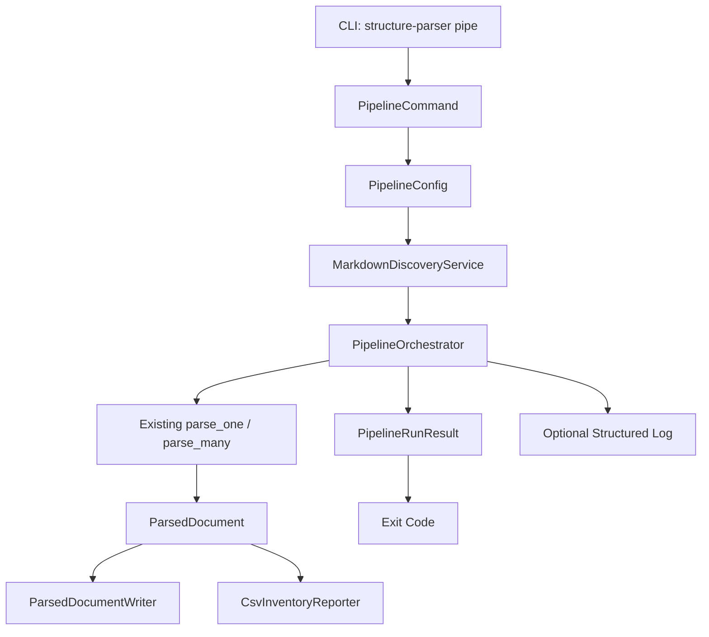
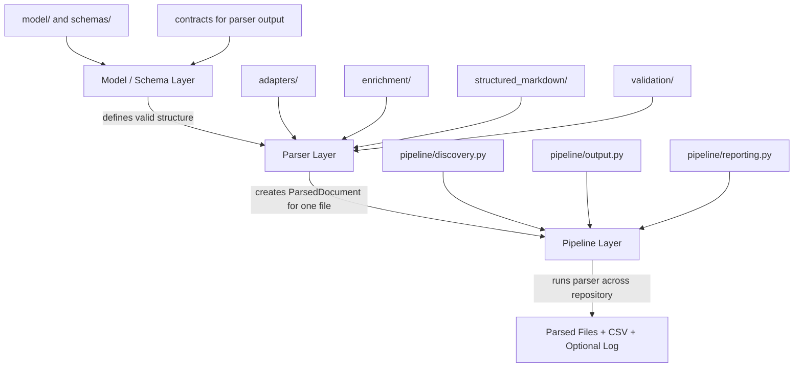
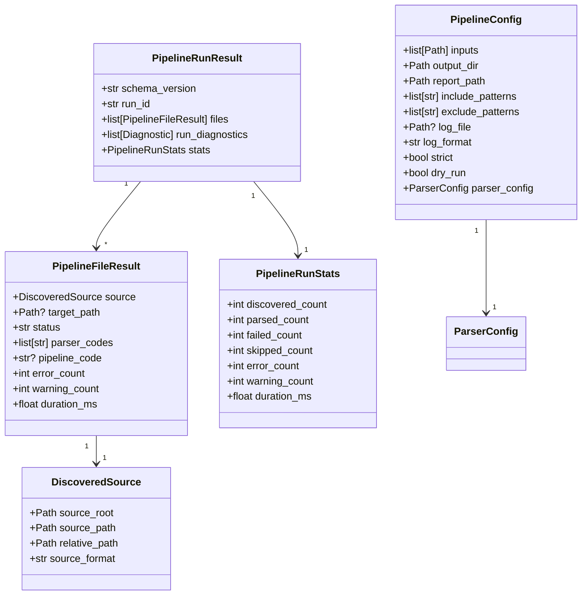
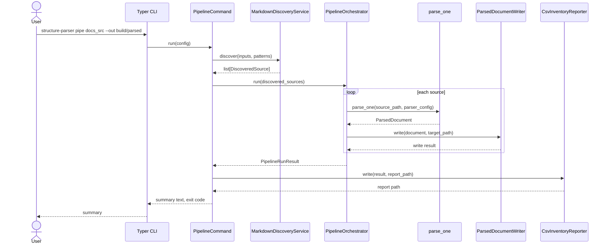
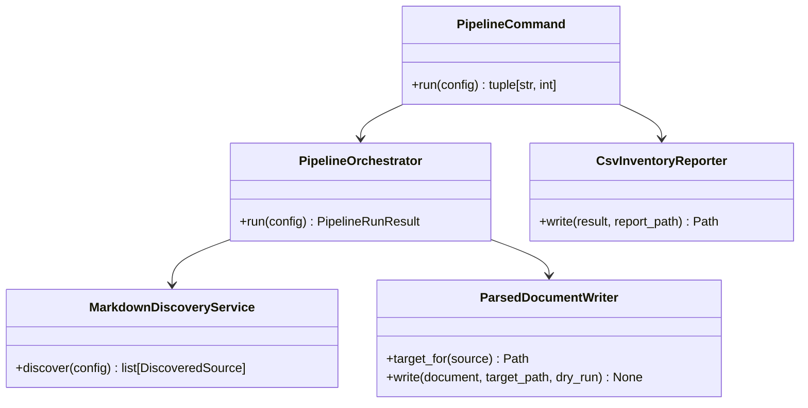

# Pipe the Pipeline: Folder-Based Structured Markdown Processing SRS

## 1. Design

### 1.1 Purpose

This Software Requirements Specification defines a Python CLI pipeline extension for
`structure-parser`. The extension shall allow the existing file-by-file structured
Markdown parser to run across nested folders of Markdown files, produce parsed output
files, emit a CSV inventory report that maps source files to target files and error
codes, and optionally emit a structured log.

The design follows an IEEE 830-style requirements format while remaining aligned with
the current project architecture: Typer CLI commands, layered application services,
Pydantic v2 contracts, stable diagnostic codes, standard Python logging, and
pytest-based unit and integration tests.

### 1.2 Scope

The pipeline shall recursively discover Markdown files in one or more input folders.
For each discovered file, the pipeline shall parse the file through the existing parser
orchestrator, serialize the parsed document to an output folder, and record a row in a
CSV report.

The pipeline shall support content repositories where Markdown files are organized in
nested folders. The output shall preserve relative source paths by default so downstream
systems can map parsed content back to the content repository.

The pipeline shall not replace the existing single-file CLI commands. It shall wrap
existing parser behavior with repository discovery, output routing, reporting, and
run-level operational controls.

### 1.3 Intended Audience

| Audience | Needs |
|---|---|
| Parser developers | Clear module boundaries, contracts, and test strategy. |
| Content architects | Repository-level inventory of parsed content and failures. |
| Documentation engineers | CLI workflow suitable for local and CI use. |
| QA engineers | Deterministic behavior and fixture coverage for success and failure states. |
| CI maintainers | Stable exit codes, CSV reports, optional logs, and predictable output layout. |

### 1.4 Definitions

| Term | Definition |
|---|---|
| Content repository | A folder tree containing Markdown source files and related assets. |
| Pipeline run | One CLI invocation that discovers, parses, writes, and reports on files. |
| Source root | Input folder used as the root for relative path preservation. |
| Target root | Output folder where parsed files and reports are written. |
| Parsed file | Serialized `ParsedDocument` output, normally JSON. |
| Inventory report | CSV file with one row per discovered source file. |
| Pipeline error code | Stable run-level or file-level code emitted by pipeline-specific logic. |
| Parser diagnostic code | Existing `SP-###` diagnostic emitted by parsing, validation, readiness, or internal parser logic. |
| Optional log | Text or JSON-lines log written only when the caller requests a log file. |

### 1.5 Document Conventions

Requirement statements use stable identifiers in the form `PIPE-REQ-###`.

The keywords "shall," "should," and "may" have the following meanings:

- **Shall** indicates a mandatory requirement.
- **Should** indicates a recommended requirement.
- **May** indicates an optional capability.

### 1.6 References

- Existing CLI entry point: `src/structure_parser/cli.py`
- Existing public API: `src/structure_parser/api.py`
- Existing application commands: `src/structure_parser/application/commands.py`
- Existing parser result contracts: `src/structure_parser/contracts/parse_run_result.py`
- Existing diagnostic codes: `src/structure_parser/domain/diagnostic_codes.py`
- Existing repository pattern: `src/structure_parser/repositories/`
- Project quality configuration: `pyproject.toml`

### 1.7 Overall Description

The pipeline shall add repository-scale processing around the existing parser. It shall
be layered so discovery, parse orchestration, output writing, reporting, and logging can
be tested independently.



**Purpose and coverage:** This diagram shows the proposed pipeline as a CLI-facing
wrapper around the existing parser. The existing parser remains authoritative for
document parsing, diagnostics, structured Markdown classification, validation, and
readiness evaluation.

#### 1.7.1 Architectural Segmentation

The system shall maintain a clean segmentation between the model, the parser, and the
pipeline.

The model and schema layer defines the semantic contract for structured Markdown. It
describes valid articles, units, components, attributes, diagnostics, readiness
contracts, and parser-output contracts. The model layer shall not discover files, parse
Markdown syntax, write repository outputs, or manage pipeline execution.

The parser layer turns one source file into the model. It reads Markdown or HTML,
builds raw structure, enriches the result, classifies structured Markdown content,
validates against the schema contracts, evaluates transform readiness, and returns a
`ParsedDocument`. The parser layer shall remain file-oriented.

The pipeline layer operates above the parser. It discovers nested Markdown files,
calculates target paths, calls the parser once per file, writes parsed outputs, emits a
CSV inventory, manages optional logs, and summarizes run status. The pipeline shall not
define content semantics or parse Markdown directly.



**Purpose and coverage:** This diagram makes the ownership boundaries explicit:
schema defines structure, the parser creates structured output for one file, and the
pipeline executes parser runs across a content repository.

PIPE-REQ-062: The model/schema layer shall remain the authoritative definition of
structured content semantics.

PIPE-REQ-063: The parser layer shall remain the authoritative implementation for
turning one source file into a `ParsedDocument`.

PIPE-REQ-064: The pipeline layer shall call the parser layer and shall not implement
Markdown syntax parsing, structured Markdown classification, schema validation, or
transform-readiness evaluation.

PIPE-REQ-065: Pipeline contracts shall describe operational run state, including source
paths, target paths, statuses, counts, run identifiers, parser diagnostic codes, and
pipeline error codes.

PIPE-REQ-066: Pipeline contracts shall not redefine article, unit, component, attribute,
or structured Markdown schema concepts.

PIPE-REQ-067: Parser diagnostic codes and pipeline error codes shall remain separate
namespaces so content diagnostics and repository-run failures can be interpreted
independently.

### 1.8 Product Functions

The pipeline shall provide the following functions:

- Recursively discover Markdown source files from nested folders.
- Exclude ignored folders and files by explicit CLI patterns.
- Preserve relative folder structure in the output folder by default.
- Parse each Markdown file through the existing parser layer.
- Write one parsed output file per source file.
- Write a CSV inventory report with source, target, status, and diagnostic codes.
- Emit run-level statistics.
- Return deterministic CLI exit codes.
- Optionally write a structured log file.
- Support unit, contract, and integration tests.

### 1.9 User Characteristics

The primary users are documentation engineers and CI maintainers who already use the
single-file parser but need repository-level processing. Users are expected to be
comfortable with command-line workflows and content repository paths.

### 1.10 Operating Environment

PIPE-REQ-001: The pipeline shall run on Python 3.11 or later.

PIPE-REQ-002: The pipeline shall be available through the existing Typer CLI.

PIPE-REQ-003: The pipeline shall run locally and in CI without requiring network access.

PIPE-REQ-004: The pipeline shall use file-system-based inputs and outputs.

PIPE-REQ-005: The pipeline shall support POSIX and Windows-style paths through
`pathlib.Path`.

### 1.11 Design Constraints

PIPE-REQ-006: The pipeline shall follow PEP 8 and the current Ruff line length of 100.

PIPE-REQ-007: Public and cross-layer contracts shall use Pydantic v2 models.

PIPE-REQ-008: Python comments and docstrings shall follow the existing Sphinx-style
project convention using `:param:`, `:returns:`, `:raises:`, and `:side effects:` where
appropriate.

PIPE-REQ-009: Pipeline layers shall not reimplement Markdown parsing.

PIPE-REQ-010: The pipeline shall call existing parser application APIs for document
parsing.

PIPE-REQ-011: Reporting shall consume Pydantic contracts and pipeline result models,
not raw parser internals.

PIPE-REQ-012: Logging shall use the standard `logging` package and the existing
`structure_parser.logging_config` conventions.

PIPE-REQ-013: The pipeline shall avoid destructive writes to source folders.

PIPE-REQ-014: The pipeline shall create output folders when needed.

PIPE-REQ-015: The pipeline shall fail fast on invalid CLI configuration before parsing
content.

### 1.12 System Features

#### 1.12.1 Recursive Discovery

PIPE-REQ-016: The pipeline shall accept one or more input paths.

PIPE-REQ-017: Input paths may be Markdown files or folders.

PIPE-REQ-018: Folder inputs shall be scanned recursively by default.

PIPE-REQ-019: The default file include pattern shall match `.md` and `.markdown`.

PIPE-REQ-020: The caller may provide additional include patterns.

PIPE-REQ-021: The caller may provide exclude patterns for folders or files.

PIPE-REQ-022: The pipeline shall produce deterministic discovery order by sorting
relative paths.

PIPE-REQ-023: The pipeline shall emit a file-level inventory row for unreadable,
unsupported, or skipped files when those files were discovered as candidate Markdown
sources.

#### 1.12.2 Output Routing

PIPE-REQ-024: The pipeline shall require an output directory.

PIPE-REQ-025: The pipeline shall write parsed documents under the output directory.

PIPE-REQ-026: By default, the pipeline shall preserve the source path relative to the
nearest source root.

PIPE-REQ-027: Parsed output file names shall use the source file name plus `.json`, for
example `guide/install.md` becomes `guide/install.md.json`.

PIPE-REQ-028: The pipeline may support a future output naming policy that replaces
`.md` with `.json`.

PIPE-REQ-029: The pipeline shall write only parsed outputs, inventory reports, and
optional logs to the output directory.

#### 1.12.3 CSV Inventory Report

PIPE-REQ-030: The pipeline shall write a CSV report for every run.

PIPE-REQ-031: The report path shall default to `<output-dir>/pipeline-inventory.csv`.

PIPE-REQ-032: The caller may provide a custom report path.

PIPE-REQ-033: The CSV shall include a header row.

PIPE-REQ-034: The CSV shall include one row per candidate source file.

PIPE-REQ-035: The CSV shall include source path, target path, status, parser diagnostic
codes, pipeline error code, error count, warning count, and elapsed milliseconds.

PIPE-REQ-036: Diagnostic codes in the CSV shall be separated by semicolons.

PIPE-REQ-037: The CSV writer shall use Python's `csv` module to avoid ad hoc escaping.

Recommended CSV columns:

| Column | Description |
|---|---|
| `run_id` | Stable ID for this pipeline invocation. |
| `source_root` | Source root used to compute the relative path. |
| `source_path` | Absolute or caller-supplied source path. |
| `relative_path` | Path from source root to source file. |
| `target_path` | Parsed output path. |
| `status` | `parsed`, `parsed_with_warnings`, `failed`, or `skipped`. |
| `parser_codes` | Semicolon-delimited `SP-###` codes from the parsed document. |
| `pipeline_code` | Pipeline-specific code, if any. |
| `error_count` | Number of error diagnostics for the file. |
| `warning_count` | Number of warning diagnostics for the file. |
| `duration_ms` | File-level elapsed processing time. |

#### 1.12.4 Optional Logging

PIPE-REQ-038: The pipeline shall not write a log file unless requested.

PIPE-REQ-039: The caller may request a log file path.

PIPE-REQ-040: The caller may request text logs or JSON-lines logs.

PIPE-REQ-041: The log shall include run start, discovery summary, file parse start,
file parse completion, file write completion, report write completion, and run summary.

PIPE-REQ-042: The log shall include `run_id` and `relative_path` when available.

#### 1.12.5 Exit Codes

PIPE-REQ-043: The CLI shall exit `0` when all candidate files parse without error
diagnostics.

PIPE-REQ-044: The CLI shall exit `1` when one or more files have parser error
diagnostics or pipeline failures.

PIPE-REQ-045: The CLI shall exit `2` when CLI configuration is invalid.

PIPE-REQ-046: The CLI may support a strict option that exits `1` when warnings are
present.

#### 1.12.6 Pipeline Error Codes

Pipeline-specific codes shall be distinct from existing `SP-###` parser diagnostics.
The recommended namespace is `PIPE-###`.

| Code | Severity | Meaning | Remediation |
|---|---|---|---|
| `PIPE-001` | error | Input path does not exist. | Check the supplied input path. |
| `PIPE-002` | error | Output path is invalid or cannot be created. | Choose a writable output directory. |
| `PIPE-003` | error | Report path is invalid or cannot be written. | Choose a writable report path. |
| `PIPE-004` | warning | No Markdown files were discovered. | Check include and exclude patterns. |
| `PIPE-005` | error | Parsed output file could not be written. | Check permissions and disk space. |
| `PIPE-006` | error | Source and output roots overlap unsafely. | Use a separate output directory. |
| `PIPE-007` | error | Duplicate relative output path detected. | Adjust source roots or output policy. |
| `PIPE-099` | error | Unexpected pipeline failure. | Re-run with logs and report the failure. |

### 1.13 External Interface Requirements

#### 1.13.1 CLI Interface

The preferred command name is `pipe`:

```bash
structure-parser pipe docs_src --out build/parsed
```

Recommended options:

```text
structure-parser pipe INPUT... \
  --out OUTPUT_DIR \
  [--report REPORT_CSV] \
  [--include PATTERN] \
  [--exclude PATTERN] \
  [--log-file LOG_FILE] \
  [--log-format text|jsonl] \
  [--strict] \
  [--debug] \
  [--dry-run]
```

PIPE-REQ-047: `INPUT` shall accept one or more file or folder paths.

PIPE-REQ-048: `--out` shall be required.

PIPE-REQ-049: `--report` shall be optional.

PIPE-REQ-050: `--include` and `--exclude` shall be repeatable.

PIPE-REQ-051: `--dry-run` shall discover files and write the report without writing
parsed output files.

PIPE-REQ-052: Human-readable CLI output shall summarize discovered, parsed, failed,
skipped, error, and warning counts.

#### 1.13.2 Python API Interface

PIPE-REQ-053: The implementation should expose a Python API entry point:

```python
from structure_parser.pipeline import run_pipeline
from structure_parser.contracts.pipeline import PipelineConfig

result = run_pipeline(
    PipelineConfig(
        inputs=["docs_src"],
        output_dir="build/parsed",
        report_path="build/parsed/pipeline-inventory.csv",
    )
)
```

### 1.14 Pydantic Contract Model



**Purpose and coverage:** This UML class diagram defines the public and cross-layer
Pydantic contracts for the pipeline. `ParsedDocument` remains the parser output
contract and is intentionally not duplicated here.

### 1.15 Pipeline Sequence



### 1.16 Nonfunctional Requirements

PIPE-REQ-054: The pipeline shall process files independently so a single file failure
does not stop the whole run unless the configuration explicitly enables fail-fast in a
future version.

PIPE-REQ-055: Results shall be deterministic for a fixed input tree and configuration.

PIPE-REQ-056: The pipeline shall be memory-conscious by writing parsed files as each
file completes rather than requiring all serialized documents to remain in memory.

PIPE-REQ-057: The pipeline should support future concurrency without changing the CSV
or result contract.

PIPE-REQ-058: The first implementation may process files sequentially.

PIPE-REQ-059: File writes shall be UTF-8 encoded.

PIPE-REQ-060: CSV report writes shall be UTF-8 encoded with newline handling compatible
with Python's `csv` module.

PIPE-REQ-061: The pipeline shall avoid writing parsed output into an input folder unless
the user explicitly enables that behavior in a future option.

### 1.17 Assumptions

| ID | Assumption |
|---|---|
| PIPE-ASM-001 | Markdown remains the first supported repository-scale source format. |
| PIPE-ASM-002 | Parsed output format is JSON in the first implementation. |
| PIPE-ASM-003 | Existing `ParsedDocument` and `Diagnostic` contracts remain authoritative. |
| PIPE-ASM-004 | Existing parser diagnostic codes remain unchanged. |
| PIPE-ASM-005 | Pipeline-specific operational failures need a separate code namespace. |
| PIPE-ASM-006 | Sequential execution is acceptable for the first version. |

### 1.18 Open Questions

| ID | Question | Impact |
|---|---|---|
| PIPE-OQ-001 | Should output names preserve `.md.json` or replace `.md` with `.json`? | Affects target-path compatibility. |
| PIPE-OQ-002 | Should reports use absolute paths or caller-supplied relative paths by default? | Affects reproducibility across machines. |
| PIPE-OQ-003 | Should skipped non-Markdown files be inventoried when discovered by folder walk? | Affects report completeness and noise. |
| PIPE-OQ-004 | Should the first version include parallel parsing? | Affects logging order and testing complexity. |

## 2. Implementation

### 2.1 Proposed Package Structure

The implementation shall extend the existing package without disrupting current parser
layers.

```text
src/structure_parser/
├── pipeline/
│   ├── __init__.py
│   ├── discovery.py
│   ├── orchestrator.py
│   ├── output.py
│   └── reporting.py
├── contracts/
│   └── pipeline.py
└── application/
    └── commands.py
```

Recommended responsibilities:

| Module | Responsibility |
|---|---|
| `contracts/pipeline.py` | Operational Pydantic contracts for configuration, discovered files, file results, run stats, and run result. These contracts reference parser diagnostics but do not redefine structured Markdown content schema. |
| `pipeline/discovery.py` | Recursive Markdown discovery, include/exclude matching, and deterministic ordering. |
| `pipeline/output.py` | Target path calculation, output safety checks, parsed document serialization, and dry-run handling. |
| `pipeline/reporting.py` | CSV inventory writer. |
| `pipeline/orchestrator.py` | End-to-end pipeline coordination around existing parser calls. |
| `application/commands.py` | `PipelineCommand` wrapper for CLI-friendly output and exit code selection. |
| `cli.py` | Typer command registration. |

### 2.2 Contract Details

`contracts/pipeline.py` shall define Pydantic models with strict, typed fields. Field
names shall use snake_case in Python and may use aliases only when a downstream JSON
contract requires them.

Pipeline contracts shall be operational contracts. They shall describe repository-scale
execution state, not content-model semantics. They may reference `ParserConfig`,
`Diagnostic`, and parser diagnostic codes, but they shall not duplicate or reinterpret
the structured Markdown schema for articles, units, components, or attributes.

Recommended model skeleton:

```python
"""Pydantic contracts for repository-scale parser pipeline runs."""
from __future__ import annotations

from pathlib import Path

from pydantic import BaseModel, Field

from structure_parser.contracts.config import ParserConfig
from structure_parser.contracts.diagnostics import Diagnostic


class PipelineConfig(BaseModel):
    """Configuration for one folder-based pipeline run.

    :param inputs:
        Source files or folders selected by the caller.
    :param output_dir:
        Directory where parsed output files are written.
    :param report_path:
        Optional CSV inventory path. Defaults to
        ``output_dir / "pipeline-inventory.csv"``.
    :param parser_config:
        Existing parser configuration applied to every source file.
    """

    inputs: list[Path]
    output_dir: Path
    report_path: Path | None = None
    include_patterns: list[str] = Field(default_factory=lambda: ["*.md", "*.markdown"])
    exclude_patterns: list[str] = Field(default_factory=list)
    log_file: Path | None = None
    log_format: str = "text"
    strict: bool = False
    dry_run: bool = False
    parser_config: ParserConfig = Field(default_factory=ParserConfig)
```

Additional models:

- `DiscoveredSource`
- `PipelineFileStatus`
- `PipelineFileResult`
- `PipelineRunStats`
- `PipelineRunResult`

Where practical, status values should use `enum.StrEnum` or the project's existing enum
style to avoid string drift.

### 2.3 Discovery Layer

`MarkdownDiscoveryService` shall accept `PipelineConfig` and return
`list[DiscoveredSource]`.

Implementation rules:

- Use `Path.rglob` for recursive folder discovery.
- Sort results by `(source_root, relative_path.as_posix())`.
- Use `fnmatch.fnmatch` for include and exclude pattern matching.
- Treat explicit file inputs as candidates when they match supported Markdown suffixes.
- Emit `PIPE-001` for missing input paths.
- Emit `PIPE-004` when no Markdown candidates are discovered.
- Avoid hidden special behavior for `.git`, `node_modules`, or `site`; callers can pass
  exclude patterns in the first version.

The layer shall not parse file content.

### 2.4 Output Layer

`ParsedDocumentWriter` shall calculate the target path and serialize each
`ParsedDocument`.

Implementation rules:

- Preserve the discovered source relative path.
- Append `.json` to the source file name for first-version output.
- Create parent directories before writing.
- Write `doc.model_dump(mode="json", by_alias=True)` with `json.dumps(..., indent=2)`.
- Use `ensure_ascii=False` to match existing JSON output behavior.
- In dry-run mode, calculate paths but do not write files.
- Emit `PIPE-005` if writing fails.
- Detect duplicate target paths before parsing and emit `PIPE-007`.
- Detect unsafe source/output overlap before parsing and emit `PIPE-006`.

### 2.5 Reporting Layer

`CsvInventoryReporter` shall write the inventory after orchestration completes. It shall
consume `PipelineRunResult`.

Implementation rules:

- Use `csv.DictWriter`.
- Use a stable field list.
- Serialize paths as POSIX-style strings where possible for portability.
- Join diagnostic code lists with semicolons.
- Write the report even when some files fail, unless the report path itself is invalid.
- Emit `PIPE-003` when report writing fails.

Recommended field list:

```python
CSV_FIELDS = [
    "run_id",
    "source_root",
    "source_path",
    "relative_path",
    "target_path",
    "status",
    "parser_codes",
    "pipeline_code",
    "error_count",
    "warning_count",
    "duration_ms",
]
```

### 2.6 Orchestration Layer

`PipelineOrchestrator` shall coordinate discovery results, parsing, writing, file-level
result construction, and run statistics.



Implementation rules:

- Generate a `run_id` at the start of the run using `uuid.uuid4().hex`.
- Measure durations with `time.perf_counter`.
- Use existing `parse_one(path, config.parser_config)` for each source file.
- Treat `ParsedDocument` as the parser-owned content result and avoid inspecting raw
  adapter or enrichment internals from pipeline code.
- Treat `ParsedDocument.has_errors` as file failure for exit-code purposes.
- Treat warnings as non-failing unless `strict=True`.
- Capture unexpected exceptions and convert them to `PIPE-099` file results or run
  diagnostics.
- Never let one failed file prevent later files from being attempted.

### 2.7 CLI Command

Add a Typer command to `src/structure_parser/cli.py`:

```python
@app.command("pipe")
def cmd_pipe(
    inputs: Annotated[list[Path], typer.Argument(help="Files or folders to process.")],
    output_dir: Annotated[Path, typer.Option("--out", help="Parsed output directory.")],
    report_path: Annotated[Path | None, typer.Option("--report", help="CSV report path.")] = None,
    include_patterns: Annotated[list[str] | None, typer.Option("--include")] = None,
    exclude_patterns: Annotated[list[str] | None, typer.Option("--exclude")] = None,
    log_file: Annotated[Path | None, typer.Option("--log-file")] = None,
    log_format: Annotated[str, typer.Option("--log-format")] = "text",
    strict: _StrictOption = False,
    debug: _DebugOption = False,
    dry_run: Annotated[bool, typer.Option("--dry-run")] = False,
) -> None:
    """Parse a nested Markdown content repository into files and a CSV inventory."""
```

The CLI function shall construct `PipelineConfig`, call `PipelineCommand().run(...)`,
echo the returned summary text, and raise `typer.Exit(exit_code)`.

### 2.8 Logging

The pipeline should reuse `configure_logging(debug=True)` for console debug behavior and
add file handlers only when `PipelineConfig.log_file` is set.

Recommended event names:

| Event | When emitted |
|---|---|
| `pipeline.start` | After config validation. |
| `pipeline.discovery.complete` | After source discovery. |
| `pipeline.file.start` | Before parsing one file. |
| `pipeline.file.parsed` | After parser returns a `ParsedDocument`. |
| `pipeline.file.written` | After parsed output write succeeds. |
| `pipeline.file.failed` | After parser or writer failure. |
| `pipeline.report.written` | After CSV report write succeeds. |
| `pipeline.complete` | At end of run. |

### 2.9 Unit Tests

Recommended unit tests:

| Test file | Coverage |
|---|---|
| `tests/unit/test_pipeline_contracts.py` | Pydantic defaults, report default handling, status enum serialization. |
| `tests/unit/test_pipeline_discovery.py` | Nested folder discovery, include/exclude patterns, deterministic ordering, missing paths. |
| `tests/unit/test_pipeline_output.py` | Target path calculation, dry-run behavior, duplicate detection, JSON serialization. |
| `tests/unit/test_pipeline_reporting.py` | CSV headers, semicolon diagnostic codes, failed/skipped rows, newline handling. |
| `tests/unit/test_pipeline_orchestrator.py` | Per-file success/failure aggregation, strict warning behavior, exception conversion. |
| `tests/unit/test_cli_pipeline_command.py` | Summary text and exit codes. |

### 2.10 Integration Tests

Recommended integration tests:

| Test file | Coverage |
|---|---|
| `tests/integration/test_pipeline_end_to_end.py` | Nested fixture repository to parsed files plus CSV report. |
| `tests/integration/test_pipeline_dry_run.py` | CSV generated without parsed output files. |
| `tests/integration/test_pipeline_error_inventory.py` | Missing/bad files represented in report with codes. |
| `tests/integration/test_pipeline_cli.py` | `structure-parser pipe` through Typer test runner. |

Suggested fixture shape:

```text
tests/fixtures/content_repo/
├── index.md
├── guide/
│   ├── install.md
│   └── configure.md
└── reference/
    └── api.md
```

### 2.11 Acceptance Criteria

The implementation is complete when:

- `structure-parser pipe tests/fixtures/content_repo --out <tmpdir>` writes one parsed
  JSON file for each Markdown fixture.
- The CSV report contains one row per Markdown fixture.
- The CSV report includes source path, relative path, target path, status, parser
  diagnostic codes, pipeline code, error count, warning count, and duration.
- The CLI exits `0` for clean fixtures.
- The CLI exits `1` when any parsed file has error diagnostics.
- The CLI exits `1` in strict mode when any parsed file has warnings.
- `--dry-run` writes the CSV report but no parsed JSON files.
- Optional logging writes a log only when `--log-file` is supplied.
- Unit and integration tests pass with `pytest`.
- Ruff and mypy remain clean under the existing `pyproject.toml` settings.

### 2.12 Implementation Order

1. Add `contracts/pipeline.py` with Pydantic contracts and status enum.
2. Add `pipeline/discovery.py` and unit tests.
3. Add `pipeline/output.py` and unit tests.
4. Add `pipeline/reporting.py` and unit tests.
5. Add `pipeline/orchestrator.py` and unit tests.
6. Add `PipelineCommand` to `application/commands.py`.
7. Register `structure-parser pipe` in `cli.py`.
8. Add nested content repository fixtures.
9. Add end-to-end integration tests.
10. Update README and CLI docs after behavior is stable.

### 2.13 Risks and Mitigations

| Risk | Impact | Mitigation |
|---|---|---|
| Output directory overlaps source repository. | Pipeline may discover generated JSON or clutter source tree. | Detect overlap and fail with `PIPE-006`. |
| Multiple input roots produce the same relative target path. | Parsed output may overwrite another file. | Detect duplicates before parsing and fail with `PIPE-007`. |
| CSV path cannot be written after parsing succeeds. | User loses inventory despite parsed files existing. | Validate report parent before parsing and emit `PIPE-003`. |
| Future concurrency changes row order. | CI comparisons become noisy. | Sort discovery and preserve ordered result aggregation. |
| Parser diagnostics change over time. | Report assertions become brittle. | Test report shape and known stable codes separately. |

### 2.14 Example User Workflow

```bash
structure-parser pipe docs_src \
  --out build/structured-markdown \
  --report build/structured-markdown/inventory.csv \
  --exclude "site/*" \
  --exclude ".git/*" \
  --log-file build/structured-markdown/pipeline.jsonl \
  --log-format jsonl
```

Expected output:

```text
Pipeline parsed 24 Markdown file(s) in 842ms
  Parsed: 23  Failed: 1  Skipped: 0
  Errors: 1  Warnings: 7
  Output: build/structured-markdown
  Report: build/structured-markdown/inventory.csv
  Log: build/structured-markdown/pipeline.jsonl
```
