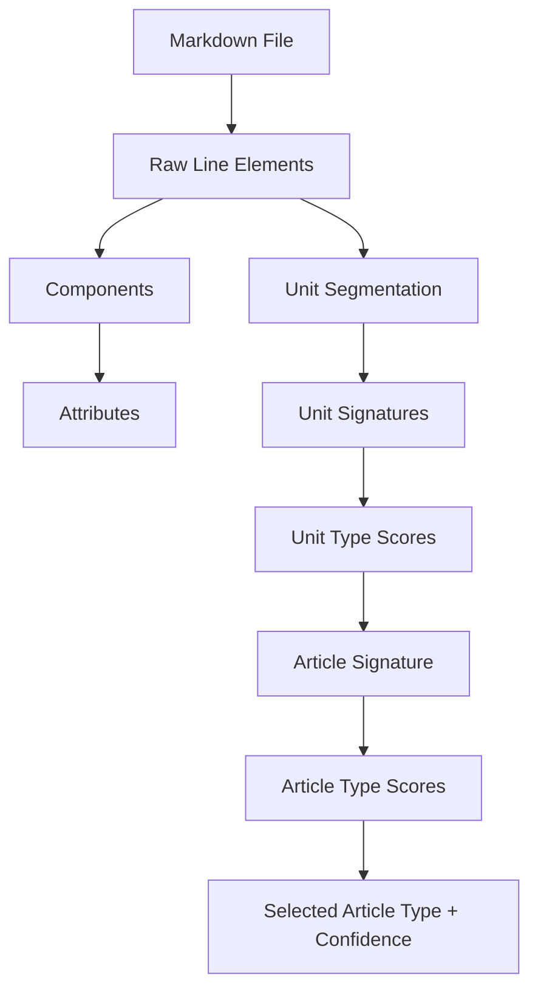

# Technical Note: Article Triage from Metadata and Document Construction

## 1. Summary

The analysis makes sense. The strongest version of the approach treats article type
classification as a two-signal triage problem:

1. **Declared metadata signal** from YAML front matter, when present.
2. **Constructed document signal** inferred from the parsed Markdown structure.

The key design point is that article triage should not rely only on metadata. Metadata
may be missing, inconsistent, nonstandard, or copied from another system. The parser
should therefore reconstruct the document from parsed line elements upward, classify
units from populations of line elements, and classify articles from populations of unit
types.

The pipeline should not perform this work. The pipeline should run the parser across
many files and preserve the parser's article triage output in parsed JSON, reports, and
logs.

## 2. Proposed Vocabulary

| Term | Meaning |
|---|---|
| Metadata signal | YAML front matter key/value evidence that may declare an article type. |
| Construction signal | Evidence inferred from the actual Markdown document structure. |
| Line element | A parsed block-level Markdown element such as a heading, paragraph, list, table, code block, block quote, alert, include, image block, or metadata block. |
| Attribute | Inline content inside a line element, such as text, link, image, emphasis, code span, or anchor. |
| Unit | A document segment containing a population of line elements. |
| Unit signature | The normalized set of line element types, heading markers, metadata, and structural features used to compare a unit to known unit types. |
| Article signature | The normalized set of unit types, unit order, article metadata, and structural features used to compare an article to known article types. |
| Triage | Classification with evidence, confidence, and fallback behavior. |

## 3. Core Analysis

The proposed triage model has two entry points.

The first entry point is the YAML metadata header. If front matter exists, the parser
should search for article-type candidate keys, normalize their values, and determine
whether the value maps to an existing article schema. The challenge is not simply
reading YAML. The challenge is identifying which metadata keys are semantically relevant
and whether their values match the structured Markdown model.

The second entry point is document construction. The parser should identify line
elements, map those line elements to components and attributes, segment the document
into units, classify those units by comparing their line-element populations to known
unit signatures, and then classify the article by comparing its unit population to known
article signatures.

This is a good fit for the current model:

```text
Markdown source
    ↓
Raw line elements
    ↓
Components and attributes
    ↓
Units as populations of line elements
    ↓
Article as a population of units
    ↓
Article type with confidence and diagnostics
```

## 4. Review and Ranking

Scores are 1-10, where 10 means the approach is ready to implement with clear
boundaries, testability, and diagnostic behavior.

| Category | Current Score | Why | Bring to 10 |
|---|---:|---|---|
| Conceptual correctness | 9 | The bottom-up model is sound and matches the article → unit → component → attribute hierarchy. | State that metadata is evidence, not truth, and that constructed structure can confirm or challenge it. |
| Model/parser/pipeline separation | 8 | The analysis implies parser ownership but does not explicitly exclude the pipeline. | Define article triage as parser/model behavior only; pipeline only records outcomes. |
| Metadata handling | 7 | It identifies the key/value problem but needs a normalization and schema-mapping strategy. | Add key aliases, value aliases, canonical values, schema existence checks, and conflict diagnostics. |
| Line-element reconstruction | 8 | The line-element-up reconstruction is right, but "line element" needs a stable contract. | Define line elements as parsed block nodes with provenance and map them to components before unit scoring. |
| Attribute handling | 7 | Attribute reconstruction is included but not yet tied to classification. | Use attributes as secondary evidence, especially links, images, code spans, anchors, and emphasized terms. |
| Unit segmentation | 8 | H2/H3 markers are a practical segmentation base. | Define H2 as the default unit boundary, H3 as nested/subunit evidence, and support fallback segmentation for unitless files. |
| Unit type scoring | 8 | The "population of line elements as a set" idea is strong. | Use weighted signatures rather than plain sets so ordered lists, code blocks, tables, and headings carry different weights. |
| Article type scoring | 8 | The "population of unit types as a set" model is right. | Score article signatures using unit types, unit order, required/optional units, and negative evidence. |
| Fallback behavior | 7 | Unknown unit and topic fallback are sensible but need confidence semantics. | Fall back to `unknown` for units, `topic` or `unknown` for articles based on explicit policy, and always emit evidence diagnostics. |
| Diagnostics and testability | 7 | The analysis implies triage but not traceable explanations. | Emit structured evidence, confidence, candidate scores, selected schema, and stable diagnostics with fixture tests. |

## 5. Target Design at 10

### 5.1 Principle

Article type identification should be an evidence-based parser process. The parser
should collect metadata evidence and construction evidence, score them against known
schemas, choose the best supported type, and preserve the reason for that choice.

### 5.2 Signal Family 1: Metadata

The parser should inspect YAML front matter when present.

Metadata triage should include:

- Candidate key detection.
- Key normalization.
- Value normalization.
- Alias mapping.
- Schema compatibility lookup.
- Confidence scoring.
- Conflict reporting.

Candidate metadata keys:

```text
articleType
article_type
type
contentType
content_type
docType
document_type
topicType
topic_type
```

Candidate values should be normalized before lookup:

| Raw Value | Canonical Article Type |
|---|---|
| `howto` | `howto` |
| `how-to` | `howto` |
| `how_to` | `howto` |
| `procedure` | `howto` |
| `concept` | `concept` |
| `reference` | `reference` |
| `troubleshoot` | `troubleshooting` |
| `troubleshooting` | `troubleshooting` |
| `quickstart` | `quickstart` |
| `quick-start` | `quickstart` |
| `tutorial` | `tutorial` |
| `glossary` | `glossary` |
| `glossentry` | `glossentry` |
| `topic` | `topic` |

The parser should check whether the canonical article type maps to an existing schema,
such as `artHowto.schema.json` or `artReference.schema.json`. If the value does not map
to an existing schema, the parser should retain the raw metadata but avoid treating it as
authoritative.

### 5.3 Signal Family 2: Document Construction

The parser should reconstruct the document from parsed Markdown structure.

Recommended construction flow:



The construction signal should be based on typed parser output, not regular expression
matching against raw source text after parsing.

### 5.4 Line Element Identification

A line element should be a block-level parsed node with provenance. Examples:

| Line Element | Classification Use |
|---|---|
| H1 heading | Article title evidence. |
| H2 heading | Primary unit boundary by default. |
| H3 heading | Secondary section marker or nested unit evidence. |
| Paragraph | General concept or explanatory evidence. |
| Ordered list | Strong procedure evidence. |
| Unordered list | Concept, reference, or prerequisite evidence depending on context. |
| Code block | Procedure, tutorial, quickstart, or reference evidence depending on heading and surrounding elements. |
| Table | Strong reference evidence. |
| Alert | Troubleshooting, prerequisite, or advisory evidence depending on type and text. |
| Block quote | Quoted/reference or unknown evidence depending on context. |
| Link list | Related-links or next-step unit evidence. |

Attributes should be extracted inside components and used as secondary evidence. For
example, dense links can strengthen related-link or reference classification, while code
spans can strengthen technical reference or procedure classification.

### 5.5 Unit Segmentation

Default segmentation should use H2 headings as unit boundaries.

H3 headings should not automatically become top-level units. They should usually remain
inside the current H2 unit as nested structure or component evidence. A future profile
may allow H3-based unit segmentation for content sets that use H1 → H3 without H2.

Fallback segmentation should handle files without H2 headings:

- If the file has an H1 and body content, create one unknown unit containing the body.
- If the file has repeated H3 headings but no H2 headings, create candidate units from
  H3 groups and mark segmentation confidence as degraded.
- If the file has no headings, create one unknown unit and emit a diagnostic.

### 5.6 Unit Type Scoring

A unit type should be treated as a weighted signature, not a simple yes/no rule.

Example unit signatures:

| Unit Type | Strong Evidence | Supporting Evidence | Negative Evidence |
|---|---|---|---|
| `introduction` | Heading contains introduction/overview; early position. | Paragraph-heavy; low procedural density. | Long ordered procedure sequence. |
| `prerequisites` | Heading contains prerequisites/requirements/before you begin. | Unordered list; alert; links to setup docs. | Glossary table or related-link list. |
| `procedure` | Ordered list; imperative step headings; code blocks. | Heading contains steps/procedure/configure/install. | Table-only content. |
| `reference` | Tables; definition lists; heading contains reference/API/options. | Code spans; dense terms; short factual rows. | Narrative-only paragraphs. |
| `troubleshooting` | Heading contains troubleshoot/error/fix. | Problem/solution language; alerts; code blocks. | Pure introductory prose. |
| `glossary` | Heading contains glossary/terms. | Term-definition pattern; table of terms. | Step sequence. |
| `link-nextstep` | Heading contains next steps/next step. | Link list near article end. | Long explanatory body. |
| `link-related` | Heading contains related/see also. | Dense links; near article end. | Ordered procedure steps. |

Each unit should receive candidate scores:

```text
procedure: 0.82
reference: 0.31
concept: 0.24
unknown: 0.10
```

The selected unit type should be the highest scoring type above a configured threshold.
If no type clears the threshold, the unit should fall back to `unknown`.

### 5.7 Article Type Scoring

An article type should be treated as a weighted population of unit types.

Example article signatures:

| Article Type | Strong Evidence | Supporting Evidence | Negative Evidence |
|---|---|---|---|
| `howto` | One or more procedure units. | Prerequisites, introduction, next steps, code blocks. | Reference-only table structure. |
| `concept` | Concept/introduction-heavy units. | Few or no procedural steps; explanatory headings. | Dominant ordered-list procedure. |
| `reference` | Reference units and table-heavy structure. | API/options/configuration headings; dense code spans. | Step-by-step flow as main body. |
| `troubleshooting` | Troubleshooting units. | Problem/fix headings; warnings; error terms. | Pure conceptual overview. |
| `glossary` | Glossary or glossentry units. | Term-definition density. | Procedure sequence. |
| `quickstart` | Procedure plus minimal prerequisites and code blocks. | Short article; install/configure/run sequence. | Long conceptual discussion. |
| `tutorial` | Multiple procedure/concept units in learning sequence. | Examples, code blocks, progressive headings. | Flat reference table. |
| `topic` | General mixed content. | Reasonable structure but no specialized type dominates. | None; this is the broad fallback type. |

The article scorer should consider:

- Metadata article type evidence.
- Unit type population.
- Unit order.
- Required and optional unit patterns from schema definitions.
- Component density.
- Heading language.
- Confidence gaps between candidates.

### 5.8 Metadata and Construction Reconciliation

Metadata and construction may agree or conflict.

Recommended policy:

| Case | Behavior |
|---|---|
| Metadata valid, construction agrees | Select metadata type with high confidence. |
| Metadata valid, construction weak | Select metadata type with medium confidence and note weak construction evidence. |
| Metadata valid, construction strongly disagrees | Select the stronger evidence according to policy and emit a conflict diagnostic. |
| Metadata missing, construction strong | Select construction-inferred type. |
| Metadata missing, construction weak | Fall back to `topic` or `unknown` based on project policy. |
| Metadata invalid, construction strong | Select construction-inferred type and emit invalid metadata diagnostic. |
| Metadata invalid, construction weak | Fall back and emit both metadata and unknown/low-confidence diagnostics. |

Recommended default fallback:

- Unit fallback: `unknown`.
- Article fallback: `topic` when the document has enough valid structure to be a
  general article.
- Article fallback: `unknown` when the parser cannot confidently identify article
  structure at all.

This is slightly more nuanced than always falling back to `topic`: `topic` means
"general but structurally usable," while `unknown` means "not enough reliable evidence."

### 5.9 Evidence Contract

The parser should eventually expose article triage evidence in the structured content
model or a related diagnostics/evidence model.

Possible shape:

```json
{
  "articleType": "howto",
  "triageStatus": "known",
  "confidence": 0.87,
  "evidence": {
    "metadata": {
      "key": "articleType",
      "rawValue": "how-to",
      "canonicalValue": "howto",
      "schema": "artHowto.schema.json",
      "confidence": 0.95
    },
    "construction": {
      "unitTypes": ["introduction", "prerequisites", "procedure", "link-nextstep"],
      "candidateScores": {
        "howto": 0.87,
        "tutorial": 0.54,
        "topic": 0.42
      }
    }
  }
}
```

The evidence object should be designed carefully so it does not destabilize the public
contract. It may start as debug output or diagnostics detail before becoming a stable
contract field.

## 6. Requirements

ART-TRIAGE-001: The parser shall treat article classification as a parser/model concern,
not a pipeline concern.

ART-TRIAGE-002: The parser shall evaluate both metadata signals and construction
signals when classifying article type.

ART-TRIAGE-003: The parser shall normalize candidate metadata keys before evaluating
metadata article type evidence.

ART-TRIAGE-004: The parser shall normalize candidate metadata values before comparing
them to known `ArticleType` values.

ART-TRIAGE-005: The parser shall verify that a normalized article type maps to an
existing article schema before treating metadata evidence as schema-valid.

ART-TRIAGE-006: The parser shall identify block-level line elements before classifying
units.

ART-TRIAGE-007: The parser shall map line elements to components and inline content to
attributes.

ART-TRIAGE-008: The parser shall segment units using H2 headings by default.

ART-TRIAGE-009: The parser should use H3 headings as nested structure or secondary
evidence unless a profile explicitly enables H3 unit segmentation.

ART-TRIAGE-010: The parser shall classify unit types by comparing each unit's line
element population to known unit signatures.

ART-TRIAGE-011: The parser shall classify article types by comparing the article's unit
population to known article signatures.

ART-TRIAGE-012: The parser shall preserve candidate scores or diagnostic evidence when
classification confidence is low, ambiguous, or contradictory.

ART-TRIAGE-013: The parser shall fall back to `unknown` unit type when no unit signature
is sufficiently supported.

ART-TRIAGE-014: The parser shall fall back to `topic` article type only when the
document appears structurally usable as a general article.

ART-TRIAGE-015: The parser shall fall back to `unknown` article type when neither
metadata nor construction evidence supports a usable article classification.

ART-TRIAGE-016: The pipeline shall preserve parser article classification outputs but
shall not compute article type itself.

## 7. Implementation Sketch

The current classifier can evolve from metadata-first classification to evidence-based
triage without changing the pipeline boundary.

Recommended staged implementation:

1. Add a metadata triage helper that returns normalized key/value/schema evidence.
2. Add unit signature scoring based on heading text and component populations.
3. Add article signature scoring based on selected unit types and unit order.
4. Add reconciliation logic between metadata and construction candidates.
5. Add diagnostics for invalid metadata, weak construction evidence, and conflicts.
6. Add fixture tests for clean, missing metadata, invalid metadata, conflicting metadata,
   construction-inferred how-to, construction-inferred reference, and unknown fallback.

Pseudocode:

```python
def classify_article(raw, metadata):
    metadata_evidence = classify_metadata_article_type(metadata)
    sections = segment_units(raw.nodes)
    units = [classify_unit(section) for section in sections]
    construction_evidence = classify_article_from_units(units)

    decision = reconcile_article_evidence(
        metadata_evidence=metadata_evidence,
        construction_evidence=construction_evidence,
    )

    return StructuredContent(
        article_type=decision.article_type,
        schema=decision.schema_id,
        triage_status=decision.triage_status,
        content=units,
    )
```

## 8. Diagnostics

Recommended diagnostic additions:

| Code | Severity | Meaning |
|---|---|---|
| `SP-042` | warning | Metadata article type value does not map to a known article schema. |
| `SP-043` | warning | Metadata article type conflicts with construction-inferred article type. |
| `SP-044` | info | Article type inferred from construction because metadata was absent. |
| `SP-045` | info | Article type fell back to general topic. |
| `SP-046` | warning | Article type could not be inferred from metadata or construction. |
| `SP-047` | info | Unit type inferred from line-element population. |
| `SP-048` | warning | Unit type fell back to unknown due to weak evidence. |

These codes are suggestions. They should be reconciled with the existing diagnostic code
registry before implementation.

## 9. Impact on the Pipeline

The pipeline should remain thin.

Pipeline responsibilities:

- Discover files.
- Call the parser.
- Write parsed output.
- Write inventory rows.
- Preserve parser diagnostic codes.
- Optionally include article type and triage status in the CSV report.

Pipeline non-responsibilities:

- Reading YAML metadata for classification.
- Scoring units.
- Scoring article types.
- Validating article schemas.
- Deciding whether a file is a how-to, concept, reference, topic, or unknown.

If the CSV inventory needs article information, it should read the parser result:

```text
doc.structured_content.article_type
doc.structured_content.triage_status
doc.structured_content.schema_name
```

## 10. Acceptance Criteria

The approach reaches "10" when:

- Metadata and construction are both first-class classification signals.
- Metadata keys and values are normalized and mapped to schemas.
- Line elements are explicitly identified before unit classification.
- Units are classified by weighted signatures of line elements and attributes.
- Articles are classified by weighted signatures of unit populations.
- Metadata/construction agreement increases confidence.
- Metadata/construction conflict produces a clear diagnostic.
- Weak unit classification falls back to `unknown`.
- Weak article classification falls back to `topic` only when structurally appropriate.
- The pipeline records parser triage results but does not perform triage itself.
- Fixtures prove metadata-only, construction-only, agreement, conflict, and fallback
  behaviors.

## 11. Recommended Next Change

The next design update should add article triage evidence to the parser SRS or structured
Markdown classifier design. The pipeline SRS should reference that parser behavior only
as an input to repository inventory reporting.

---

## 12. Implementation Plan

### 12.1 Current State Gap

The existing classifier at `src/structure_parser/structured_markdown/classifier.py`
implements a metadata-first approach with three gaps:

**Metadata triage gap.** `_infer_article_type()` checks only three front-matter keys
(`articleType`, `article_type`, `type`) and maps 12 values. It misses six key aliases
(`contentType`, `content_type`, `docType`, `document_type`, `topicType`, `topic_type`),
three value aliases (`how_to`, `procedure`, `troubleshoot`), and performs no schema
existence check, no confidence scoring, and no conflict detection.

**Unit scoring gap.** `_infer_unit_type()` matches heading keywords only. Content-based
heuristics (ordered list, code block) apply only to `UnitType.unknown` fallback in
`_build_unit()`. No weighted scoring exists for heading-plus-component populations.

**Article scoring gap.** Article type is determined entirely by metadata. There is no
construction signal. When metadata is absent or unmapped, the result is
`ArticleType.unknown` with a single SP-041 diagnostic and no evidence.

### 12.2 New Module: `structured_markdown/triage.py`

All new scoring and reconciliation logic shall live in a new module so the existing
classifier remains the segmentation and component-mapping entry point.

**Responsibilities of `triage.py`:**

| Function | Input | Output |
|---|---|---|
| `classify_metadata_article_type(metadata)` | `dict[str, Any]` | `MetadataEvidence \| None` |
| `score_unit_type(heading, components)` | `RawNode \| None`, `list[Component]` | `dict[UnitType, float]` |
| `score_article_type(units, metadata_evidence)` | `list[Unit]`, `MetadataEvidence \| None` | `dict[ArticleType, float]` |
| `reconcile_article_evidence(metadata, construction)` | `MetadataEvidence \| None`, `dict[ArticleType, float]` | `TriageDecision` |

**Key data structures:**

```python
@dataclass(frozen=True)
class MetadataEvidence:
    key: str                    # Normalized key that matched (e.g. "articleType")
    raw_value: str              # Original value from front matter
    canonical_value: str        # Mapped ArticleType string (e.g. "howto")
    article_type: ArticleType   # Enum value
    schema_exists: bool         # Whether the schema file exists in the registry
    confidence: float           # 0.0–1.0

@dataclass(frozen=True)
class TriageDecision:
    article_type: ArticleType
    triage_status: TriageStatus
    confidence: float           # Final reconciled confidence
    metadata_evidence: MetadataEvidence | None
    construction_scores: dict[ArticleType, float]
```

These are `dataclasses`, not Pydantic models, since they are internal to the classifier
and are not serialized.

### 12.3 Step 1: Metadata Triage

**File:** `src/structure_parser/structured_markdown/triage.py`

Expand the candidate key list in `classify_metadata_article_type`:

```python
_CANDIDATE_KEYS: tuple[str, ...] = (
    "articleType", "article_type", "type",
    "contentType", "content_type",
    "docType", "document_type",
    "topicType", "topic_type",
)
```

Expand the value alias map in `_ARTICLE_TYPE_MAP` (additions to the existing dict in
`classifier.py`, migrated to `triage.py`):

| Add these raw values | Canonical type |
|---|---|
| `how_to` | `howto` |
| `procedure` | `howto` |
| `troubleshoot` | `troubleshooting` |

Confidence assignment:

- `1.0` — schema exists and value maps exactly to a canonical type.
- `0.8` — schema exists but value was an alias (normalized to match).
- `0.5` — canonical type found but no corresponding schema file exists.
- `0.0` — no candidate key found, or value does not map to any known type.

Schema existence check uses the existing `_SCHEMA_MAP` dict. If the canonical
`ArticleType` is not in `_SCHEMA_MAP`, or if the mapped schema filename is
`artUnknown.schema.json`, treat `schema_exists` as `False`.

Return `None` when no candidate key yields a mappable value.

**New diagnostics emitted here:**

- `SP-042` — emitted when a candidate key is found but its value does not map to a known
  schema (i.e. `schema_exists is False`).

### 12.4 Step 2: Unit Type Scoring

**File:** `src/structure_parser/structured_markdown/triage.py`

Replace heading-keyword-only unit inference with a weighted score across both heading
evidence and component population evidence.

**Scoring approach:** each unit type receives a float score `0.0–1.0`. The score
accumulates from independent evidence signals, capped at `1.0`. The unit type with the
highest score above a threshold (default `0.35`) is selected. If no type clears the
threshold, the unit falls back to `UnitType.unknown`.

**Signal weights per unit type (representative subset):**

| Unit Type | Signal | Weight |
|---|---|---|
| `introduction` | Heading keyword match (`introduction`, `overview`) | `0.70` |
| `introduction` | Unit is first in document | `+0.15` |
| `introduction` | Contains only paragraphs | `+0.10` |
| `prerequisites` | Heading keyword match (`prerequisites`, `requirements`, `before you begin`) | `0.80` |
| `prerequisites` | Contains `compListUnordered` | `+0.10` |
| `procedure` | Contains `compListOrdered` | `0.70` |
| `procedure` | Heading keyword match (`steps`, `procedure`, `configure`, `install`) | `+0.20` |
| `procedure` | Contains `compBlockCode` | `+0.10` |
| `reference` | Contains `compTable` | `0.65` |
| `reference` | Heading keyword match (`reference`, `api`, `options`) | `+0.20` |
| `troubleshooting` | Heading keyword match (`troubleshoot`, `error`, `fix`) | `0.80` |
| `glossary` | Heading keyword match (`glossary`, `terms`) | `0.80` |
| `link-nextstep` | Heading keyword match (`next steps`, `next step`) | `0.90` |
| `link-related` | Heading keyword match (`related`, `see also`) | `0.90` |
| `unknown` | Default when no type clears threshold | — |

Heading keyword matching uses the existing `_UNIT_TITLE_MAP` keys as the primary keyword
source, with additional keywords added for `procedure` and `reference`.

Component population counts are derived from `unit.content` (a `list[Component]`). Count
each `ComponentType` in the unit's components and use the counts as evidence signals.

**New diagnostics emitted here:**

- `SP-047` — info, emitted when a unit type is inferred from component population rather
  than heading keywords alone.
- `SP-048` — warning, emitted when no unit type clears the scoring threshold and the unit
  falls back to `UnitType.unknown`.

**Transition:** `_build_unit()` in `classifier.py` shall call
`score_unit_type(heading, components)` and select the top-scoring type. The existing
keyword-first fallback logic in `_infer_unit_type()` is replaced by the scorer, which
subsumes both heading keywords and component-based heuristics.

### 12.5 Step 3: Article Type Scoring

**File:** `src/structure_parser/structured_markdown/triage.py`

Implement `score_article_type(units, metadata_evidence)` as a weighted sum over the
built unit population.

**Article scoring signals:**

| Article Type | Strong unit evidence (weight) | Supporting evidence (weight) | Negative evidence |
|---|---|---|---|
| `howto` | ≥1 `procedure` unit (`0.65`) | `prerequisites` unit (`+0.10`), `link-nextstep` unit (`+0.10`) | All-reference unit set (penalize `−0.20`) |
| `concept` | ≥1 `introduction` unit and no `procedure` units (`0.55`) | `link-related` unit (`+0.10`) | `procedure` unit present (penalize `−0.30`) |
| `reference` | ≥1 `reference` unit (`0.65`) | Low unit count and dense tables | `procedure` unit present (penalize `−0.15`) |
| `troubleshooting` | ≥1 `troubleshooting` unit (`0.75`) | — | — |
| `glossary` | ≥1 `glossary` unit (`0.80`) | — | — |
| `quickstart` | ≥1 `procedure` unit and total unit count ≤3 (`0.60`) | `compBlockCode` density | Multi-section conceptual body |
| `tutorial` | ≥2 `procedure` units in sequence (`0.55`) | Mixed `concept` and `procedure` (`+0.10`) | — |
| `topic` | Default non-zero score (`0.25`) | — | — |

When `metadata_evidence` is provided, add its `confidence * 0.40` to the corresponding
article type's score to give metadata a vote without making it deterministic.

Return a `dict[ArticleType, float]` of all non-zero scores.

**New diagnostics emitted here:**

- `SP-044` — info, emitted when article type is inferred from construction because
  metadata was absent.
- `SP-045` — info, emitted when article type falls back to `topic`.
- `SP-046` — warning, emitted when neither metadata nor construction produces a score
  above a minimum threshold (default `0.30`), causing an `unknown` fallback.

### 12.6 Step 4: Reconciliation

**File:** `src/structure_parser/structured_markdown/triage.py`

Implement `reconcile_article_evidence(metadata_evidence, construction_scores)` following
the seven-case policy table from section 5.8.

```python
_METADATA_STRONG_THRESHOLD = 0.80      # schema-valid, exact match
_CONSTRUCTION_STRONG_THRESHOLD = 0.60  # construction score for the winner
_CONFLICT_GAP_THRESHOLD = 0.20         # construction score gap required to override
```

| Case | Metadata | Construction | Behavior |
|---|---|---|---|
| 1 | Valid (≥0.80) | Agrees (winner = metadata type) | Metadata type, confidence = `metadata.confidence`. |
| 2 | Valid (≥0.80) | Weak (winner score < threshold) | Metadata type, confidence = `metadata.confidence * 0.85`. |
| 3 | Valid (≥0.80) | Strongly disagrees (winner ≠ metadata, gap > threshold) | Construction type, confidence = construction score. Emit SP-043. |
| 4 | None | Strong construction winner (≥0.60) | Construction type, confidence = winner score. Emit SP-044. |
| 5 | None | Weak construction (winner < 0.30) | `topic` fallback. Emit SP-045. |
| 6 | Invalid (schema_exists=False) | Strong construction | Construction type. Emit SP-042 for metadata, SP-044 for construction. |
| 7 | Invalid | Weak construction | `unknown` fallback. Emit SP-042 and SP-046. |

`triage_status` assignment:

- `TriageStatus.known` — confidence ≥ 0.60.
- `TriageStatus.ambiguous` — confidence 0.30–0.59.
- `TriageStatus.unknown` — confidence < 0.30 or article type is `unknown`.

**New diagnostic emitted here:**

- `SP-043` — warning, emitted in case 3 when metadata and construction disagree.

### 12.7 Step 5: Add SP-042 to SP-048 Diagnostic Codes

**File:** `src/structure_parser/domain/diagnostic_codes.py`

Add seven new entries to `DIAGNOSTIC_CODES`:

| Code | Severity | Category | Message template |
|---|---|---|---|
| `SP-042` | warning | `authoring_violation` | `"Metadata article type '{value}' does not map to a known schema."` |
| `SP-043` | warning | `authoring_violation` | `"Metadata article type '{metadata_type}' conflicts with construction-inferred type '{construction_type}'."` |
| `SP-044` | info | `unknown_classification` | `"Article type inferred from document construction; no metadata type was declared."` |
| `SP-045` | info | `unknown_classification` | `"Article type fell back to 'topic'; construction evidence was insufficient for a specific type."` |
| `SP-046` | warning | `unknown_classification` | `"Article type could not be determined from metadata or construction."` |
| `SP-047` | info | `unknown_classification` | `"Unit type inferred from component population: '{unit_type}'."` |
| `SP-048` | warning | `unknown_classification` | `"Unit type fell back to unknown; no component signature matched the scoring threshold."` |

Add corresponding factory methods to `DiagnosticFactory` in
`src/structure_parser/contracts/diagnostics.py`.

### 12.8 Step 6: Rewire `classifier.py`

**File:** `src/structure_parser/structured_markdown/classifier.py`

Minimal changes to `classify()` and `_build_unit()`. The classifier keeps segmentation
and component-mapping; all scoring and reconciliation moves to `triage.py`.

```python
# In classify():
metadata_evidence = classify_metadata_article_type(metadata)

units: list[Unit] = []
for section_nodes, section_heading in sections:
    unit, unit_diags = _build_unit(section_nodes, section_heading, metadata, source_path)
    units.append(unit)
    diags.extend(unit_diags)

construction_scores = score_article_type(units, metadata_evidence)
decision = reconcile_article_evidence(metadata_evidence, construction_scores)

diags.extend(decision.diagnostics)   # SP-042 to SP-046 from triage
```

```python
# In _build_unit():
components = [map_block_node(n, source_path) for n in nodes]
scores = score_unit_type(heading, components)
unit_type, unit_diags = _select_unit_type(scores, heading, source_path)
# unit_diags carries SP-047 / SP-048 as appropriate
```

Remove `_infer_article_type()` and the direct call to `DiagnosticFactory.unknown_article_type()`
from `classify()`. Replace `_infer_unit_type()` with the scorer. `_ARTICLE_TYPE_MAP` and
`_UNIT_TITLE_MAP` migrate to `triage.py`.

`_DITA_TYPE_MAP`, `_SCHEMA_MAP`, `_UNIT_INFO_TYPE`, `_split_into_sections`,
`_find_h1_title`, `_infer_article_info_type`, and `_make_id` remain in `classifier.py`.

### 12.9 Step 7: Evidence in Contract (Deferred)

Section 5.9 describes an evidence JSON object. This should **not** be added to
`StructuredContent` in the first implementation. The decision and candidate scores are
available in `TriageDecision` (in-process only) and in the new diagnostics (SP-042 to
SP-048). A future change may expose `confidence`, `candidate_scores`, and
`metadata_evidence` as stable fields on `StructuredContent` once the scoring behavior is
validated by fixture tests.

### 12.10 Test Plan

**Fixture files (add to `tests/fixtures/markdown/`):**

| File | Purpose |
|---|---|
| `metadata_only_howto.md` | Valid `articleType: howto` front matter, procedure structure. Expect: type=howto, triage=known. |
| `construction_only_howto.md` | No front matter, clear ordered-list procedure body. Expect: type=howto, SP-044 emitted. |
| `construction_only_reference.md` | No front matter, table-heavy reference body. Expect: type=reference, SP-044 emitted. |
| `metadata_construction_conflict.md` | Front matter says `concept`, structure shows ordered-list procedure. Expect: type inferred from construction, SP-043 emitted. |
| `metadata_invalid_value.md` | Front matter has `articleType: flooble`. Expect: construction inference or unknown, SP-042 emitted. |
| `unknown_fallback.md` | No front matter, single paragraph, no recognizable structure. Expect: type=unknown or topic, SP-046 emitted. |

**New unit test files:**

| File | Coverage |
|---|---|
| `tests/unit/test_metadata_triage.py` | Key normalization, value alias mapping, schema existence check, confidence values for each metadata case. |
| `tests/unit/test_unit_scoring.py` | Score distributions for procedure-heavy, reference-heavy, prerequisite, link units. Threshold fallback to unknown. |
| `tests/unit/test_article_scoring.py` | Article score distribution for fixture-representative unit populations. Fallback to topic. |
| `tests/unit/test_triage_reconciliation.py` | All seven reconciliation cases from section 5.8. Correct `triage_status`, confidence, and diagnostic codes. |

**Existing tests to watch:** `tests/contract/test_known_failure_fixture_contract.py` and
`tests/unit/test_structured_markdown_classifier.py` assert SP-041 (`unknown_article_type`)
behavior. These will need updating: SP-041 is replaced by the more specific SP-046
(unknown from scoring) or SP-044/SP-045 (fallback paths) depending on each fixture.
Existing fixtures that rely on `ArticleType.unknown` from absent metadata should continue
to pass if `topic` or `unknown` fallback is still emitted; confirm test assertions cover
the new diagnostic codes rather than requiring SP-041.

### 12.11 Implementation Order

1. Add SP-042 to SP-048 to `domain/diagnostic_codes.py` and `DiagnosticFactory`.
2. Create `structured_markdown/triage.py` with `MetadataEvidence`, `TriageDecision`,
   `classify_metadata_article_type`, and the expanded key and value maps.
3. Wire `classify_metadata_article_type` into `classifier.py`; run existing tests.
4. Add `score_unit_type` to `triage.py`; update `_build_unit` in `classifier.py`; run
   tests; add `test_unit_scoring.py`.
5. Add `score_article_type` to `triage.py`; add `test_article_scoring.py`.
6. Add `reconcile_article_evidence` to `triage.py`; wire into `classify()`; update
   `classifier.py` to remove `_infer_article_type` and direct SP-041 emission.
7. Add `test_triage_reconciliation.py`.
8. Add fixture files; update contract tests that assert on SP-041 or `ArticleType.unknown`.
9. Add `test_metadata_triage.py`.
10. Verify ruff and all existing tests pass.
