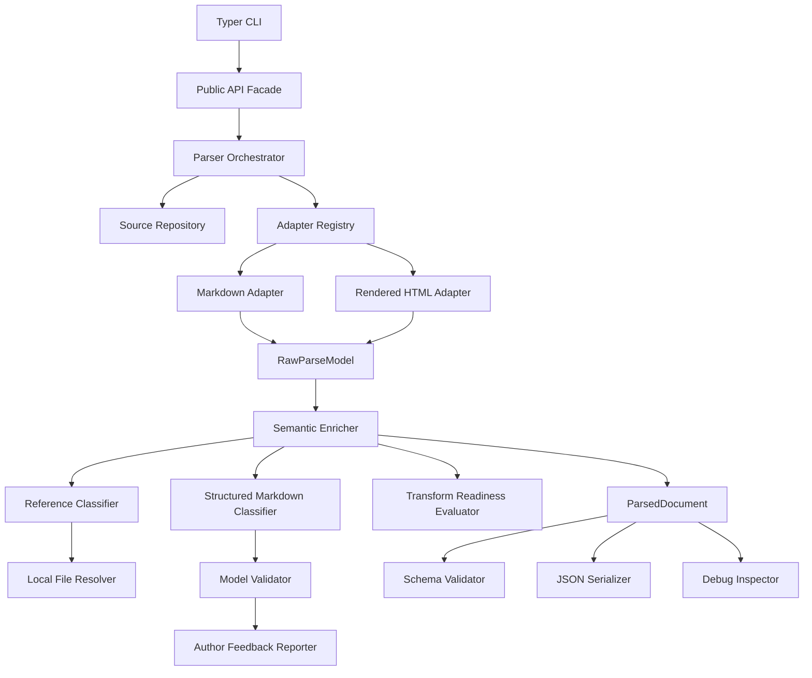

## 1. Implementation Strategy

### Assumptions

| ID | Assumption |
|---|---|
| A-001 | MVP priority source format is Markdown. Rendered HTML is second. |
| A-002 | First downstream consumer is the Markdown authoring validator. |
| A-003 | Dependency analyzer integration follows after structured Markdown validation is stable. |
| A-004 | Full DITA, Schema.org, and RAG transforms are out of scope for MVP; readiness evaluation is in scope. |
| A-005 | Full publishing resolution, conref/keyref resolution, complex includes, and custom metadata formats are deferred. |
| A-006 | Python package contracts use Pydantic as the authoritative source for JSON Schema generation. |
| A-007 | CLI debug interface is required for MVP; GUI and REPL are deferred. |

### Open Questions Remaining

| ID | Question | Impact |
|---|---|---|
| OQ-R1 | Exact legacy Markdown and rendered HTML output fields requiring compatibility. | Blocks final compatibility adapter scope. |
| OQ-R2 | Exact selected structured Markdown JSON Schemas for MVP validation. | Affects model validator and fixture expectations. |
| OQ-R3 | Required metadata and taxonomy fields per validation profile. | Affects author diagnostics and transform-readiness rules. |
| OQ-R4 | CI performance thresholds. | Affects benchmark gating. |
| OQ-R5 | Path-redaction policy for reports. | Affects diagnostics and user-facing output. |

### MVP Implementation Strategy

Build a layered Python package named `structure_parser` with:

1. **Pydantic boundary contracts** for configuration, raw parse models, normalized parser output, diagnostics, references, structured Markdown, validation results, and transform readiness.
2. **Markdown format adapter first**, using a Markdown parser that can expose block and inline structure with source-position support where practical.
3. **Rendered HTML adapter second**, using `lxml` or equivalent.
4. **Semantic enrichment pipeline** that converts raw syntax trees into normalized `ParsedDocument` objects.
5. **Structured Markdown classifier** that creates article → unit → component → attribute hierarchy.
6. **JSON Schema validation** generated from or verified against Pydantic models.
7. **Author-facing diagnostics** with stable codes, severity, provenance, detail fields, and remediation hints.
8. **Reference classification and optional local resolution** for links and images.
9. **CLI commands** for parsing, validation, inspection, diagnostics, references, contract validation, and transform readiness.
10. **Full unit and contract tests** using clean, complex, known-failure, and unknown-classification fixtures.
11. **MkDocs Material documentation plus Sphinx API docs** generated from rich Sphinx-compliant docstrings.

Recommended runtime stack:

| Concern | Choice |
|---|---|
| Packaging | `pyproject.toml`, `uv` or standard `venv` + `pip` |
| Models | Pydantic v2 |
| CLI | Typer |
| Markdown parsing | `markdown-it-py` with plugins, or `mistune` if source positions are stronger for the chosen syntax |
| HTML parsing | `lxml` |
| JSON Schema validation | `jsonschema` |
| Logging | Standard `logging` with structured JSON formatter support |
| Testing | `pytest`, `pytest-cov`, `hypothesis` where useful |
| Docs | MkDocs Material, Sphinx, Mermaid diagrams |
| Quality | Ruff, mypy, pre-commit |

---

## 2. Proposed Project Structure

```text
structure-aware-parser/
├── pyproject.toml
├── README.md
├── LICENSE
├── mkdocs.yml
├── .gitignore
├── .pre-commit-config.yaml
├── docs/
│   ├── index.md
│   ├── getting-started.md
│   ├── architecture/
│   │   ├── overview.md
│   │   ├── layers.md
│   │   ├── contracts.md
│   │   ├── diagnostics.md
│   │   ├── provenance.md
│   │   └── diagrams.md
│   ├── user-guide/
│   │   ├── cli.md
│   │   ├── markdown-validation.md
│   │   ├── author-feedback.md
│   │   ├── transform-readiness.md
│   │   └── debug-inspection.md
│   ├── developer-guide/
│   │   ├── adapters.md
│   │   ├── validators.md
│   │   ├── compatibility.md
│   │   ├── testing.md
│   │   └── schema-versioning.md
│   ├── schemas/
│   │   ├── parser-contract-v1.md
│   │   └── structured-markdown-v1.md
│   └── api/
│       └── index.md
├── sphinx/
│   ├── conf.py
│   ├── index.rst
│   ├── api.rst
│   └── architecture.rst
├── schemas/
│   ├── parser/
│   │   └── v1/
│   │       ├── ParsedDocument.schema.json
│   │       ├── ParseRunResult.schema.json
│   │       ├── Diagnostic.schema.json
│   │       └── Reference.schema.json
│   └── structured_markdown/
│       └── v1/
│           ├── Article.schema.json
│           ├── Unit.schema.json
│           ├── Component.schema.json
│           └── Attribute.schema.json
├── src/
│   └── structure_parser/
│       ├── __init__.py
│       ├── py.typed
│       ├── api.py
│       ├── cli.py
│       ├── logging_config.py
│       ├── application/
│       │   ├── __init__.py
│       │   ├── orchestrator.py
│       │   ├── commands.py
│       │   ├── adapter_registry.py
│       │   └── run_context.py
│       ├── contracts/
│       │   ├── __init__.py
│       │   ├── config.py
│       │   ├── diagnostics.py
│       │   ├── provenance.py
│       │   ├── references.py
│       │   ├── raw.py
│       │   ├── structure.py
│       │   ├── structured_markdown.py
│       │   ├── validation.py
│       │   ├── transform_readiness.py
│       │   ├── parsed_document.py
│       │   └── parse_run_result.py
│       ├── domain/
│       │   ├── __init__.py
│       │   ├── diagnostic_codes.py
│       │   ├── enums.py
│       │   └── errors.py
│       ├── adapters/
│       │   ├── __init__.py
│       │   ├── base.py
│       │   ├── markdown.py
│       │   ├── html.py
│       │   └── dita_xml.py
│       ├── enrichment/
│       │   ├── __init__.py
│       │   ├── semantic_enricher.py
│       │   ├── structure_builder.py
│       │   ├── metadata_extractor.py
│       │   ├── reference_classifier.py
│       │   └── provenance_mapper.py
│       ├── structured_markdown/
│       │   ├── __init__.py
│       │   ├── classifier.py
│       │   ├── component_mapper.py
│       │   ├── attribute_mapper.py
│       │   └── unknowns.py
│       ├── validation/
│       │   ├── __init__.py
│       │   ├── schema_validator.py
│       │   ├── model_validator.py
│       │   ├── validation_profiles.py
│       │   └── author_feedback.py
│       ├── readiness/
│       │   ├── __init__.py
│       │   ├── evaluator.py
│       │   ├── dita.py
│       │   ├── schema_org.py
│       │   └── rag_ingestion.py
│       ├── resolution/
│       │   ├── __init__.py
│       │   ├── base.py
│       │   └── local_file_resolver.py
│       ├── repositories/
│       │   ├── __init__.py
│       │   ├── source_repository.py
│       │   ├── schema_repository.py
│       │   ├── fixture_repository.py
│       │   └── result_repository.py
│       ├── serialization/
│       │   ├── __init__.py
│       │   ├── json_serializer.py
│       │   └── legacy_adapter.py
│       ├── reporting/
│       │   ├── __init__.py
│       │   ├── diagnostic_reporter.py
│       │   ├── structure_reporter.py
│       │   ├── reference_reporter.py
│       │   └── readiness_reporter.py
│       └── debug/
│           ├── __init__.py
│           └── inspector.py
├── tests/
│   ├── unit/
│   │   ├── test_contract_models.py
│   │   ├── test_diagnostic_factory.py
│   │   ├── test_markdown_adapter.py
│   │   ├── test_html_adapter.py
│   │   ├── test_semantic_enricher.py
│   │   ├── test_structured_markdown_classifier.py
│   │   ├── test_model_validator.py
│   │   ├── test_reference_classifier.py
│   │   ├── test_local_file_resolver.py
│   │   ├── test_transform_readiness.py
│   │   └── test_cli_commands.py
│   ├── contract/
│   │   ├── test_clean_fixture_contract.py
│   │   ├── test_complex_fixture_contract.py
│   │   ├── test_known_failure_fixture_contract.py
│   │   ├── test_unknown_classification_fixture_contract.py
│   │   └── test_schema_generation.py
│   ├── integration/
│   │   ├── test_parse_files_end_to_end.py
│   │   ├── test_validate_markdown_end_to_end.py
│   │   ├── test_debug_inspection.py
│   │   └── test_dependency_analyzer_contract.py
│   ├── performance/
│   │   └── test_benchmark_fixtures.py
│   └── fixtures/
│       ├── markdown/
│       │   ├── clean.md
│       │   ├── complex.md
│       │   ├── known_failure.md
│       │   └── unknown_classification.md
│       ├── html/
│       │   └── rendered_clean.html
│       └── expected/
│           ├── clean.parse.json
│           ├── complex.parse.json
│           ├── known_failure.diagnostics.json
│           └── unknown_classification.parse.json
└── tools/
    ├── generate_json_schemas.py
    ├── validate_fixtures.py
    └── update_expected_contracts.py
```

---

## 3. Layer and Contract Model

### Layer Boundaries

| Layer | Package | Input Contract | Output Contract | Main Rule |
|---|---|---|---|---|
| Public API / CLI | `api.py`, `cli.py` | `ParserConfig`, file paths | `ParsedDocument`, `ParseRunResult`, JSON, reports | No adapter internals exposed. |
| Application | `application/` | Commands, config, repositories | Orchestrated parse result | Coordinates only; no format parsing logic. |
| Format Adapter | `adapters/` | `SourceFile` | `RawParseModel` | Parses syntax only; no authoring validation. |
| Raw Model | `contracts/raw.py` | Adapter syntax facts | Typed raw tree | Internal but explicit and versioned. |
| Enrichment | `enrichment/` | `RawParseModel` | `ParsedDocument` partial/full | Converts syntax to normalized semantics. |
| Structured Markdown | `structured_markdown/` | Raw or enriched Markdown nodes | `StructuredContent` | Classifies article/unit/component/attribute hierarchy. |
| Validation | `validation/` | `StructuredContent`, schemas, profiles | `ModelValidationResult`, diagnostics | Validates without reparsing source. |
| Readiness | `readiness/` | `ParsedDocument` | `TransformReadiness` | Checks preconditions only; no transform execution. |
| Serialization | `serialization/` | Pydantic contracts | JSON or legacy projection | Contracts remain authoritative. |
| Reporting / Debug | `reporting/`, `debug/` | Normalized contracts | Human-readable views | No raw model dependency unless explicitly debug-only. |

### Core Public Pydantic Contracts

| Contract | File | Purpose |
|---|---|---|
| `ParserConfig` | `contracts/config.py` | Public execution configuration. |
| `ParsedDocument` | `contracts/parsed_document.py` | Single-document normalized output. |
| `ParseRunResult` | `contracts/parse_run_result.py` | Batch output and CLI run result. |
| `Diagnostic` | `contracts/diagnostics.py` | Stable diagnostic shape. |
| `Reference` | `contracts/references.py` | Classified reference with resolution state. |
| `StructuralNode` | `contracts/structure.py` | Queryable structure node. |
| `StructuredContent` | `contracts/structured_markdown.py` | Article/unit/component/attribute hierarchy. |
| `ModelValidationResult` | `contracts/validation.py` | Structured Markdown schema validation result. |
| `TransformReadiness` | `contracts/transform_readiness.py` | Target-specific readiness result. |

### Internal Typed Contracts

| Contract | File | Boundary |
|---|---|---|
| `SourceFile` | `repositories/source_repository.py` or `contracts/source.py` | Source repository → adapter. |
| `RawParseModel` | `contracts/raw.py` | Adapter → semantic enrichment. |
| `RawNode` | `contracts/raw.py` | Adapter syntax tree representation. |
| `RunContext` | `application/run_context.py` | Application orchestration internals. |

### Contract Invariants to Enforce

| Invariant | Enforcement |
|---|---|
| Every output has `schema_version`. | Pydantic required field and contract tests. |
| Every diagnostic has `code`, `severity`, `message`, `detail`, `provenance_status`. | Pydantic model validation. |
| Every reference has one resolution state. | Enum field and resolver tests. |
| `resolved` is only used after verified resolution. | Resolver unit tests. |
| Unavailable spans are not fabricated. | Provenance mapper tests. |
| Unknown content is preserved. | Unknown-classification fixture test. |
| JSON Schema matches Pydantic contracts. | Schema-generation contract test. |
| Deterministic output for identical input/config. | Repeat-run integration test. |

---

## 4. Design Patterns Used

| Pattern | Where | Why |
|---|---|---|
| Adapter | `IFormatAdapter`, `MarkdownAdapter`, `HtmlAdapter`, future `DitaXmlAdapter` | Keeps source-format parsing isolated. |
| Strategy | `IReferenceResolver`, readiness evaluators, validation profiles | Allows configurable behavior by source format, validation mode, and downstream target. |
| Factory | `DiagnosticFactory` or diagnostic helper functions | Ensures stable codes, severities, provenance, and remediation fields. |
| Repository | `SourceRepository`, `SchemaRepository`, `FixtureRepository`, `ResultRepository` | Isolates file-system, schema, fixture, and output storage. |
| Facade | `parse_file`, `parse_files` in `api.py` | Provides simple public API over layered internals. |
| Command | CLI command objects in `application/commands.py` | Makes CLI behavior unit-testable without shelling out everywhere. |
| Composite | `RawNode`, `StructuralNode`, `Article → Unit → Component → Attribute` | Represents hierarchical source and structured content. |
| Null Object / Fallback Object | Unknown article/unit/component/attribute objects | Preserves unclassified content without pretending classification succeeded. |

Avoid adding patterns where simple functions are clearer, especially for small mappers or validators.

---

## 5. Service Architecture

No microservices or GUI are required for the MVP. The system is a local Python package with CLI and Python API interfaces.

### Runtime Service Boundaries



### CLI Commands

| Command | Purpose | Output |
|---|---|---|
| `structure-parser parse PATH...` | Parse one or more files. | JSON `ParseRunResult` or human summary. |
| `structure-parser validate-markdown PATH... --schema artArticle.schema.json` | Validate structured Markdown authoring model. | Author feedback and validation status. |
| `structure-parser inspect-structure PATH` | Display structure tree and node paths. | Human-readable tree. |
| `structure-parser inspect-model PATH` | Display article/unit/component/attribute classification. | Human-readable model tree. |
| `structure-parser inspect-references PATH` | Display references and states. | Reference table. |
| `structure-parser inspect-diagnostics PATH` | Display diagnostics grouped by severity/file/remediation. | Diagnostic report. |
| `structure-parser transform-readiness PATH --target dita --target rag_ingestion` | Evaluate readiness preconditions. | Target status report. |
| `structure-parser validate-contract tests/fixtures/...` | Validate fixtures against expected contract behavior. | Pass/fail summary. |

### CI Exit Behavior

| Condition | Exit Code |
|---|---:|
| No errors and validation valid | `0` |
| Warnings only in advisory mode | `0` |
| Authoring validation invalid in CI mode | `1` |
| Parser errors present | `1` |
| Unsupported schema version/configuration error | `2` |
| Internal controlled failure | `3` |

---

## 6. Documentation Plan

### README.md

Include:

1. Purpose and MVP scope.
2. Installation using virtual environment.
3. Basic CLI usage.
4. Basic Python API usage.
5. Example normalized JSON output.
6. Development setup.
7. Test and coverage commands.
8. Documentation build commands.

### MkDocs Material Documentation

| Page | Content |
|---|---|
| `docs/index.md` | System overview, MVP scope, links. |
| `docs/getting-started.md` | Install, run parser, validate Markdown. |
| `docs/architecture/overview.md` | Layered architecture and boundaries. |
| `docs/architecture/contracts.md` | Public and internal contracts. |
| `docs/architecture/diagnostics.md` | Diagnostic codes, severities, remediation. |
| `docs/architecture/provenance.md` | Span rules and unavailable provenance behavior. |
| `docs/architecture/diagrams.md` | Mermaid architecture, sequence, state, class diagrams. |
| `docs/user-guide/cli.md` | Full CLI reference. |
| `docs/user-guide/markdown-validation.md` | Structured Markdown validation workflow. |
| `docs/user-guide/author-feedback.md` | How authors interpret diagnostics. |
| `docs/user-guide/transform-readiness.md` | Readiness target semantics. |
| `docs/user-guide/debug-inspection.md` | Debug commands and examples. |
| `docs/developer-guide/adapters.md` | How to add format adapters. |
| `docs/developer-guide/validators.md` | How to add validation profiles. |
| `docs/developer-guide/compatibility.md` | Legacy adapter policy. |
| `docs/developer-guide/testing.md` | Fixture and contract testing rules. |
| `docs/developer-guide/schema-versioning.md` | Breaking/nonbreaking change rules. |
| `docs/schemas/*.md` | Generated or verified schema documentation. |

### Sphinx API Documentation

Use rich Sphinx-compliant docstrings for all public classes, commands, services, interfaces, and contract models.

Docstrings should cover:

| Required Docstring Field | Applies To |
|---|---|
| Purpose | All public classes/functions. |
| Caller contract | Public APIs, services, commands. |
| Parameters | Public and internal boundary methods. |
| Return value | Public APIs and service methods. |
| Failure behavior | APIs, adapters, validators, resolvers. |
| Side effects | Repositories, serializers, CLI commands. |
| Framework integration | CLI, logging, Pydantic, schema generation. |
| Replacement/extension points | Interfaces, adapters, validators, readiness strategies. |

Example style:

```python
def parse_file(path: Path, config: ParserConfig | None = None) -> ParsedDocument:
    """Parse one source file into a normalized parser contract.

    :param path:
        Source file path selected by the caller. The path is treated as
        untrusted input and is loaded only through ``SourceRepository``.
    :param config:
        Optional parser configuration. When omitted, the default MVP
        configuration enables Markdown parsing, structured Markdown
        classification, advisory model validation, and no external
        resource resolution.
    :returns:
        A versioned ``ParsedDocument`` Pydantic contract. The result may
        contain diagnostics and partial structure when recoverable parse
        errors occur.
    :raises ParserConfigurationError:
        Raised when the requested schema version or adapter selection is
        unsupported.
    :side effects:
        Reads the source file and emits structured logs. Does not mutate
        the source file or execute source content.
    """
```

---

## 7. Testing and Coverage Plan

### Test Types

| Test Type | Location | Purpose |
|---|---|---|
| Unit tests | `tests/unit/` | Validate individual models, mappers, adapters, services. |
| Contract tests | `tests/contract/` | Verify stable parser outputs and schema conformance. |
| Integration tests | `tests/integration/` | Validate API, CLI, orchestration, validation, readiness flows. |
| Performance tests | `tests/performance/` | Record benchmark metrics for representative fixtures. |
| Schema tests | `tests/contract/test_schema_generation.py` | Verify Pydantic models and JSON Schema artifacts stay aligned. |

### Required Fixtures

| Fixture | Purpose |
|---|---|
| `clean.md` | Valid Markdown article with title, metadata, units, paragraphs, lists, links, images. |
| `complex.md` | Nested headings, mixed components, table, code block, multiple references, metadata hooks. |
| `known_failure.md` | Malformed metadata, broken link, unsupported semantic, missing expected structure. |
| `unknown_classification.md` | Valid Markdown syntax that cannot be safely classified into known article/unit/component patterns. |
| `rendered_clean.html` | Rendered HTML equivalent of simple structured Markdown. |

### Coverage Targets

| Area | Minimum Coverage |
|---|---:|
| Overall line coverage | 90% |
| Public contract models | 100% |
| Diagnostic code creation paths | 100% for MVP codes |
| Markdown adapter | 90% |
| Structured Markdown classifier | 90% |
| Model validator | 90% |
| Reference classifier/resolver | 90% |
| CLI command objects | 85% |
| Readiness evaluators | 85% |
| Legacy compatibility adapter | 80% until compatibility policy is finalized |

### Coverage Measurement

Use:

```bash
pytest --cov=structure_parser --cov-report=term-missing --cov-report=xml --cov-fail-under=90
```

Add per-module thresholds in CI through `coverage.py` configuration if needed.

### Acceptance Criteria Mapping

| Acceptance Area | Test Coverage |
|---|---|
| AC-001 to AC-005 | Contract fixture tests. |
| AC-006 to AC-010 | Source repository, adapter registry, orchestrator integration tests. |
| AC-011 to AC-015, AC-045 to AC-048 | Structure, metadata, classifier, model validator tests. |
| AC-016 to AC-021 | Reference classifier and local resolver tests. |
| AC-022 to AC-025 | Diagnostic model, factory, reporter tests. |
| AC-026 to AC-029 | Provenance mapper tests. |
| AC-030 to AC-033 | Schema validator and compatibility adapter tests. |
| AC-034 to AC-037 | Debug inspector and CLI command tests. |
| AC-038 to AC-041, AC-049 to AC-054 | Integration tests for validator, dependency analyzer contract, readiness. |
| AC-042 to AC-044 | Benchmark and caching tests. |

---

## 8. Implementation Plan Table

| Phase | Task | Files | Contracts | Tests | Docs | Dependencies | Completion Criteria |
|---:|---|---|---|---|---|---|---|
| 1 | Initialize Python package, virtual environment workflow, tooling, CI-ready project metadata. | `pyproject.toml`, `README.md`, `.pre-commit-config.yaml`, `src/structure_parser/__init__.py` | N/A | Smoke import test | README setup section | `pytest`, `ruff`, `mypy`, `pydantic`, `typer` | Package installs in editable mode; tests run; lint/type commands configured. |
| 2 | Define core enums, errors, and diagnostic codes. | `domain/enums.py`, `domain/errors.py`, `domain/diagnostic_codes.py` | `Severity`, `ResolutionState`, `SourceFormat`, readiness/status enums | `test_diagnostic_factory.py`, enum validation tests | Diagnostics docs scaffold | Pydantic | Stable MVP codes for missing file, unsupported format, malformed metadata, unsupported semantic, unresolved reference, schema invalid, unknown classification. |
| 3 | Implement Pydantic public contracts. | `contracts/*.py` | `ParserConfig`, `ParsedDocument`, `ParseRunResult`, `Diagnostic`, `Reference`, `StructuralNode`, `StructuredContent`, `ModelValidationResult`, `TransformReadiness` | `test_contract_models.py` | Contract docs | Pydantic v2 | Required fields, enums, JSON serialization, validation errors verified. |
| 4 | Implement schema generation and verification. | `tools/generate_json_schemas.py`, `schemas/parser/v1/*`, `schemas/structured_markdown/v1/*`, `validation/schema_validator.py` | Generated JSON Schemas | `test_schema_generation.py` | `docs/schemas/*.md` | `jsonschema` | JSON Schema artifacts generated from or verified against Pydantic models. |
| 5 | Implement source repository and file intake. | `repositories/source_repository.py`, `application/run_context.py` | `SourceFile`, file diagnostics | Missing file and source load tests | User guide: input behavior | `pathlib`, `hashlib` | Existing, missing, unsupported, and multiple-path intake behavior works. |
| 6 | Implement adapter interface and registry. | `adapters/base.py`, `application/adapter_registry.py` | `IFormatAdapter`, `RawParseModel` | Adapter registry tests | Developer guide: adapters | `typing.Protocol` | Format selection by extension, hint, or explicit adapter works. |
| 7 | Implement raw parse contracts. | `contracts/raw.py` | `RawParseModel`, `RawNode` | Raw model validation tests | Architecture: raw boundary | Pydantic or dataclasses with typed validation | Adapter-to-enricher boundary is typed, versioned, and testable. |
| 8 | Implement Markdown adapter MVP. | `adapters/markdown.py` | `RawParseModel` | `test_markdown_adapter.py` using clean/complex/failure fixtures | Supported formats docs | `markdown-it-py` or selected parser | Headings, paragraphs, lists, tables, code blocks, links, images, front matter, and line provenance captured where practical. |
| 9 | Implement rendered HTML adapter. | `adapters/html.py` | `RawParseModel` | `test_html_adapter.py` | Supported formats docs | `lxml` | HTML headings, paragraphs, lists, tables, links, images parsed into raw nodes. |
| 10 | Implement provenance mapper. | `enrichment/provenance_mapper.py` | `SourceSpan`, `provenance_status` | Provenance tests | Provenance docs | N/A | No fabricated spans; unavailable provenance is explicitly marked. |
| 11 | Implement metadata extraction. | `enrichment/metadata_extractor.py` | `metadata`, metadata diagnostics | Metadata tests | Metadata hooks docs | YAML front matter parser if selected | Front matter extracted; malformed versus absent metadata distinguished. |
| 12 | Implement structure builder. | `enrichment/structure_builder.py` | `DocumentStructure`, `StructuralNode` | Structure tests | Structure docs and Mermaid examples | N/A | Heading hierarchy, source order, paths, IDs, and missing-structure diagnostics verified. |
| 13 | Implement reference classifier. | `enrichment/reference_classifier.py` | `Reference` | Reference classification tests | Reference contract docs | N/A | Links, images, file refs, anchors classified with `not_attempted` default state. |
| 14 | Implement local file reference resolver. | `resolution/base.py`, `resolution/local_file_resolver.py` | `Reference.state` | Resolver tests | Reference resolution docs | N/A | Existing targets become `resolved`; missing targets become `unresolved`; unsupported types are explicit. |
| 15 | Implement semantic enricher. | `enrichment/semantic_enricher.py` | `ParsedDocument` | `test_semantic_enricher.py` | Architecture sequence docs | N/A | Raw model becomes normalized document with metadata, structure, references, diagnostics. |
| 16 | Implement structured Markdown classifier. | `structured_markdown/classifier.py`, `component_mapper.py`, `attribute_mapper.py`, `unknowns.py` | `StructuredContent`, `Article`, `Unit`, `Component`, `Attribute` | Classifier tests; unknown fixture test | Structured Markdown model docs | N/A | Article/unit/component/attribute hierarchy produced; order preserved; unknown objects preserve source. |
| 17 | Implement model validator. | `validation/model_validator.py`, `validation/validation_profiles.py` | `ModelValidationResult` | Valid/invalid schema tests | Markdown validation docs | `jsonschema` | Valid content returns `valid`; invalid content returns diagnostics with authoring violation category. |
| 18 | Implement author feedback reporter. | `validation/author_feedback.py`, `reporting/diagnostic_reporter.py` | Diagnostics grouped by severity/file/remediation | Feedback tests | Author feedback docs | N/A | Parser/model diagnostics become actionable author-facing messages without changing parse output. |
| 19 | Implement transform-readiness evaluators. | `readiness/evaluator.py`, `dita.py`, `schema_org.py`, `rag_ingestion.py` | `TransformReadiness` | Readiness tests | Transform readiness docs | N/A | Target statuses are `ready`, `blocked`, `degraded`, or `not_evaluated`; no transform execution occurs. |
| 20 | Implement parser orchestrator. | `application/orchestrator.py`, `api.py` | `ParsedDocument`, `ParseRunResult` | End-to-end parse tests | API docs | All previous services | `parse_file` and `parse_files` return typed Pydantic models and deterministic JSON. |
| 21 | Implement CLI commands. | `cli.py`, `application/commands.py` | Command inputs, parser outputs | CLI tests | CLI guide | Typer | Parse, validate-markdown, inspect-structure, inspect-model, inspect-references, inspect-diagnostics, transform-readiness, validate-contract commands work. |
| 22 | Implement debug inspector and reporters. | `debug/inspector.py`, `reporting/*.py` | Normalized contracts only | Debug inspection tests | Debug docs | Rich optional | Structure, references, diagnostics, assumptions, and model classifications inspectable without Python object access. |
| 23 | Implement compatibility adapter placeholder and policy hooks. | `serialization/legacy_adapter.py` | Legacy projection contract TBD | Legacy adapter smoke tests | Compatibility docs | N/A | Adapter consumes normalized contract; no parser-core behavior changed. |
| 24 | Implement fixture repository and contract fixtures. | `repositories/fixture_repository.py`, `tests/fixtures/*` | Expected JSON fixtures | Fixture contract tests | Fixture examples docs | N/A | Clean, complex, known-failure, and unknown-classification fixtures validate MVP guarantees. |
| 25 | Implement performance benchmark scaffolding and caching. | `tests/performance/test_benchmark_fixtures.py`, source caching in repository/orchestrator | Stats in `ParseRunResult.stats` | Benchmark and cache tests | Performance docs | `pytest-benchmark` optional | Duration/resource stats recorded; repeated safe reads/parses avoided within run. |
| 26 | Add structured logging. | `logging_config.py`, orchestrator/services log calls | Event-like log fields | Logging tests where practical | Observability docs | `python-json-logger` optional | Debug mode logs assumptions, adapter selection, parse phases, and controlled failures. |
| 27 | Build MkDocs and Sphinx documentation. | `mkdocs.yml`, `docs/**`, `sphinx/**` | API docs from docstrings | Documentation build test | All docs | `mkdocs-material`, `sphinx` | MkDocs and Sphinx build without warnings treated as errors where practical. |
| 28 | Final acceptance and coverage gate. | All files | All MVP contracts | Full test suite and coverage | Completion report | All dependencies | All mapped acceptance criteria pass; coverage ≥ 90%; unresolved open questions documented. |

---

## 9. Completion Report Template

```markdown
# Structure-Aware Parser Improvement System Completion Report

## Summary

- Implementation status: Complete / Partial / Blocked
- Release scope: MVP structured Markdown parser and authoring validator
- Source formats implemented:
  - Markdown: Complete / Partial / Not started
  - Rendered HTML: Complete / Partial / Not started
  - DITA/XML: Deferred / Partial / Complete
- First downstream consumer:
  - Markdown authoring validator: Complete / Partial / Not started
- Second downstream consumer:
  - Dependency analyzer contract: Complete / Partial / Deferred

## Implementation Status Against Plan

| Phase | Task | Status | Evidence | Notes |
|---:|---|---|---|---|
| 1 | Package initialization |  |  |  |
| 2 | Enums, errors, diagnostic codes |  |  |  |
| 3 | Public Pydantic contracts |  |  |  |
| 4 | JSON Schema generation |  |  |  |
| 5 | Source repository and intake |  |  |  |
| 6 | Adapter interface and registry |  |  |  |
| 7 | Raw parse contracts |  |  |  |
| 8 | Markdown adapter |  |  |  |
| 9 | Rendered HTML adapter |  |  |  |
| 10 | Provenance mapper |  |  |  |
| 11 | Metadata extraction |  |  |  |
| 12 | Structure builder |  |  |  |
| 13 | Reference classifier |  |  |  |
| 14 | Local file resolver |  |  |  |
| 15 | Semantic enricher |  |  |  |
| 16 | Structured Markdown classifier |  |  |  |
| 17 | Model validator |  |  |  |
| 18 | Author feedback reporter |  |  |  |
| 19 | Transform-readiness evaluators |  |  |  |
| 20 | Parser orchestrator and API |  |  |  |
| 21 | CLI commands |  |  |  |
| 22 | Debug inspector and reporters |  |  |  |
| 23 | Compatibility adapter |  |  |  |
| 24 | Fixture repository and contract tests |  |  |  |
| 25 | Performance benchmark scaffolding |  |  |  |
| 26 | Structured logging |  |  |  |
| 27 | MkDocs and Sphinx documentation |  |  |  |
| 28 | Final acceptance and coverage gate |  |  |  |

## Acceptance Criteria Results

| Acceptance Criterion | Status | Test Evidence | Notes |
|---|---|---|---|
| AC-001 |  |  |  |
| AC-002 |  |  |  |
| AC-003 |  |  |  |
| AC-004 |  |  |  |
| AC-005 |  |  |  |
| AC-006 to AC-010 |  |  |  |
| AC-011 to AC-015 |  |  |  |
| AC-016 to AC-021 |  |  |  |
| AC-022 to AC-025 |  |  |  |
| AC-026 to AC-029 |  |  |  |
| AC-030 to AC-033 |  |  |  |
| AC-034 to AC-037 |  |  |  |
| AC-038 to AC-041 |  |  |  |
| AC-042 to AC-044 |  |  |  |
| AC-045 to AC-054 |  |  |  |

## Coverage Report

- Overall coverage target: 90%
- Actual overall coverage:
- Public contract model coverage:
- Diagnostic code coverage:
- Markdown adapter coverage:
- Structured Markdown classifier coverage:
- Model validator coverage:
- Reference classifier/resolver coverage:
- CLI command coverage:
- Readiness evaluator coverage:

Command used:

```bash
pytest --cov=structure_parser --cov-report=term-missing --cov-report=xml --cov-fail-under=90
```

## Schema and Contract Verification

- Pydantic contracts generated or verified against JSON Schema: Yes / No
- Active parser schema version:
- Structured Markdown schema version:
- Fixture contract tests passing: Yes / No
- Deterministic output test passing: Yes / No

## Known Limitations

- Full DITA publishing resolution:
- Full Schema.org transform execution:
- Full RAG ingestion execution:
- Complex include/conref/keyref resolution:
- Custom metadata formats:
- Legacy compatibility fields still pending:

## Open Questions / Follow-Up Decisions

| Question | Owner | Target Decision Date | Impact |
|---|---|---|---|
| Legacy compatibility field inventory |  |  |  |
| Required metadata/taxonomy profile |  |  |  |
| CI performance thresholds |  |  |  |
| Path redaction policy |  |  |  |

## Final Status

The MVP is considered complete when:

1. Markdown parsing produces schema-valid `ParsedDocument` and `ParseRunResult` contracts.
2. Structured Markdown classification preserves article, unit, component, and attribute order.
3. Unknown content is preserved with explicit diagnostics.
4. Authoring validation returns actionable diagnostics.
5. Reference classification and local resolution states are correct.
6. Transform-readiness checks report target-specific status without executing transforms.
7. CLI and Python APIs expose typed Pydantic models.
8. Fixture-based contract tests pass.
9. Coverage meets or exceeds 90%.
10. MkDocs and Sphinx documentation build successfully.
```