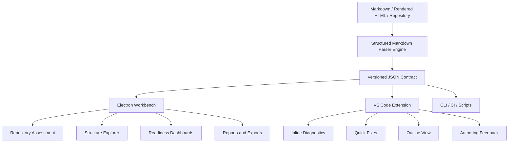
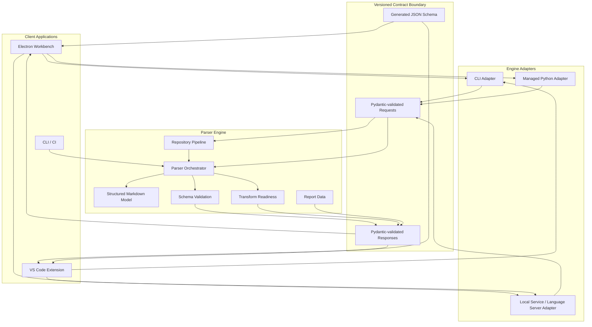

# Software Requirements Specification: Structured Markdown Clients

Version: 0.2  
Date: 2026-06-29  
Status: Draft for implementation planning  
Related specifications:
- [srs-Parser-Reader-SRS.md](srs-Parser-Reader-SRS.md)
- [imp-Parser-Reader-SRS.md](imp-Parser-Reader-SRS.md)
- [srs-VS-Code-Plugin.md](srs-VS-Code-Plugin.md)
- [2026-06-28-b1-parse-assess-implementation-update.md](2026-06-28-b1-parse-assess-implementation-update.md)
- [2026-06-28-Future-Implementation-Tasks.md](2026-06-28-Future-Implementation-Tasks.md)

## 1. Introduction

### 1.1 Purpose

This Software Requirements Specification defines client applications that demonstrate and operationalize the Structured Markdown specification and parser.

The clients are not the semantic source of truth. They are user-facing applications over an engine-owned semantic layer:

`article` contains `unit` contains `component` contains `attribute`.

The Structured Markdown parser engine and specification provide the agnostic semantic layer. Client tools consume that layer to help users inspect, validate, triage, repair, report on, and prepare Markdown or rendered HTML content for downstream workflows such as DITA XML, Schema.org, RAG ingestion, dependency analysis, author feedback, CI reporting, and migration planning.

### 1.2 Client Strategy

The first-class client shall be a standalone Electron application. The Electron client shall provide a repository-level workbench for content architects, documentation engineers, DITA migration specialists, RAG pipeline owners, and technical writers who need to assess and improve content across files and folders.

The VS Code extension shall be an additional client. It shall provide in-editor authoring feedback for writers and technical authors working inside Markdown files.

Both clients shall illustrate the same core claim: Structured Markdown is an engine-owned, client-agnostic semantic layer. Electron, VS Code, CLI, CI, and future clients shall consume the same parser contract rather than reimplementing parser logic.

### 1.3 Scope

The client system shall:

- Consume parser engine output through stable machine-readable contracts.
- Display structured Markdown article, unit, component, and attribute data.
- Display diagnostics, unknown structures, validation state, and transform-readiness state.
- Help users understand whether content is suitable for DITA XML, Schema.org output, RAG chunking, XML serialization, or authoring compliance.
- Support the primary SRS use cases for content architects, writers, metadata owners, transform developers, RAG pipeline owners, CI maintainers, support engineers, and QA engineers.
- Keep parser, schema, validation, transform-readiness, and semantic classification logic inside the parser engine.

The client system shall not:

- Replace the parser engine.
- Duplicate the Structured Markdown schema model in client code.
- Reimplement article, unit, component, attribute, validation, or readiness decisions.
- Guarantee complete DITA migration by itself.
- Execute untrusted Markdown, embedded HTML, scripts, or code blocks.
- Require network access for normal local validation and assessment workflows.

### 1.4 Audience

This document is intended for:

- Electron client developers.
- VS Code extension developers.
- Parser engine maintainers.
- Content architects.
- Documentation engineers.
- Technical writers and Markdown authors.
- DITA migration specialists.
- RAG pipeline owners.
- Release engineers.
- QA engineers.

### 1.5 Definitions

| Term | Definition |
|---|---|
| Engine | The Structured Markdown parser package that parses Markdown and rendered HTML into structured contracts, diagnostics, validation results, references, provenance, and readiness reports. |
| Semantic layer | The engine-owned, versioned content model that represents articles, units, components, attributes, metadata hooks, references, diagnostics, and readiness state. |
| Electron client | The first-class standalone desktop application for repository-level content assessment, parser demonstration, reporting, and migration/RAG planning. |
| VS Code extension | The additional editor-integrated client for inline authoring validation and feedback. |
| Client | Any application that consumes the engine-owned Structured Markdown contract. |
| Contract boundary | The versioned JSON request/response boundary between clients and the parser engine. |
| Profile | A named validation, schema, metadata, or transform-readiness configuration. |
| Transform readiness | Engine-provided assessment of whether parsed content has enough explicit structure, metadata, provenance, and diagnostics for target transforms. |
| Unknown structure | Article, unit, component, or attribute content that the parser preserves but cannot confidently classify. |
| RAG ingestion shape | Structured chunking and metadata contract for retrieval, citation, filtering, and generation workflows. |

### 1.6 References

- Primary parser SRS: [srs-Parser-Reader-SRS.md](srs-Parser-Reader-SRS.md).
- Parser implementation SRS: [imp-Parser-Reader-SRS.md](imp-Parser-Reader-SRS.md).
- Previous VS Code plugin SRS: [srs-VS-Code-Plugin.md](srs-VS-Code-Plugin.md).
- Structured Markdown model and schemas.
- DITA 1.3 topic categories: topic, concept, task/how-to, reference, troubleshooting, glossary, and glossentry.
- Robert Horn information mapping types: concept, procedure, principle, process, and fact.

## 2. Overall Description

### 2.1 Product Perspective

The client system shall sit above the parser engine. The engine remains authoritative for parsing, model construction, schema validation, diagnostics, reference classification, transform-readiness evaluation, and contract serialization.

The Electron and VS Code clients shall be peers over the same engine boundary:



The Electron client shall emphasize repository-level review, assessment, migration planning, and batch reporting. The VS Code extension shall emphasize file-level authoring feedback while a writer is editing.

### 2.2 Product Functions

The shared client system shall provide:

- Engine discovery and health checks.
- Contract version compatibility checks.
- File and repository validation through the parser engine.
- Structured model inspection.
- Diagnostic presentation.
- Transform-readiness presentation for DITA, Schema.org, XML, and RAG workflows.
- Metadata and taxonomy hook visibility.
- Unknown structure visibility.
- Report export.
- Debug views for engine requests and responses.
- Offline operation after installation.

The Electron client shall additionally provide:

- Repository open/import workflow.
- Batch parse and assessment runs.
- Inventory dashboards and filtering.
- File-to-file comparison across assessment runs.
- Aggregated unknown-unit and diagnostic views.
- DITA readiness and RAG readiness work queues.
- Reference and image review views.
- Exportable markdown, CSV, and JSON reports.
- Optional launch/open-in-editor integration.

The VS Code extension shall additionally provide:

- Inline diagnostics in the editor.
- Problems panel integration.
- Validate-on-save and optional validate-on-change.
- Structure outline for the current file.
- Code actions for safe quick fixes.
- Status bar validation state.
- Workspace scan command where practical.

### 2.3 User Classes

| User class | Primary client | Needs |
|---|---|---|
| Content architect | Electron | Repository-wide structure visibility, article triage, taxonomy hooks, readiness summaries, unknown-content reports. |
| Documentation engineer | Electron | Repeatable batch assessment, CSV/JSON exports, parser health, pipeline diagnostics, CI evidence. |
| Technical writer | VS Code and Electron | In-editor authoring feedback plus broader structure/readiness review. |
| Markdown author | VS Code | Fast diagnostics, clear messages, safe quick fixes, low-noise validation. |
| DITA migration specialist | Electron | DITA topic classification, strict/degraded readiness, unknown-unit work queues, export planning. |
| RAG pipeline owner | Electron | Chunkability, metadata, provenance, reference/image counts, quality filters. |
| Metadata owner | Electron and VS Code | Article and unit metadata visibility, missing taxonomy signals, profile-aware checks. |
| Support engineer | Electron | Debuggable parser output, raw request/response views, reproducible reports. |
| CI maintainer | CLI and Electron | Deterministic reports, stable exit behavior, evidence that batch outputs match expectations. |
| QA engineer | Electron and CLI | Fixture review, regression comparison, contract compatibility evidence. |

### 2.4 Operating Environment

The Electron client shall support:

- macOS, Windows, and Linux desktop environments.
- Local repository folders.
- Local parser engine execution through CLI, managed Python, bundled engine, or long-running local service.
- Offline operation after installation.

The VS Code extension shall support:

- VS Code desktop on macOS, Windows, and Linux.
- Markdown files using VS Code language id `markdown`.
- Workspace Trust.
- Local validation without network access.
- Remote development environments when the parser engine is available in the extension host.

### 2.5 Design and Implementation Constraints

- CLIENT-REQ-001: Clients shall consume engine-owned contracts and shall not parse source content directly when the engine can provide the required data.
- CLIENT-REQ-002: Clients shall not import parser implementation modules for semantic decisions.
- CLIENT-REQ-003: Clients shall not read schema files as a substitute for engine output.
- CLIENT-REQ-004: Clients shall not infer undocumented domain meaning from incidental JSON fields.
- CLIENT-REQ-005: Clients shall reject or quarantine engine responses that fail contract validation.
- CLIENT-REQ-006: Clients shall distinguish engine errors from content authoring errors.
- CLIENT-REQ-007: Clients shall not send source content to external services by default.
- CLIENT-REQ-008: Clients shall not mutate source Markdown automatically without explicit user action.
- CLIENT-REQ-009: Clients shall show unknown structures as first-class model objects.
- CLIENT-REQ-010: Clients shall preserve the distinction between transform possibility and schema compliance.

## 3. Engine Contract Boundary

### 3.1 Contract Ownership

The parser engine shall own all public request and response contracts. Clients may generate TypeScript or other client-side type mirrors from engine-provided JSON Schema, but those mirrors are compatibility aids, not independent sources of truth.

Minimum contract families:

- Engine health.
- Version and contract schema.
- Single-file validation.
- Repository or pipeline run.
- Structure inspection.
- Diagnostics inspection.
- Reference inspection.
- Transform readiness.
- RAG chunk-readiness or chunk-preview.
- Quick-fix hints where safe.
- Report export metadata.

### 3.2 Minimum Engine Commands

The clients should be able to call stable engine commands or equivalent service endpoints:

```text
structure-parser --version --json
structure-parser contract-schema --json
structure-parser parse <file> --json
structure-parser validate-markdown <file> --profile <profile> --json
structure-parser inspect-structure <file> --profile <profile> --json
structure-parser inspect-diagnostics <file> --profile <profile> --json
structure-parser inspect-references <file> --profile <profile> --json
structure-parser transform-readiness <file> --profile <profile> --json
structure-parser pipe <folder> --out <output-folder> --report <report.csv>
```

The VS Code extension should additionally support stdin validation for unsaved buffers when the engine exposes it:

```text
structure-parser validate-markdown --stdin --path <logical-file-path> --profile <profile> --json
```

### 3.3 Contract Data Requirements

Client-facing responses shall include:

- `contractVersion`
- `engineVersion`
- request status
- source path or logical URI
- parser configuration/profile summary
- diagnostics with stable codes, severities, messages, and ranges where available
- structured article/unit/component/attribute data
- validation state, including explicit `not_attempted` or `null` status where relevant
- transform-readiness state
- references and resolution states
- image references and image metadata where available
- triage status and unknown markers
- timing and performance metadata where available

### 3.4 Contract Compatibility

- CLIENT-REQ-011: Contract models shall be versioned independently from internal parser models.
- CLIENT-REQ-012: Patch contract changes may add optional fields only.
- CLIENT-REQ-013: Minor contract changes may add optional features, new diagnostic codes, or new enum values that older clients can ignore safely.
- CLIENT-REQ-014: Major contract changes may remove fields, rename fields, or change field semantics.
- CLIENT-REQ-015: Clients shall check engine contract compatibility before enabling validation features.
- CLIENT-REQ-016: Shared contract fixtures shall be used by the engine and clients.

## 4. Electron Client Requirements

### 4.1 Electron Client Purpose

The Electron client shall be the first-class client for demonstrating and using Structured Markdown as a repository-level semantic layer.

It shall make the parser useful beyond single-file authoring by supporting assessment, triage, migration planning, RAG-readiness review, report export, and parser debugging across folders of Markdown content.

### 4.2 Electron Functional Requirements

- ELEC-FR-001: The Electron client shall open a local content repository or folder.
- ELEC-FR-002: The Electron client shall discover Markdown files through the parser engine or pipeline contract.
- ELEC-FR-003: The Electron client shall run a repository assessment through the parser engine.
- ELEC-FR-004: The Electron client shall display a dashboard of parsed, failed, warning, and unknown-classification counts.
- ELEC-FR-005: The Electron client shall display article-type distribution.
- ELEC-FR-006: The Electron client shall display DITA, Schema.org, XML, and RAG readiness summaries.
- ELEC-FR-007: The Electron client shall display files in a sortable/filterable inventory table.
- ELEC-FR-008: The Electron client shall provide a structured model explorer for a selected file.
- ELEC-FR-009: The structured model explorer shall show article, units, components, attributes, metadata hooks, references, images, diagnostics, validation state, and readiness state.
- ELEC-FR-010: The Electron client shall show unknown units, components, and attributes as first-class review items.
- ELEC-FR-011: The Electron client shall provide work queues for DITA readiness issues, RAG readiness issues, unknown classifications, schema validation failures, unresolved references, and image issues.
- ELEC-FR-012: The Electron client shall compare assessment runs when two compatible result sets are available.
- ELEC-FR-013: The Electron client shall export markdown, CSV, and JSON reports.
- ELEC-FR-014: The Electron client shall support opening a selected source file in the user's configured editor.
- ELEC-FR-015: The Electron client shall expose raw engine request/response debug output in a dedicated debug view.
- ELEC-FR-016: The Electron client shall not edit source files in the MVP unless a future explicit authoring mode is approved.

### 4.3 Electron Views

The Electron MVP shall include:

- Repository dashboard.
- File inventory.
- Structure explorer.
- Diagnostics panel.
- Transform-readiness panel.
- RAG-readiness panel.
- Reference and image panel.
- Assessment-run history.
- Report export panel.
- Engine health/debug panel.

### 4.4 Electron Use Cases

#### ELEC-UC-001 Assess Repository

Primary actor: Content architect  
Goal: Understand how a repository maps into Structured Markdown.

Main flow:

1. User opens a repository folder.
2. Electron discovers Markdown files or asks the engine pipeline to discover them.
3. User starts an assessment.
4. Engine parses files and returns parsed outputs, diagnostics, readiness, and inventory data.
5. Electron displays aggregate metrics and file-level results.
6. User filters by unknown units, article type, readiness status, or diagnostics.

#### ELEC-UC-002 Plan DITA Migration

Primary actor: DITA migration specialist  
Goal: Identify which files can become DITA topics, concepts, tasks/how-tos, or references.

Main flow:

1. User selects the DITA readiness view.
2. Electron groups files by DITA readiness and article type.
3. Electron highlights degraded or blocked files.
4. User inspects unknown units, validation absence, validation failures, and article triage confidence.
5. User exports a migration-readiness report.

#### ELEC-UC-003 Review RAG Suitability

Primary actor: RAG pipeline owner  
Goal: Identify which files can produce useful chunks and metadata.

Main flow:

1. User selects the RAG readiness view.
2. Electron shows chunkability, article/unit metadata, diagnostics, unknown-unit counts, source paths, references, and image counts.
3. User filters lower-confidence chunks or files.
4. User exports a RAG assessment report.

#### ELEC-UC-004 Debug Parser Behavior

Primary actor: Support engineer  
Goal: Understand why the parser classified content in a particular way.

Main flow:

1. User selects a parsed file.
2. Electron displays structure, diagnostics, triage metadata, source spans, and raw engine output.
3. User identifies whether a problem is source content, schema validation, classifier uncertainty, missing reference resolution, or engine error.

### 4.5 Electron Nonfunctional Requirements

- ELEC-NFR-001: The Electron client shall remain responsive during repository assessment.
- ELEC-NFR-002: Long-running operations shall show progress, cancellation, and partial results where the engine supports them.
- ELEC-NFR-003: The Electron client shall not execute Markdown, embedded HTML, scripts, or fenced code blocks.
- ELEC-NFR-004: Source content shall not leave the local machine by default.
- ELEC-NFR-005: Telemetry, if ever added, shall be disabled by default and shall not include source content.
- ELEC-NFR-006: UI controls shall be keyboard accessible.
- ELEC-NFR-007: Diagnostic and readiness states shall not rely on color alone.
- ELEC-NFR-008: The application shall store recent repository paths and assessment metadata only with user consent or clear settings.

## 5. VS Code Extension Requirements

### 5.1 VS Code Client Purpose

The VS Code extension shall be an additional client focused on authoring-time feedback inside the editor.

It shall help Markdown authors repair and maintain content while preserving the rule that the engine owns parsing, validation, diagnostics, and readiness decisions.

### 5.2 VS Code Functional Requirements

- VSC-FR-001: The extension shall discover the parser engine through workspace setting, user setting, managed environment, or `PATH`.
- VSC-FR-002: The extension shall verify engine version and contract compatibility.
- VSC-FR-003: The extension shall validate the current Markdown file on explicit command.
- VSC-FR-004: The extension shall support validate-on-save.
- VSC-FR-005: The extension should support debounced validate-on-change when performance allows.
- VSC-FR-006: The extension shall map engine diagnostics to VS Code Problems and editor ranges.
- VSC-FR-007: The extension shall show a status bar item with active profile, validation state, and engine health.
- VSC-FR-008: The extension shall provide a structure outline for the active file.
- VSC-FR-009: The extension shall provide a transform-readiness view for the active file.
- VSC-FR-010: The extension shall show unknown structures as first-class outline and diagnostic items.
- VSC-FR-011: The extension should provide safe quick fixes when engine hints or local deterministic rules make the edit low-risk.
- VSC-FR-012: The extension should provide a workspace scan command where practical.
- VSC-FR-013: The extension shall provide an export validation report command.
- VSC-FR-014: The extension shall provide a check-engine command.

### 5.3 VS Code Nonfunctional Requirements

- VSC-NFR-001: The extension shall debounce live validation with a configurable interval.
- VSC-NFR-002: The extension shall cancel or ignore stale validation results.
- VSC-NFR-003: The extension should return feedback for typical files under 1 second after debounce when using a warm engine.
- VSC-NFR-004: The extension shall show a nonblocking status indicator when validation exceeds 3 seconds.
- VSC-NFR-005: The extension shall respect Workspace Trust.
- VSC-NFR-006: The extension shall pass engine arguments as structured process arguments, not shell strings.
- VSC-NFR-007: The extension shall not send source content to any external service by default.
- VSC-NFR-008: The extension shall not automatically edit documents without explicit user action.
- VSC-NFR-009: The extension UI shall support keyboard navigation and VS Code themes.

### 5.4 VS Code Use Cases

#### VSC-UC-001 Get Authoring Feedback

Primary actor: Markdown author  
Goal: See parser diagnostics while editing.

Main flow:

1. User opens or saves a Markdown file.
2. Extension sends file content or file path to the engine.
3. Engine returns diagnostics, structure, validation state, and readiness state.
4. Extension maps diagnostics to Problems, editor ranges, and status.
5. User revises the file.

#### VSC-UC-002 Inspect Current File Structure

Primary actor: Technical writer  
Goal: Understand how the parser sees the current Markdown file.

Main flow:

1. User opens the Structure Outline.
2. Extension displays article, units, components, attributes, metadata hooks, and unknown structures.
3. User selects a node.
4. Editor reveals the source range where available.

#### VSC-UC-003 Apply Safe Quick Fix

Primary actor: Markdown author  
Goal: Apply a deterministic repair.

Main flow:

1. User selects a diagnostic with a quick fix.
2. Extension shows safe or suggested actions.
3. User chooses an action.
4. Extension applies the edit through the VS Code workspace edit API.
5. Extension revalidates the document.

## 6. Shared Architecture

### 6.1 Layering Rules

| Layer | Owns | Must not own |
|---|---|---|
| Electron client | Desktop workbench UI, repository dashboards, assessment views, local app state, report rendering, engine process lifecycle. | Parser semantics, schema validation, model classification, transform-readiness decisions. |
| VS Code extension | Editor UI, diagnostics presentation, code actions, status bar, outline, VS Code workspace integration. | Parser semantics, schema validation, model classification, transform-readiness decisions. |
| Contract boundary | Versioned JSON payloads generated from engine-owned Pydantic models. | UI-specific state, parser internals, business logic outside the contract. |
| Parser engine | Parsing, model construction, validation, diagnostics, readiness, references, quick-fix hints where safe, Pydantic validation, JSON serialization. | Electron UI, VS Code UI, editor state, desktop app state. |

All client-to-engine and engine-to-client data shall cross the contract boundary.

### 6.2 Logical Architecture



### 6.3 Adapter Strategy

Both clients may use these engine integration modes:

| Mode | Description | Best fit |
|---|---|---|
| CLI adapter | Invoke `structure-parser` commands and consume JSON output. | Alpha clients, CI-like operations, Electron batch workflows. |
| Managed Python adapter | Client manages or locates a Python environment containing the engine. | Beta clients and controlled installs. |
| Bundled engine | Client ships an engine runtime or packaged executable. | Production desktop distribution. |
| Local service / language server | Long-running parser service with cancellation and caching. | Production real-time editor feedback and large repository UX. |

## 7. User Interface Requirements

### 7.1 Electron UI

The Electron client shall use dense, workbench-style views suitable for repeated assessment and review.

Required high-level navigation:

- Repository.
- Inventory.
- Structure.
- Diagnostics.
- Readiness.
- RAG.
- References and images.
- Reports.
- Settings.
- Engine health.

The Electron client shall avoid marketing-style landing pages. The first useful screen after opening a repository shall be the actual repository assessment workspace.

### 7.2 VS Code UI

The VS Code extension shall use native VS Code surfaces:

- Command Palette commands.
- Problems diagnostics.
- Editor squiggles and hover messages.
- Code actions.
- Status bar.
- Tree view for structure.
- Webview or custom panel for readiness and report detail.
- Output channel for engine logs.

### 7.3 Shared Presentation Rules

- CLIENT-REQ-017: Clients shall distinguish author action from content-architect action.
- CLIENT-REQ-018: Clients shall show validation absence distinctly from validation success.
- CLIENT-REQ-019: Clients shall show `unknown` as uncertainty, not as failure by itself.
- CLIENT-REQ-020: Clients shall distinguish `ready`, `degraded`, `blocked`, and `not_attempted` readiness states where the engine provides them.
- CLIENT-REQ-021: Clients shall show source provenance and ranges where available.
- CLIENT-REQ-022: Clients shall provide report exports that preserve engine diagnostic codes and readiness states.

## 8. Packaging and Installation

### 8.1 Electron Packaging

The Electron client shall be packaged as a desktop application for macOS, Windows, and Linux.

Packaging options:

| Option | Description | Recommended phase |
|---|---|---|
| External engine | User installs parser engine separately. | Alpha |
| Managed engine | Electron creates or manages a Python environment. | Beta |
| Bundled engine | Electron bundles engine runtime and model schemas. | Production |
| Local service | Electron starts and manages a long-running engine service. | Production for larger repositories |

### 8.2 VS Code Packaging

The VS Code extension shall be packaged as a `.vsix` and may later be distributed through VS Code Marketplace, Open VSX, or internal enterprise channels.

Packaging options:

| Option | Description | Recommended phase |
|---|---|---|
| External engine | User configures `structure-parser` path or relies on `PATH`. | Alpha |
| Managed extension environment | Extension installs or locates parser engine. | Beta |
| Bundled engine or server | Extension bundles engine or starts a local language-server-style process. | Production |

### 8.3 Shared Packaging Requirements

- CLIENT-REQ-023: Clients shall report engine path, engine version, schema availability, and contract compatibility.
- CLIENT-REQ-024: Clients shall degrade gracefully when the engine is missing, too old, or incompatible.
- CLIENT-REQ-025: Clients shall support offline use after installation when the engine is available locally.
- CLIENT-REQ-026: Clients shall document installation, configuration, troubleshooting, and engine compatibility.

## 9. Acceptance Criteria

### 9.1 Shared MVP Acceptance Criteria

- CLIENT-AC-001: Client can discover a configured parser engine.
- CLIENT-AC-002: Client can run an engine health check.
- CLIENT-AC-003: Client validates engine responses against the advertised contract.
- CLIENT-AC-004: Client can display diagnostics with code, severity, message, and source location where available.
- CLIENT-AC-005: Client can display article, unit, component, and attribute structure.
- CLIENT-AC-006: Client can display unknown structures.
- CLIENT-AC-007: Client can display transform-readiness state.
- CLIENT-AC-008: Client does not reimplement parser semantics.
- CLIENT-AC-009: Client can export a report containing engine version, diagnostics, readiness, and structure summary.

### 9.2 Electron MVP Acceptance Criteria

- ELEC-AC-001: Electron app opens a local repository folder.
- ELEC-AC-002: Electron app runs a repository assessment through the engine.
- ELEC-AC-003: Electron app shows a file inventory with parse status, diagnostics, article type, and readiness status.
- ELEC-AC-004: Electron app shows aggregate unknown-unit, diagnostic, article-type, reference, image, and readiness metrics.
- ELEC-AC-005: Electron app provides a file structure explorer.
- ELEC-AC-006: Electron app exports markdown and CSV assessment reports.
- ELEC-AC-007: Electron app handles missing or incompatible engines gracefully.

### 9.3 VS Code MVP Acceptance Criteria

- VSC-AC-001: VS Code extension activates for Markdown files.
- VSC-AC-002: VS Code extension validates the current file on explicit command.
- VSC-AC-003: Engine diagnostics appear in VS Code Problems.
- VSC-AC-004: Diagnostics with ranges appear as editor squiggles.
- VSC-AC-005: Extension shows active profile and validation state in the status bar.
- VSC-AC-006: Extension includes a check-engine command.
- VSC-AC-007: Extension does not import parser internals or read model schemas directly.

### 9.4 Production Acceptance Criteria

- CLIENT-AC-010: Engine schemas are packaged and available without a repository checkout.
- CLIENT-AC-011: Engine contract is versioned and covered by compatibility tests.
- CLIENT-AC-012: Electron, VS Code, and engine tests pass on macOS, Windows, and Linux.
- CLIENT-AC-013: Clients can run without network access after local installation.
- CLIENT-AC-014: Security review confirms source content does not leave the local machine by default.
- CLIENT-AC-015: Accessibility review confirms keyboard usability and non-color-only status communication.
- CLIENT-AC-016: Long-running operations provide progress and do not freeze the UI.

## 10. Implementation Readiness

The parser engine is close enough to support a narrow Electron MVP sooner than a full VS Code real-time authoring experience.

Current strengths:

- Markdown and rendered HTML parsing exist.
- Article, unit, component, and attribute contracts exist.
- Diagnostics and readiness concepts exist.
- Repository pipeline output exists.
- CSV inventory reporting exists.
- JSON output exists.

Current blockers:

- Extension-facing and client-facing contracts need to be stabilized.
- Validation absence must be represented honestly in readiness output.
- Schema resources must be available from installed packages.
- Article triage should be made more conservative and generic.
- RAG chunk quality metadata needs a stable contract.
- Quick-fix hints are not yet mature.
- Real-time validation likely needs a warm engine or local service.

Implication:

- Electron MVP should come first because it can work well with batch parser output and repository assessment latency.
- VS Code MVP should follow once single-file validation, diagnostic ranges, contract schemas, and engine health commands are stable.
- Production VS Code real-time feedback should wait for a persistent local service or language-server-style adapter.

## 11. Implementation Plan

### Phase 1: Shared Engine Contract Stabilization

- Define client-facing Pydantic contracts for health, validation, structure, diagnostics, references, readiness, pipeline runs, quick-fix hints, and reports.
- Add `contract-schema --json`.
- Add contract fixture tests.
- Package model schemas as runtime resources.
- Make DITA readiness explicit when validation is not attempted.
- Add article triage evidence metadata.

### Phase 2: Electron MVP

- Scaffold Electron application.
- Add engine discovery and health check.
- Add open-repository workflow.
- Run `structure-parser pipe` or equivalent engine pipeline call.
- Display repository dashboard and file inventory.
- Display selected-file structure, diagnostics, references, images, and readiness.
- Export markdown and CSV reports.

### Phase 3: Electron Assessment Workbench

- Add assessment-run history.
- Add comparison between runs.
- Add DITA readiness queue.
- Add RAG readiness queue.
- Add unknown classification review queue.
- Add reference and image review.
- Add configurable profiles.

### Phase 4: VS Code MVP

- Scaffold VS Code extension.
- Add engine discovery and check-engine command.
- Add validate-current-file command.
- Map diagnostics to Problems and editor ranges.
- Add status bar state.
- Add structure outline.

### Phase 5: VS Code Authoring Feedback

- Add validate-on-save.
- Add debounced validate-on-change.
- Add stale-result cancellation.
- Add safe quick fixes.
- Add transform-readiness panel.
- Add workspace scan where practical.

### Phase 6: Production Packaging

- Add managed or bundled engine strategy.
- Add local service or language-server-style adapter.
- Add cross-platform packaging.
- Add security, accessibility, and offline installation tests.
- Prepare internal, marketplace, or enterprise distribution.

## 12. Open Questions

- Should the Electron MVP use generated parsed JSON files on disk, direct engine API calls, or both?
- Should the Electron app manage parser output directories, or treat them as explicit user-selected assessment artifacts?
- Should Electron include source editing, or should editing stay in external editors and VS Code?
- What report formats are required first: markdown, CSV, JSON, HTML, or all four?
- Should RAG chunk preview be part of the Electron MVP or beta?
- Should DITA XML export live inside the Electron client, the parser engine, or a separate transformer package?
- Should both clients use the same generated TypeScript contract package?
- What profile configuration file should be shared by CLI, Electron, and VS Code?
- Should the long-running engine be a formal Language Server Protocol implementation or a custom local JSON-RPC service?

## 13. Traceability Matrix

| Primary SRS concern | Electron client | VS Code extension |
|---|---|---|
| Parse source content | Repository assessment and file inventory | Validate current file |
| Preserve structure and provenance | Structure explorer and source spans | Structure outline and editor ranges |
| Classify references and metadata | References/images panel and metadata views | Current-file references and metadata outline |
| Expose diagnostics | Diagnostics dashboard and work queues | Problems panel and editor squiggles |
| Normalize outputs | Assessment artifacts and report exports | Engine contract responses |
| Downstream validation | Readiness dashboards and queues | Readiness panel for active file |
| DITA transform readiness | Migration-readiness view | Current-file readiness view |
| RAG ingestion shape | RAG readiness and chunk-quality views | Current-file RAG warnings |
| Dependency/reference analysis | Repository reference and image review | Current-file reference diagnostics |
| Reporting | Markdown, CSV, and JSON exports | Export validation report |
| Debugging | Engine health and raw response view | Output channel and debug command |
| CI and automation | Review of pipeline outputs | Workspace scan support |

## 14. Summary Recommendation

Build the clients as demonstrations and practical interfaces over the same engine-owned semantic layer.

Make Electron the first-class client because it best matches the primary SRS use cases around repository assessment, content architecture, DITA migration planning, RAG readiness, reporting, and parser debugging.

Keep the VS Code extension as an additional client focused on authoring-time feedback. It should reuse the same contract and should not become the place where parser semantics live.

The strategic product shape is:

```text
Structured Markdown specification
  -> parser engine and semantic contract
  -> Electron workbench
  -> VS Code authoring client
  -> CLI / CI / future clients
```

This keeps Structured Markdown useful as an agnostic semantic layer while giving different users the client experience that matches their work.
