# Software Requirements Specification: Structure-Aware Parser Improvement System

## 1. Introduction

### 1.1 Purpose

This Software Requirements Specification defines requirements for a structure-aware parser improvement system used in a documentation and content-analysis toolchain.

The system shall parse source content, preserve meaningful structure and provenance, classify references and metadata, expose diagnostics, and provide normalized outputs for downstream validation, dependency analysis, reporting, debugging, and automation.

For structured Markdown workflows, the system shall support authoring validation by parsing Markdown or rendered HTML into a schema-valid structured content model. That model shall make article, unit, component, and attribute patterns explicit so tools can provide feedback that helps authors create well-formed Markdown before downstream transformation.

### 1.2 Scope

The parser improvement system shall provide a reusable parser layer between source files and downstream tools. The system shall not treat source content as undifferentiated text. It shall expose enough structure, relationships, provenance, and diagnostic context to support trustworthy decisions by humans, command-line tools, CI pipelines, validators, analyzers, reports, and future repair-planning tools.

The initial implementation shall be a layered Python package with format adapters, a normalized internal model, semantic enrichment, diagnostics, JSON-compatible output, fixture-based contract tests, and debug inspection commands.

For Markdown-first workflows, the initial implementation shall support a structured Markdown Pattern Object Model that validates one Markdown file or rendered HTML page as an article containing ordered units, block-level components, and inline attributes. The model shall support article and unit metadata hooks so metadata and taxonomies can be associated with validated content without making metadata extraction part of component-level authoring requirements.

Compliant structured Markdown output shall be suitable for downstream transformation into DITA, Schema.org schemas or objects, explicit retrieval-augmented generation ingestion shapes, and other documented content contracts. The parser shall not itself be required to implement all transformations in the first version.

The system shall not attempt to become a complete publishing engine unless explicitly required by a future approved scope change.

### 1.3 Intended Audience

This SRS is intended for:

- Parser developers
- Documentation tooling engineers
- Content architects
- Rule authors
- Validation and reporting developers
- Support engineers
- CI maintainers
- QA engineers
- Product owners or technical leads responsible for documentation tooling

### 1.4 Definitions

| Term | Definition |
|---|---|
| Parser | Software component that reads source content and produces structured parse output. |
| Format adapter | Format-specific component that reads Markdown, HTML, DITA/XML, or another supported format. |
| Raw parse model | Initial syntax-oriented representation generated from source content. |
| Semantic enrichment | Processing that adds metadata, references, relationships, structural roles, provenance, and diagnostic context. |
| Normalized parse result | Stable, JSON-compatible output consumed by downstream tools. |
| Provenance | Information that connects parsed output or diagnostics to original source files, paths, lines, spans, or source assumptions. |
| Diagnostic | Machine-readable and human-readable finding emitted during parsing or enrichment. |
| Unsupported semantic | A source behavior that the parser recognizes as out of scope or not fully resolved. |
| Downstream consumer | Validator, analyzer, report generator, CLI command, CI workflow, debug tool, or automation process that consumes parser output. |
| Fixture | Representative test input used to verify parser behavior. |
| Contract test | Test that verifies parser output against an expected schema and expected semantic behavior. |
| Publishing resolver | Full engine that resolves source content exactly as a publishing pipeline would. |
| Structured Markdown Pattern Object Model | JSON Schema-based content model that defines article, unit, component, and attribute patterns for Markdown intended to render as HTML5. |
| Article | One Markdown source file or rendered HTML5 page represented as a root-level structured content object. |
| Unit | Logical chunk of an article, often marked by a heading and classified by information type. |
| Component | Block-level Markdown or HTML5 construct, such as a heading, paragraph, list, table, code block, alert, or include. |
| Attribute | Inline Markdown or HTML5 construct, such as plain text, link, image, emphasis, strong text, code span, or span. |
| Authoring validation | Validation that checks parsed Markdown against explicit content patterns and produces feedback for authors. |
| Author feedback | Human-readable diagnostic or report guidance intended to help a writer make Markdown conform to a supported pattern. |
| Transform readiness | State in which parsed and validated content contains enough explicit structure, metadata, provenance, and diagnostics to be transformed into another target contract. |
| RAG ingestion shape | Explicit structured content contract used to chunk, label, filter, retrieve, or cite content in a retrieval-augmented generation workflow. |
| Metadata hook | Open metadata field at article or unit level used to attach source metadata, product metadata, taxonomy terms, governance data, review state, transform hints, or downstream processing tags. |

### 1.5 Document Conventions

Requirement statements use stable identifiers in the form `REQ-###`.

The keywords “shall,” “should,” and “may” have the following meanings:

- **Shall** indicates a mandatory requirement.
- **Should** indicates a recommended requirement.
- **May** indicates an optional capability.

### 1.6 References

This SRS uses an IEEE 830-style structure and requirements style based on the parser improvement system purpose, the structured Markdown model in `model/construction-of-schema.md`, and the current JSON Schema model under `model/articles`.

The SRS refers to DITA 1.3 topic categories and Schema.org-oriented structured data as downstream transform targets. Those targets are referenced as transform-readiness use cases; this SRS does not define complete DITA or Schema.org transformation rules.

### 1.7 Assumptions

ASM-001: The parser is part of a documentation or content-analysis toolchain.

ASM-002: The current parser can read files but does not model enough structure, relationships, context, provenance, or unsupported semantics.

ASM-003: Downstream tools include validators, analyzers, CLI commands, reports, CI checks, debug tools, and possible future repair-planning automation.

ASM-004: Python is the preferred implementation language.

ASM-005: JSON-compatible output is acceptable as the interchange format for downstream consumers.

ASM-006: The first version will be narrower than the complete future system.

ASM-007: At least one priority source format and one priority downstream consumer will be selected before broad implementation.

ASM-008: Markdown authoring validation is a primary use case for the first structured Markdown workflow.

ASM-009: Markdown source is intended to render as HTML5, and the model may use Markdown patterns and HTML5 render hints to classify constructs.

ASM-010: Compliant structured Markdown may be transformed into DITA, Schema.org-oriented outputs, RAG ingestion shapes, or other downstream contracts after validation.

ASM-011: Metadata and taxonomy associations will be attached primarily through article-level and unit-level metadata hooks; component-level and attribute-level metadata hooks remain available for exceptional cases.

---

## 2. Overall Description

### 2.1 Product Perspective

The parser improvement system shall act as a semantic boundary between source content and downstream decision-making tools.

The system shall replace brittle text-based extraction and repeated ad hoc parsing with a shared normalized parse contract. It shall enable downstream tools to consume structured facts, unresolved relationships, unsupported semantics, and diagnostics from a single source of truth.

For Markdown authoring workflows, the system shall also act as the boundary between loose Markdown syntax and a controlled structured Markdown pattern language. The parser shall produce candidate structured content, and validators shall use that candidate output plus JSON Schema contracts to provide author-facing feedback.

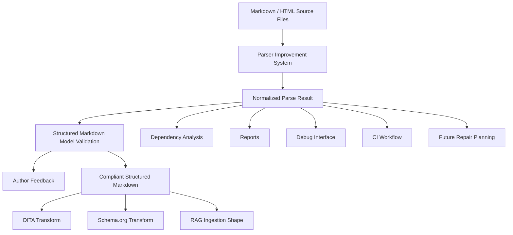

**Purpose and coverage:** This diagram shows the parser as the upstream boundary for structured Markdown validation, author feedback, analysis, reporting, debugging, CI, downstream transforms, and future automation.

### 2.2 Product Functions

The system shall provide the following major functions:

- Read source files through format-specific adapters.
- Produce raw parse models from source syntax.
- Enrich parse models with metadata, references, structure, roles, provenance, and diagnostics.
- Normalize parse results into a stable contract.
- Classify references as resolved, unresolved, unsupported, or not attempted.
- Classify structured Markdown article, unit, component, and attribute patterns where supported.
- Validate parsed Markdown or rendered HTML against JSON Schema-based authoring patterns.
- Attach and preserve metadata and taxonomy hooks at article and unit levels.
- Emit actionable diagnostics.
- Emit author-facing feedback for malformed, ambiguous, incomplete, or unsupported Markdown structures.
- Support fixture-based parser contract testing.
- Provide debug inspection commands for parsed structure, query paths, and unresolved references.
- Version parse output schemas.
- Support transform-ready outputs for DITA, Schema.org, RAG ingestion shapes, and other documented downstream contracts.
- Support compatibility adapters where existing tools depend on old output formats.

### 2.3 User Classes and Characteristics

| User Class | Description | Primary Needs |
|---|---|---|
| Content architect | Designs content structures, maps, metadata models, and governance rules. | Trustworthy structure, dependency visibility, lifecycle metadata, explainable findings. |
| Writer | Creates and updates content files. | Clear reports, actionable remediation, fewer false positives. |
| Markdown author | Writes Markdown intended to conform to a structured content pattern. | Fast feedback, clear examples, guidance for well-formed article/unit/component structure. |
| Support engineer | Investigates parser, validation, or publishing failures. | Provenance, debug output, reproducible parse results, clear diagnostics. |
| Rule author | Creates validation or analysis rules. | Stable schema, queryable structure, predictable reference models. |
| Taxonomy or metadata owner | Defines metadata, taxonomy, and governance fields attached to content. | Reliable article and unit metadata hooks, validation of required taxonomy associations. |
| Transform developer | Builds DITA, Schema.org, RAG, or other output transforms. | Explicit source structure, stable model fields, transform-readiness indicators, provenance. |
| RAG pipeline owner | Prepares validated content for retrieval, chunking, citation, and generation workflows. | Explicit chunks, metadata hooks, stable IDs, source provenance, safe handling of unknown structures. |
| CI maintainer | Maintains automated validation workflows. | Deterministic outputs, acceptable performance, stable exit behavior. |
| Tool developer | Builds validators, analyzers, reports, and automation. | Versioned parser contract, clear APIs, compatibility guarantees. |
| QA engineer | Tests parser behavior and downstream integrations. | Fixtures, expected outputs, acceptance criteria, error-state coverage. |

### 2.4 Operating Environment

REQ-001: The system shall run as a Python package.

REQ-002: The system shall expose functionality usable from command-line workflows.

REQ-003: The system shall support local developer execution.

REQ-004: The system shall support CI execution.

REQ-005: The system shall operate on file-system-based content inputs.

REQ-006: The system shall produce JSON-compatible outputs.

### 2.5 Design and Implementation Constraints

REQ-007: The system shall separate format-specific parsing from normalized model generation.

REQ-008: The system shall separate parsing, semantic enrichment, validation, reporting, and debugging concerns.

REQ-009: The system shall not require downstream tools to parse source files directly when the normalized parse result provides the required data.

REQ-010: The system shall explicitly mark unsupported semantics instead of silently ignoring them.

REQ-011: The system shall not claim full publishing-resolution equivalence unless a supported resolver explicitly provides that behavior.

REQ-012: The system shall version the parse output schema.

REQ-013: The system shall preserve backward compatibility through a compatibility adapter when required by existing consumers.

### 2.6 User Documentation

REQ-014: The system shall document the parser contract.

REQ-015: The system shall document supported source formats.

REQ-016: The system shall document unsupported semantics.

REQ-017: The system shall document diagnostic codes, severities, and remediation guidance.

REQ-018: The system shall document schema versioning rules.

REQ-019: The system shall provide examples of normalized parse output.

REQ-020: The system shall provide fixture examples for clean, complex, and known-failure source content.

REQ-313: The system shall document the structured Markdown Pattern Object Model, including article, unit, component, and attribute levels.

REQ-314: The system shall document how Markdown and rendered HTML5 constructs map to component and attribute schemas.

REQ-315: The system shall document how structured Markdown validation diagnostics should be interpreted by authors.

REQ-316: The system shall document downstream transform-readiness expectations for DITA, Schema.org, RAG ingestion shapes, and other supported output contracts.

REQ-317: The system shall document how article-level and unit-level metadata hooks may be used for taxonomies, governance metadata, and downstream processing metadata.

### 2.7 Dependency Assumptions

REQ-021: The system shall use explicit Python typed models for every inter-layer contract. Versioned public contracts, parser configuration contracts, and normalized parser-output contracts shall use Pydantic models. Internal-only models may use dataclasses or equivalent typed constructs when they do not cross a public or cross-layer boundary.

REQ-022: The system shall use an XML/HTML parsing library appropriate for dependency constraints, such as `lxml` or the Python XML stack.

REQ-023: The system shall isolate optional parser dependencies by format adapter where practical.

---

## 3. System Features

### 3.1 Use Case Overview

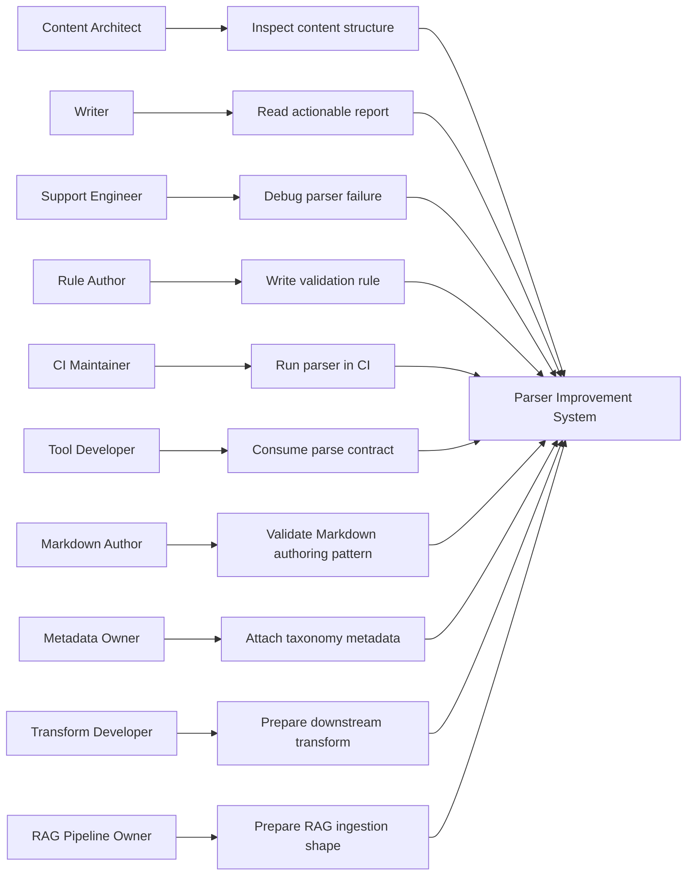

**Purpose and coverage:** This use case diagram shows primary actors and their interactions with parser capabilities.

### 3.1.1 Explicit Use Cases

| Use Case | Primary Actor | Goal | Required System Support |
|---|---|---|---|
| Validate Markdown authoring pattern | Markdown author | Receive feedback that helps make a Markdown file conform to a supported structured content pattern. | Markdown parsing, model classification, JSON Schema validation, author-facing diagnostics. |
| Validate content model in CI | CI maintainer | Fail or warn on malformed, incomplete, or unsupported Markdown structures before publication or transformation. | Deterministic parser output, stable diagnostics, CI exit behavior, schema selection. |
| Inspect structured content | Content architect | Confirm that Markdown has been classified into article, unit, component, and attribute structures. | Debug inspection, query paths, structure tree, metadata and provenance visibility. |
| Attach taxonomy and metadata | Metadata owner | Associate taxonomy, product, lifecycle, or governance metadata with articles and units. | Metadata hooks, metadata validation, provenance, diagnostics for missing or malformed metadata. |
| Transform compliant content to DITA | Transform developer | Convert validated structured Markdown into DITA-oriented topics or specializations. | Transform-ready article and unit classifications, source provenance, explicit unknown markers. |
| Transform compliant content to Schema.org | Transform developer | Convert validated structured Markdown into Schema.org-oriented structured data where applicable. | Explicit content roles, metadata hooks, stable identifiers, transform diagnostics. |
| Prepare RAG ingestion shape | RAG pipeline owner | Produce explicit chunks and metadata for retrieval, citation, filtering, and generation workflows. | Stable article/unit IDs, chunkable units, metadata hooks, source provenance, unknown handling. |
| Analyze references and dependencies | Tool developer | Build dependency and reference analysis without reparsing Markdown. | Reference classification, resolution states, provenance, normalized parse contract. |
| Debug parser classification | Support engineer | Explain why content was classified, rejected, or marked unknown. | Debug assumptions, raw-to-normalized traceability, diagnostics, model validation results. |

### 3.2 Feature: Source File Intake

REQ-024: The system shall accept one or more input file paths.

REQ-025: The system shall determine the source format for each input file by file extension, explicit configuration, or adapter selection.

REQ-026: The system shall reject unsupported file formats with a diagnostic.

REQ-027: The system shall continue processing other files when one file cannot be parsed, unless configured to fail fast.

REQ-028: The system shall preserve each source file path in parser output.

REQ-029: The system shall support content package parsing when a content package format is in scope.

REQ-030: The system shall distinguish root inputs from referenced inputs when package or map parsing is supported.

### 3.3 Feature: Format Adapter Framework

REQ-031: The system shall provide a format adapter interface.

REQ-032: Each format adapter shall parse exactly one source format family unless explicitly designed as a composite adapter.

REQ-033: Each format adapter shall produce a raw parse model.

REQ-034: Format adapters shall not emit downstream validation decisions.

REQ-035: Format adapters shall isolate format-specific behavior from the normalized model.

REQ-036: The system shall support adding new format adapters without modifying downstream consumers.

REQ-037: The initial candidate adapters shall include Markdown, rendered HTML, and DITA/XML, subject to priority selection.

### 3.4 Feature: Raw Parse Model Generation

REQ-038: The system shall generate a raw parse model from each supported source file.

REQ-039: The raw parse model shall preserve source-level structure before simplification.

REQ-040: The raw parse model shall include parse errors when source syntax cannot be fully read.

REQ-041: The raw parse model shall be available to semantic enrichment components.

REQ-042: The raw parse model shall not be treated as the stable external contract.

### 3.5 Feature: Normalized Document Model

REQ-043: The system shall produce a normalized document model for each parsed document.

REQ-044: The normalized document model shall include document identity.

REQ-045: The normalized document model shall include source path.

REQ-046: The normalized document model shall include source format.

REQ-047: The normalized document model shall include optional title.

REQ-048: The normalized document model shall include metadata.

REQ-049: The normalized document model shall include document structure.

REQ-050: The normalized document model shall include references.

REQ-051: The normalized document model shall include diagnostics.

REQ-052: The normalized document model shall include schema version.

REQ-053: The normalized document model shall be serializable to JSON.

REQ-054: The normalized document model shall use stable field names within a schema version.

### 3.6 Feature: Structure Extraction

REQ-055: The system shall identify headings where the source format supports headings.

REQ-056: The system shall identify sections where the source format supports sections.

REQ-057: The system shall identify maps where the source format supports maps.

REQ-058: The system shall identify body content structure where practical.

REQ-059: The system shall identify generated or declared IDs where practical.

REQ-060: The system shall preserve structural hierarchy.

REQ-061: The system shall expose queryable paths for structural nodes.

REQ-062: The system shall emit a diagnostic when expected structure cannot be determined.

### 3.7 Feature: Metadata Extraction

REQ-063: The system shall extract document metadata where supported by the source format.

REQ-064: The system shall preserve metadata keys and values.

REQ-065: The system shall identify lifecycle metadata where available.

REQ-066: The system shall identify front matter where available.

REQ-067: The system shall identify conditional processing metadata where supported and in scope.

REQ-068: The system shall emit diagnostics for malformed metadata.

REQ-069: The system shall distinguish absent metadata from malformed metadata.

### 3.8 Feature: Reference Classification

REQ-070: The system shall identify references from source content.

REQ-071: The system shall classify each reference by type.

REQ-072: The system shall preserve each reference target.

REQ-073: The system shall preserve each reference source path.

REQ-074: The system shall preserve line or span information for each reference where practical.

REQ-075: The system shall classify reference resolution state as `resolved`, `unresolved`, `unsupported`, or `not_attempted`.

REQ-076: The system shall distinguish file references from anchor references.

REQ-077: The system shall distinguish asset references from content references.

REQ-078: The system shall distinguish key references where supported and in scope.

REQ-079: The system shall distinguish conrefs where supported and in scope.

REQ-080: The system shall distinguish image references where supported.

REQ-081: The system shall identify broken links where reference resolution is attempted and fails.

REQ-082: The system shall not mark a reference as resolved unless the configured resolver has verified it.

### 3.9 Feature: Semantic Enrichment

REQ-083: The system shall enrich raw parse models with metadata, references, structure roles, and provenance.

REQ-084: The system shall make semantic enrichment deterministic for the same input files and configuration.

REQ-085: The system shall record semantic assumptions applied during enrichment.

REQ-086: The system shall record unresolved semantics as diagnostics or reference states.

REQ-087: The system shall not hide source-format differences that materially affect downstream decisions.

REQ-088: The system shall avoid flattening format-specific semantics into misleading normalized fields.

### 3.10 Feature: Diagnostics

REQ-089: The system shall emit diagnostics for parse errors.

REQ-090: The system shall emit diagnostics for unsupported source formats.

REQ-091: The system shall emit diagnostics for malformed metadata.

REQ-092: The system shall emit diagnostics for unresolved references when resolution is attempted.

REQ-093: The system shall emit diagnostics for unsupported semantics.

REQ-094: The system shall emit diagnostics for missing expected structure.

REQ-095: Each diagnostic shall include a stable diagnostic code.

REQ-096: Each diagnostic shall include severity.

REQ-097: Each diagnostic shall include a human-readable message.

REQ-098: Each diagnostic shall include source path where available.

REQ-099: Each diagnostic shall include line or span information where practical.

REQ-100: Each diagnostic shall include machine-readable detail fields where useful.

REQ-101: Diagnostic severity shall be one of `info`, `warning`, or `error`.

REQ-102: The system shall group diagnostics by severity, file, and remediation type in report-oriented output.

REQ-103: The system shall distinguish parser limitations from content defects.

REQ-104: The system shall avoid duplicate diagnostics for the same root cause where practical.

### 3.11 Feature: Provenance Tracking

REQ-105: The system shall preserve document-level source provenance.

REQ-106: The system shall preserve node-level provenance where practical.

REQ-107: The system shall preserve reference-level provenance where practical.

REQ-108: The system shall preserve diagnostic-level provenance where practical.

REQ-109: The system shall support line-level provenance in the first version.

REQ-110: The system shall explicitly mark provenance as unavailable when it cannot be determined.

REQ-111: The system shall not fabricate line numbers, spans, or source paths.

### 3.12 Feature: Normalized JSON Output

REQ-112: The system shall serialize parse results to JSON-compatible data.

REQ-113: The JSON-compatible output shall conform to the active parser schema version.

REQ-114: The output shall support machine consumption by validators, analyzers, reports, CLI commands, and CI workflows.

REQ-115: The output shall include diagnostics even when parsing partially fails.

REQ-116: The output shall include unsupported-semantics markers where applicable.

REQ-117: The output shall distinguish required fields from optional fields.

REQ-118: The output shall remain deterministic for identical inputs and configuration.

### 3.13 Feature: Debug Inspection Interface

REQ-119: The system shall provide debug commands to inspect parsed structure.

REQ-120: The system shall provide debug commands to inspect query paths.

REQ-121: The system shall provide debug commands to inspect unresolved references.

REQ-122: The system shall provide debug commands to inspect parser diagnostics.

REQ-123: The debug interface shall expose enough information to reproduce parser behavior for a given input.

REQ-124: The debug interface should support REPL-like inspection if required by users.

REQ-125: The debug interface shall not require users to inspect internal Python objects directly.

### 3.14 Feature: Downstream Consumer Integration

REQ-126: Validators shall consume normalized parse output for structure, metadata, references, and diagnostics.

REQ-127: Dependency analyzers shall consume normalized parse output for maps, topics, references, keys, images, assets, and anchors where supported.

REQ-128: Report generators shall consume normalized parse output to explain findings with provenance and remediation context.

REQ-129: CI workflows shall consume parser diagnostics and exit behavior.

REQ-318: Markdown authoring validators shall consume normalized parse output and structured Markdown model validation results to produce author-facing feedback.

REQ-319: DITA transform tools shall consume compliant structured Markdown output and explicit classification metadata rather than reparsing source Markdown when the normalized output provides the required data.

REQ-320: Schema.org transform tools shall consume compliant structured Markdown output and metadata hooks when producing structured data outputs.

REQ-321: RAG ingestion tools shall consume stable article and unit structures, metadata hooks, references, and provenance from normalized parse output.

REQ-130: Downstream consumers shall not depend on unstable raw parse model details.

REQ-131: Downstream consumers shall treat unsupported semantics as explicit uncertainty.

REQ-132: Downstream consumers shall not downgrade parser errors silently.

### 3.15 Feature: Schema Versioning and Compatibility

REQ-133: The system shall include a schema version in every normalized parse result.

REQ-134: The system shall document breaking schema changes.

REQ-135: The system shall document nonbreaking schema changes.

REQ-136: The system shall provide compatibility adapters for required legacy output formats.

REQ-137: The system shall reject unsupported requested schema versions with a diagnostic or explicit error.

REQ-138: The system shall include migration guidance when a breaking schema change is introduced.

### 3.16 Feature: Fixture-Based Contract Testing

REQ-139: The system shall support fixture-based parser contract tests.

REQ-140: The first contract test set shall include one clean fixture.

REQ-141: The first contract test set shall include one structurally complex fixture.

REQ-142: The first contract test set shall include one known-failure fixture.

REQ-143: Contract tests shall verify schema conformance.

REQ-144: Contract tests shall verify meaningful semantic guarantees.

REQ-145: Contract tests shall avoid freezing incidental output details that are not part of the contract.

REQ-146: Contract tests shall verify diagnostic codes and severity where expected.

REQ-147: Contract tests shall verify reference resolution states where expected.

REQ-148: Contract tests shall verify provenance fields where expected.

### 3.17 Feature: Performance and Scalability Controls

REQ-149: The system shall benchmark parser performance on representative large fixtures.

REQ-150: The system shall cache file reads where safe and useful.

REQ-151: The system shall stream content where practical for large inputs.

REQ-152: The system shall avoid repeated parsing of the same file within one parser run.

REQ-153: The system shall report performance regressions through automated tests or benchmark checks when performance targets are defined.

### 3.18 Feature: MVP Parser Contract Prototype

REQ-154: The first implementation shall select one priority source format.

REQ-155: The first implementation shall select one priority downstream consumer.

REQ-156: The first implementation shall define required fields, optional fields, diagnostics, provenance expectations, and schema versioning.

REQ-157: The first implementation shall validate the parser contract against clean, complex, and known-failure fixtures.

REQ-158: The first implementation shall revise the parser contract based on fixture evidence before broad implementation.

REQ-159: The first implementation shall explicitly define which semantics are in scope.

REQ-160: The first implementation shall explicitly define which semantics are out of scope.

### 3.19 Feature: Structured Markdown Pattern Model Support

REQ-322: The system shall support a structured Markdown Pattern Object Model for Markdown intended to render as HTML5.

REQ-323: The structured Markdown model shall represent one Markdown source file or rendered HTML5 page as one article.

REQ-324: The structured Markdown model shall represent article content as ordered units.

REQ-325: The structured Markdown model shall represent unit content as ordered block-level components.

REQ-326: The structured Markdown model shall represent component inline content as attributes where inline structure is available.

REQ-327: The structured Markdown model shall classify articles by article type, DITA-oriented topic shape, and information type where classification is supported.

REQ-328: The structured Markdown model shall classify units by unit type and information type where classification is supported.

REQ-329: The structured Markdown model shall classify components by block-level component type.

REQ-330: The structured Markdown model shall classify attributes by inline attribute type.

REQ-331: The structured Markdown model shall preserve source order at article, unit, component, and attribute levels.

REQ-332: The structured Markdown model shall include fallback objects for unknown articles, units, components, and attributes when the parser cannot classify source content safely.

REQ-333: The structured Markdown model shall make dependent structures explicit, including list-to-list-item and table-to-row-to-cell relationships.

REQ-334: The system shall support JSON Schema validation of structured Markdown model instances.

### 3.20 Feature: Markdown Authoring Validation and Feedback

REQ-335: The system shall validate parsed Markdown against selected structured Markdown article schemas.

REQ-336: The system shall emit author-facing diagnostics when Markdown does not conform to the selected article, unit, component, or attribute schema.

REQ-337: Author-facing diagnostics shall identify whether the issue is caused by malformed Markdown syntax, unsupported Markdown syntax, missing required structure, ambiguous classification, malformed metadata, or downstream transform risk.

REQ-338: Author-facing diagnostics should include remediation guidance where a known author action can fix the issue.

REQ-339: The system shall support validation modes that distinguish advisory feedback from CI-failing errors.

REQ-340: The system shall preserve unknown objects in validation output so authors can see unclassified content instead of losing source material.

REQ-341: The system shall support validating Markdown authoring patterns without requiring downstream DITA, Schema.org, or RAG transformations to run.

### 3.21 Feature: Metadata, Taxonomy, and Transform Readiness

REQ-342: The system shall expose article-level metadata hooks.

REQ-343: The system shall expose unit-level metadata hooks.

REQ-344: The system should expose component-level and attribute-level metadata hooks for exceptional cases, but shall not require metadata at those levels for normal Markdown authoring validation.

REQ-345: Metadata hooks shall support product metadata, taxonomy terms, lifecycle state, governance metadata, review state, transform hints, and RAG ingestion tags.

REQ-346: The system shall preserve metadata provenance where practical.

REQ-347: The system shall emit diagnostics for required metadata or taxonomy fields that are missing, malformed, or invalid under the active validation profile.

REQ-348: The system shall indicate whether a parsed and validated document is transform-ready for each configured downstream target.

REQ-349: Transform readiness shall be target-specific and shall not imply publishing equivalence.

REQ-350: The system shall identify unknown or unsupported structures that may block or degrade DITA, Schema.org, RAG ingestion, or other configured transforms.

---

## 4. External Interface Requirements

### 4.1 User Interfaces

The system shall primarily expose command-line and report-facing interfaces.

REQ-161: The system shall provide a CLI command to parse one or more source files.

REQ-162: The system shall provide a CLI option to select output schema version when supported.

REQ-163: The system shall provide a CLI option to select or override source format when supported.

REQ-164: The system shall provide a CLI option to emit JSON output.

REQ-165: The system shall provide a CLI option to emit debug-oriented output.

REQ-166: The system shall provide a CLI option to fail fast.

REQ-167: The system shall provide a CLI option to continue on parse errors.

REQ-168: The system shall provide human-readable diagnostic summaries.

REQ-169: The system shall support CI-friendly exit codes.

REQ-351: The system shall provide a CLI command or option to validate Markdown against a selected structured Markdown article schema.

REQ-352: The system shall provide a CLI command or option to emit author-facing validation feedback.

REQ-353: The system shall provide a CLI command or option to inspect structured Markdown model classification results.

REQ-354: The system shall provide a CLI command or option to report transform readiness for configured downstream targets.

#### 4.1.1 CLI Interface Sketch

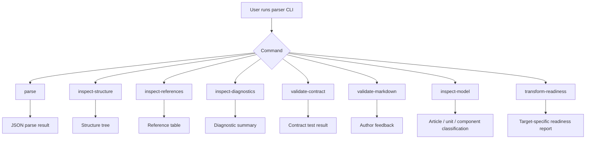

**Purpose and coverage:** This sketch shows the expected command-line interaction model for parsing, inspection, diagnostics, contract validation, Markdown authoring validation, model inspection, and transform-readiness reporting.

#### 4.1.2 Debug Interface Sketch

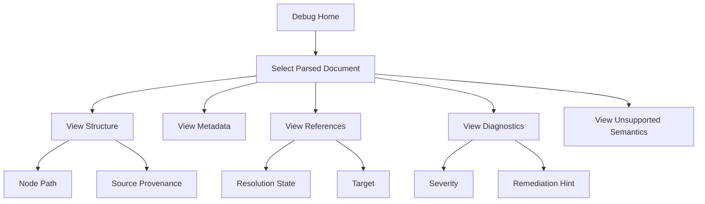

**Purpose and coverage:** This GUI-style flow shows the information architecture for a possible debug interface or equivalent CLI inspection flow.

### 4.2 Hardware Interfaces

REQ-170: The system shall not require specialized hardware.

REQ-171: The system shall run on standard developer and CI machines capable of running the supported Python runtime.

### 4.3 Software Interfaces

REQ-172: The system shall expose a Python package interface for parser execution.

REQ-173: The system shall expose a CLI interface for local and CI workflows.

REQ-174: The system shall expose JSON-compatible parse results for downstream tools.

REQ-175: The system shall support integration with validation rules.

REQ-176: The system shall support integration with dependency analysis tools.

REQ-177: The system shall support integration with report-generation tools.

REQ-178: The system shall support integration with debug tooling.

REQ-179: The system shall support integration with fixture-based test automation.

REQ-355: The system shall expose structured Markdown model validation results to callers.

REQ-356: The system shall expose transform-readiness results to callers without requiring callers to run downstream transforms.

### 4.4 Communication Interfaces

REQ-180: The system shall read local files or content package files from configured paths.

REQ-181: The system shall write output to standard output, files, or caller-provided interfaces.

REQ-182: The system shall not require network access for normal parsing unless a future resolver explicitly requires it.

REQ-183: The system shall make network-dependent resolution behavior explicit if introduced later.

### 4.5 Public API Contract

REQ-184: The parser package shall expose an API to parse a file.

REQ-185: The parser package shall expose an API to parse a collection of files.

REQ-186: The parser package shall expose an API to register format adapters.

REQ-187: The parser package shall expose an API to serialize parse results.

REQ-188: The parser package shall expose an API to validate parse results against a schema.

REQ-189: The parser package shall expose an API to inspect diagnostics.

Public API boundary rules:

- `parse_file(...)` shall return one versioned `ParsedDocument` contract object.
- `parse_files(...)` shall return one versioned `ParseRunResult` contract object that contains zero or more `ParsedDocument` objects plus run-level diagnostics.
- The Python API boundary shall expose typed Pydantic models, not untyped dictionaries.
- JSON serialization shall be derived from those typed models so that the Python and JSON contracts are mechanically aligned.

Example conceptual API:

```python
document = parser.parse_file(
    path="docs/example.md",
    format_hint="markdown",
    schema_version="1.0"
)

run = parser.parse_files(
    paths=["docs/example.md", "docs/other.md"],
    schema_version="1.0"
)

json_output = run.model_dump_json()
```

---

## 5. Nonfunctional Requirements

### 5.1 Reliability

REQ-190: The system shall produce deterministic output for identical inputs, parser configuration, and schema version.

REQ-191: The system shall preserve partial parse results when recoverable parse errors occur.

REQ-192: The system shall emit explicit diagnostics for recoverable failures.

REQ-193: The system shall fail with a controlled error for unrecoverable failures.

REQ-194: The system shall not silently skip unsupported source files.

REQ-195: The system shall not silently discard unsupported semantics.

### 5.2 Performance

REQ-196: The system shall avoid parsing the same file more than once per parser run unless configuration changes require it.

REQ-197: The system shall support performance benchmarking on representative content packages.

REQ-198: The system shall provide measurable performance targets after representative package sizes are known.

REQ-199: The system should stream or incrementally process large files where practical.

REQ-200: The system should cache file reads and intermediate results where safe.

### 5.3 Maintainability

REQ-201: The system shall use a layered architecture.

REQ-202: The system shall keep format adapters isolated.

REQ-203: The system shall keep semantic enrichment separate from format-specific parsing.

REQ-204: The system shall keep validation rule logic separate from parser logic.

REQ-205: The system shall keep report formatting separate from parser logic.

REQ-206: The system shall provide typed models for parser output.

REQ-207: The system shall document all public fields in the parser contract.

REQ-208: The system shall include automated tests for parser contract behavior.

### 5.4 Usability

REQ-209: Diagnostics shall use clear, active, user-focused language.

REQ-210: Diagnostics shall describe what failed.

REQ-211: Diagnostics shall identify where the failure occurred when provenance is available.

REQ-212: Diagnostics shall distinguish content defects from parser limitations.

REQ-213: Diagnostics should include remediation guidance where known.

REQ-214: Debug commands shall expose parser behavior without requiring source-code inspection.

### 5.5 Compatibility

REQ-215: The system shall identify existing downstream consumers before breaking output changes are introduced.

REQ-216: The system shall provide compatibility adapters when legacy consumers must continue operating.

REQ-217: The system shall support schema-version negotiation or explicit schema-version selection where practical.

REQ-218: The system shall preserve old behavior only when required by compatibility policy.

### 5.6 Testability

REQ-219: Every parser contract field shall be testable through fixtures or schema validation.

REQ-220: Every diagnostic code shall have at least one positive test or documented reason for exclusion.

REQ-221: Reference resolution states shall be testable through fixtures.

REQ-222: Unsupported semantics shall be testable through fixtures.

REQ-223: Provenance behavior shall be testable through fixtures where supported.

REQ-224: Performance behavior shall be testable after performance targets are established.

### 5.7 Security

REQ-225: The system shall treat input files as untrusted.

REQ-226: The system shall avoid executing source content during parsing.

REQ-227: The system shall avoid resolving external resources unless explicitly configured.

REQ-228: The system shall report unsafe or unsupported external resolution behavior through diagnostics or configuration errors.

REQ-229: The system shall avoid exposing sensitive local paths in user-facing reports when path redaction is configured.

### 5.8 Observability

REQ-230: The system shall expose diagnostics in machine-readable form.

REQ-231: The system shall expose diagnostics in human-readable form.

REQ-232: The system shall support debug output for parser decisions.

REQ-233: The system shall support logging of parser assumptions when debug mode is enabled.

REQ-234: The system shall make unresolved and unsupported semantics visible to downstream consumers.

---

## 6. Domain Model

### 6.1 Domain Overview

The parser improvement system uses an object-oriented, model-driven design. The core domain is the transformation of source files into normalized, provenance-rich parse results.

The design uses four named contract boundaries:

1. `ParserConfig` as the execution contract between callers and orchestration.
2. `RawParseModel` as the typed internal contract between format adapters and semantic enrichment.
3. `ParsedDocument` and `ParseRunResult` as the public normalized contracts consumed by downstream tools.
4. Compatibility output contracts as explicit legacy projections derived from the normalized public contract.

For structured Markdown workflows, `ParsedDocument` also contains structured content, model-validation results, and transform-readiness results. These fields let validators produce author feedback and let downstream tools consume compliant content without reparsing Markdown.

### 6.2 Domain Class Diagram

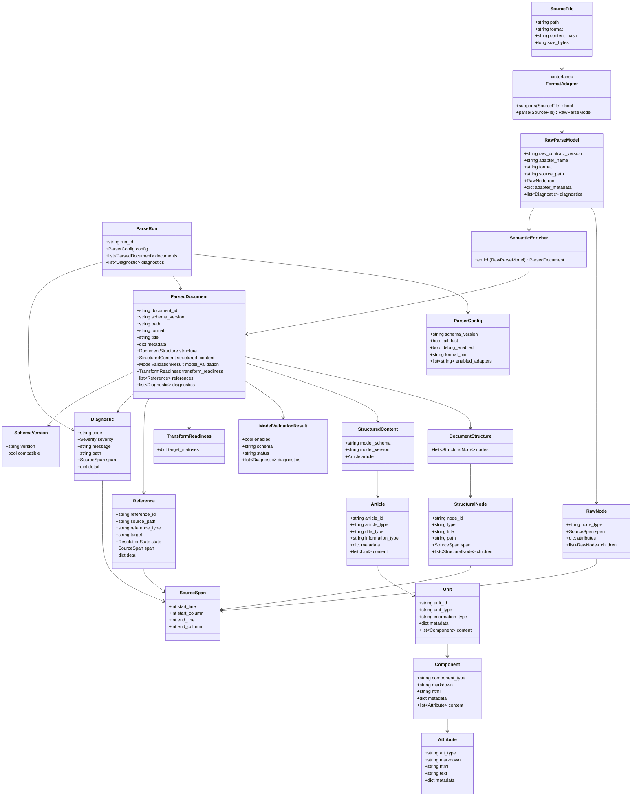

**Purpose and coverage:** This class diagram defines core entities, services, value objects, interfaces, and relationships in the parser domain model.

Implementation note:

- `ParseRun` is the internal orchestration entity for one execution.
- `ParseRunResult` is the public batch contract exposed at the Python and JSON boundary.
- `ParsedDocument` is the public single-document contract exposed by `parse_file(...)`.

### 6.3 Entities

| Entity | Description | Identity |
|---|---|---|
| ParseRun | One parser execution over one or more inputs. | `run_id` |
| SourceFile | A file selected for parsing. | Normalized path plus content hash |
| RawParseModel | Typed adapter output consumed by semantic enrichment. | Source path plus raw contract version |
| ParsedDocument | Normalized parse result for one source document. | `document_id` |
| StructuredContent | Structured Markdown model instance produced from one parsed Markdown or rendered HTML document. | Document identity plus model schema |
| Article | Root structured Markdown object representing one Markdown file or HTML5 page. | `articleId` |
| Unit | Logical chunk within an article. | `unitId` within article |
| Component | Block-level Markdown or HTML5 construct. | Component path within unit |
| Attribute | Inline Markdown or HTML5 construct. | Attribute path within component |
| StructuralNode | Node in parsed document structure. | `node_id` within document |
| Reference | Source-to-target relationship found in content. | `reference_id` within document |
| Diagnostic | Parser, enrichment, or contract finding. | Diagnostic code plus source context |

### 6.4 Value Objects

| Value Object | Description |
|---|---|
| SourceSpan | Line and column range in a source file. |
| ParserConfig | Immutable configuration for a parse run. |
| SchemaVersion | Version identifier for parse result schema. |
| ResolutionState | Enumerated reference resolution state. |
| Severity | Enumerated diagnostic severity. |
| MetadataValue | Typed representation of metadata values when supported. |

### 6.5 Services

| Service | Responsibility |
|---|---|
| ParserOrchestrator | Coordinates file intake, adapter selection, parsing, enrichment, diagnostics, and output generation. |
| FormatAdapter | Parses format-specific syntax into a raw parse model. |
| SemanticEnricher | Converts raw parse models into normalized parsed documents. |
| StructuredMarkdownClassifier | Classifies parsed Markdown or rendered HTML into article, unit, component, and attribute patterns. |
| ModelValidator | Validates structured Markdown model instances against selected JSON Schemas. |
| AuthorFeedbackReporter | Converts parser and model-validation diagnostics into writer-oriented feedback. |
| TransformReadinessEvaluator | Evaluates whether normalized output satisfies configured preconditions for DITA, Schema.org, RAG ingestion, or other target contracts. |
| ReferenceResolver | Resolves supported references when configured and in scope. |
| DiagnosticFactory | Creates consistent diagnostics with stable codes and severities. |
| SchemaValidator | Validates normalized output against schema. |
| CompatibilityAdapter | Converts current output into legacy output when required. |
| DebugInspector | Exposes parsed structure, references, diagnostics, and assumptions. |

### 6.6 Repositories

| Repository | Responsibility |
|---|---|
| SourceRepository | Reads source files and content packages from the file system. |
| FixtureRepository | Provides clean, complex, and known-failure fixtures for contract tests. |
| SchemaRepository | Stores parser schema definitions and version metadata. |
| ResultRepository | Stores parse output when configured to write results to disk. |

### 6.7 Interfaces

| Interface | Responsibility |
|---|---|
| `IFormatAdapter` | Defines adapter support and parse operations. |
| `IReferenceResolver` | Defines reference resolution behavior. |
| `IOutputSerializer` | Defines JSON and optional human-readable output serialization. |
| `IDiagnosticReporter` | Defines diagnostic grouping and presentation. |
| `ISchemaValidator` | Defines schema validation operations. |
| `IModelValidator` | Defines structured Markdown model-validation operations. |
| `ITransformReadinessEvaluator` | Defines target-specific transform-readiness checks. |
| `IDebugInspector` | Defines inspection operations for debug workflows. |

### 6.8 Commands

| Command | Description |
|---|---|
| `ParseFilesCommand` | Parses one or more source files. |
| `InspectStructureCommand` | Displays structure tree and node paths. |
| `InspectReferencesCommand` | Displays references and resolution states. |
| `InspectDiagnosticsCommand` | Displays diagnostics by severity, file, and remediation type. |
| `ValidateContractCommand` | Runs parser contract tests against fixtures. |
| `ValidateMarkdownCommand` | Validates Markdown against a selected structured Markdown model schema and emits author feedback. |
| `InspectModelCommand` | Displays article, unit, component, and attribute classification results. |
| `TransformReadinessCommand` | Reports target-specific readiness for DITA, Schema.org, RAG ingestion, or other configured targets. |
| `SerializeResultCommand` | Writes normalized parse output to JSON. |

### 6.9 Events

| Event | Trigger |
|---|---|
| `ParseRunStarted` | Parser run begins. |
| `SourceFileLoaded` | Source file is read successfully. |
| `AdapterSelected` | Format adapter is selected for a source file. |
| `RawParseCompleted` | Raw parse model is produced. |
| `SemanticEnrichmentCompleted` | Normalized document model is produced. |
| `StructuredMarkdownClassificationCompleted` | Structured Markdown model instance is produced or source content is marked unknown. |
| `ModelValidationCompleted` | Structured Markdown model validation finishes. |
| `TransformReadinessCompleted` | Target-specific transform-readiness evaluation finishes. |
| `ReferenceResolutionCompleted` | Reference resolution finishes for a document. |
| `DiagnosticEmitted` | Parser emits a diagnostic. |
| `ParseRunCompleted` | Parser run finishes. |
| `SchemaValidationFailed` | Output does not conform to schema. |

### 6.10 State Model

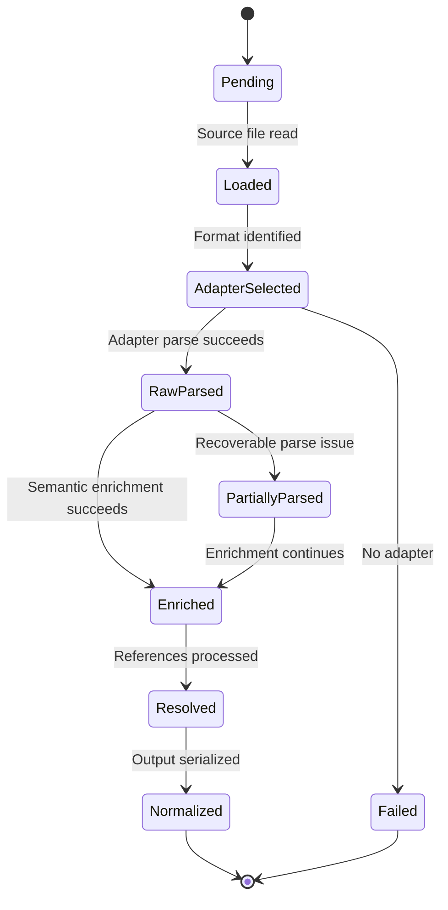

**Purpose and coverage:** This state diagram shows the lifecycle of a source document during parsing, including recoverable and unrecoverable paths.

### 6.11 Activity Flow

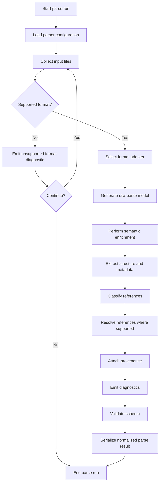

**Purpose and coverage:** This activity diagram describes the end-to-end parser workflow from configuration to output serialization.

---

## 7. Architecture and Design Constraints

### 7.1 Layered Architecture

The system shall use layered architecture to reduce coupling and prevent parser responsibilities from leaking into validation or reporting.

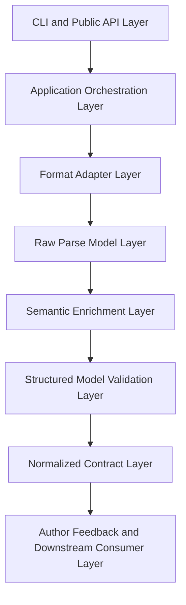

**Purpose and coverage:** This component-level view shows the required separation of interfaces, orchestration, adapters, raw parsing, enrichment, structured model validation, normalized output, author feedback, and downstream consumers.

Layer boundary contract table:

| Layer | Responsibility | Input contract | Output contract | Forbidden dependencies |
|---|---|---|---|---|
| CLI and Public API | Accept commands and caller requests. | `ParserConfig` and user inputs | `ParsedDocument`, `ParseRunResult`, diagnostics, serialized output | Format-specific parsing internals |
| Application Orchestration | Coordinate one parse run. | `ParserConfig`, `SourceFile`, registered interfaces | Calls to adapters, enrichers, validators, serializers | Adapter-private syntax structures |
| Format Adapter | Read one source format family. | `SourceFile` | `RawParseModel` | Downstream validators, report formatters, legacy compatibility logic |
| Raw Parse Model | Preserve syntax-oriented facts with provenance. | Adapter-produced typed nodes | `RawParseModel` consumed by enrichment | Downstream consumer assumptions |
| Semantic Enrichment | Convert syntax facts into normalized semantics. | `RawParseModel` | `ParsedDocument` | Format-adapter internals outside the raw contract |
| Structured Model Validation | Validate structured Markdown model instances and evaluate target readiness. | `structured_content`, selected model schema, validation profile | `model_validation`, `transform_readiness`, author-facing diagnostics | Source-file reparsing and downstream transform execution |
| Normalized Contract | Public parser output boundary. | `ParsedDocument` and `ParseRunResult` | Stable JSON and Python contract objects | Legacy consumer-specific field quirks |
| Author Feedback and Downstream Consumer | Validate, report, debug, transform, ingest, or analyze. | Normalized public contract | Consumer-specific results | Raw parse internals and direct source-file parsing when contract data is sufficient |

### 7.2 Component Diagram

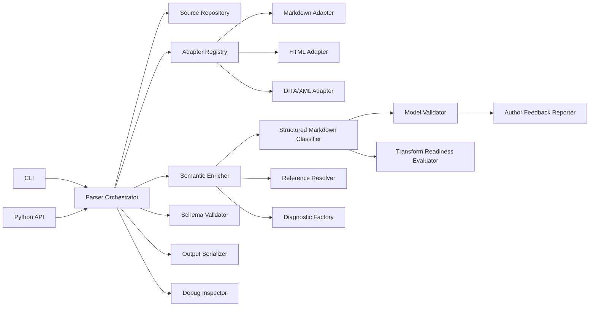

**Purpose and coverage:** This diagram identifies major runtime components and their dependencies.

### 7.3 Deployment Diagram

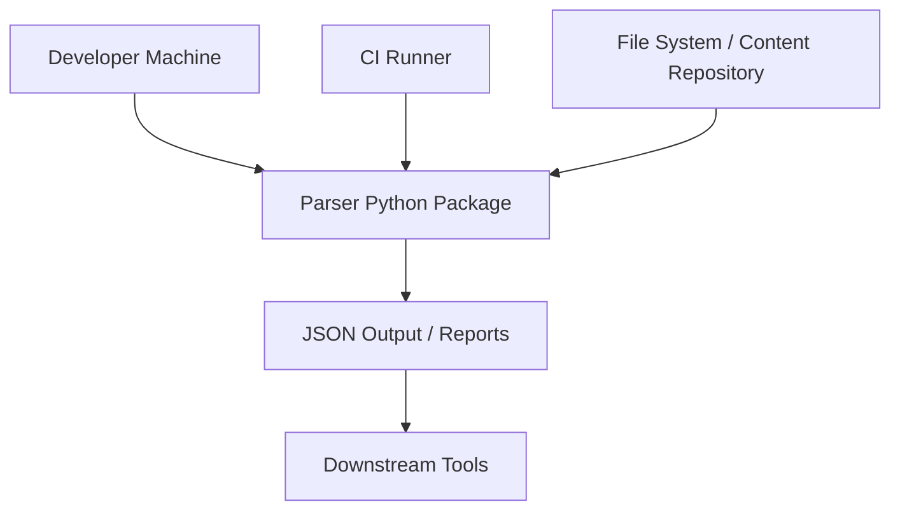

**Purpose and coverage:** This deployment diagram shows normal local and CI execution using file-system inputs and JSON/report outputs.

### 7.4 Sequence Diagram: Parse File

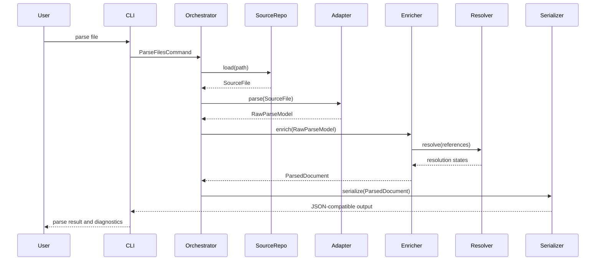

**Purpose and coverage:** This sequence diagram shows the primary parser interaction from user command to serialized output.

### 7.5 Design Patterns

The following design patterns clarify expected design decisions:

| Pattern | Use |
|---|---|
| Adapter | Isolate Markdown, HTML, DITA/XML, and future format-specific parsing. |
| Strategy | Select reference-resolution behavior by format and configuration. |
| Factory | Create diagnostics consistently with stable codes and severity. |
| Repository | Isolate source, schema, fixture, and result storage. |
| Facade | Provide a simple public parser API over layered internals. |
| Command | Implement CLI operations as testable command objects. |

### 7.6 Architectural Constraints

REQ-235: The parser orchestrator shall coordinate components without containing format-specific parsing logic.

REQ-236: Format adapters shall not call downstream validators.

REQ-237: Validators shall not depend on format adapter internals.

REQ-238: Reports shall consume normalized parse output and diagnostics.

REQ-239: Debug tools shall consume normalized parse output and optional debug metadata.

REQ-240: Reference resolution shall be explicit, configurable, and limited to supported semantics.

REQ-241: Unsupported semantics shall flow through the system as explicit diagnostic or state information.

REQ-242: The parser contract shall be treated as a public boundary between parser internals and downstream tools.

REQ-293: Every layer boundary shall be defined by explicit Python types rather than implicit dictionaries or ad hoc object payloads.

REQ-294: Public parser contracts and parser configuration contracts shall be implemented as versioned Pydantic models.

REQ-295: The format-adapter to semantic-enricher boundary shall use a typed internal raw parse contract owned by the parser core.

REQ-296: Format adapters shall not expose arbitrary untyped syntax payloads across the adapter boundary.

REQ-297: The application orchestration layer shall depend on interfaces and contract models, not on adapter-private structures.

REQ-298: Published JSON Schema artifacts shall be generated from or mechanically verified against the authoritative Pydantic contract models.

REQ-299: Batch parsing shall expose a top-level parse-run contract distinct from the single-document contract.

REQ-300: Compatibility adapters shall consume versioned normalized contracts and emit legacy shapes without modifying parser-core behavior.

---

## 8. Data and Validation Contracts

### 8.1 Public Contract Hierarchy

The parser exposes two public normalized contract shapes:

- `ParsedDocument` for single-document parsing and document-level consumption.
- `ParseRunResult` for multi-file parsing, CLI batch output, and any workflow that needs run-level diagnostics or aggregate metadata.

Conceptual `ParseRunResult` structure:

```json
{
  "schema_version": "1.0",
  "run_id": "string",
  "documents": [],
  "diagnostics": [],
  "stats": {}
}
```

`ParseRunResult` rules:

- `schema_version` is required.
- `run_id` is required.
- `documents` is required and may be empty only when no document could be produced.
- `diagnostics` is required and may be empty.
- `stats` may be empty and shall contain only documented aggregate fields.

The single-document normalized contract shall use the following conceptual structure.

```json
{
  "schema_version": "1.0",
  "document_id": "string",
  "path": "string",
  "format": "markdown | html | dita_xml | other",
  "title": "string | null",
  "metadata": {},
  "structure": {
    "nodes": []
  },
  "structured_content": {},
  "model_validation": {},
  "transform_readiness": {},
  "references": [],
  "diagnostics": []
}
```

REQ-243: `schema_version` shall be required.

REQ-244: `document_id` shall be required.

REQ-245: `path` shall be required.

REQ-246: `format` shall be required.

REQ-247: `title` shall be optional.

REQ-248: `metadata` shall be required and may be empty.

REQ-249: `structure` shall be required.

REQ-250: `references` shall be required and may be empty.

REQ-251: `diagnostics` shall be required and may be empty.

REQ-357: `structured_content` shall contain the structured Markdown model instance when structured Markdown validation is enabled and a model instance can be produced.

REQ-358: `structured_content` shall be omitted or set to null when no structured content model is requested or available.

REQ-359: `model_validation` shall contain structured Markdown model validation results when model validation is enabled.

REQ-360: `transform_readiness` shall contain target-specific readiness results when transform-readiness analysis is enabled.

### 8.1.1 Structured Markdown Content Contract

When structured Markdown validation is enabled, the parser shall produce a structured content object that follows the article, unit, component, and attribute hierarchy.

Conceptual `structured_content` structure:

```json
{
  "model_schema": "artArticle.schema.json",
  "model_version": "0.1.0",
  "article": {
    "articleId": "string",
    "articleType": "topic | concept | howto | reference | troubleshooting | glossary | glossentry | overview | quickstart | tutorial | unknown",
    "ditaType": "topic | concept | howto | reference | troubleshooting | glossary | glossentry",
    "informationType": "concept | procedure | principle | process | fact | mixed | unknown",
    "metadata": {},
    "source": {},
    "content": []
  }
}
```

REQ-361: The structured Markdown content contract shall identify the JSON Schema used to validate the model instance.

REQ-362: The structured Markdown content contract shall include one article object for each parsed Markdown file or rendered HTML5 page.

REQ-363: The article object shall include `articleId`, `articleType`, `ditaType`, `informationType`, and ordered `content`.

REQ-364: Unit objects shall include `unitId`, `unitType`, `informationType`, optional metadata hooks, optional source provenance, and ordered `content`.

REQ-365: Component objects shall include `componentType`, optional metadata hooks, optional source provenance, source Markdown or rendered HTML where available, and ordered child content where applicable.

REQ-366: Attribute objects shall include `attType`, source Markdown or rendered HTML where available, text or target fields where applicable, optional metadata hooks, and optional provenance.

REQ-367: Unknown article, unit, component, or attribute objects shall preserve the source content that could not be safely classified.

REQ-368: Structured Markdown content shall preserve order using arrays rather than relying on object property order.

### 8.1.2 Model Validation Result Contract

Conceptual `model_validation` structure:

```json
{
  "enabled": true,
  "schema": "artHowto.schema.json",
  "status": "valid | invalid | not_attempted",
  "diagnostics": []
}
```

REQ-369: Model validation results shall identify the selected validation schema.

REQ-370: Model validation status shall be one of `valid`, `invalid`, or `not_attempted`.

REQ-371: Model validation diagnostics shall use the same diagnostic contract as parser diagnostics.

REQ-372: Model validation diagnostics shall distinguish authoring-pattern violations from parser limitations.

### 8.1.3 Transform Readiness Contract

Conceptual `transform_readiness` structure:

```json
{
  "dita": {
    "status": "ready | blocked | degraded | not_evaluated",
    "diagnostics": []
  },
  "schema_org": {
    "status": "ready | blocked | degraded | not_evaluated",
    "diagnostics": []
  },
  "rag_ingestion": {
    "status": "ready | blocked | degraded | not_evaluated",
    "diagnostics": []
  }
}
```

REQ-373: Transform-readiness status shall be target-specific.

REQ-374: Transform-readiness status shall be one of `ready`, `blocked`, `degraded`, or `not_evaluated`.

REQ-375: Transform-readiness diagnostics shall identify the structure, metadata, reference, or unsupported-semantic issue that affects the target.

REQ-376: A `ready` status shall mean that the normalized output satisfies the configured preconditions for that target, not that a downstream transform has already succeeded.

### 8.2 Diagnostic Contract

```json
{
  "code": "PARSER_DIAGNOSTIC_CODE",
  "severity": "info | warning | error",
  "message": "string",
  "path": "string | null",
  "provenance_status": "present | unavailable | not_applicable",
  "span": {
    "start_line": 1,
    "start_column": 1,
    "end_line": 1,
    "end_column": 10
  },
  "detail": {}
}
```

REQ-252: Diagnostic `code` shall be required.

REQ-253: Diagnostic `severity` shall be required.

REQ-254: Diagnostic `message` shall be required.

REQ-255: Diagnostic `path` shall be optional only when no source path is available.

REQ-256: Diagnostic `span` shall be optional.

REQ-257: Diagnostic `detail` shall be required and may be empty.

REQ-301: Diagnostic `provenance_status` shall be required and shall be one of `present`, `unavailable`, or `not_applicable`.

REQ-258: Diagnostic codes shall be stable within a schema version.

REQ-259: Diagnostic messages shall be suitable for users.

REQ-260: Diagnostic details shall be suitable for machines.

### 8.3 Reference Contract

```json
{
  "reference_id": "string",
  "source_path": "string",
  "reference_type": "link | image | asset | keyref | conref | map | anchor | other",
  "target": "string",
  "state": "resolved | unresolved | unsupported | not_attempted",
  "provenance_status": "present | unavailable | not_applicable",
  "span": {
    "start_line": 1,
    "start_column": 1,
    "end_line": 1,
    "end_column": 10
  },
  "detail": {}
}
```

REQ-261: Reference `reference_id` shall be required.

REQ-262: Reference `source_path` shall be required.

REQ-263: Reference `reference_type` shall be required.

REQ-264: Reference `target` shall be required.

REQ-265: Reference `state` shall be required.

REQ-266: Reference `span` shall be optional.

REQ-267: Reference `detail` shall be required and may be empty.

REQ-302: Reference `provenance_status` shall be required and shall be one of `present`, `unavailable`, or `not_applicable`.

REQ-268: The system shall not use `resolved` unless resolution was attempted and succeeded.

REQ-269: The system shall use `unresolved` when resolution was attempted and failed.

REQ-270: The system shall use `unsupported` when the reference type or resolution semantics are recognized but out of scope.

REQ-271: The system shall use `not_attempted` when resolution was not attempted.

### 8.4 Structure Node Contract

```json
{
  "node_id": "string",
  "type": "document | heading | section | map | topic | body | metadata | other",
  "title": "string | null",
  "path": "string",
  "provenance_status": "present | unavailable | not_applicable",
  "span": {
    "start_line": 1,
    "start_column": 1,
    "end_line": 1,
    "end_column": 10
  },
  "attributes": {},
  "children": []
}
```

REQ-272: Structure node `node_id` shall be required.

REQ-273: Structure node `type` shall be required.

REQ-274: Structure node `title` shall be optional.

REQ-275: Structure node `path` shall be required.

REQ-276: Structure node `span` shall be optional.

REQ-277: Structure node `attributes` shall be required and may be empty.

REQ-278: Structure node `children` shall be required and may be empty.

REQ-303: Structure node `provenance_status` shall be required and shall be one of `present`, `unavailable`, or `not_applicable`.

REQ-279: Structure node paths shall be stable within a parse result.

REQ-280: Structure node hierarchy shall preserve source hierarchy where practical.

### 8.5 Parser Configuration Contract

```json
{
  "schema_version": "1.0",
  "format_hint": "string | null",
  "fail_fast": false,
  "debug_enabled": false,
  "enabled_adapters": ["markdown", "html", "dita_xml"],
  "model_validation": {
    "enabled": true,
    "schema": "artArticle.schema.json"
  },
  "transform_readiness": {
    "enabled": true,
    "targets": ["dita", "schema_org", "rag_ingestion"]
  },
  "reference_resolution": {
    "enabled": true,
    "allowed_reference_types": []
  }
}
```

REQ-281: Parser configuration shall specify a schema version.

REQ-282: Parser configuration shall support optional format hints.

REQ-283: Parser configuration shall support fail-fast behavior.

REQ-284: Parser configuration shall support debug mode.

REQ-285: Parser configuration shall support adapter selection.

REQ-286: Parser configuration shall support reference-resolution settings.

REQ-377: Parser configuration shall support structured Markdown model-validation settings.

REQ-378: Parser configuration shall support transform-readiness target selection.

REQ-379: Parser configuration shall support validation profiles that distinguish advisory author feedback from CI-failing validation.

### 8.6 Internal Raw Parse Contract

The adapter-to-enricher contract is internal but explicit. It shall be typed, versioned, and testable.

Conceptual `RawParseModel` structure:

```json
{
  "raw_contract_version": "1.0",
  "adapter_name": "markdown",
  "format": "markdown",
  "source_path": "string",
  "root": {
    "node_type": "document",
    "attributes": {},
    "children": []
  },
  "adapter_metadata": {},
  "diagnostics": []
}
```

REQ-304: `raw_contract_version` shall be required for every raw parse model.

REQ-305: `adapter_name`, `format`, and `source_path` shall be required for every raw parse model.

REQ-306: `root` shall be required unless source syntax failure prevents any tree creation, in which case diagnostics shall explain the omission.

REQ-307: `adapter_metadata` shall be optional only for documented empty cases and shall not be used as an unbounded substitute for core raw-contract fields.

REQ-308: Raw parse models shall be represented in Python as typed models or protocols owned by the parser package.

REQ-309: Semantic enrichment shall consume only the declared raw parse contract and shall not inspect adapter-private objects outside that contract.

### 8.7 Validation Boundaries

REQ-287: Format adapters shall validate source syntax only to the extent required to produce a raw parse model.

REQ-288: Semantic enrichment shall validate whether required normalized fields can be populated.

REQ-289: Schema validation shall validate the normalized parse result.

REQ-290: Downstream validation rules shall validate content governance or business rules.

REQ-291: Report validation shall validate presentation completeness, not parser correctness.

REQ-292: Contract tests shall validate parser guarantees, not incidental implementation details.

REQ-380: Structured Markdown model validation shall validate parsed model instances against selected JSON Schemas and authoring profiles.

REQ-381: Author feedback reporting shall translate parser, schema, and model-validation diagnostics into user-facing guidance without changing parser output.

REQ-382: Transform-readiness evaluation shall check configured target preconditions without executing downstream DITA, Schema.org, RAG ingestion, or other transforms.

REQ-383: Downstream transforms shall consume normalized parse output or compliant structured Markdown model instances and shall not be required for normal Markdown authoring validation.

REQ-310: Line-level provenance shall be mandatory in the first version for diagnostics, references, and structure nodes when the active source format and parser path can represent that information.

REQ-311: When line-level provenance cannot be determined, the contract shall omit `span`, set `provenance_status` to `unavailable` or `not_applicable`, and record a machine-readable reason in the extension field for that contract object.

REQ-312: The system shall never fabricate line, column, or span values to satisfy a contract field.

### 8.8 Invariants

INV-001: Every normalized parse result shall have one schema version.

INV-002: Every parsed document shall have one source path.

INV-003: Every diagnostic shall have one stable diagnostic code.

INV-004: Every reference shall have one resolution state.

INV-005: A reference shall not be both `resolved` and `unresolved`.

INV-006: Unsupported semantics shall not be silently dropped.

INV-007: Parser output for identical inputs and configuration shall be deterministic.

INV-008: Raw parse models shall not be used as the stable external contract.

INV-009: Every public parser result shall be representable both as a typed Python contract model and as JSON-compatible serialized output for the same schema version.

### 8.9 Preconditions and Postconditions

#### Parse File

Preconditions:

- PRE-001: The input path exists or can produce a controlled missing-file diagnostic.
- PRE-002: Parser configuration is valid.
- PRE-003: At least one format adapter is registered.

Postconditions:

- POST-001: The system produces a normalized parse result, partial parse result, or controlled error.
- POST-002: The system emits diagnostics for parse failures.
- POST-003: The system preserves source path provenance when available.
- POST-004: The system serializes output when requested.

#### Resolve Reference

Preconditions:

- PRE-004: A reference target is present.
- PRE-005: Reference resolution is enabled.
- PRE-006: The reference type is supported by the active resolver.

Postconditions:

- POST-005: The reference state is `resolved`, `unresolved`, `unsupported`, or `not_attempted`.
- POST-006: The result does not claim resolution without verification.
- POST-007: A diagnostic is emitted when configured resolution fails or is unsupported.

### 8.10 Error States

| Error State | Required Behavior |
|---|---|
| Missing input file | Emit diagnostic and continue unless fail-fast is enabled. |
| Unsupported format | Emit diagnostic and continue unless fail-fast is enabled. |
| Malformed source syntax | Emit parse diagnostic and produce partial result when possible. |
| Malformed metadata | Emit diagnostic and distinguish from absent metadata. |
| Unsupported semantic | Mark unsupported and emit diagnostic where useful. |
| Unresolved reference | Mark unresolved when resolution was attempted. |
| Schema validation failure | Emit controlled error and diagnostic. |
| Legacy schema requested but unavailable | Emit controlled error or diagnostic. |
| Internal parser exception | Fail with controlled error and include safe diagnostic context. |

### 8.11 ER Diagram

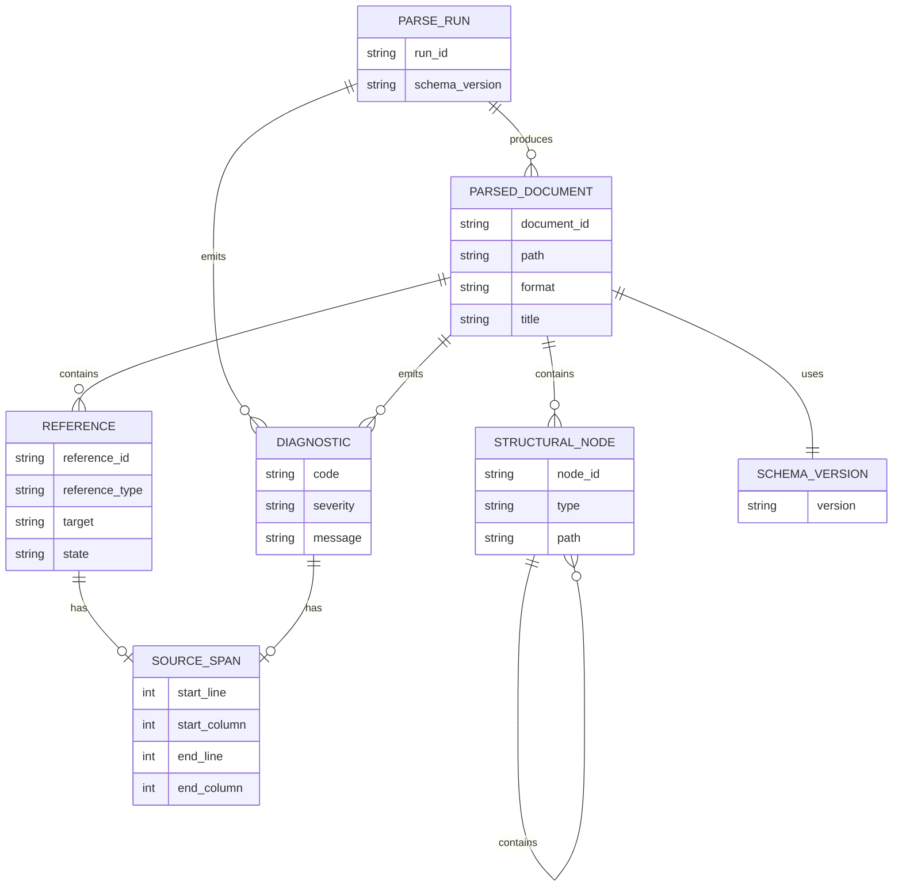

**Purpose and coverage:** This ER diagram shows persistent or serialized relationships among parse runs, documents, nodes, references, diagnostics, spans, and schema versions.

---

## 9. Acceptance Criteria

### 9.1 Parser Contract Prototype

AC-001: Given one selected priority source format, when a clean fixture is parsed, then the system produces a schema-valid normalized parse result.

AC-002: Given one selected priority source format, when a structurally complex fixture is parsed, then the system preserves expected hierarchy, metadata, references, and provenance.

AC-003: Given one selected priority source format, when a known-failure fixture is parsed, then the system emits expected diagnostics with stable codes and severities.

AC-004: Given the same fixture and configuration, when the parser runs twice, then both runs produce deterministic equivalent output.

AC-005: Given an unsupported semantic in a fixture, when the parser processes it, then the output marks the semantic as unsupported or emits an appropriate diagnostic.

### 9.2 Source Intake

AC-006: Given an existing supported file path, when the parser runs, then it selects the correct adapter or uses the configured format hint.

AC-007: Given a missing file path, when the parser runs, then it emits a missing-file diagnostic.

AC-008: Given an unsupported file format, when the parser runs, then it emits an unsupported-format diagnostic.

AC-009: Given multiple input files and one parse failure, when fail-fast is disabled, then the parser continues processing remaining files.

AC-010: Given multiple input files and one parse failure, when fail-fast is enabled, then the parser stops after the failure.

### 9.3 Structure and Metadata

AC-011: Given a source file with headings, when the parser runs, then the normalized output includes heading nodes in source order.

AC-012: Given a source file with nested sections, when the parser runs, then the normalized output preserves hierarchy.

AC-013: Given a source file with front matter, when the parser runs, then the normalized output includes metadata fields.

AC-014: Given malformed metadata, when the parser runs, then the output includes a malformed-metadata diagnostic.

AC-015: Given absent metadata, when the parser runs, then the output does not report malformed metadata.

AC-045: Given a Markdown file that conforms to a selected structured Markdown article schema, when authoring validation runs, then the model-validation status is `valid`.

AC-046: Given a Markdown file that violates a selected structured Markdown article schema, when authoring validation runs, then the model-validation status is `invalid` and author-facing diagnostics identify the violated article, unit, component, or attribute expectation.

AC-047: Given Markdown content that cannot be safely classified, when authoring validation runs, then the output preserves that content in an unknown article, unit, component, or attribute object and emits a diagnostic explaining the uncertainty.

AC-048: Given a source file with ordered headings, paragraphs, lists, tables, and inline attributes, when structured Markdown output is produced, then source order is preserved in article, unit, component, and attribute `content` arrays.

### 9.4 References

AC-016: Given a source file with a supported link reference, when reference resolution is enabled and the target exists, then the reference state is `resolved`.

AC-017: Given a source file with a supported link reference, when reference resolution is enabled and the target does not exist, then the reference state is `unresolved`.

AC-018: Given a source file with a recognized but unsupported reference type, when the parser runs, then the reference state is `unsupported`.

AC-019: Given reference resolution is disabled, when the parser finds a reference, then the reference state is `not_attempted`.

AC-020: Given an image reference, when the parser runs, then the reference type is `image`.

AC-021: Given an anchor reference and supported anchor resolution, when the parser runs, then the parser distinguishes file target and anchor target.

### 9.5 Diagnostics

AC-022: Given any parser diagnostic, when output is serialized, then the diagnostic includes code, severity, message, path where available, and detail.

AC-023: Given a parser limitation, when output is generated, then the diagnostic distinguishes the limitation from a content defect.

AC-024: Given repeated symptoms caused by one root parse issue, when practical, then the parser avoids duplicate diagnostics.

AC-025: Given report-oriented output, when diagnostics exist, then the system groups them by severity, file, and remediation type.

### 9.6 Provenance

AC-026: Given a parsed document, when output is generated, then document-level source path provenance is present.

AC-027: Given a reference with available source location, when output is generated, then reference-level line or span provenance is present.

AC-028: Given unavailable line information, when output is generated, then the parser does not fabricate a line number.

AC-029: Given a diagnostic with available source location, when output is generated, then diagnostic-level provenance is present.

### 9.7 Schema and Compatibility

AC-030: Given a normalized parse result, when schema validation runs, then the result conforms to the active schema version.

AC-031: Given an unsupported requested schema version, when the parser runs, then it emits a controlled schema-version error or diagnostic.

AC-032: Given a required legacy consumer, when compatibility output is requested, then the compatibility adapter produces the documented legacy shape.

AC-033: Given a breaking schema change, when released, then migration guidance is available.

### 9.8 Debug Interface

AC-034: Given a parsed document, when the user runs the structure inspection command, then the system displays the structure tree and node paths.

AC-035: Given unresolved references, when the user runs the reference inspection command, then the system displays references and resolution states.

AC-036: Given diagnostics, when the user runs the diagnostic inspection command, then the system displays code, severity, message, and source context where available.

AC-037: Given debug mode is enabled, when the parser applies assumptions, then the debug output includes those assumptions.

### 9.9 Downstream Integration

AC-038: Given a validator integrated with the parser, when validation runs, then it consumes normalized parse output instead of re-parsing the same source file.

AC-039: Given a dependency analyzer integrated with the parser, when analysis runs, then it consumes references from normalized parse output.

AC-040: Given a report generator integrated with the parser, when a finding is reported, then the report can include source provenance from parser output.

AC-041: Given CI execution, when parser diagnostics include errors, then the configured CI exit behavior is applied.

AC-049: Given a Markdown authoring validator integrated with the parser, when validation runs, then it consumes `structured_content` and `model_validation` instead of reparsing the same Markdown source.

AC-050: Given a DITA transform-readiness check, when required topic shape, unit structure, references, and metadata are present, then the DITA target readiness status is `ready`.

AC-051: Given a DITA transform-readiness check and unclassified required structure, when readiness is evaluated, then the DITA target readiness status is `blocked` or `degraded` and diagnostics identify the blocking or degrading structures.

AC-052: Given a Schema.org transform-readiness check, when required metadata hooks are present, then the Schema.org target readiness status reflects the configured target preconditions.

AC-053: Given a RAG ingestion-readiness check, when article and unit IDs, source provenance, metadata hooks, and chunkable units are present, then the RAG ingestion target readiness status is `ready`.

AC-054: Given required taxonomy metadata is missing under the active validation profile, when model validation runs, then the output includes an author-facing diagnostic identifying the missing taxonomy field and the article or unit where it is required.

### 9.10 Performance

AC-042: Given representative large fixtures, when benchmark tests run, then parser duration and resource usage are recorded.

AC-043: Given a file referenced multiple times in one run, when safe caching is enabled, then the parser avoids repeated file reads or repeated parsing.

AC-044: Given performance targets are established, when a regression exceeds the threshold, then automated checks report the regression.

---

## 10. Open Questions

OQ-001: Which source format is the first priority: Markdown, rendered HTML, DITA/XML, or exported content packages?

Markdown and then rendered HTML.

OQ-002: Which downstream consumer is the first priority: validator, dependency analyzer, report generator, CLI, CI workflow, debug tool, or repair-planning tool?

The tool will ingest and parse the source format using the design and contract defined in this document. The first downstream consumer priority is the Markdown authoring validator, which will consume structured content and model-validation results to help authors create well-formed Markdown. The second downstream consumer priority is the dependency analyzer, which will consume references from the new parser output and demonstrate improved dependency analysis results compared to the current parser output. Transform-readiness checks for DITA, Schema.org, and RAG ingestion are explicit use cases, but full transform execution may be implemented after the structured Markdown validation workflow is proven. Report generators, CLI, CI workflows, debug tools, and repair-planning tools will be updated in subsequent phases after the validator and dependency analyzer have successfully integrated with the new parser output.

OQ-003: What existing parser outputs must remain backward compatible?

The current parser output for Markdown and rendered HTML must remain backward compatible for existing downstream consumers until they can migrate to the new parser contract. The exact compatibility policy, including which fields and behaviors must be preserved and for how long, will be determined after an inventory of existing consumers is completed. Compatibility adapters may be used to provide legacy output shapes when required by the compatibility policy. However, the new normalized parser contract will be the primary focus for development and testing, and legacy output will only be preserved when necessary to avoid breaking existing tools.

OQ-004: Should line-level provenance be mandatory in the first version?

Yes

OQ-005: Which source semantics are explicitly in scope for the first parser contract?

The first parser contract will focus on core structured Markdown semantics such as article, unit, component, and attribute hierarchy; Markdown and rendered HTML5 headings; paragraphs; ordered and unordered lists; list items; tables, rows, and cells; code blocks; links; images; basic metadata; source provenance; and unknown fallback objects. It will also include authoring-pattern validation against selected JSON Schemas. Full DITA publishing semantics, advanced metadata parsing, and specialized reference types may be deferred to future versions after the core contract is established and validated with downstream consumers.

OQ-006: Which source semantics are explicitly out of scope for the first parser contract?

Semantics that require complex resolution or complete downstream execution are out of scope for the first parser contract. This includes full DITA publishing resolution, full Schema.org object generation, full RAG ingestion execution, complex include/conref/keyref resolution unless explicitly configured, and custom metadata formats that are not part of the selected validation profile. The first version shall focus on parsing, validating, diagnosing, and reporting transform readiness rather than running every downstream transform.

OQ-007: What are the expected size and complexity limits for real content packages?

The expected size and complexity limits for real content packages will be determined based on an analysis of typical content packages used in the target domain. This analysis will consider factors such as the number of source files, the depth of document hierarchy, the number of references, and the presence of complex metadata. The parser will be designed to handle a range of content package sizes and complexities, with performance targets established based on this analysis. Benchmark tests using representative fixtures will be used to validate that the parser meets these performance targets under realistic conditions.

OQ-008: What are the current parser performance baselines?

Current parser performance baselines will be established by running the existing parser implementation on a set of representative fixtures that reflect typical content packages in terms of size and complexity. Key performance metrics such as total parse duration, memory usage, and CPU usage will be recorded for each fixture. These baselines will serve as a reference point for evaluating the performance of the new parser implementation and ensuring that it meets or exceeds the performance of the current parser while delivering improved output quality and reliability.

OQ-009: What are the current false-positive, missed-dependency, and unclear-diagnostic examples?

Current false-positive, missed-dependency, and unclear-diagnostic examples will be collected from existing parser runs, user feedback, and known issues in downstream consumers. This collection will include specific cases where the current parser output has led to incorrect validation results, missed dependencies in analysis, or diagnostics that were difficult for users to understand or act upon. These examples will be used to inform the design of the new parser contract, ensuring that it addresses these issues effectively and provides clearer, more actionable output for downstream consumers.

OQ-010: Who owns the parser contract and approves schema changes?

The parser contract will be owned by the Parser Team, which is responsible for defining, implementing, and maintaining the parser contract. Schema changes will require approval from the Parser Team Lead, who will review proposed changes for compatibility, impact on downstream consumers, and alignment with project goals before granting approval. Additionally, significant schema changes may require consultation with downstream consumer teams to ensure that they can adapt to the changes without undue disruption.

OQ-011: Should the debug interface be CLI-only in the first version, or should it include a REPL-like inspection mode?

Yes, the debug interface will be CLI-only in the first version, providing commands for inspecting structure, references, diagnostics, and assumptions. A REPL-like inspection mode may be considered for future versions after the CLI-based debug tools have been established and validated with users.

OQ-012: Should the parser include confidence or completeness indicators for relationships?

Yes, the parser may include confidence or completeness indicators for relationships, structured Markdown classifications, transform-readiness results, references, or structural nodes, especially when the source semantics are ambiguous or when assumptions were made during parsing. These indicators can help authors and downstream consumers understand the reliability of parsed information and decide whether validation feedback requires human review.

OQ-013: How should unsupported semantics influence downstream validation severity or confidence?

Unsupported semantics should be clearly marked in the parser output, either through explicit diagnostic codes or through state information in the relevant output fields. Downstream validation tools can then use this information to adjust the severity of validation findings or to indicate lower confidence in results that depend on unsupported semantics. For example, if a required reference type is marked as unsupported, a validator might choose to downgrade related validation errors to warnings or to include a note about the limitation in the validation report. The exact approach will depend on the specific semantics that are unsupported and the needs of downstream consumers, but the key principle is that unsupported semantics should not lead to silent failures or misleading validation results.

OQ-014: What path-redaction rules are required for user-facing reports?

Path-redaction rules for user-facing reports will be established to protect sensitive information while still providing useful provenance context. These rules may include redacting specific directory names, file names, or path segments that are known to contain sensitive information, while preserving enough of the path structure to allow users to understand the general location of issues. The exact redaction rules will be determined based on an analysis of typical file paths in the target domain and consultation with stakeholders to balance privacy concerns with the need for actionable information in reports.

OQ-015: Should a full publishing resolver be integrated for any format, or should publishing resolution remain out of scope?

Out of scope. Publishing resolution involves complex logic and external dependencies that are beyond the scope of the initial parser contract. The first version of the parser will focus on producing a normalized parse result with clear diagnostics and provenance, while leaving more advanced resolution features for future iterations after the core contract has been established and validated with downstream consumers.

OQ-016: Which diagnostic codes and severities are required for the MVP?

The MVP will include diagnostic codes and severities for the most common and impactful parse issues, such as missing files, unsupported formats, malformed syntax, unsupported semantics, and unresolved references. The exact set of diagnostic codes and their associated severities will be determined based on an analysis of the most frequent and critical issues encountered with the current parser, as well as feedback from users and downstream consumer teams. The goal is to provide clear, actionable diagnostics that help users understand and address parse issues effectively while avoiding overwhelming them with too many low-impact diagnostics in the MVP.

OQ-017: Which fixture set is representative enough to validate the first parser contract?

The fixture set for validating the first parser contract will include a clean fixture that represents well-formed content with expected structure and metadata, a complex fixture that includes nested sections, various reference types, and edge-case syntax to test the parser's ability to handle real-world complexity, and a known-failure fixture that contains common issues such as malformed syntax, unsupported semantics, or missing references to ensure that the parser emits appropriate diagnostics. The exact content of these fixtures will be determined based on an analysis of typical source files in the target domain and consultation with stakeholders to ensure that they effectively validate the key aspects of the new parser contract.

OQ-018: What migration schedule is acceptable for existing validators and analyzers?

A migration schedule for existing validators and analyzers will be established to allow sufficient time for downstream consumer teams to adapt to the new parser contract while minimizing disruption. This schedule may include a transition period during which both the old and new parser outputs are supported, with clear communication about when support for the old output will be deprecated. The exact timeline will depend on the complexity of the changes, the number of affected downstream consumers, and the resources available for migration efforts. The goal is to ensure a smooth transition that allows downstream teams to update their tools and processes without undue pressure while still moving towards the improved parser contract in a timely manner.

OQ-019: Should schema definitions be maintained as JSON Schema, Python models, or both?

Both, with one authority. Versioned Pydantic models will be the authoritative in-code contract definitions for the Python package and public API boundary. Published JSON Schema artifacts will be generated from or mechanically verified against those Pydantic models so that external tooling, fixture validation, and documentation all use the same contract semantics. Dataclasses may still be used for internal-only models that do not cross a public or inter-layer contract boundary.

OQ-020: What performance thresholds must CI workflows meet?

Performance thresholds for CI workflows will be established based on the performance baselines of the current parser and the expected improvements from the new parser implementation. These thresholds may include maximum acceptable parse duration, memory usage, and CPU usage for representative fixtures. Automated checks will be implemented in CI workflows to monitor these performance metrics and report any regressions that exceed the established thresholds, ensuring that the new parser maintains or improves upon the performance of the current implementation while delivering enhanced output quality.

---

## Appendix A: MVP Recommendation

The first release shall be a narrow structured Markdown parser and validation prototype. The implementation should select Markdown as the priority source format, the Markdown authoring validator as the priority downstream consumer, and representative fixtures for clean, complex, known-failure, and unknown-classification content.

The MVP shall prove that the normalized model, structured Markdown content model, provenance fields, diagnostics, author-facing feedback, and unsupported-semantics markers improve Markdown validation before broader implementation or downstream transform execution begins.

### MVP Scope Summary

| Area | MVP Decision |
|---|---|
| Source formats | Markdown first, rendered HTML next |
| Downstream consumers | Markdown authoring validator first, dependency analyzer second |
| Fixtures | Clean, complex, known-failure, unknown-classification |
| Output | Versioned JSON-compatible parse result with structured content, model validation, and transform-readiness fields |
| Provenance | Document-level and line-level required, with explicit unavailable markers when a span cannot be determined |
| Structured Markdown model | Article, unit, component, and attribute hierarchy |
| Author feedback | Diagnostics that help authors create well-formed Markdown |
| Metadata and taxonomies | Article-level and unit-level metadata hooks |
| References | Classified with explicit resolution states |
| Diagnostics | Stable codes, severity, message, source context where available |
| Unsupported semantics | Explicitly marked |
| Transform readiness | DITA, Schema.org, and RAG ingestion readiness may be reported without executing full transforms |
| Compatibility | Inventory existing consumers before breaking changes |

### MVP Success Criteria

The MVP succeeds when a Markdown authoring validator can use the normalized parser output and structured Markdown model to produce clearer, more trustworthy feedback than the current parser output, with preserved source content, explicit uncertainty, and enough structure to evaluate downstream transform readiness.
