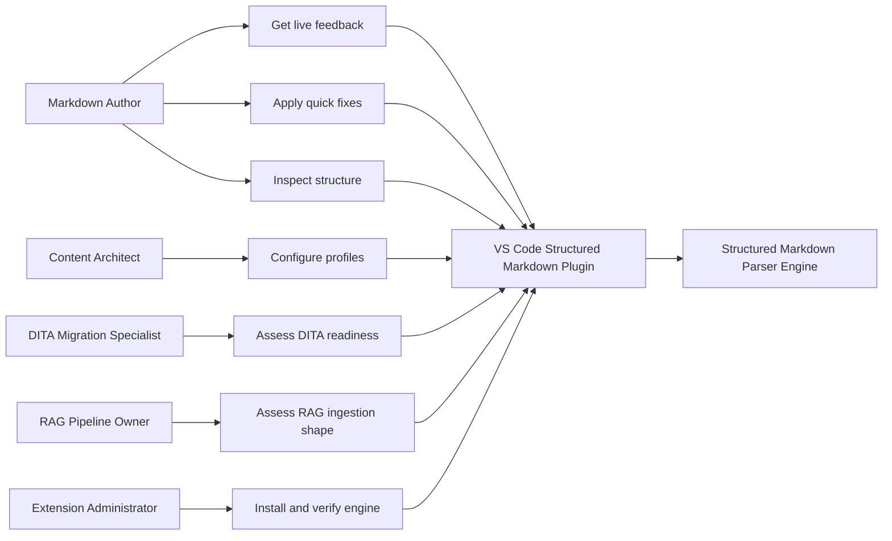
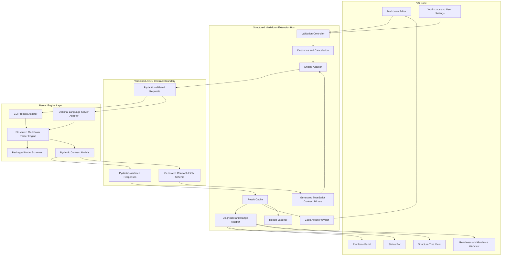
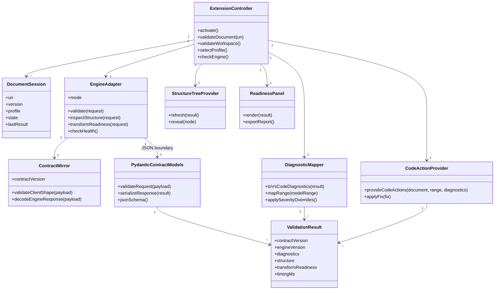
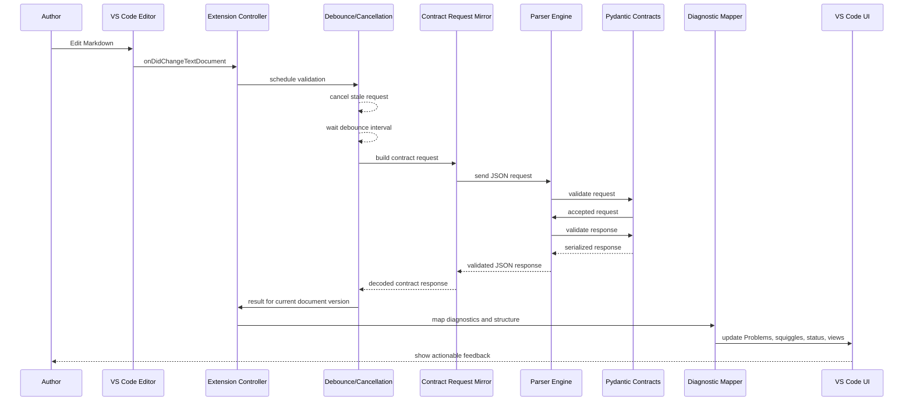
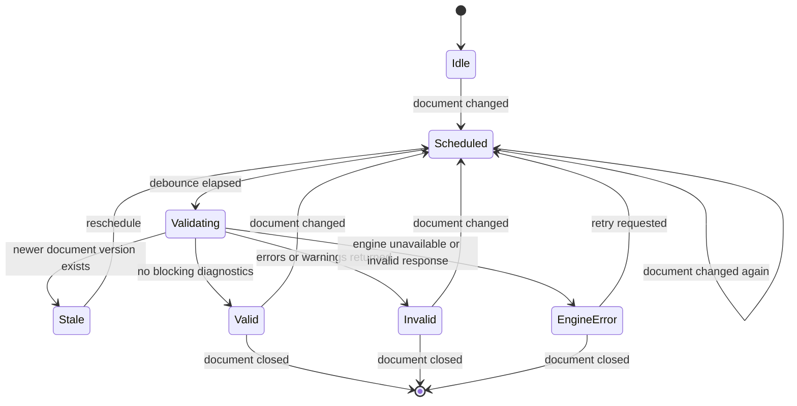
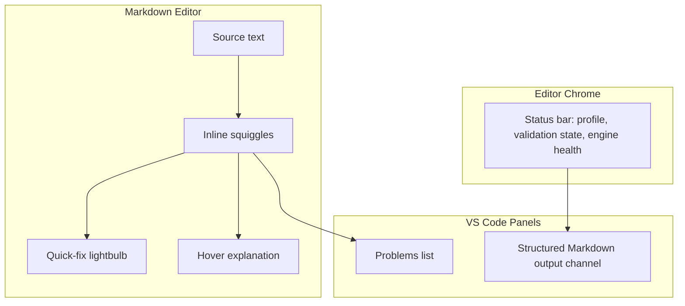
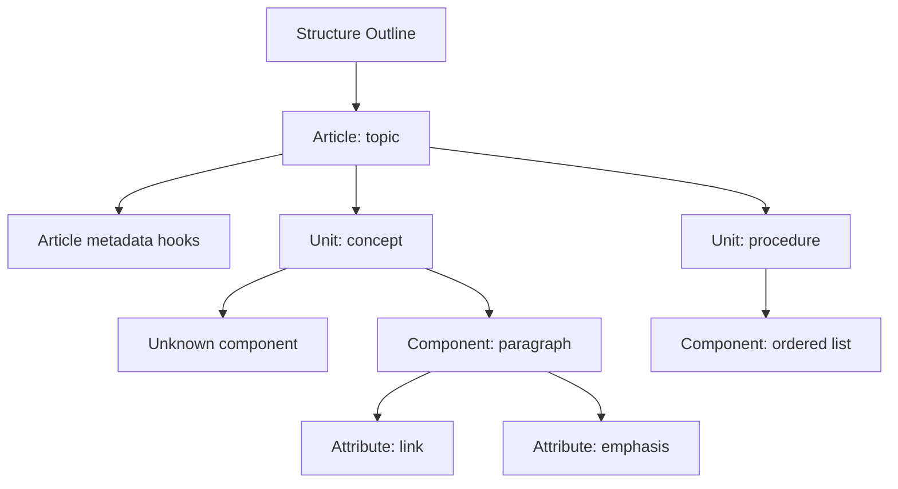
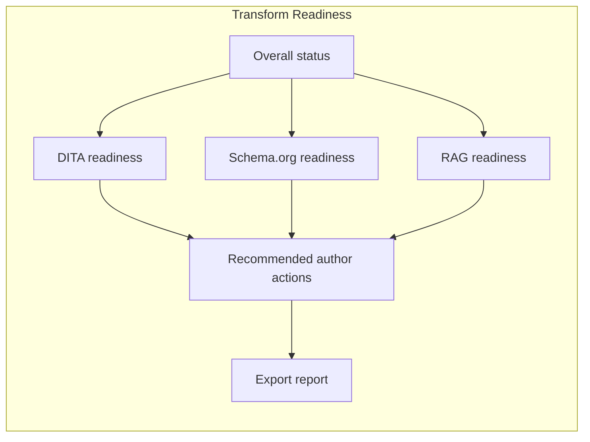
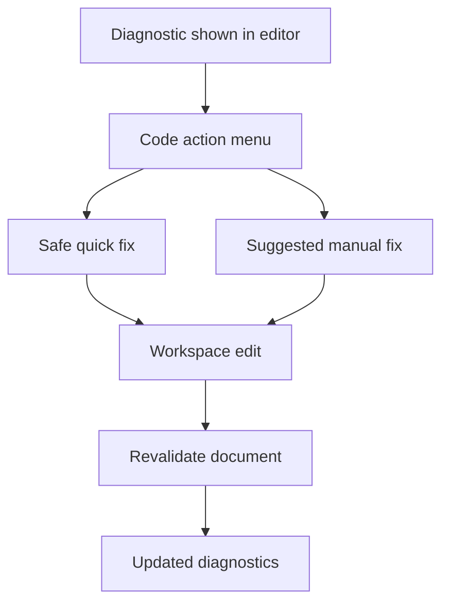
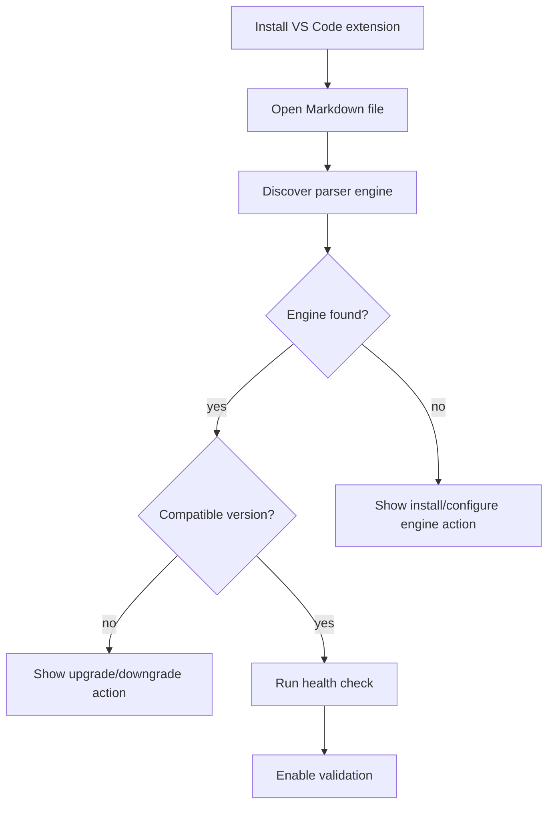

# Software Requirements Specification: VS Code Structured Markdown Authoring Plugin

Version: 0.1  
Date: 2026-06-26  
Status: Draft for implementation planning  
Related specifications:
- [srs-Parser-Reader-SRS.md](srs-Parser-Reader-SRS.md)
- [imp-Parser-Reader-SRS.md](imp-Parser-Reader-SRS.md)
- [2026-06-26-feedback-update.md](2026-06-26-feedback-update.md)

## 1. Introduction

### 1.1 Purpose

This Software Requirements Specification defines a secondary VS Code extension that uses the Structured Markdown Parser engine to provide real-time authoring feedback for Markdown content. The plugin shall help authors create, repair, and maintain Markdown that conforms to the project model:

`article` contains `unit` contains `component` contains `attribute`.

The plugin is intended to feel familiar to users of Markdown linters, XML authoring tools, and language-server-backed editor integrations. It shall surface model validation results directly in VS Code through diagnostics, editor squiggles, quick fixes, outline views, status indicators, and transform-readiness reports.

### 1.2 Scope

The VS Code plugin shall:

- Validate Markdown files against the Structured Markdown model through the parser engine.
- Provide author-facing feedback while editing, on save, and on explicit command.
- Map parser diagnostics to VS Code Problems, inline ranges, status bar items, and optional side-panel reports.
- Help authors correct Markdown so it can be transformed into downstream formats such as DITA, Schema.org representations, and RAG ingestion shapes.
- Expose metadata and taxonomy hooks at article and unit levels without forcing metadata into every component or inline attribute.
- Provide packaging and installation paths for development, beta, and production use.

The VS Code plugin shall not:

- Replace the parser engine or duplicate its model validation logic.
- Provide a full WYSIWYG Markdown editor.
- Guarantee a lossless DITA migration by itself.
- Execute untrusted Markdown or embedded HTML as code.
- Require network access for validation.

### 1.3 Audience

This document is intended for:

- Extension developers implementing the VS Code plugin.
- Parser engine maintainers stabilizing the engine interface.
- Content architects defining schema profiles and authoring rules.
- Technical writers and Markdown authors evaluating authoring workflows.
- Release engineers packaging the plugin and engine.

### 1.4 Definitions

| Term | Definition |
| --- | --- |
| Article | A single Markdown file or rendered HTML page represented as the root content object. |
| Unit | A logical chunk inside an article, often introduced by a heading or other sectioning construct. |
| Component | A block-level Markdown or HTML construct such as paragraph, list, table, block quote, code block, or heading. |
| Attribute | An inline construct such as emphasis, strong text, link, code span, or other span-level content. |
| Engine | The Structured Markdown Parser package that parses Markdown and rendered HTML into structured contracts and diagnostics. |
| Extension | The VS Code plugin described by this SRS. |
| Diagnostic | A structured finding reported to an author, such as an error, warning, hint, or informational message. |
| Profile | A named schema, rule set, or target transformation context used to validate content. |
| Transform readiness | An assessment of whether parsed content is ready for downstream DITA, Schema.org, or RAG ingestion transformation. |
| Quick fix | A VS Code code action that proposes a safe edit for a diagnostic. |
| Contract | The versioned request and response boundary between the VS Code extension and the parser engine. |
| Pydantic contract model | A Python Pydantic model in the parser engine package that validates engine inputs, outputs, diagnostics, structure summaries, quick-fix hints, and readiness reports. |

### 1.5 References

- IEEE 830 style SRS organization.
- VS Code Extension API for diagnostics, code actions, language features, webviews, tree views, configuration, and extension packaging.
- Structured Markdown Parser SRS.
- Structured Markdown model schemas.
- Production readiness assessment in `design/2026-06-26-feedback-update.md`.
- DITA 1.3 information types: topic, concept, task/how-to, reference, troubleshooting, glossary, and glossentry.
- Robert Horn information mapping types: concept, procedure, principle, process, and fact.

## 2. Overall Description

### 2.1 Product Perspective

The extension shall be an editor integration for the existing parser engine. The extension is responsible for editor behavior, author experience, packaging, and presentation. The engine remains responsible for parsing, model interpretation, schema validation, diagnostics, and transform-readiness evaluation.

The extension and parser engine shall be separate layers. The extension shall not import parser internals, load model schemas directly, run parser validation logic in TypeScript, or infer domain meaning from undocumented fields. The only supported boundary between the extension and the engine shall be a versioned contract serialized as JSON and validated by Pydantic models owned by the parser engine package.

The engine layer shall own:

- Markdown and HTML parsing.
- Article, unit, component, and attribute construction.
- JSON Schema validation.
- Diagnostic generation.
- Transform-readiness evaluation.
- Quick-fix hint generation where safe.
- Pydantic contract validation and serialization.

The VS Code extension layer shall own:

- VS Code activation, commands, views, and settings.
- Debounce, cancellation, and editor-session state.
- Process or server lifecycle management for the engine adapter.
- Mapping validated engine diagnostics to VS Code diagnostics.
- Mapping validated quick-fix hints to VS Code code actions.
- Rendering structure, readiness, and report views.

The extension may integrate with the engine through one of three implementation modes:

1. CLI adapter: invoke the installed `structure-parser` command and consume JSON output.
2. Managed Python adapter: run the parser package from a plugin-managed virtual environment.
3. Language server adapter: communicate with a long-running parser service using JSON-RPC or a compatible protocol.

The preferred long-term architecture is a language-server-style adapter because it supports cancellation, caching, incremental validation, and responsive editor feedback. The preferred MVP architecture is a CLI adapter because it can be implemented with the current package shape once stable machine-readable command output is guaranteed.

### 2.2 Product Functions

The extension shall provide:

- Real-time Markdown validation with debounce and stale-request cancellation.
- Diagnostics in VS Code Problems and editor ranges.
- Quick fixes for common structural and metadata issues.
- A structured outline showing article, units, components, and attributes.
- A transform-readiness view for DITA, Schema.org, and RAG ingestion targets.
- Model/profile selection at workspace and file scope.
- Metadata and taxonomy assistance for article and unit hooks.
- Engine discovery, health checks, and version compatibility checks.
- Exportable validation reports.
- Offline operation after installation.

### 2.3 User Classes

| User class | Needs |
| --- | --- |
| Markdown author | Immediate feedback, clear messages, quick fixes, low noise, safe edits. |
| Technical writer | Transform-readiness guidance, structural outline, content-type guidance, repeatable checks. |
| Content architect | Schema/profile configuration, taxonomy hooks, rule severity control, migration readiness. |
| DITA migration specialist | Evidence that Markdown maps cleanly to DITA topics, concepts, tasks/how-to, references, troubleshooting, and glossary entries. |
| RAG pipeline owner | Validation that content can produce explicit shapes with usable provenance, metadata, and chunk boundaries. |
| Extension administrator | Predictable installation, engine version control, workspace policy, offline packaging. |

### 2.4 Operating Environment

The extension shall support:

- VS Code desktop on macOS, Windows, and Linux.
- VS Code compatible distributions where the required APIs are available.
- Markdown files using VS Code language id `markdown`.
- Workspaces that contain a Structured Markdown model, schema profile, or configuration file.
- Local validation without network access.

The extension should support:

- Remote development environments such as SSH, Dev Containers, and WSL when engine execution is available in the remote extension host.
- Multi-root workspaces with independent configuration per root.

### 2.5 Design and Implementation Constraints

- The parser engine shall remain the authoritative validator.
- The parser engine shall remain the owner of all domain contracts and Pydantic validation models.
- The extension shall consume machine-readable engine output rather than scraping human-readable text.
- The extension shall reject engine output that does not validate against the advertised contract version.
- The extension shall not mutate documents automatically without an explicit user action.
- The extension shall pass file paths and arguments safely, without shell interpolation.
- The extension shall respect VS Code Workspace Trust.
- The extension shall degrade gracefully when the engine is unavailable, too old, or returns invalid JSON.
- The extension shall avoid network access by default.

### 2.6 Feasibility Assessment

The plugin is feasible, but production readiness depends on hardening the parser package as a reusable engine.

Current feasibility:

| Target | Feasibility | Assessment |
| --- | ---: | --- |
| Manual validate command | 8/10 | Feasible with current CLI shape if stable JSON output and exit codes are maintained. |
| Validate on save | 7/10 | Feasible once schema reference and packaged model issues are fixed. |
| Real-time validation while typing | 5/10 | Feasible for small files, but current observed CLI latency around 10 seconds is too slow for keystroke feedback. Needs caching, debounce, cancellation, and ideally a long-running server. |
| Problems integration | 8/10 | Feasible if diagnostics include stable ranges, severities, codes, and messages. |
| Quick fixes | 6/10 | Feasible for narrow repairs. Requires diagnostic codes and safe edit recipes from engine or extension rules. |
| Transform-readiness panel | 7/10 | Feasible because the package already contains readiness concepts, but the report contract must be stable. |
| Production Marketplace release | 5/10 | Feasible after packaging, schema resource, lint, type checking, CI, and install smoke-test blockers are resolved. |

Production blockers from the package readiness assessment that affect the plugin:

- Schema `$ref` resolution must be fixed before the extension can trust validation results.
- The `model/` schemas must be packaged as runtime resources, not only found from a repository checkout.
- The CLI and Python API need stable JSON contracts for parse, validate, inspect, diagnostics, readiness, and version output.
- Engine execution needs predictable performance targets or a persistent server mode.
- Ruff, mypy, CI, and wheel installation smoke tests should be addressed before Marketplace release.

Conclusion: an MVP VS Code extension is practical after the schema packaging and machine-readable CLI contracts are stabilized. A production real-time authoring tool is practical after engine startup cost, validation latency, cancellation, and installation workflows are improved.

## 3. Specific Requirements

### 3.1 Functional Requirements

#### VSC-FR-001 Engine Discovery

The extension shall discover the parser engine using the following precedence:

1. Workspace setting `structuredMarkdown.engine.path`.
2. User setting `structuredMarkdown.engine.path`.
3. A managed extension environment if installed.
4. The `structure-parser` executable on `PATH`.

The extension shall expose an `Structured Markdown: Check Engine` command that reports engine path, engine version, schema model path, supported contract version, and health status.

#### VSC-FR-002 Version Compatibility

The extension shall verify that the engine supports the minimum contract version required by the extension. If the engine is incompatible, the extension shall show a clear warning and disable validation actions that would produce unreliable results.

#### VSC-FR-003 Validation Triggers

The extension shall support validation on:

- Document open.
- Document change after a configurable debounce interval.
- Document save.
- Explicit command.
- Workspace scan command.

The extension shall allow users to disable live validation while keeping validate-on-save enabled.

#### VSC-FR-004 Diagnostic Mapping

The extension shall map engine diagnostics to VS Code diagnostics with:

- File URI.
- Start and end range.
- Severity.
- Message.
- Diagnostic code.
- Source value `structured-markdown`.
- Optional related information.
- Optional target transform context.

Diagnostics without precise ranges shall be attached to the nearest known article, unit, or component range. If no range is available, they shall be attached to the first line of the document and marked as document-level findings.

#### VSC-FR-005 Diagnostic Severity

The extension shall support these severity levels:

| Engine severity | VS Code severity |
| --- | --- |
| error | Error |
| warning | Warning |
| info | Information |
| hint | Hint |

The extension shall allow severity overrides by rule code in workspace settings.

#### VSC-FR-006 Author-Facing Messages

Each diagnostic shown to an author shall include:

- What is wrong.
- Why it matters for the selected model or transform target.
- The smallest safe next action where known.

The extension should avoid parser-internal terminology unless the selected user mode is `architect` or `debug`.

#### VSC-FR-007 Quick Fixes

The extension shall provide quick fixes for diagnostics that have deterministic, low-risk repairs. Initial quick fixes should include:

- Insert missing required article metadata.
- Insert missing top-level heading.
- Normalize heading order when the safe edit is local.
- Add an empty metadata hook to an article or unit.
- Replace unsupported inline markup with a supported equivalent.
- Add table header separators when the intended table shape is clear.
- Convert known ambiguous constructs to explicit structured equivalents when the edit is local and reversible.

The extension shall label speculative fixes as suggestions and shall not apply them automatically.

#### VSC-FR-008 Structured Outline

The extension shall provide a tree view showing:

- Article root.
- Units.
- Components within each unit.
- Attributes within each component when expanded.
- Unknown units and unknown components.
- Metadata hooks at article and unit levels.
- Diagnostic counts by tree node.

Selecting a tree item shall reveal the corresponding document range in the editor.

#### VSC-FR-009 Transform Readiness View

The extension shall provide a transform-readiness view for:

- DITA topic, concept, how-to/task, reference, troubleshooting, glossary, and glossentry.
- Schema.org output shapes.
- RAG ingestion shapes with provenance, chunk boundaries, metadata, and taxonomy hooks.

The view shall distinguish:

- Ready.
- Needs author action.
- Needs content-architect decision.
- Unsupported by current model.
- Unknown because parsing failed.

#### VSC-FR-010 Metadata and Taxonomy Assistance

The extension shall identify article-level and unit-level metadata hooks and help authors inspect or add metadata values. The extension shall not require component-level or attribute-level metadata unless a selected profile explicitly allows it.

#### VSC-FR-011 Profile Selection

The extension shall support validation profiles. A profile may define:

- Target information type.
- Required article metadata.
- Required unit metadata.
- Allowed unit types.
- Allowed component types and ordering constraints.
- Target transform readiness rules.
- Rule severity overrides.

The active profile shall be visible in the status bar.

#### VSC-FR-012 Unknown Structure Handling

When the engine reports unknown units, components, or attributes, the extension shall show them as first-class model objects rather than hiding them. Unknown objects shall be eligible for diagnostics, outline display, and transform-readiness warnings.

#### VSC-FR-013 Export Report

The extension shall provide an `Structured Markdown: Export Validation Report` command that writes a JSON or Markdown report containing diagnostics, structure summary, active profile, engine version, and transform-readiness status.

#### VSC-FR-014 Workspace Scan

The extension should provide a workspace scan command that validates Markdown files in the current workspace and produces a summary by file. The command shall respect ignore patterns and workspace trust.

#### VSC-FR-015 Debug View

The extension should provide an optional debug view that displays raw engine request and response data for troubleshooting.

#### VSC-FR-016 Layer Boundary Enforcement

The extension shall communicate with the parser engine only through the documented engine adapter contract. The extension shall not:

- Import Python parser modules directly into extension code.
- Read parser model schema files as a substitute for engine output.
- Reimplement article, unit, component, or attribute classification.
- Depend on undocumented JSON fields.
- Parse human-readable CLI output.

The extension may use generated TypeScript types derived from the Pydantic contract schemas, but those types shall be treated as client-side mirrors of the engine-owned contract, not as an independent source of truth.

#### VSC-FR-017 Pydantic Contract Enforcement

The parser engine shall validate every request and response that crosses the extension boundary with Pydantic before data is accepted as contract-compliant. The engine shall:

- Validate incoming validation, structure, readiness, and version requests.
- Validate outgoing diagnostics, structure summaries, readiness reports, quick-fix hints, and health responses.
- Emit a machine-readable contract error when validation fails.
- Include `contractVersion`, `engineVersion`, and response `status` in all extension-facing responses.
- Provide JSON Schema generated from the Pydantic models for extension-side type generation and compatibility tests.

The extension shall treat Pydantic validation failures reported by the engine as engine contract errors, not content authoring errors.

### 3.2 External Interface Requirements

#### 3.2.1 VS Code UI Interfaces

The extension shall contribute:

- Commands:
  - `Structured Markdown: Validate Current File`
  - `Structured Markdown: Validate Workspace`
  - `Structured Markdown: Show Structure Outline`
  - `Structured Markdown: Show Transform Readiness`
  - `Structured Markdown: Check Engine`
  - `Structured Markdown: Select Profile`
  - `Structured Markdown: Export Validation Report`
- Diagnostics collection for Markdown files.
- Code actions for supported diagnostic codes.
- Status bar item showing validation state and active profile.
- Tree view for structure outline.
- Webview or custom editor panel for transform-readiness and author guidance.
- Configuration settings under `structuredMarkdown`.

#### 3.2.2 Engine Interface

The extension shall call the engine through a stable request and response contract. This contract shall be defined by Pydantic models in the parser engine package and serialized as JSON for CLI, managed Python, and language-server transport modes.

Minimum engine commands:

```text
structure-parser --version --json
structure-parser validate-markdown <file> --profile <profile> --json
structure-parser inspect-structure <file> --profile <profile> --json
structure-parser transform-readiness <file> --profile <profile> --json
```

The extension should support stdin validation for unsaved buffers:

```text
structure-parser validate-markdown --stdin --path <logical-file-path> --profile <profile> --json
```

If stdin validation is unavailable, the extension shall validate unsaved buffers through a temporary file only when workspace trust allows it and the file is written in a secure temporary directory.

The engine interface shall expose a contract schema command:

```text
structure-parser contract-schema --json
```

The command shall return JSON Schema generated from the Pydantic contract models so the extension can verify compatibility and generate TypeScript types.

#### 3.2.3 Configuration Interface

The extension shall support these settings:

```json
{
  "structuredMarkdown.engine.path": "",
  "structuredMarkdown.engine.mode": "cli",
  "structuredMarkdown.validation.enabled": true,
  "structuredMarkdown.validation.onChange": true,
  "structuredMarkdown.validation.onSave": true,
  "structuredMarkdown.validation.debounceMs": 750,
  "structuredMarkdown.validation.maxFileSizeKb": 512,
  "structuredMarkdown.profile.default": "topic",
  "structuredMarkdown.profile.path": "",
  "structuredMarkdown.diagnostics.severityOverrides": {},
  "structuredMarkdown.reports.outputFormat": "markdown",
  "structuredMarkdown.debug.rawEngineOutput": false
}
```

#### 3.2.4 File System Interface

The extension shall read Markdown documents and optional workspace configuration files. It shall not write to source Markdown files except when the user explicitly applies a quick fix or command that edits the document.

### 3.3 Data Requirements

#### 3.3.1 Validation Request

The extension shall send or derive a validation request that conforms to the engine-owned Pydantic request model:

```json
{
  "contractVersion": "1.0",
  "documentUri": "file:///workspace/docs/example.md",
  "logicalPath": "docs/example.md",
  "content": "# Example\n\nBody text.",
  "profile": "topic",
  "targets": ["dita", "schema.org", "rag"],
  "includeStructure": true,
  "includeReadiness": true
}
```

#### 3.3.2 Validation Response

The engine response consumed by the extension shall be produced from the engine-owned Pydantic response model and shall include:

```json
{
  "contractVersion": "1.0",
  "engineVersion": "0.1.0",
  "status": "completed",
  "document": {
    "uri": "file:///workspace/docs/example.md",
    "articleType": "topic",
    "range": { "startLine": 0, "startColumn": 0, "endLine": 10, "endColumn": 0 }
  },
  "diagnostics": [],
  "structure": {},
  "transformReadiness": {},
  "timingMs": 142
}
```

The extension shall treat missing required fields, invalid field types, unknown contract versions, or failed Pydantic validation as an engine contract error and surface a single diagnostic or status message instead of showing partial, misleading validation results.

#### 3.3.3 Code Action Contract

Quick fixes may be supplied by the engine or derived by the extension. Each fix shall include:

- Diagnostic code.
- Human-readable title.
- Edit range.
- Replacement text or structured edit.
- Safety level: `safe`, `suggested`, or `manual`.
- Optional explanation.

#### 3.3.4 Pydantic Contract Model Set

The parser engine shall define extension-facing Pydantic models for at least:

- `EngineHealthRequest`
- `EngineHealthResponse`
- `ValidationRequest`
- `ValidationResponse`
- `StructureInspectionRequest`
- `StructureInspectionResponse`
- `TransformReadinessRequest`
- `TransformReadinessResponse`
- `DiagnosticContract`
- `RangeContract`
- `RelatedInformationContract`
- `QuickFixHintContract`
- `ContractErrorResponse`

The contract models shall be versioned independently from internal parser implementation classes. Internal engine models may evolve, but extension-facing contract changes shall follow semantic compatibility rules:

- Patch changes may add optional fields only.
- Minor changes may add optional features, new diagnostic codes, or new enum values when the extension can ignore them safely.
- Major changes may remove or rename fields, change required fields, or change semantics.

The engine shall include a contract test suite that validates representative JSON fixtures against the Pydantic models. The extension shall include a compatibility test suite that validates the generated TypeScript contract mirrors against those fixtures.

## 4. Use Cases

### 4.1 Use Case Overview



### 4.2 UC-001 Live Author Feedback

Primary actor: Markdown author  
Precondition: A Markdown file is open and validation is enabled.  
Trigger: The author edits the document.  
Main flow:

1. The extension detects a document change.
2. The extension waits for the configured debounce interval.
3. The extension cancels any stale validation for the same document.
4. The extension sends the current content to the engine.
5. The engine returns diagnostics and structure data.
6. The extension maps findings to editor squiggles, Problems, and status bar state.
7. The author uses the feedback to repair the content.

Postcondition: The author sees current validation status without leaving the editor.

### 4.3 UC-002 Apply a Quick Fix

Primary actor: Markdown author  
Precondition: A diagnostic has a supported quick fix.  
Trigger: The author invokes the VS Code code action menu.  
Main flow:

1. The extension lists available fixes for the selected diagnostic.
2. The author selects a fix.
3. The extension applies the edit through the VS Code workspace edit API.
4. The extension revalidates the changed document.

Postcondition: The document reflects the selected edit and diagnostics are refreshed.

### 4.4 UC-003 Inspect Structured Model

Primary actor: Technical writer  
Precondition: A Markdown file has been parsed.  
Trigger: The writer opens the Structure Outline.  
Main flow:

1. The extension displays the article root.
2. The extension shows units, components, attributes, metadata hooks, and unknown structures.
3. The writer selects a node.
4. The editor reveals the corresponding source range.

Postcondition: The writer can understand how the parser sees the document.

### 4.5 UC-004 Check Migration Readiness

Primary actor: DITA migration specialist  
Precondition: A target profile is selected.  
Trigger: The specialist opens Transform Readiness.  
Main flow:

1. The extension requests readiness analysis from the engine.
2. The extension groups results by DITA target type.
3. The extension distinguishes author fixes from architecture decisions.
4. The specialist exports a readiness report.

Postcondition: The migration specialist has actionable evidence for transformation planning.

### 4.6 UC-005 Validate RAG Ingestion Shape

Primary actor: RAG pipeline owner  
Precondition: A RAG profile is selected.  
Trigger: The owner validates a file or workspace.  
Main flow:

1. The extension requests validation for provenance, chunking, metadata, and taxonomy hooks.
2. The engine reports whether content can form explicit ingestion shapes.
3. The extension displays blockers and warnings.

Postcondition: The owner can identify content that will produce weak or ambiguous ingestion records.

## 5. Architecture

### 5.1 Layering Rules

The system shall be organized into two primary layers and one explicit contract boundary:

| Layer | Owns | Must not own |
| --- | --- | --- |
| VS Code plugin layer | Editor UI, commands, views, settings, diagnostics presentation, code-action presentation, report rendering, engine process lifecycle. | Parser domain logic, schema validation, model classification, transform-readiness decisions, Pydantic model definitions. |
| Contract boundary | Versioned JSON payloads generated from parser-owned Pydantic models. | Business logic, editor UI, parser internals. |
| Parser engine layer | Parsing, model construction, schema validation, diagnostics, transform-readiness, quick-fix hint generation, Pydantic validation, JSON serialization. | VS Code UI, editor state, VS Code-specific diagnostic objects. |

All data crossing from the extension to the engine shall enter through the contract boundary. All data crossing from the engine to the extension shall leave through the same boundary. This rule applies equally to CLI, managed Python, and language-server transport modes.

### 5.2 Logical Architecture



### 5.3 Domain Class Diagram



### 5.4 Live Validation Sequence



### 5.5 Document Validation State



## 6. UI Specification

### 6.1 Primary Editor Feedback



### 6.2 Structure Outline View



### 6.3 Transform Readiness Panel



### 6.4 Quick Fix Flow



## 7. Nonfunctional Requirements

### 7.1 Performance

- VSC-NFR-001: The extension shall debounce live validation, with a default interval of 750 ms.
- VSC-NFR-002: The extension shall cancel or ignore stale validation results.
- VSC-NFR-003: The extension should return feedback for typical files under 1 second after debounce when using a warm engine.
- VSC-NFR-004: The extension shall show a nonblocking status indicator when validation exceeds 3 seconds.
- VSC-NFR-005: The extension shall skip live validation for files larger than the configured maximum and offer manual validation instead.

### 7.2 Reliability

- VSC-NFR-006: The extension shall continue operating if one validation request fails.
- VSC-NFR-007: The extension shall not clear old diagnostics until a newer valid result or explicit engine error state is available.
- VSC-NFR-008: The extension shall log engine errors to an output channel with enough detail for troubleshooting.

### 7.3 Usability

- VSC-NFR-009: Diagnostics shall be written in author-facing language.
- VSC-NFR-010: The extension shall distinguish author action from content-architect action.
- VSC-NFR-011: The extension shall support a quiet mode that reports only errors.
- VSC-NFR-012: The extension shall keep common actions available through the Command Palette.

### 7.4 Security and Privacy

- VSC-NFR-013: The extension shall not send document content to any external service by default.
- VSC-NFR-014: The extension shall not execute Markdown, embedded HTML, scripts, or fenced code blocks.
- VSC-NFR-015: The extension shall pass engine arguments as structured process arguments, not shell strings.
- VSC-NFR-016: The extension shall respect VS Code Workspace Trust before running workspace-local engine paths.
- VSC-NFR-017: Telemetry, if ever added, shall be disabled by default and shall not include source content.

### 7.5 Accessibility

- VSC-NFR-018: All extension UI shall be accessible through keyboard navigation.
- VSC-NFR-019: Webview content shall use semantic HTML and support VS Code themes.
- VSC-NFR-020: Diagnostic information shall not rely on color alone.

### 7.6 Maintainability

- VSC-NFR-021: Extension logic shall be separated into controller, engine adapter, diagnostic mapper, code action provider, tree provider, and report rendering modules.
- VSC-NFR-022: Engine contract types shall be generated or centrally defined to prevent drift.
- VSC-NFR-023: The extension shall include unit tests for diagnostic mapping and code actions.
- VSC-NFR-024: The extension shall include integration tests for command activation and sample Markdown validation.

## 8. Packaging and Installation

### 8.1 Extension Package

The VS Code extension shall be packaged as a `.vsix` using the VS Code extension packaging toolchain, typically `@vscode/vsce`. The extension package shall include:

- `package.json` with activation events, commands, views, configuration, and extension metadata.
- Compiled TypeScript extension code.
- Webview assets where used.
- Default icons and UI resources.
- README, changelog, license, and troubleshooting guide.
- Optional bundled engine bootstrap scripts.

The extension shall be installable by:

- VS Code Marketplace.
- Open VSX Registry, if desired.
- Manual `.vsix` installation.
- Internal enterprise extension distribution.

### 8.2 Engine Packaging Options

#### Option A: External Engine Dependency

The extension requires users to install the Python package separately and configure the engine path or rely on `PATH`.

Advantages:

- Small extension package.
- Simple development workflow.
- Clear separation between extension and engine release cycles.

Disadvantages:

- Higher setup burden.
- More support cases from missing Python, wrong virtual environment, or incompatible engine versions.
- Harder offline installation.

Recommended for: first MVP and internal alpha.

#### Option B: Managed Extension Environment

The extension creates or uses a managed Python environment and installs the parser engine wheel into it.

Advantages:

- Better author experience.
- Extension can control engine version.
- More predictable validation behavior.

Disadvantages:

- Requires Python availability or bundling strategy.
- More complex updates and troubleshooting.
- Network access may be needed unless wheels are bundled.

Recommended for: beta.

#### Option C: Bundled Engine

The extension bundles the engine and model schemas, either as a packaged Python environment, native executable, or platform-specific artifact.

Advantages:

- Best end-user installation experience.
- Works offline after `.vsix` installation.
- Strong version compatibility.

Disadvantages:

- Larger extension package.
- Platform-specific release complexity.
- More release engineering work.

Recommended for: production if enterprise or nontechnical author adoption is a priority.

#### Option D: Language Server Package

The parser engine is exposed through a long-running language server that the extension starts and manages.

Advantages:

- Best fit for real-time validation.
- Supports cancellation, caching, incremental parsing, and richer editor features.
- Aligns with familiar editor tooling architecture.

Disadvantages:

- Requires additional server protocol design and tests.
- More complex than CLI invocation.

Recommended for: production real-time authoring.

### 8.3 Recommended Packaging Path

The recommended release path is:

1. Alpha: CLI adapter with external engine dependency and explicit engine path setting.
2. Beta: managed Python environment with engine install and health check commands.
3. Production: language-server-style engine adapter with packaged schemas, stable contract versioning, and optional bundled wheels or server artifacts.

### 8.4 Installation Flow



## 9. Acceptance Criteria

### 9.1 MVP Acceptance Criteria

- VSC-AC-001: Installing the extension activates it for Markdown files.
- VSC-AC-002: The extension can discover a configured `structure-parser` executable.
- VSC-AC-003: The `Check Engine` command reports engine path, version, and health state.
- VSC-AC-004: The extension validates the current Markdown file on explicit command.
- VSC-AC-005: Engine diagnostics appear in VS Code Problems with correct severity and source.
- VSC-AC-006: Diagnostics with ranges are shown as editor squiggles.
- VSC-AC-007: The extension validates on save when enabled.
- VSC-AC-008: The extension shows a status bar item with active profile and validation state.
- VSC-AC-009: The extension handles missing or incompatible engines gracefully.
- VSC-AC-010: The extension includes documentation for installation, configuration, and troubleshooting.
- VSC-AC-011: Engine responses consumed by the extension validate against the parser-owned Pydantic contract models.
- VSC-AC-012: The extension does not import parser internals or read model schema files directly.

### 9.2 Beta Acceptance Criteria

- VSC-AC-013: Live validation works with debounce and stale-result cancellation.
- VSC-AC-014: The Structure Outline shows article, units, components, attributes, metadata hooks, and unknown structures.
- VSC-AC-015: At least five common diagnostics provide quick fixes.
- VSC-AC-016: Transform-readiness view reports DITA, Schema.org, and RAG readiness.
- VSC-AC-017: Workspace validation produces a summary report.
- VSC-AC-018: The extension supports profile selection and severity overrides.
- VSC-AC-019: Generated TypeScript contract mirrors are produced from Pydantic JSON Schema and covered by compatibility fixtures.

### 9.3 Production Acceptance Criteria

- VSC-AC-020: The extension and engine pass CI on macOS, Windows, and Linux.
- VSC-AC-021: The parser model schemas are available from an installed package without requiring a repository checkout.
- VSC-AC-022: The engine contract is versioned and covered by compatibility tests.
- VSC-AC-023: Typical warm validation completes within the configured real-time target.
- VSC-AC-024: The extension is packaged as `.vsix` and can be installed offline.
- VSC-AC-025: Marketplace or internal distribution documentation is complete.
- VSC-AC-026: Security review confirms no source content leaves the local machine by default.
- VSC-AC-027: Accessibility review confirms keyboard and screen-reader usability for extension views.
- VSC-AC-028: A layered architecture test or static check prevents the extension package from importing parser implementation modules directly.

## 10. Implementation Readiness Assessment

### 10.1 Current Readiness

The VS Code plugin can be planned now, but implementation should begin with a narrow CLI-backed MVP. The parser package already has the right conceptual foundation:

- Article, unit, component, and attribute contracts.
- JSON Schema model files.
- Diagnostics concepts.
- Transform-readiness concepts.
- CLI entry points that can be adapted for editor use.

However, production plugin work should not assume the engine is ready as an installable editor dependency until the package readiness blockers are fixed.

### 10.2 Required Engine Capabilities Before MVP

The parser engine should provide:

- Stable JSON output for validation and inspection commands.
- Pydantic request and response models for every extension-facing command.
- Generated JSON Schema for the extension-facing contract models.
- Stable diagnostic range format using zero-based line and column values.
- Stable severity and diagnostic code taxonomy.
- Reliable schema reference resolution.
- Packaged model schema resources.
- `--version --json` or equivalent health output.
- Exit codes that distinguish validation failure from engine failure.

### 10.3 Required Engine Capabilities Before Production

The parser engine should provide:

- Fast warm validation.
- Optional stdin validation for unsaved buffers.
- Persistent server mode or language server mode.
- Cancellation support.
- Contract versioning and backward compatibility policy.
- Contract fixture tests shared by the parser engine and extension.
- Generated TypeScript type mirrors derived from Pydantic JSON Schema.
- Machine-readable quick-fix hints where possible.
- Install smoke tests for wheels and extension-managed environments.

## 11. Implementation Plan Summary

### Phase 1: Engine Contract Stabilization

- Define JSON contracts for version, validation, structure, diagnostics, readiness, and quick-fix hints.
- Implement the extension-facing contracts as Pydantic models in the parser engine layer.
- Generate JSON Schema from the Pydantic models for extension compatibility tests.
- Fix schema `$ref` resolution.
- Package model schemas with the Python distribution.
- Add contract tests and CLI smoke tests.

### Phase 2: VS Code MVP

- Scaffold a TypeScript VS Code extension.
- Add engine discovery and health check.
- Add explicit validate command.
- Map diagnostics into Problems and editor ranges.
- Add status bar state.
- Document local development installation.

### Phase 3: Authoring Feedback

- Add validate-on-save and debounced validate-on-change.
- Add stale-result cancellation.
- Add initial quick fixes.
- Add Structure Outline tree.
- Add profile selection and severity overrides.

### Phase 4: Readiness and Migration Views

- Add transform-readiness panel.
- Add DITA, Schema.org, and RAG grouping.
- Add export report command.
- Add workspace validation.

### Phase 5: Production Packaging

- Add managed engine install or language server integration.
- Add extension tests.
- Add CI for extension and engine compatibility.
- Package `.vsix`.
- Prepare Marketplace, Open VSX, or internal distribution.

## 12. Open Questions

- Should the first extension use an external CLI dependency only, or should it immediately manage a Python environment?
- Should the production engine adapter be a custom server or a formal Language Server Protocol implementation?
- Which diagnostic codes should be eligible for automatic quick fixes in the first beta?
- Where should schema profiles live: repository root, `.vscode`, `model/`, or a project configuration file?
- Should transform-readiness be computed on every validation or only on demand?
- Should taxonomy metadata be edited through front matter, sidecar files, or inline structured blocks?
- What minimum VS Code version should be supported?
- Should the extension target VS Code Marketplace, Open VSX, or internal distribution first?

## 13. Traceability Matrix

| Parser SRS concern | VS Code plugin requirement |
| --- | --- |
| Parse source content | VSC-FR-003, VSC-FR-004 |
| Preserve structure and provenance | VSC-FR-008, VSC-FR-009 |
| Classify references and metadata | VSC-FR-010, VSC-FR-011 |
| Expose diagnostics | VSC-FR-004, VSC-FR-005, VSC-FR-006 |
| Normalized outputs | VSC-FR-013, 3.3 Data Requirements |
| Downstream validation | VSC-FR-009, VSC-FR-014 |
| Dependency analysis | VSC-FR-008, VSC-FR-013 |
| Reporting | VSC-FR-013, VSC-AC-017 |
| Debugging | VSC-FR-015, VSC-NFR-008 |
| Automation | Engine contract requirements and Phase 5 packaging |

## 14. Summary Recommendation

Build the VS Code plugin in stages. Start with a CLI-backed validation MVP after the parser engine has stable JSON output, packaged schemas, and reliable schema references. Treat real-time authoring feedback as a beta feature until validation latency is low enough for editor use. For production, move toward a persistent language-server-style adapter so the extension can provide the responsiveness authors expect from Markdown linters and XML authoring tools.
