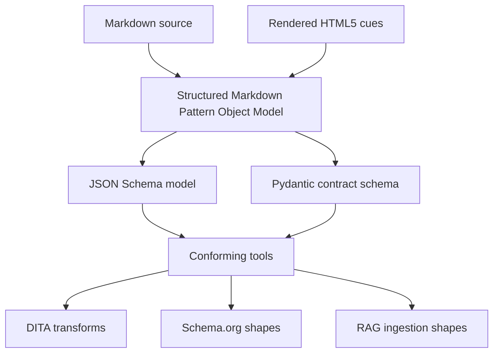
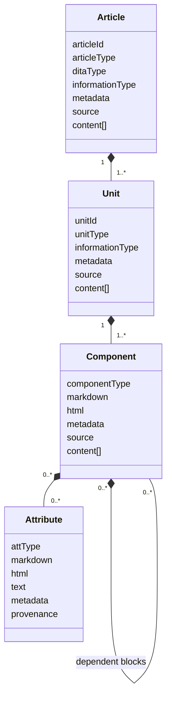
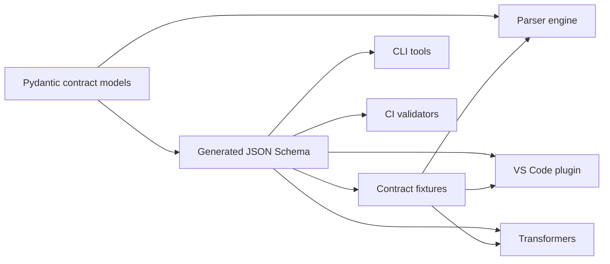
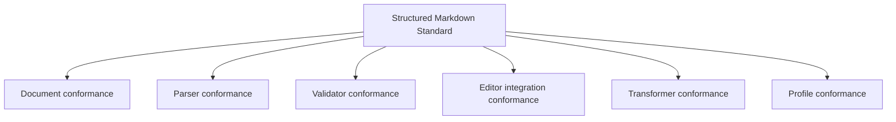
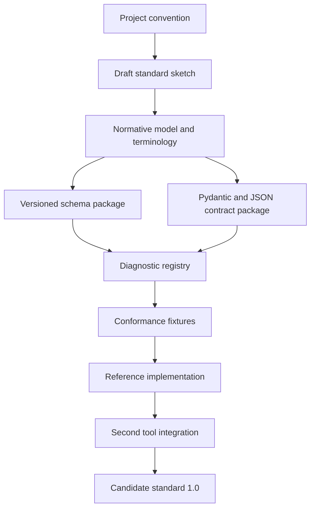

# Structured Markdown Candidate Standard

Version: 0.1  
Date: 2026-06-26  
Status: Standards sketch for review  
Audience: Content architects, parser implementers, editor-tool developers, transform developers, RAG pipeline owners, and standards reviewers

Related project artifacts:

- [srs-Parser-Reader-SRS.md](srs-Parser-Reader-SRS.md)
- [srs-VS-Code-Plugin.md](srs-VS-Code-Plugin.md)
- [imp-Parser-Reader-SRS.md](imp-Parser-Reader-SRS.md)
- [2026-06-26-feedback-update.md](2026-06-26-feedback-update.md)
- [../model/construction-of-schema.md](../model/construction-of-schema.md)
- `../model/articles`
- `../src/structure_parser/contracts`

## 1. Purpose

Structured Markdown is a candidate standard for making Markdown authoring predictable enough to validate, repair, transform, and ingest into downstream systems without treating Markdown as unstructured text.

The core idea is simple:

```text
article contains unit contains component contains attribute
```

An article is one Markdown file or rendered HTML5 page. A unit is a logical chunk of that article. A component is a block-level construct. An attribute is an inline construct.

This document sketches how the current project can become a candidate standard. It identifies the normative model, conformance targets, contracts, extension points, and preparation work needed before the project can reasonably claim standard status.

## 2. Standards Claim

The project is not yet a complete external standard. It is a strong foundation for a candidate standard.

The foundation exists because the project already has:

- A named structural model for Markdown content.
- JSON Schema files that describe valid model shapes.
- Pydantic contracts that can enforce parser and tool boundaries.
- A parser engine that produces structured Markdown contracts.
- Diagnostics for malformed, incomplete, unsupported, or ambiguous content.
- Transform-readiness concepts for DITA, Schema.org, and RAG ingestion.
- A proposed VS Code authoring plugin that treats the engine contract as a tool boundary.

The standard becomes credible when the model, schemas, contracts, diagnostics, fixtures, versioning rules, and conformance tests are published as stable artifacts independent of one implementation.

## 3. Normative Language

This sketch uses the following words:

- **Shall** means a mandatory requirement for conformance.
- **Should** means a recommended requirement.
- **May** means an optional capability.

Future versions of this standard should maintain a clear separation between:

- Normative requirements that define conformance.
- Informative guidance that explains implementation choices.
- Reference implementation details that describe the current parser package.

## 4. Scope

### 4.1 In Scope

The Structured Markdown standard shall define:

- The article, unit, component, and attribute content hierarchy.
- Required and optional classification fields.
- Required provenance and source-location concepts.
- Metadata hook behavior at article and unit levels.
- Rules for known and unknown structures.
- JSON Schema model artifacts.
- Pydantic-enforced parser and tool contracts.
- Diagnostic shape, severity, code, and remediation conventions.
- Conformance classes for documents, parsers, validators, editor integrations, and transformers.
- Extension points for profiles, metadata, taxonomy, and target-specific readiness checks.

### 4.2 Out of Scope

The Structured Markdown standard shall not:

- Replace Markdown, CommonMark, GitHub Flavored Markdown, HTML5, DITA, Schema.org, or any RAG framework.
- Define a complete publishing engine.
- Require one specific parser implementation.
- Require one specific editor.
- Guarantee lossless transformation to every downstream format.
- Define a universal taxonomy or metadata vocabulary.
- Execute embedded code, scripts, or unsafe HTML.

## 5. Standardization Model

Structured Markdown should be understood as a profile and interchange standard layered on top of Markdown and HTML5 rendering behavior.



Markdown remains the authoring syntax. HTML5 remains the expected rendering target. Structured Markdown defines the machine-readable structure that can be validated after Markdown is parsed.

## 6. Core Content Model

### 6.1 Structural Hierarchy

The standard shall define four structural levels:

| Level | Meaning | Typical Markdown or HTML source |
| --- | --- | --- |
| Article | One Markdown file or rendered page. | File, page, root document. |
| Unit | A logical content chunk inside an article. | Heading-delimited section or inferred section. |
| Component | A block-level construct inside a unit. | Heading, paragraph, list, table, code block, block quote, alert. |
| Attribute | An inline construct inside a component. | Text, link, image, emphasis, strong text, code span. |



### 6.2 Article

An article shall represent a single Markdown source file or rendered HTML5 page.

An article shall include:

- A stable article type.
- A DITA-inspired topic type where known.
- A Horn-inspired information type where known.
- Source provenance.
- Ordered unit content.
- Metadata hooks.

An article may be generic, specialized, or unknown.

### 6.3 Unit

A unit shall represent a logical chunk of an article. Units are often marked by headings, but a parser may infer a unit from other structural cues.

A unit shall include:

- A unit type.
- An information type.
- Ordered component content.
- Source provenance.
- Metadata hooks.

Units should preserve source order.

### 6.4 Component

A component shall represent a block-level Markdown or HTML5 construct.

Components shall preserve:

- Component type.
- Markdown source where practical.
- HTML5 render information where available.
- Source provenance.
- Ordered child content where the component has dependent structure.

Dependent components shall be nested under the component that owns them. For example:

- List items shall be nested under ordered or unordered lists.
- Table rows shall be nested under tables.
- Table cells shall be nested under table rows.

### 6.5 Attribute

An attribute shall represent an inline construct.

Attributes shall preserve:

- Attribute type.
- Inline text or value where available.
- Markdown source where practical.
- HTML5 render information where available.
- Source provenance.

## 7. Classification Layers

The standard shall support two classification layers:

| Layer | Field | Purpose |
| --- | --- | --- |
| DITA-inspired topic shape | `ditaType` | Indicates target topic shape for publication and migration. |
| Horn information mapping | `informationType` | Indicates rhetorical function of the content. |

DITA-inspired values should include:

- `topic`
- `concept`
- `howto`
- `reference`
- `troubleshooting`
- `glossary`
- `glossentry`

Horn-inspired information mapping values should include:

- `concept`
- `procedure`
- `principle`
- `process`
- `fact`
- `mixed`
- `unknown`

This two-layer classification is important because a publication topic shape and the rhetorical function of a content block are related but not identical. A how-to article, for example, may contain concept units, fact units, procedure units, and reference units.

## 8. Known and Unknown Structures

The standard shall define explicit unknown structures:

- Unknown article.
- Unknown unit.
- Unknown component.
- Unknown attribute.

A conforming parser shall use unknown structures when classification is ambiguous or unsupported. A conforming parser shall not silently discard source content because it cannot classify it.

Unknown structures shall:

- Preserve source text where practical.
- Preserve provenance where practical.
- Emit diagnostics.
- Remain visible to validators, editor plugins, reports, and transforms.

Unknown structures are not failures by themselves. They are evidence that author action, parser improvement, or content-architecture decisions may be required.

## 9. Metadata and Taxonomy Hooks

The standard shall allow metadata hooks at every structural level, but article and unit metadata shall be the primary governance surfaces.

Article metadata may include:

- Product identity.
- Document identity.
- Version.
- Audience.
- Lifecycle state.
- Taxonomy terms.
- Transform hints.
- Review state.

Unit metadata may include:

- Topic-specific taxonomy terms.
- Chunk labels.
- Retrieval filters.
- DITA transform hints.
- Schema.org shape hints.
- Governance state.

Component-level and attribute-level metadata may be used for exceptional cases, but conforming profiles should avoid requiring dense metadata at those levels.

Metadata hooks shall be open extension points. Standard profiles may define required metadata fields, but the core standard should not impose one universal metadata vocabulary.

## 10. Provenance

A conforming parser shall preserve enough provenance for downstream tools to explain where a structure, diagnostic, reference, or readiness finding came from.

Provenance should include:

- Source path.
- Line and column range.
- Original Markdown source where practical.
- Rendered HTML cue where available.
- Query path or model path where practical.

Editor integrations, CI reports, migration reports, and RAG ingestion layers depend on this provenance to make feedback trustworthy.

## 11. Diagnostics

The standard shall define a diagnostic contract.

A diagnostic shall include:

- Code.
- Severity.
- Message.
- Source range where available.
- Category.
- Remediation guidance where available.
- Related information where available.

Severity values shall include:

- `error`
- `warning`
- `info`
- `hint`

Diagnostic categories should include:

- Parse failure.
- Schema validation failure.
- Unknown classification.
- Unsupported structure.
- Missing required metadata.
- Missing required structure.
- Transform-readiness blocker.
- Reference issue.
- Internal engine issue.

Diagnostics shall distinguish content authoring issues from engine contract errors.

## 12. Contract Schema

The standard shall define a versioned contract schema for communication between tools.

The current implementation basis is Pydantic in `src/structure_parser/contracts`. A candidate standard should treat Pydantic as the reference contract authoring mechanism for the Python engine and JSON Schema as the published interchange form.

The standard shall define contract models for:

- Engine health.
- Validation request.
- Validation response.
- Structure inspection request.
- Structure inspection response.
- Transform-readiness request.
- Transform-readiness response.
- Diagnostic.
- Range.
- Related information.
- Quick-fix hint.
- Contract error.



The parser engine shall validate extension-facing requests and responses through Pydantic before accepting or emitting contract-compliant data.

Tools written in other languages should use generated JSON Schema or generated language-specific types derived from the Pydantic contract schemas.

## 13. JSON Schema Model Artifacts

The standard shall publish JSON Schema artifacts for the Pattern Object Model.

The current schema family is rooted in `model/articles`.

Required schema families should include:

- Article schemas.
- Unit schemas.
- Component schemas.
- Attribute schemas.
- Shared definitions.
- Profile schemas.

The schemas shall define:

- Required fields.
- Allowed type values.
- Ordered content arrays.
- Valid nesting rules.
- Dependent structures.
- Unknown fallback structures.
- Metadata hook shape.
- Source and provenance hooks.

The schemas should be packaged as versioned resources so validators and tools can use them outside a repository checkout.

## 14. Profiles

The core standard shall define the common model. Profiles shall define stricter rules for a particular use case.

Candidate profiles:

| Profile | Purpose |
| --- | --- |
| Core topic | Minimum valid article, unit, component, and attribute structure. |
| Concept | Explanation-oriented content. |
| How-to | Procedure-oriented content. |
| Reference | Lookup-oriented content. |
| Troubleshooting | Symptom, cause, diagnostic, and resolution content. |
| Glossary | Glossary and glossentry content. |
| DITA readiness | Validation rules for DITA migration. |
| Schema.org readiness | Validation rules for structured data transformation. |
| RAG readiness | Validation rules for chunking, metadata, provenance, and retrieval filters. |
| Authoring strict | A stricter profile for controlled authoring environments. |

Profiles may define:

- Required article metadata.
- Required unit metadata.
- Allowed article types.
- Allowed unit types.
- Required unit ordering.
- Allowed component types.
- Required transform-readiness checks.
- Severity overrides.
- Quick-fix availability.

## 15. Conformance Classes

The standard should define separate conformance classes so tools can comply with the part they implement.



### 15.1 Document Conformance

A Structured Markdown document shall conform to a declared profile when:

- It can be parsed into the article, unit, component, and attribute hierarchy.
- Its structured model validates against the selected JSON Schema.
- Required metadata hooks are present.
- Required provenance can be derived or preserved.
- It has no diagnostics above the maximum severity allowed by the profile.

### 15.2 Parser Conformance

A parser shall conform when it:

- Accepts Markdown or rendered HTML5 input.
- Produces the standard structured model.
- Preserves source order.
- Emits unknown structures instead of dropping unclassified content.
- Emits standard diagnostics.
- Produces Pydantic or JSON Schema-valid contract output.
- Reports its supported standard version.

### 15.3 Validator Conformance

A validator shall conform when it:

- Validates structured model output against the standard schemas.
- Applies a declared profile.
- Emits standard diagnostics.
- Provides deterministic pass, warning, and failure results.

### 15.4 Editor Integration Conformance

An editor integration shall conform when it:

- Uses a conforming parser or validator as its source of truth.
- Does not reimplement parser domain logic as editor-only behavior.
- Maps standard diagnostics to editor feedback.
- Shows unknown structures and transform-readiness findings.
- Applies quick fixes only through explicit user action.

### 15.5 Transformer Conformance

A transformer shall conform when it:

- Consumes standard structured model output.
- Declares the profiles it accepts.
- Preserves or maps provenance where practical.
- Emits diagnostics for unsupported mappings.
- Does not silently discard unknown structures.

### 15.6 Profile Conformance

A profile shall conform when it:

- Declares the standard version it extends.
- Declares required and optional rules.
- Declares metadata requirements.
- Declares accepted article and unit types.
- Declares severity overrides.
- Includes fixtures that demonstrate valid and invalid examples.

## 16. Conformance Levels

The standard should define progressive conformance levels.

| Level | Name | Meaning |
| --- | --- | --- |
| L0 | Syntax aware | Tool can parse Markdown or HTML but does not claim Structured Markdown output. |
| L1 | Core structure | Tool emits article, unit, component, and attribute structures. |
| L2 | Schema valid | Tool output validates against the core JSON Schema model. |
| L3 | Authoring valid | Tool applies profiles and emits author-facing diagnostics. |
| L4 | Transform ready | Tool reports readiness for DITA, Schema.org, RAG, or another target. |
| L5 | Interoperable | Tool passes shared conformance fixtures and contract compatibility tests. |

This staged model allows early tools to participate without claiming full migration or transformation readiness.

## 17. Interoperability Requirements

To support independent tools, the candidate standard shall publish:

- Versioned JSON Schema model files.
- Versioned contract schemas.
- Diagnostic code registry.
- Conformance fixtures.
- Example valid documents.
- Example invalid documents.
- Expected validation reports.
- Expected transform-readiness reports.
- Versioning and compatibility policy.

Interoperability should be tested across at least:

- The reference parser engine.
- The CLI validator.
- The VS Code plugin.
- At least one transform or readiness consumer.

## 18. Relationship to Existing Standards

### 18.1 Markdown and CommonMark

Structured Markdown should not redefine Markdown syntax. It should consume Markdown parsed by a supported Markdown parser and define the structured model produced after parsing.

Future candidate-standard work should explicitly state which Markdown dialects are in scope.

### 18.2 HTML5

Structured Markdown assumes Markdown is intended to render as HTML5. HTML5 cues may help classify components and attributes, but the standard should avoid requiring a full browser rendering engine.

### 18.3 DITA

Structured Markdown uses DITA 1.3 topic types as transform-readiness targets. The standard should define readiness requirements, not claim complete DITA equivalence.

### 18.4 Schema.org

Structured Markdown may support Schema.org-oriented transforms by preserving enough structure and metadata to produce explicit shapes. The standard should define the readiness contract before defining complete Schema.org mappings.

### 18.5 RAG Ingestion

Structured Markdown supports RAG ingestion by making chunks, metadata, provenance, and unknown structures explicit. A RAG profile should define minimum requirements for chunk identity, source citation, taxonomy filters, and retrieval-safe text.

## 19. Security and Privacy

A conforming tool shall not execute Markdown, embedded HTML, fenced code blocks, or scripts as part of validation.

A conforming editor integration or validation service should not send source content to network services by default.

A conforming tool shall preserve enough provenance for auditability, but should not require sensitive metadata unless a profile explicitly does so.

## 20. Versioning

The standard shall define separate versions for:

- Core content model.
- JSON Schema artifact set.
- Tool contract schema.
- Diagnostic registry.
- Profiles.

Recommended versioning rules:

- Patch versions may add optional fields or clarify wording without changing conformance.
- Minor versions may add optional structures, diagnostic codes, or profiles.
- Major versions may remove fields, rename fields, change required structures, or alter conformance semantics.

A conforming tool shall report the standard versions it supports.

## 21. Candidate Standard Package

A candidate standard release should contain:

```text
structured-markdown-standard/
  README.md
  standard.md
  terminology.md
  conformance.md
  versioning.md
  diagnostics/
    registry.md
    registry.schema.json
  schemas/
    model/
      articles/
      units/
      components/
      attributes/
    profiles/
  contracts/
    pydantic/
    json-schema/
    examples/
  fixtures/
    valid/
    invalid/
    readiness/
  reports/
    expected/
  tools/
    validate-fixtures.md
```

The current repository can host these artifacts during incubation. If the standard matures, the standard artifacts may be moved into a separate package or repository so they are clearly independent of the reference implementation.

## 22. Current Repository Mapping

| Standard concern | Current project location |
| --- | --- |
| Parser SRS | `design/srs-Parser-Reader-SRS.md` |
| VS Code plugin SRS | `design/srs-VS-Code-Plugin.md` |
| Production readiness assessment | `design/2026-06-26-feedback-update.md` |
| Pattern Object Model construction | `model/construction-of-schema.md` |
| JSON Schema article model | `model/articles` |
| Pydantic parser contracts | `src/structure_parser/contracts` |
| Structured Markdown classifier | `src/structure_parser/structured_markdown` |
| Transform readiness | `src/structure_parser/readiness` |
| CLI commands | `src/structure_parser/cli.py` |
| Validation commands | `src/structure_parser/application/commands.py` |

This mapping is useful for incubation, but a standard should not depend on source-code layout. Standard artifacts should eventually be packaged and versioned as release assets.

## 23. Required Work Before Candidate Standard Status

### 23.1 Define the Standard Charter

Create a short charter that answers:

- What problem does Structured Markdown solve?
- Who are the expected implementers?
- Which Markdown dialects are in scope?
- Which downstream targets are in scope for the first candidate release?
- What does the standard promise, and what does it explicitly not promise?

### 23.2 Separate Normative and Informative Material

Split the current design material into:

- Normative standard text.
- Informative implementation guidance.
- Reference implementation notes.
- Non-normative examples.

This prevents implementation details from accidentally becoming standard requirements.

### 23.3 Freeze Core Terminology

Create a terminology document for:

- Article.
- Unit.
- Component.
- Attribute.
- Profile.
- Metadata hook.
- Provenance.
- Diagnostic.
- Unknown structure.
- Transform readiness.
- Contract.

Term definitions should be stable before schema and contract version 1.0.

### 23.4 Stabilize the JSON Schema Model

Before candidate status, the schema set should:

- Resolve all `$ref` paths reliably.
- Be packaged as installable resources.
- Have stable `$id` values.
- Have a versioned root schema.
- Include examples for every article, unit, component, and attribute type.
- Include negative fixtures for invalid nesting and missing required fields.

### 23.5 Define the Pydantic Contract Set

The parser engine should define extension-facing Pydantic models for:

- Health checks.
- Validation requests and responses.
- Structure inspection.
- Transform readiness.
- Diagnostics.
- Ranges.
- Quick-fix hints.
- Contract errors.

These Pydantic models should generate JSON Schema used by non-Python tools.

### 23.6 Publish a Diagnostic Registry

Create a diagnostic registry with:

- Stable diagnostic codes.
- Severity defaults.
- Categories.
- Author-facing messages.
- Remediation guidance.
- Whether a quick fix may exist.
- Whether the issue blocks DITA, Schema.org, or RAG readiness.

### 23.7 Define Conformance Tests

Build a conformance test suite with:

- Valid Markdown fixtures.
- Invalid Markdown fixtures.
- Unknown structure fixtures.
- Metadata fixtures.
- DITA readiness fixtures.
- Schema.org readiness fixtures.
- RAG readiness fixtures.
- Expected structured JSON output.
- Expected diagnostics.

Tests should be executable by the reference parser and reusable by independent implementations.

### 23.8 Create Reference Implementation Boundaries

The current Python parser may be the reference implementation, but the standard should define what is reference behavior versus implementation detail.

Required boundaries:

- Parser internals are not normative.
- Published schemas are normative.
- Published contracts are normative.
- Published conformance fixtures are normative.
- Diagnostic registry entries are normative once accepted.

### 23.9 Prove Tool Interoperability

At least two tool surfaces should consume the same standard artifacts:

- CLI validation.
- VS Code plugin validation.

Additional desirable consumers:

- CI validator.
- DITA readiness reporter.
- RAG ingestion reporter.
- Schema.org readiness reporter.

### 23.10 Define Governance

Candidate-standard governance should define:

- Who can propose schema changes.
- Who approves breaking changes.
- How diagnostic codes are reserved.
- How profiles are added.
- How deprecated fields are handled.
- How compatibility is tested.

### 23.11 Prepare Candidate Release Artifacts

A candidate release should include:

- Standard text.
- JSON Schema package.
- Contract schema package.
- Diagnostic registry.
- Conformance fixtures.
- Reference parser version.
- VS Code plugin compatibility statement.
- Changelog.
- Migration notes from pre-standard artifacts.

## 24. Suggested Candidate Standard Roadmap



Recommended phases:

| Phase | Goal | Exit criteria |
| --- | --- | --- |
| 1 | Draft standard sketch | This document reviewed and accepted as directionally correct. |
| 2 | Normative core | Terms, model, conformance classes, and profile rules separated from implementation notes. |
| 3 | Schema stabilization | JSON Schema package resolves reliably and validates fixtures. |
| 4 | Contract stabilization | Pydantic contracts generate JSON Schema and pass compatibility fixtures. |
| 5 | Tool interoperability | CLI and VS Code plugin consume the same contract and schema artifacts. |
| 6 | Candidate 1.0 | Standard package, fixtures, reference implementation, and governance published. |

## 25. Open Issues

The following issues should be resolved before candidate-standard 1.0:

- Which Markdown dialects are explicitly supported?
- Are HTML5 render cues required, optional, or profile-dependent?
- What exact syntax should authors use for article and unit metadata hooks?
- Should profile configuration live in the document, workspace, repository, or all three?
- How should schema `$id` values and package paths be assigned?
- What diagnostic codes are stable enough for 1.0?
- Which quick fixes are safe enough to standardize?
- What minimum provenance fields are mandatory?
- How should unknown structures affect conformance?
- Which DITA mappings are readiness checks versus actual transform requirements?
- What is the minimum RAG readiness profile?
- Should the standard define a namespace for custom metadata?
- How will backward compatibility be tested across parser, plugin, and schema versions?

## 26. Recommendation

Treat Structured Markdown as a candidate profile and interchange standard, not only as a parser implementation.

The immediate next step should be to separate the standard artifacts from implementation artifacts:

- Publish the Pattern Object Model as versioned JSON Schema.
- Publish the extension-facing contracts as Pydantic models and generated JSON Schema.
- Publish a diagnostic registry.
- Publish conformance fixtures.
- Keep the Python parser as the reference implementation.
- Keep the VS Code plugin as the first editor conformance test.

Once those artifacts are stable, the project can credibly describe Structured Markdown as a candidate standard for validating and transforming Markdown into structured documentation, DITA migration inputs, Schema.org shapes, and RAG ingestion records.
