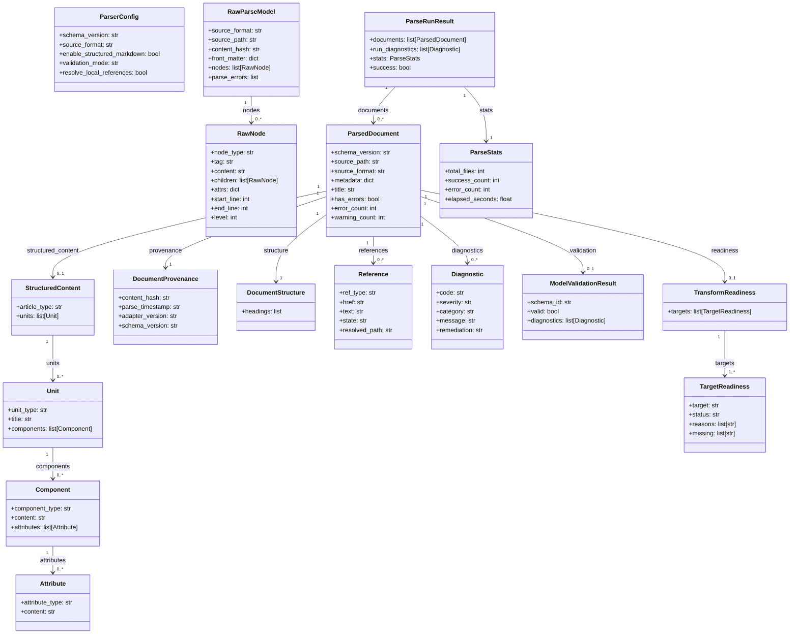

# Contracts

Every layer boundary in the `structure_parser` pipeline is defined by a versioned, immutable Pydantic model. This design means any layer can be replaced or tested in isolation as long as it accepts the same input contract and returns the same output contract — the caller never needs to know which implementation is behind the interface. All contracts live in `src/structure_parser/contracts/` and each carries a `schema_version` field; breaking changes require a version bump rather than silent drift.

## ParserConfig

`ParserConfig` is the configuration contract. It is a frozen Pydantic model constructed once per run and passed through to every layer that needs it. Its fields are:

| Field | Type | Default | Meaning |
|---|---|---|---|
| `schema_version` | `str` | `"1"` | Contract version |
| `source_format` | `str` | `"markdown"` | Format identifier used by `AdapterRegistry` |
| `enable_structured_markdown` | `bool` | `True` | Whether to run the Classification layer |
| `validation_mode` | `str` | `"advisory"` | `"advisory"` or `"strict"` |
| `resolve_local_references` | `bool` | `False` | Whether to run `LocalFileResolver` |
| `model_schema_dir` | `str \| None` | `None` | Override path for JSON schema directory |
| `emit_debug_logs` | `bool` | `False` | Whether to emit debug-level log lines |
| `max_diagnostic_count` | `int` | `200` | Cap on diagnostics collected per document |

The `validation_mode` field controls the entire Validation layer's error-reporting behavior: `"advisory"` produces SP-030 warnings; `"strict"` produces SP-099 errors that set `ParsedDocument.has_errors` to `True`.

## RawParseModel and RawNode

`RawParseModel` is the output contract of every adapter. It carries the source format identifier, the source path, a SHA-256 content hash of the raw bytes, the parsed front matter dict (or an empty dict if absent), the flat ordered list of `RawNode` objects, and any parse errors that the adapter could not recover from. Preserving source order is a hard requirement because the Classification and Enrichment layers depend on positional relationships between nodes.

Each `RawNode` carries:

| Field | Type | Meaning |
|---|---|---|
| `node_type` | `str` | Broad category (`heading`, `fence`, `inline`, `image`, etc.) |
| `tag` | `str` | Source tag or token type |
| `content` | `str` | Text content of the node |
| `children` | `list[RawNode]` | Inline children for block nodes |
| `attrs` | `dict` | Element attributes (href, src, alt, etc.) |
| `start_line` | `int \| None` | First source line (1-indexed) |
| `end_line` | `int \| None` | Last source line (1-indexed) |
| `level` | `int \| None` | Heading level (1–6) for heading nodes |

Line numbers are `None` when the adapter cannot determine them, which the provenance system records as `partial` or `unavailable` status.

## ParsedDocument

`ParsedDocument` is the primary output contract of the entire pipeline. It is the object returned to every caller — CLI commands, API consumers, and test assertions alike. Its fields are:

| Field | Type | Meaning |
|---|---|---|
| `schema_version` | `str` | Contract version |
| `source_path` | `str` | Absolute path to the source file |
| `source_format` | `str` | Format string from `ParserConfig` |
| `provenance` | `DocumentProvenance` | Hash, timestamp, adapter version |
| `metadata` | `dict` | Extracted front matter key-value pairs |
| `title` | `str \| None` | H1 heading text, if present |
| `structure` | `DocumentStructure` | Heading tree |
| `structured_content` | `StructuredContent \| None` | Classification output; `None` if disabled |
| `references` | `list[Reference]` | All links and images found |
| `diagnostics` | `list[Diagnostic]` | All diagnostics emitted across all layers |
| `validation` | `ModelValidationResult \| None` | Schema validation result |
| `readiness` | `TransformReadiness \| None` | Per-target readiness assessment |

Three computed properties make common queries concise:

- `has_errors` — `True` if any `Diagnostic` in `diagnostics` has `severity == "error"`
- `error_count` — count of error-severity diagnostics
- `warning_count` — count of warning-severity diagnostics

## StructuredContent, Unit, Component, Attribute

These four contracts form the classification hierarchy. `StructuredContent` is the top-level container; it holds the inferred article type and an ordered list of `Unit` objects. Each `Unit` corresponds to one H2 section of the document and carries a `unit_type`, a heading title, a `SourceSpan`, and an ordered list of `Component` objects. Each `Component` maps to one block-level node and carries a `component_type`, its text content, a `SourceSpan`, and an optional list of `Attribute` objects. Each `Attribute` maps to one inline node and carries an `attribute_type` and its text content.

Unknown content at any level uses sentinel type values — `artUnknown`, `unitUnknown`, `compUnknown`, `attUnknown` — so that unclassified material is preserved in the output rather than discarded.

## ParseRunResult and ParseStats

`ParseRunResult` is the contract returned by batch operations that process multiple files. It contains:

- `documents` — the list of `ParsedDocument` objects, one per source file
- `run_diagnostics` — diagnostics that apply to the run as a whole rather than any single file (for example, SP-002 when a directory contains no supported files)
- `stats` — a `ParseStats` object

`ParseStats` summarizes the run with counts: `total_files`, `success_count`, `error_count`, `warning_count`, and `elapsed_seconds`. The computed property `success` on `ParseRunResult` is `True` only if no document in the run has `has_errors == True` and `run_diagnostics` contains no errors.

## DocumentProvenance and SourceSpan

These two contracts carry origin tracking information at different granularities. `DocumentProvenance` is attached to the `ParsedDocument` and records the SHA-256 `content_hash` of the source bytes, the `parse_timestamp` in ISO 8601 format, the `adapter_version` string, and the `schema_version`. `SourceSpan` is attached to individual `Unit`, `Component`, and `Attribute` objects and records the `source_path`, `start_line`, `end_line`, and a `provenance_status` value (`available`, `partial`, or `unavailable`).

## Schema Versioning

All contracts carry `schema_version = "1"`. The version field exists so that serialized contract instances (for example, cached JSON files) can be detected as stale if the schema changes between releases. Any change that removes a field, renames a field, or alters a field's type is a breaking change and requires incrementing `schema_version`. Additive changes — new optional fields with defaults — do not require a version bump but should be documented in the changelog.

## Contract Class Hierarchy

