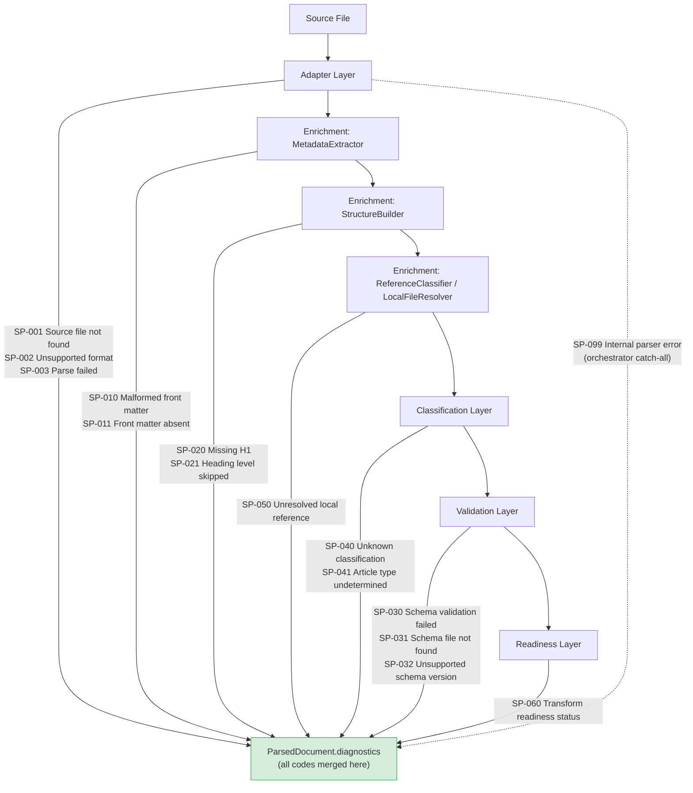

# Data Flow Diagrams

The two diagrams on this page show the parser flow from a data perspective rather than a component perspective. The first traces how a single Markdown source file is progressively transformed into narrower, more specific contract types. The second shows exactly where in the parser flow each group of SP-NNN diagnostic codes can be emitted.

## Data Transformation Flow

Each arrow in the diagram below represents a layer boundary. The label on each arrow names the contract type that crosses the boundary — the output of the layer on the left and the input of the layer on the right. Reading the diagram left to right traces the full lifecycle of a document from raw bytes to a caller-ready `ParsedDocument`.

```mermaid
flowchart LR
    SRC["Source File\n(.md / .html)"]

    subgraph "Adapter Layer"
        ADP["Adapter\nMarkdown · HTML"]
    end

    subgraph "Enrichment Layer"
        ENR["SemanticEnricher\nMetadata · Structure · References"]
    end

    subgraph "Classification Layer"
        CLS["StructuredMarkdownClassifier\nUnit · Component · Attribute"]
    end

    subgraph "Validation Layer"
        VAL["SchemaValidator\nDraft7Validator"]
    end

    subgraph "Readiness Layer"
        RDY["ReadinessEvaluator\nDITA · Schema.org · RAG"]
    end

    OUT["ParsedDocument\n(assembled by Orchestrator)"]

    SRC -->|"source bytes"| ADP
    ADP -->|"RawParseModel"| ENR
    ENR -->|"metadata + DocumentStructure\n+ list[Reference]"| CLS
    CLS -->|"StructuredContent"| VAL
    VAL -->|"ModelValidationResult"| RDY
    RDY -->|"TransformReadiness"| OUT
```

The `RawParseModel` is the widest contract in the parser flow — it carries every token in source order with no interpretation applied. Each subsequent layer narrows and enriches the representation: the enrichment layer adds meaning to the flat node list; the classification layer imposes the Structured Markdown type hierarchy; the validation layer adds a pass/fail judgment against a schema; the readiness layer adds a downstream-transformation judgment. The orchestrator is the only component that sees all five outputs simultaneously and is responsible for assembling them into the final `ParsedDocument`.

## Diagnostic Emission Points

Diagnostics are emitted throughout the parser flow, not only in the validation layer. The diagram below shows which SP-NNN code groups can be emitted at each stage, so that when you see a particular code in a `ParsedDocument`, you know which layer produced it and can narrow your investigation accordingly.

SP-099 (internal parser error) is shown with a dashed line because it is a catch-all emitted by the orchestrator's top-level exception handler, not by any single layer. If an unexpected exception escapes from any layer, the orchestrator catches it, wraps it in a SP-099 diagnostic, and returns a `ParsedDocument` with `has_errors = True` rather than propagating the exception to the caller. This ensures that callers always receive a `ParsedDocument` — even for catastrophic failures — and that the diagnostic list is the single source of truth for what went wrong.
