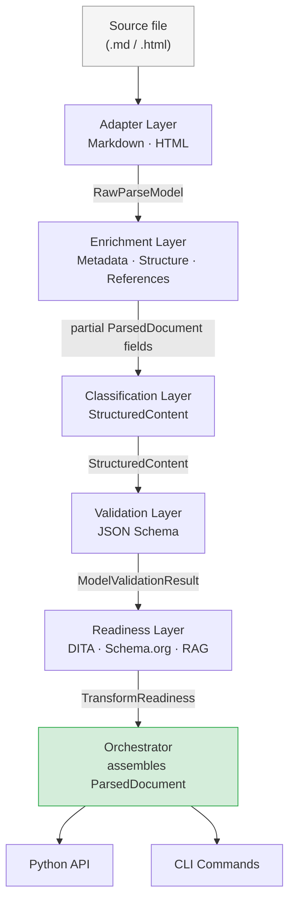
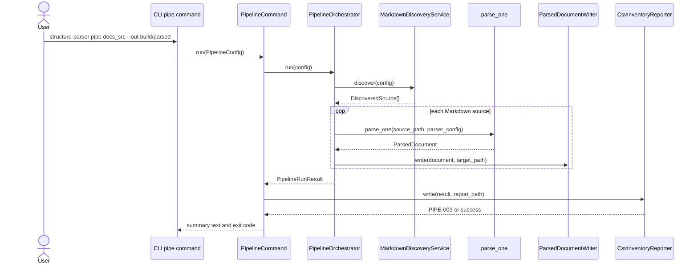

# Architecture Overview

The parser flow transforms one source document into a single normalized output. A `ParsedDocument` carries extracted metadata, a heading tree, structured content units, a reference inventory, schema validation results, transform readiness assessments, and a complete list of diagnostic messages.

The repository pipeline wraps the parser flow for content repositories. It discovers Markdown files in nested folders, calls the parser once per file, writes parsed JSON files, writes a CSV inventory report through the CLI command, and optionally writes a log file.

## What the Parser Flow Does

The parser flow accepts a file path and a `ParserConfig`. It routes source bytes through five successive layers before returning a `ParsedDocument` to the caller.

Each parser layer narrows the representation. Raw bytes become typed tokens, tokens become a structured document tree, the tree is classified into semantic units, those units are validated against JSON schemas, and the final document is assessed for readiness to transform into downstream formats.

No parser layer reaches backward into a previous layer's internals. Communication happens through the shared contracts in `src/structure_parser/contracts/`.

## The Five Layers

The parser flow is organized into five layers, each with a single responsibility:

- **Adapters** parse source bytes into a `RawParseModel` — a flat, ordered list of `RawNode` objects plus any front matter.
- **Enrichment** reads the `RawParseModel` and populates metadata, the heading tree, and the reference inventory on a partial `ParsedDocument`.
- **Classification** maps raw nodes to typed `StructuredContent`, splitting the document into `Unit` objects at H2 headings and mapping each block or inline node to a `Component` or `Attribute`.
- **Validation** serializes the `StructuredContent` and runs it against JSON schemas from `model/articles/`, returning a `ModelValidationResult`.
- **Readiness** evaluates the enriched `ParsedDocument` against three downstream targets — DITA, Schema.org, and RAG ingestion — returning a `TransformReadiness` with per-target status and reasons.

## What the Repository Pipeline Does

The repository pipeline is an operational layer above the parser flow. It uses `PipelineConfig` to discover Markdown files, calculate output paths, call the parser, write parsed outputs, and aggregate file-level statuses into `PipelineRunResult`.

The repository pipeline does not classify article types. Article type, unit type, component type, attribute type, and information type remain parser and model responsibilities.

The CLI `pipe` command adds CSV reporting on top of `PipelineOrchestrator`. The Python `run_pipeline()` helper currently returns a `PipelineRunResult` and writes parsed JSON outputs, while callers that need a CSV report can use `CsvInventoryReporter`.

## Contract-Based Design

Every layer boundary is a typed, immutable Pydantic model. This design means that any layer can be replaced, rewritten, or tested in isolation as long as it honours its input and output contracts. There are no shared mutable objects crossing layer boundaries; instead, each layer receives a contract instance, reads from it, and produces a new contract instance. The contracts live in `src/structure_parser/contracts/` and each carries a `schema_version` field so that breaking changes force an explicit version bump rather than silent drift.

## CLI and API Share the Same Orchestrator

Both the command-line interface and the Python API delegate to shared application logic. The nine CLI commands implemented in `commands.py` are thin wrappers: they parse arguments, construct configuration models, call parser or pipeline services, and format the result for terminal output.

A caller using the Python API calls the same parser orchestrator or repository pipeline services directly. This means every improvement to parser layers or repository pipeline orchestration is available to both interfaces without duplicating parsing behavior.

## Parser Flowchart

The orchestrator assembles the `ParsedDocument` from the outputs of every layer and attaches all diagnostics emitted along the way. A caller that receives a `ParsedDocument` therefore has a single object that answers every question about the source file: what it contains, whether it is valid, where it has authoring gaps, and whether it is ready for downstream transformation.

## Repository Pipeline Sequence

The sequence diagram shows that repository processing is separate from content classification. The pipeline owns discovery, output, report writing, and run status, while `parse_one` owns the article model produced for each file.
