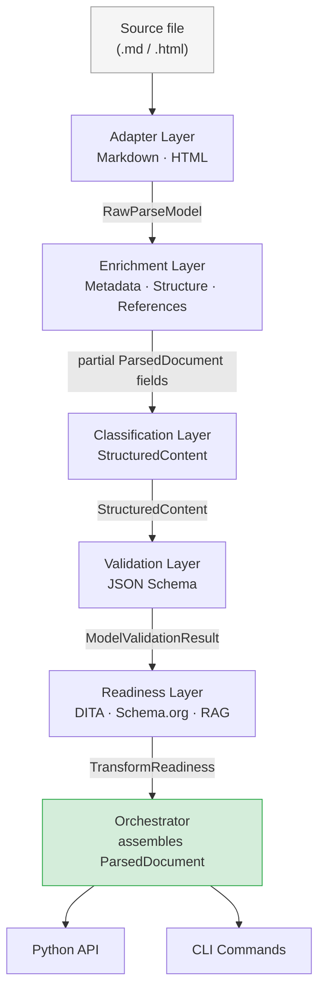

# Architecture Overview

The `structure_parser` pipeline transforms source documents — Markdown, HTML, or future formats — into a single, normalized output: a `ParsedDocument` that carries extracted metadata, a heading tree, structured content units, a reference inventory, schema validation results, transform readiness assessments, and a complete list of diagnostic messages. Every stage of that transformation is discrete, testable, and bound by a versioned Pydantic contract at each layer boundary.

## What the Pipeline Does

The pipeline accepts a file path and a `ParserConfig`, then routes the source bytes through five successive layers before returning a `ParsedDocument` to the caller. Each layer narrows the representation: raw bytes become typed tokens, tokens become a structured document tree, the tree is classified into semantic units, those units are validated against JSON schemas, and the final document is assessed for readiness to transform into downstream formats. No layer reaches backward into a previous layer's internals; communication happens entirely through the shared contracts in `src/structure_parser/contracts/`.

## The Five Layers

The pipeline is organized into five layers, each with a single responsibility:

- **Adapters** parse source bytes into a `RawParseModel` — a flat, ordered list of `RawNode` objects plus any front matter.
- **Enrichment** reads the `RawParseModel` and populates metadata, the heading tree, and the reference inventory on a partial `ParsedDocument`.
- **Classification** maps raw nodes to typed `StructuredContent`, splitting the document into `Unit` objects at H2 headings and mapping each block or inline node to a `Component` or `Attribute`.
- **Validation** serializes the `StructuredContent` and runs it against JSON schemas from `model/articles/`, returning a `ModelValidationResult`.
- **Readiness** evaluates the enriched `ParsedDocument` against three downstream targets — DITA, Schema.org, and RAG ingestion — returning a `TransformReadiness` with per-target status and reasons.

## Contract-Based Design

Every layer boundary is a typed, immutable Pydantic model. This design means that any layer can be replaced, rewritten, or tested in isolation as long as it honours its input and output contracts. There are no shared mutable objects crossing layer boundaries; instead, each layer receives a contract instance, reads from it, and produces a new contract instance. The contracts live in `src/structure_parser/contracts/` and each carries a `schema_version` field so that breaking changes force an explicit version bump rather than silent drift.

## CLI and API Share the Same Orchestrator

Both the command-line interface and the Python API delegate to the same `orchestrator.py` in the `application/` layer. The eight CLI commands implemented in `commands.py` are thin wrappers: they parse arguments, construct a `ParserConfig`, call the orchestrator, and format the result for terminal output. A caller using the Python API calls the same orchestrator methods directly. This means every improvement to the pipeline — whether a new enrichment step or a new readiness evaluator — is immediately available to both interfaces without duplication.

## Pipeline Flowchart

The orchestrator assembles the `ParsedDocument` from the outputs of every layer and attaches all diagnostics emitted along the way. A caller that receives a `ParsedDocument` therefore has a single object that answers every question about the source file: what it contains, whether it is valid, where it has authoring gaps, and whether it is ready for downstream transformation.
