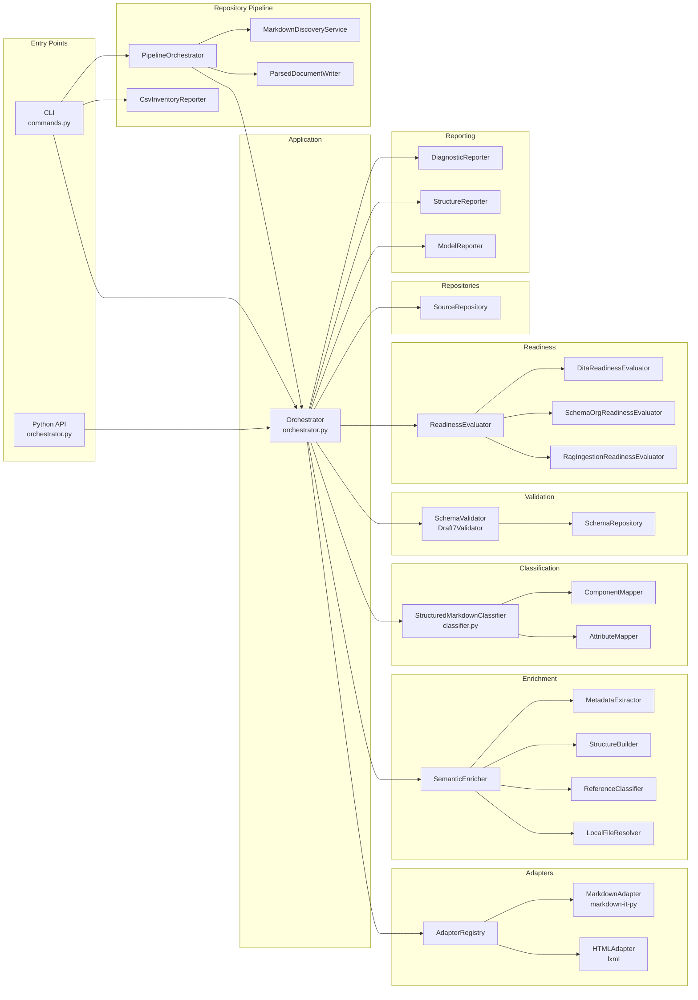
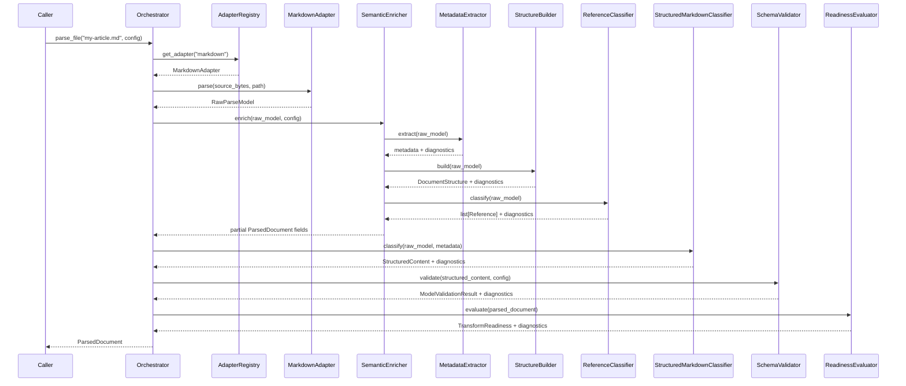
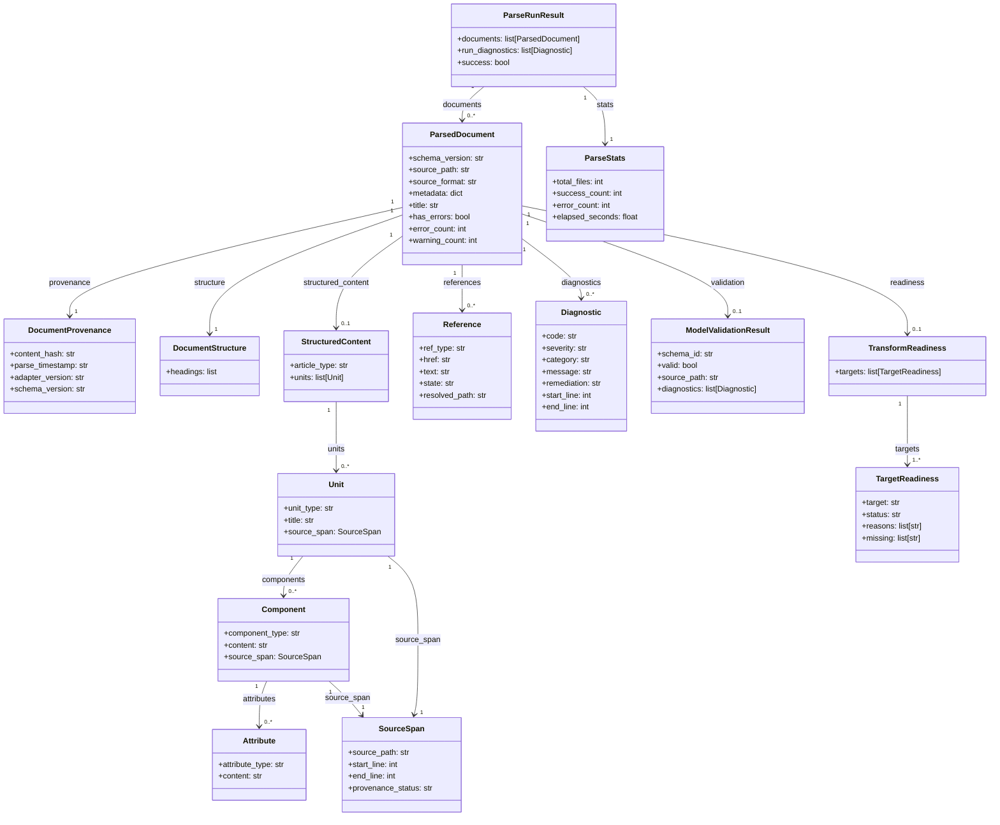
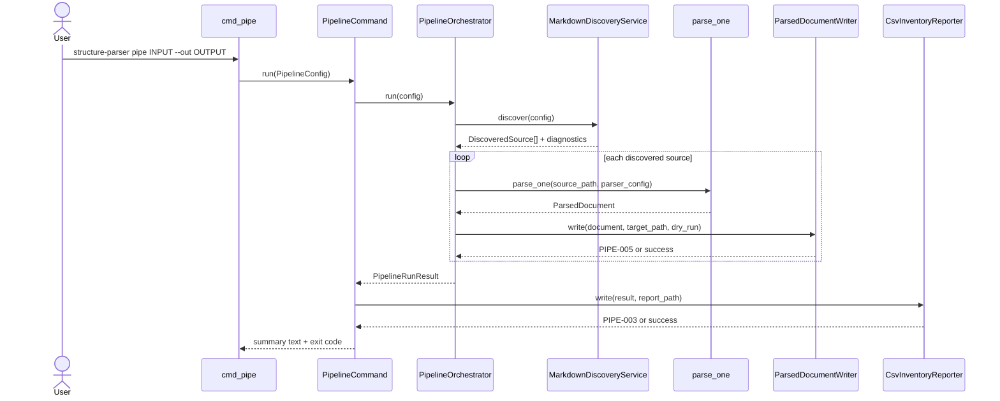
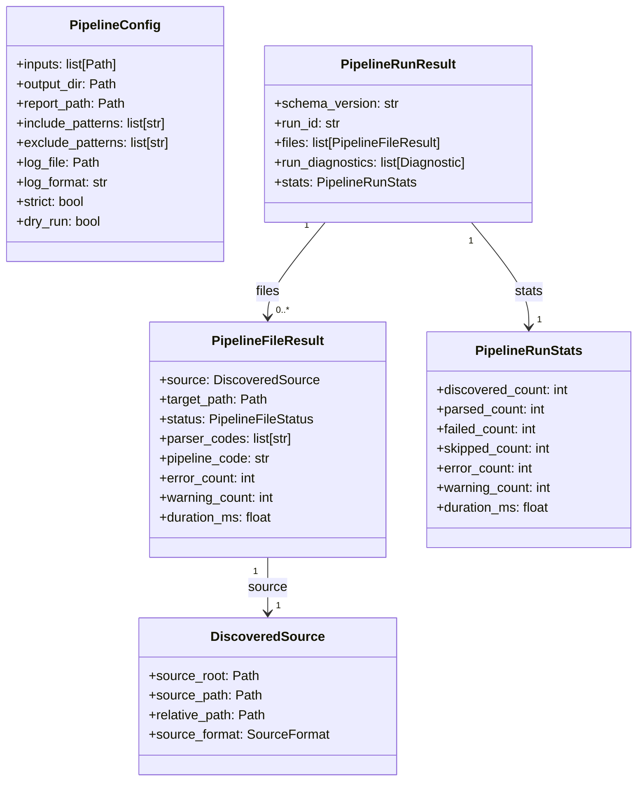

# UML System Model

The diagrams on this page provide a structural and behavioral picture of `structure_parser` at different levels of abstraction. The component diagram shows subsystem boundaries and dependencies, the sequence diagrams show runtime message flows, and the class diagrams show the contract object graphs that carry data between subsystems.

## Component Diagram

The component diagram below shows the major subsystems of `structure_parser` and the dependencies between them. The CLI and Python API are the two entry points; both delegate immediately to the Orchestrator, which coordinates all other subsystems. The Orchestrator never calls adapters, enrichment steps, or validators directly — it goes through the registry and pipeline objects that own those responsibilities.

The Repositories subsystem (`SourceRepository`, `SchemaRepository`) handles parser file I/O. Adapters receive source bytes from `SourceRepository` rather than reading files directly, which keeps adapters testable with in-memory strings. `SchemaRepository` pre-loads all JSON schemas at startup and hands the pre-built schema store to `SchemaValidator`, eliminating repeated file reads during batch processing.

The Repository Pipeline subsystem handles repository-scale operations. It discovers Markdown files, delegates each file to the parser orchestrator, writes parsed JSON output, and writes the CSV inventory report through the CLI command.

## Sequence Diagram

The sequence diagram below shows the complete message flow for a call to `parse_file("my-article.md")` through the Python API. Each vertical lifeline represents one object; each arrow represents one method call or return value.

The orchestrator is the only component that sees all five layer outputs simultaneously. It assembles them into a single `ParsedDocument` at the end, merging all diagnostics from every layer into `ParsedDocument.diagnostics`. This assembly step is the only place in the codebase where cross-layer data is combined; every other component operates on its own input contract in isolation.

## Class Diagram

The class diagram below shows the parser contract object graph. It is the authoritative picture of how `ParsedDocument` — the parser's primary output — relates to every other contract type. Cardinalities on association lines indicate how many instances of the target type a source instance may carry.

The class diagram reveals a key structural property of the design: `ParsedDocument` is the single root of the entire output graph. There is no other way for a caller to obtain a `StructuredContent`, `TransformReadiness`, or `ModelValidationResult` except through a `ParsedDocument`. This means callers always have full context available — they never hold a validation result without the document it came from, and they never hold a readiness assessment without the diagnostics that explain it.

## Repository Pipeline Sequence Diagram

The repository pipeline sequence diagram shows the runtime message flow for `structure-parser pipe`. The CLI command owns CSV report writing, while `PipelineOrchestrator` owns discovery, parser calls, JSON output writing, and run statistics.

The pipeline sequence makes the boundary with the parser explicit. The parser decides article, unit, component, attribute, and information types; the pipeline only schedules files and preserves those parser results.

## Repository Pipeline Class Diagram

The repository pipeline class diagram shows the operational contracts added for folder-scale processing. These contracts describe run state and file routing rather than structured content semantics.

The pipeline class diagram shows why pipeline contracts should remain operational. The graph references parser diagnostics but does not include `Article`, `Unit`, `Component`, or `Attribute` classes because those belong to the parser/model contract graph.
