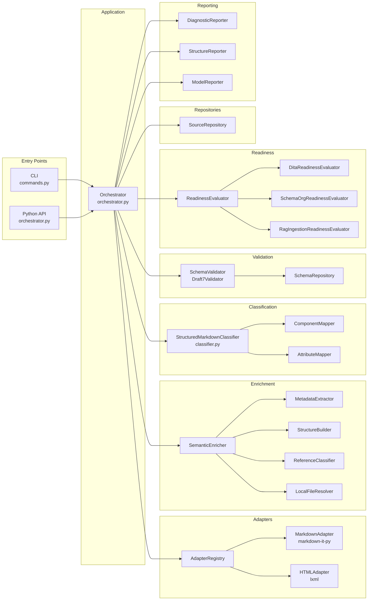
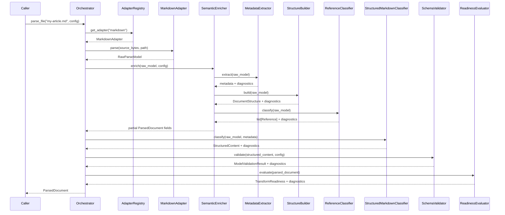

# UML System Model

The three diagrams on this page provide a complete structural and behavioral picture of `structure_parser` at different levels of abstraction. The component diagram shows subsystem boundaries and dependencies. The sequence diagram shows the runtime message flow for a single file parse. The class diagram shows the contract object graph that carries data between subsystems.

## Component Diagram

The component diagram below shows the major subsystems of `structure_parser` and the dependencies between them. The CLI and Python API are the two entry points; both delegate immediately to the Orchestrator, which coordinates all other subsystems. The Orchestrator never calls adapters, enrichment steps, or validators directly — it goes through the registry and pipeline objects that own those responsibilities.

The Repositories subsystem (`SourceRepository`, `SchemaRepository`) handles all file I/O. Adapters receive source bytes from `SourceRepository` rather than reading files directly, which keeps adapters testable with in-memory strings. `SchemaRepository` pre-loads all JSON schemas at startup and hands the pre-built schema store to `SchemaValidator`, eliminating repeated file reads during batch processing. The Reporting subsystem formats `ParsedDocument` fields for terminal output; it has no access to the pipeline and depends only on the contracts.

## Sequence Diagram

The sequence diagram below shows the complete message flow for a call to `parse_file("my-article.md")` through the Python API. Each vertical lifeline represents one object; each arrow represents one method call or return value.

The orchestrator is the only component that sees all five layer outputs simultaneously. It assembles them into a single `ParsedDocument` at the end, merging all diagnostics from every layer into `ParsedDocument.diagnostics`. This assembly step is the only place in the codebase where cross-layer data is combined; every other component operates on its own input contract in isolation.

## Class Diagram

The class diagram below shows the contract object graph. It is the authoritative picture of how `ParsedDocument` — the pipeline's primary output — relates to every other contract type. Cardinalities on association lines indicate how many instances of the target type a source instance may carry.

The class diagram reveals a key structural property of the design: `ParsedDocument` is the single root of the entire output graph. There is no other way for a caller to obtain a `StructuredContent`, `TransformReadiness`, or `ModelValidationResult` except through a `ParsedDocument`. This means callers always have full context available — they never hold a validation result without the document it came from, and they never hold a readiness assessment without the diagnostics that explain it.
