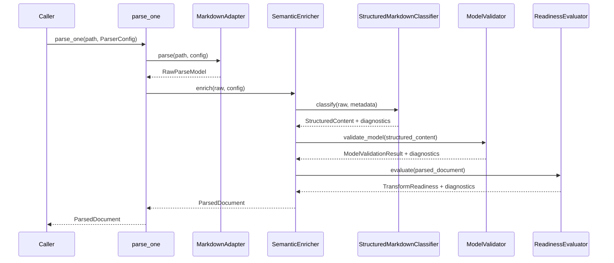
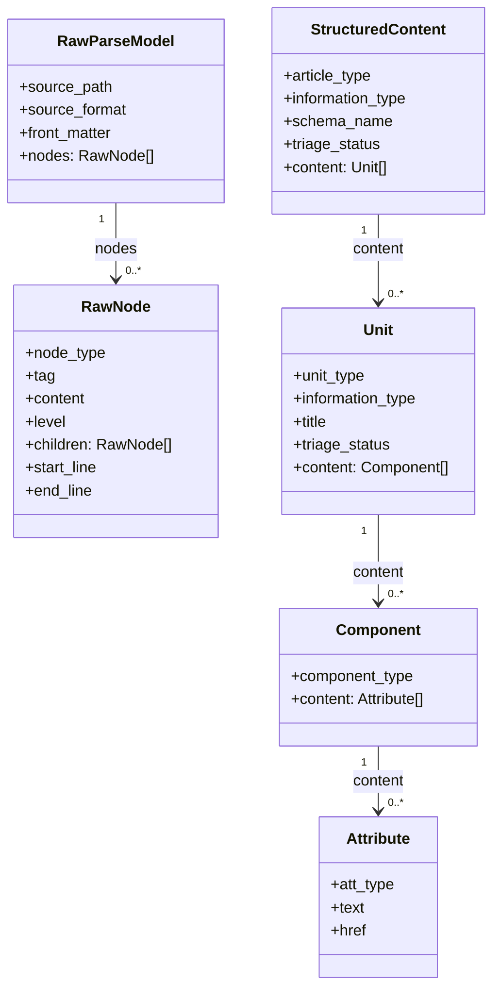

# Document Type Triage

## Concept

Document type triage is the parser's act of applying the Structured Markdown model to
ordinary Markdown. Markdown is non-semantic because it can identify headings, lists,
tables, code blocks, links, and emphasis, but it cannot declare that a document is a
how-to, that a section is a procedure, or that a list is a next-step navigation unit.

The Structured Markdown model supplies the semantic contract that Markdown lacks. The
model defines article types, unit types, component types, attribute types, and validation
schemas that the parser can use as a target.

The parser exerts the model on Markdown by mapping syntax to typed contracts. The
adapter reads Markdown syntax, the classifier interprets that syntax against model
patterns, and the validator checks the classified result against JSON Schema.

The triage process uses two families of evidence from a Markdown file. The first family
is explicit metadata in YAML front matter, and the second family is the constructed
document shape that appears after headings, blocks, and inline elements have been
parsed.

The current implementation uses metadata as the first article-type signal. The
classifier looks for front matter keys named `articleType`, `article_type`, or `type`,
normalizes recognized values, and maps them to an `ArticleType` and an article schema.

The current implementation uses document construction as the fallback article-type
signal. If metadata does not identify a known article type, the classifier scores the
population of inferred unit types against runtime article signatures that mirror the
model schema intent.

The current implementation uses document construction as the unit and content signal.
The classifier splits the file into H2-bounded sections, classifies each section as a
unit, maps block elements to components, and maps inline elements to attributes.

The current implementation preserves uncertainty instead of hiding it. If neither
metadata nor unit populations support an article type, the article receives
`ArticleType.unknown` and SP-041; if a unit cannot be classified, the unit receives
`UnitType.unknown` and SP-040.

This page complements [Parsing Approaches: AST, BNF, and Schema Mapping](parsing-approaches.md).
That page explains why the project uses deterministic schema mapping; this page explains
how that mapping works when the parser triages one Markdown file.

## Process

The parser process begins with one file path and ends with one `ParsedDocument`. The
orchestrator selects an adapter, asks the adapter for a raw parse model, enriches the
raw model, classifies structured content, validates the result, evaluates readiness, and
returns a single object containing content plus diagnostics.

The raw parse model is the bridge between Markdown syntax and semantic classification.
It contains source format, source path, content hash, YAML front matter, and ordered
`RawNode` objects for headings, paragraphs, lists, tables, code blocks, block quotes,
and inline children.

The classifier converts raw syntax into the Article to Unit to Component to Attribute
hierarchy. It does not ask Markdown to be semantic; it reads Markdown evidence and
assigns the closest model type that the evidence supports.

The article type decision currently begins with metadata. The classifier checks
`articleType`, then `article_type`, then `type`, and maps values such as `howto`,
`how-to`, `concept`, `reference`, `troubleshooting`, `glossary`, `quickstart`, and
`tutorial` to known article schemas.

The article type decision now falls back to construction evidence. If metadata is absent
or unsupported, the classifier scores the set of inferred unit types against article
signatures such as procedure-heavy how-to, reference-heavy reference, troubleshooting,
glossary, and concept.

The article signature sets are runtime mirrors of the schema contract. For example,
`artHowto.schema.json` requires procedure-shaped content, and the classifier's how-to
signature requires a procedure unit with supporting evidence from prerequisites,
introduction, next-step, or related-link units.

The unit type decision currently begins with H2 sections. The classifier splits the
document at H2 headings, uses heading keywords such as "Introduction", "Prerequisites",
"Reference", "Troubleshooting", "Next steps", and "Related" to assign unit types, and
then uses construction signals such as ordered lists and code blocks to infer
procedure-like units when headings are not specific.

The component and attribute decisions currently begin with parsed line elements. Block
nodes become components such as `compParagraph`, `compListOrdered`, `compTable`, or
`compBlockCode`, while inline children become attributes such as `attText`, `attLink`,
`attCode`, `attImage`, or `attEmphasis`.

## Procedure

The parser reads and triages a Markdown file through a deterministic sequence of code
steps. The steps below describe the current implementation path through the package.

1. The caller invokes `parse_one(path, config)` through the CLI, Python API, or
   repository pipeline.

2. The application orchestrator calls `get_adapter(path, config)` to select the
   Markdown adapter for `.md` or `.markdown` files.

3. The Markdown adapter uses `markdown-it-py` to tokenize the file and convert Markdown
   syntax into a `RawParseModel`.

4. The metadata extractor reads YAML front matter from `RawParseModel.front_matter` and
   returns a normalized metadata dictionary plus diagnostics.

5. The structure builder reads heading nodes and builds a heading tree for inspection,
   source navigation, and structural diagnostics.

6. The reference classifier reads links and images from raw nodes and records each
   reference with its resolution state.

7. The structured Markdown classifier receives the raw model and extracted metadata.

8. The article metadata helper checks metadata keys in the order `articleType`,
   `article_type`, and `type`.

9. The article metadata helper maps recognized metadata values to article types and schema
   names.

10. The classifier splits the raw node list into units at H2 heading boundaries.

11. The unit triage helper maps known H2 heading text to `UnitType` values.

12. The unit triage helper inspects construction shape when heading text is not enough.

13. The unit triage helper maps ordered-list sections to procedure units with
    `ProcedureRepresentation.ordered_list`.

14. The unit triage helper maps code-block-only sections to procedure units with
    `ProcedureRepresentation.code_block`.

15. The unit triage helper assigns `UnitType.unknown` and emits SP-040 when no unit
    signal is strong enough.

16. The article construction helper scores the resulting unit population when metadata
    did not select a known article type.

17. The article construction helper selects the closest article type when the score
    clears that article signature's threshold.

18. The article construction helper falls back to `ArticleType.topic` for mixed known
    unit populations that do not clearly match a specialized article type.

19. The article construction helper assigns `ArticleType.unknown` and emits SP-041 when
    neither metadata nor construction provides enough evidence.

20. The component mapper maps each block-level raw node in a unit to a component type.

21. The attribute mapper maps inline raw node children to attribute types.

22. The classifier constructs `StructuredContent` with article type, information type,
    triage status, schema name, source information, metadata, and ordered units.

23. The validator serializes `StructuredContent` and checks it against the selected JSON
    Schema.

24. The readiness evaluator checks whether the parsed document is ready for DITA,
    Schema.org, and RAG ingestion targets.

25. The orchestrator returns `ParsedDocument` with structured content, validation,
    readiness, references, provenance, and diagnostics.

The procedure shows where semantic meaning enters the parse. Markdown syntax becomes
meaningful only after the classifier compares parsed nodes to the model vocabulary and
selects article, unit, component, and attribute types.

## Discussion

The model is exerted on Markdown through deterministic interpretation rather than source
format changes. Authors can continue writing ordinary Markdown, but the parser applies a
semantic contract after parsing by asking whether the file matches known article and
unit patterns.

The current article type triage is metadata-first and construction-aware. It trusts
recognized metadata keys when present, but it now uses unit populations to infer article
type when metadata is absent or unsupported.

The current construction triage is strongest when units contain recognizable structural
signals. H2 headings, ordered lists, code blocks, tables, links, and inline elements
provide evidence to classify units, components, attributes, and fallback article type.

The current fallback behavior is part of the semantic contract. Unknown article and
unit types are not thrown away; they are preserved as structured unknowns with
diagnostics so a downstream report can inventory what needs human review.

The current approach differs from a general Markdown AST. A Markdown AST describes
syntax faithfully, while `structure_parser` maps syntax into a project-specific schema
that can be validated, reported, transformed, and used as a stable content contract.

The current approach differs from a grammar-only parser. A grammar can prove that a line
is a valid heading or list item, but the Structured Markdown model asks a further
question: what does that heading or list mean inside an information architecture?

The current article triage direction is not yet fully schema-derived. Runtime article
signatures mirror the intent of the article schemas, but they are still maintained in
classifier code rather than extracted directly from JSON Schema.

The remaining reconciliation problem is metadata versus construction. If front matter says
`articleType: reference` but the document shape is dominated by ordered procedures, the
parser should preserve both signals, choose the best-supported article type according to
policy, and emit a conflict diagnostic.

The related tuning article explains how to adjust schemas and runtime signatures
together. See [Tuning the Model for Triage](model-tuning.md) for guidance on making
schema constraints useful as article and unit classification sets.

The practical design rule is that parser triage belongs in the parser, not the
repository pipeline. The pipeline can run triage across many files and report the
results, but it should not decide article type itself.

The related design note expands the construction-aware direction. See
`design/2026-06-27-tech-note-article-triage-note.md` for the planned evidence model,
weighted unit signatures, and article signature scoring.
