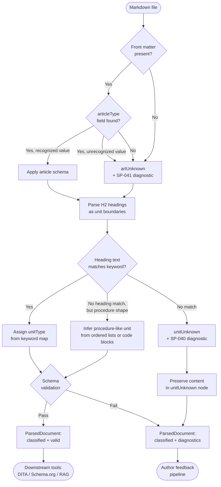

# Information Architecture: Robert Horn and DITA

Every piece of structured technical content must answer two questions simultaneously: what kind of thinking does it ask of the reader, and what publication shape does it require? These are distinct questions, and conflating them produces classification systems that serve neither purpose well. The Structured Markdown model answers them separately, using Robert Horn's information mapping system for the first and DITA 1.3's topic specialization hierarchy for the second — then carries both answers at every level of the document hierarchy.

## Two Independent Classification Systems

The Structured Markdown model carries two independent classification systems at the article and unit levels — Robert Horn's information mapping types and DITA 1.3's topic specializations — because they answer different questions about the same content. Horn's types answer "what kind of thinking does this content ask of the reader?" and map to rhetorical purpose: is the reader building a mental model, executing a sequence of steps, or looking up a discrete value? DITA's types answer "what publication shape and transformation pipeline does this content require?" and map to structural contracts: does the content need ordered steps, a symptom-condition-remedy structure, or a definition list?

A single article classified as `artHowto` carries both `ditaType: howto` (the DITA publication shape that requires step structure) and `informationType: procedure` (the Horn rhetorical function that asks the reader to execute actions in sequence). Both classifications apply simultaneously and are not redundant: the DITA type governs what a transformation pipeline produces, while the Horn type governs how a content analytics system assesses the rhetorical health of the content. A corpus analysis that finds an `artHowto` article with no `unitProcedure` units is using the Horn classification to identify a structural problem. A DITA-OT transformation pipeline is using the DITA classification to select the correct output template.

The unit level carries both classifications as well. A `unitProcedure` carries `informationType: procedure`, while a `unitConcept` within the same article carries `informationType: concept`. This per-unit classification enables the model to describe the internal rhetorical composition of an article — what percentage of a how-to article is conceptual explanation versus procedural instruction versus reference lookup — which neither classification system alone can express.

## Robert Horn's Information Mapping

Robert Horn's information mapping system identifies information types that correspond to distinct patterns of human cognition and communication. The Structured Markdown design vocabulary uses seven Information Mapping types:

- **Concept**: defines what something is, what it is not, and how its parts relate. A concept unit builds a mental model.
- **Procedure**: describes a sequence of steps to accomplish a goal. A procedure unit asks the reader to execute actions in order.
- **Principle**: states a rule, policy, guideline, or design constraint that governs behavior. A principle unit asks the reader to apply a judgment criterion.
- **Process**: explains how something works over time, through stages or mechanisms that the reader does not directly control. A process unit builds causal understanding.
- **Fact**: records discrete, lookup-oriented information — values, parameters, identifiers, specifications, compatibility tables. A fact unit asks the reader to retrieve a specific datum.
- **Structure**: describes parts, relationships, arrangement, or organization. A structure unit asks the reader to understand how pieces fit together.
- **Classification**: describes groups, classes, categories, or taxonomies. A classification unit asks the reader to sort or recognize related things.

The current runtime enum implements five Horn-derived values: `concept`, `procedure`, `process`, `principle`, and `fact`. The parser also emits `mixed` and `unknown` as operational states, while `structure` and `classification` remain future model-expansion targets.

The Information Mapping types are cognitively distinct in a meaningful sense: a reader processing a concept is constructing and connecting mental nodes; a reader processing a procedure is executing actions and tracking state; a reader processing a fact is matching a query to a stored datum. Mixing types without signaling the transition creates cognitive load because the reader must shift cognitive modes without warning. Horn's core claim is that well-typed information is more scannable, more learnable, and more maintainable because readers and writers alike have shared expectations about what each type contains and how it is organized.

Horn's system has a practical weakness that the Structured Markdown model must account for: it is a rhetorical classification, not a machine-processable schema. A trained human editor can read a section of prose and determine whether it is explaining what a thing is (concept) or explaining how something works (process) — the distinction is real, but it depends on reading comprehension. A parser cannot make that determination from syntactic signals alone. The Structured Markdown model therefore infers Horn's information types from structural signals — heading text, article type, unit position — rather than content analysis, which means the inference is an approximation that benefits from author cooperation through heading naming conventions.

## DITA 1.3 Topic Specializations

DITA 1.3's topic specialization hierarchy solves a different problem — it defines publication shapes and transformation rules for content management systems and publishing pipelines — and it solves that problem through schema enforcement rather than rhetorical analysis. Each DITA topic type is a structural contract:

- `concept`: conceptual explanation with no required task structure. A `<conbody>` contains paragraphs, sections, and examples but no mandatory step elements.
- `task` (mapped to `howto` in Structured Markdown): task-oriented, requiring a `<taskbody>` that must contain `<steps>` or `<steps-unordered>`, each with `<step>` children containing at minimum a `<cmd>` element.
- `reference`: lookup-oriented, typically containing `<refsyn>` (syntax definition), `<properties>` tables, or `<simpletable>` structures.
- `troubleshooting`: extends task with a mandatory `<troublebody>` that must contain `<condition>`, `<cause>`, and `<remedy>` elements — the symptom-condition-remedy diagnostic structure.
- `glossary`/`glossentry`: terminology definition, requiring `<glossterm>` and `<glossdef>` elements in a constrained structure.

The constraint model means that a DITA-OT transformation pipeline can make structural assumptions before reading a single word of content. A pipeline processing a `<task>` topic knows it will find steps, that steps will be ordered, and that each step will contain a command. It can generate a numbered checklist, produce accessible alt-text for step numbering, or extract steps for a conversational interface — all without content inspection. These guarantees make DITA valuable at scale in organizations that produce high-volume, multi-channel technical documentation.

The relationship between DITA types and Horn types is not one-to-one, and understanding that asymmetry is important for using both classification systems correctly. A `concept` topic in DITA maps cleanly to Horn's `concept` type: both describe what something is. A `task` topic in DITA maps to Horn's `procedure` type at the article level, but a realistic DITA task contains introductory concept paragraphs, prerequisite fact sections, and concluding reference tables alongside its required steps. At the article level the topic is a procedure; at the unit level it is a mix of procedure, concept, and fact. The Structured Markdown model captures both levels of that truth simultaneously, which neither DITA alone nor Horn alone can express.

## How the Two Systems Map to Each Other

The Structured Markdown model maps the two classification systems at both the article level and the unit level, capturing the rhetorical intent of the content alongside its publication shape. The following table shows the article-level mapping:

| Article Schema | DITA Type | Horn Information Type | Characteristic Unit Types |
|---|---|---|---|
| `artConcept` | concept | concept | unitConcept, unitPrinciple |
| `artHowto` | howto | procedure | unitProcedure, unitPrerequisites |
| `artReference` | reference | fact | unitReference, unitFact |
| `artTroubleshooting` | troubleshooting | process | unitTroubleshooting, unitProcedure |
| `artGlossary` | glossary | fact | unitGlossentry |
| `artGlossentry` | glossentry | fact | unitGlossentry |
| `artOverview` | concept | concept | unitConcept, unitIntroduction |
| `artQuickstart` | howto | procedure | unitProcedure, unitPrerequisites |
| `artTutorial` | howto | procedure | unitProcedure, unitConcept |
| `artTopic` | topic | mixed | any |

The "Characteristic Unit Types" column identifies the unit types that appear most often in conforming articles of each type, not an exhaustive or exclusive list. An `artHowto` article that contains a `unitConcept` to explain background context is not non-conforming — it is a common and desirable pattern, as long as the article also contains the required `unitProcedure` units. The article-level `informationType: procedure` describes the article's primary rhetorical purpose; it does not constrain what individual units may contain.

The unit level carries `informationType` independently, which enables the model to express the full rhetorical composition of the document. A `artTutorial` article carries `informationType: procedure` at the article level but commonly contains `unitConcept` units explaining the domain being taught alongside `unitProcedure` units providing the instructional steps. Each of those units carries its own `informationType` — `concept` and `procedure` respectively — and that per-unit classification is what enables a content analytics pipeline to compute metrics like "what fraction of this tutorial is explanation versus instruction?" without reading the prose.

## Information Mixing at the Unit Level

A key design decision in the Structured Markdown model is that information type mixing is permitted at the unit level, enabling realistic technical documentation patterns that do not fit a pure single-type article. Real technical documentation is almost never a pure instance of any single information type. A production how-to article for a software product typically contains:

- An introductory concept unit explaining what the feature does and why a user would invoke it
- A prerequisites fact unit listing software versions, permissions, and configuration states required before starting
- One or more procedure units containing the numbered steps
- A reference fact unit tabulating configuration parameters, flags, and their default values
- A link unit pointing to related procedures and next steps

All of these belong within `artHowto`, because the article-level `informationType: procedure` describes the article's primary purpose, not the rhetorical type of every unit it contains. This mirrors how technical writers actually structure content: the article is "a how-to" in the sense that its primary value is the sequence of steps that accomplishes a goal, but it provides enough supporting context that the steps can be followed successfully. A model that required every unit in a procedure article to carry `informationType: procedure` would force technical writers to split naturally unified articles into multiple files, increasing navigation overhead without improving content quality.

The Structured Markdown model takes a principled stance on this: article-level classification describes the dominant rhetorical purpose; unit-level classification describes the actual rhetorical function of each section. These two levels of description are complementary, and the full picture requires both. A content quality dashboard can surface articles where the dominant information type at the unit level contradicts the article-level claim — a `artHowto` where eighty percent of the units are `unitConcept` is probably misclassified or structurally imbalanced — without requiring that every unit conform to the article's type.

## Classification in the Parser

The parser infers article type and unit type from source Markdown signals rather than requiring authors to annotate every structural element. Article type inference is currently metadata-first: the parser reads front matter and looks for fields named `articleType`, `article_type`, or `type`.

The current article classifier selects the first recognized metadata value from that key list. If a recognized value maps to a known article type, the parser applies the corresponding schema. If no recognized field is present, the article is classified as `artUnknown` and an SP-041 diagnostic is emitted.

Construction-based article triage is planned design work rather than current behavior. The target design is to infer article type from unit populations when metadata is absent or weak, then reconcile metadata evidence with construction evidence and emit diagnostics for conflicts.

Unit type inference is driven by the text of H2 headings, using a keyword-matching pass that resolves common heading conventions to known unit types:

- "Introduction" or "Overview" at the unit level → `unitIntroduction`
- "Prerequisites" or "Before you begin" → `unitPrerequisites`
- "Steps", "Procedure", "How to", or headings beginning with "To " → `unitProcedure`
- "Next Steps" or "What's next" → `unitLinkNextstep`
- "Related" or "See also" → `unitLinkRelated`
- "Glossary" → `unitGlossary`
- Headings matching parameter, configuration, or API vocabulary → `unitReference`

When a heading text matches none of these patterns, the parser may still infer a procedure-like unit from ordered lists or code blocks. If no heading or construction signal is strong enough, the unit is classified as `unitUnknown` and SP-040 is emitted.

Authors can currently override article-level inference by providing explicit front matter. Future support for `unitType` annotations in heading attributes would enable unit-level overrides without changing the heading text.

The flowchart reflects a key invariant: the parser always produces a `ParsedDocument`, regardless of how many classification decisions fail. Failed classification produces Unknown nodes and diagnostics; successful classification produces known nodes and a validation result. Both paths produce a complete document model that downstream tools can consume, with the Unknown nodes and diagnostics serving as the signal for what requires author attention. This invariant is what makes incremental adoption safe: the first time the parser runs on an existing corpus, it will produce many Unknown nodes and many diagnostics, but it will not fail, and the diagnostic list is the roadmap for conformance work.
