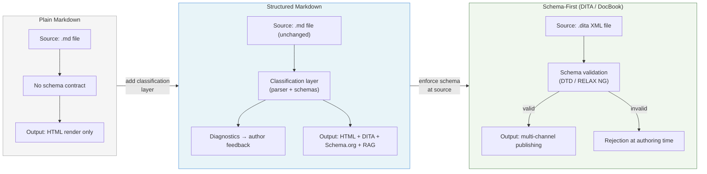

# Why Markdown Is Not a Semantic Format

Markdown is the dominant technical writing format of the 2020s, yet it was never designed to carry semantic meaning. Understanding why requires going back to Gruber's original intent, distinguishing presentation from meaning, and recognizing that Markdown's deliberate ambiguity is not a flaw to be patched but an enabling property that made it successful. Structured Markdown exploits that enabling property by adding a classification layer outside the source file, not inside it.

## The Design Intent of Markdown

Markdown was designed as a lightweight authoring shorthand for HTML, optimized for human readability as plain text rather than for machine-processable semantics. John Gruber published the original Markdown specification in 2004 with a stated goal that has not changed: "a text-to-HTML conversion tool for web writers" whose source text is "as readable as possible." The design priority was that a Markdown file should read naturally as plain text, even before any conversion takes place. Machine-processability was not a design requirement.

Markdown's relationship to HTML is generative rather than semantic: it is a syntax that produces HTML output, not a model that replaces HTML's element vocabulary. Gruber deliberately allowed raw HTML inline, which means Markdown source files are a superset of HTML authoring — any HTML construct that Markdown cannot express can be embedded directly. This design choice reveals the intent: Markdown is a convenience layer over HTML, not an alternative to it. The format inherits HTML's presentational strengths and its semantic weaknesses in equal measure.

CommonMark, the community-driven standardization effort that produced a formal specification in 2014, made this division explicit. CommonMark specifies parsing rules and rendering behavior with precision — it answers "how do I parse a setext heading?" and "what is the canonical representation of a tight list?" It does not specify what a heading means, what a list is for, or what publication purpose a code block serves. CommonMark standardized syntax, not semantics, which is the correct scope given what Markdown is.

## What Semantic Means — and What Markdown Provides

A semantic format encodes meaning that machines can process independently of presentation; Markdown provides structure, not meaning. The distinction between presentational structure and semantic meaning is the central issue. Presentational structure answers the question "how does this render?" — a `#` heading renders as an `<h1>`, a `**bold**` span renders as `<strong>`. Semantic meaning answers the question "what does this represent?" — this heading is the title of a concept definition; this bold span names a parameter; this paragraph is a warning that must be surfaced to the reader before they proceed.

DITA 1.3 illustrates the semantic alternative. A DITA `<task>` element carries a schema contract: it must contain a `<taskbody>`, which must contain `<steps>`, which must contain `<step>` elements, each of which must contain a `<cmd>`. Every element name carries meaning that is independent of how it renders. A transformation pipeline processing a `<task>` knows — without reading the content — that it is looking at a sequence of user-executable actions. It can generate numbered steps, produce a PDF checklist, or extract steps for a voice interface without any content inspection.

A `#` heading in Markdown carries none of that. It signals "render this text at the highest heading level" and nothing more. Whether that heading is the title of a concept, a procedure, a reference section, or a warning depends entirely on the content beneath it — content that only a human reader (or a trained classifier) can interpret. The heading level is a presentational signal, not a semantic one, and no amount of CommonMark parsing resolves that gap.

## The Ambiguity of Markdown as a Strength

The ambiguity that makes Markdown non-semantic is precisely what makes it the most widely adopted technical authoring format in the world. Low authoring friction is the mechanism: an author writing in Markdown does not need to understand XML schemas, DITA specialization hierarchies, or topic-type constraints to produce readable, publishable content. The barrier to entry is a heading and a paragraph, both of which are already natural behaviors in any text editor.

The same Markdown source renders correctly as HTML, PDF, slides, documentation sites, README files, and pull request descriptions with minimal or no configuration. GitHub Flavored Markdown added tables, task lists, and fenced code blocks. CommonMark anchored baseline compatibility. Platform-specific extensions — GitHub's alert blockquotes (`[!NOTE]`, `[!WARNING]`), front matter YAML, Mermaid diagrams — demonstrate that Markdown absorbs new authoring conventions incrementally, without breaking existing content. Each extension adds expressive power without invalidating prior documents, which is why platforms converge on Markdown rather than diverging toward specialized formats.

HTML shares this property in an instructive way. A `
` element can be anything — a page section, a modal dialog, a data table wrapper, an advertising slot. That openness enabled the web to grow faster than any schema committee could have planned for. The richness of HTML-based user interfaces emerged precisely because the format imposed no semantic constraint on how elements were used. Natural language carries the same property: the ambiguity of a word like "run" — which can mean a physical action, the execution of software, a sequence of events, or a ski trail — is not a defect of English. It is the feature that makes natural language expressive across an unbounded range of human activity. Ambiguity enables richness; constraint enables automation. Markdown chose richness.

## What Markdown Can and Cannot Carry Semantically

Markdown carries modest semantic indicators — primarily through YAML front matter, heading levels, and conventions like fenced code block language tags — but these indicators are not governed by a formal contract. YAML front matter is the strongest available semantic hook: fields like `title`, `articleType`, `tags`, and `date` can encode authorial intent in a machine-readable key-value structure. A parser that encounters `articleType: howto` has received an explicit classification signal. The limitation is that front matter has no enforced schema: any key-value pair is syntactically valid, the same field can appear under multiple names (`articleType`, `article_type`, `type`), and the parser must decide how to reconcile conflicts or missing values.

Heading levels signal hierarchy without signaling topic type. An H2 heading named "Prerequisites" carries conventional semantic weight — readers and parsers alike recognize it as describing preconditions. An H2 heading named "Overview" signals introductory content. These are naming conventions, not schema constraints, and they fail silently: an H2 named "Background" and an H2 named "Context" might both be intended as concept introductions, but a naive parser sees two different strings. Fenced code blocks with language tags (`python`, `bash`, `yaml`) signal format and can indicate what kind of example is being given, but they cannot signal whether the block is a conceptual example, an executable snippet, or a configuration template.

Alert-style blockquotes — `> [!NOTE]`, `> [!WARNING]`, `> [!CAUTION]` — are GitHub Flavored Markdown conventions that provide the clearest example of semantic encoding in Markdown. They carry explicit type signals that a renderer or parser can act on. They are also not part of the CommonMark standard, are not guaranteed to render correctly outside GitHub-compatible environments, and cannot be extended with custom alert types without platform support. The key limitation across all of these mechanisms is the same: any of them can be omitted, misused, or contradicted without the format objecting, because Markdown has no schema enforcement layer.

## The Contrast with DITA and XML-Based Formats

XML-based formats like DITA provide genuine semantic contracts at the cost of authoring friction. DITA's constraint model is schema-first: the document type definition (DTD) or RELAX NG schema defines exactly what elements a topic type may contain, in what order, and with what cardinality. A `<concept>` topic can contain a `<conbody>` but not a `<taskbody>`. A `<task>` must contain `<steps>` or `<steps-unordered>`. Authors cannot violate these constraints without producing a document that schema validation rejects. The contract is enforced at the point of authoring, not downstream.

This enforcement enables transformation pipelines to make structural assumptions. The DITA Open Toolkit processes a `<task>` element knowing it will find steps, a title, and a short description — not because it read the content, but because the schema guarantees their presence and position. Publishing pipelines for HTML, PDF, EPUB, and help systems can all rely on these guarantees to produce correctly structured output without content inspection. The semantic contract is load-bearing: it is what makes automated, multi-channel publishing feasible at scale.

The cost is real and well-documented. DITA requires specialized editors — oXygen XML Editor, XMetaL, Arbortext — because raw XML authoring is error-prone and slow. Authors must understand topic specialization, the difference between a concept and a task, when to use `<note>` versus `<hazardstatement>`, and how to manage content reuse through keyrefs and conrefs. The DITA-OT transformation pipeline requires configuration, specialization awareness, and maintenance. DocBook carries similar costs: its schema is exhaustive and precise, and precisely for that reason it has remained a format for technical publishers rather than a general-purpose authoring tool. These are not failures of DITA or DocBook — they are the deliberate tradeoffs of a format designed for semantic contracts over authoring ease.

## Modest Semantic Enrichment — the Middle Path

Structured Markdown occupies the space between unconstrained Markdown and schema-first formats by defining a pattern language that maps authoring conventions to a semantic contract without altering the source format. The approach does not introduce new Markdown syntax. Authors write ordinary Markdown — headings, paragraphs, code blocks, lists, front matter — using the conventions they already know. The parser reads the content and classifies it against a four-level hierarchy: Article, Unit, Component, and Attribute. When classification succeeds, the content satisfies a semantic contract that can be used to drive DITA output, Schema.org markup, or RAG chunk boundaries.

When classification fails, the parser emits author-facing diagnostics rather than a parse error. A heading that does not match a known unit type produces an SP-040 diagnostic identifying what could not be classified and why. A document receives SP-041 when the parser can neither read a known `articleType` from front matter nor infer an article type from the constructed units. These diagnostics create a feedback loop: the author learns where the content deviates from the pattern language and can decide whether to conform or accept the classification gap. The contract lives outside the source file, in the parser and the schemas, not inside the Markdown itself. The source file remains plain Markdown, readable in any editor, renderable on any platform, and processable by any Markdown tool — the semantic enrichment is additive, not disruptive.

The following diagram shows where Structured Markdown sits relative to plain Markdown and schema-first formats:

The middle path is not a compromise in the pejorative sense. It is a design decision that preserves what makes Markdown successful — low friction, ubiquity, platform compatibility — while adding enough semantic structure to enable machine processing downstream. The tradeoff is that the contract must be enforced by the pipeline, not by the format, which means an author can bypass it. Whether that tradeoff is acceptable depends on the authoring environment: a team with CI/CD enforcement of diagnostics gets near-schema-first guarantees; a team with no pipeline discipline gets enriched Markdown. The format works in both cases. The contract is enforced in the first and voluntary in the second, and that flexibility is exactly what the middle path requires.
