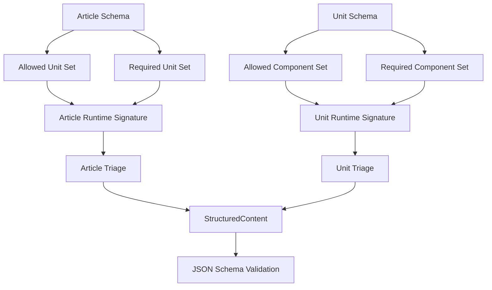

# Tuning the Model for Triage

## Concept

Model tuning is the practice of adjusting schemas and classifier signatures so the
parser can use the model as a practical triage instrument. The goal is not only to
validate finished structured output, but also to help the parser choose the closest
article and unit types from non-semantic Markdown evidence.

The schema model defines the authoritative semantic contract. Article schemas describe
which unit populations are valid, unit schemas describe which component populations are
valid, and component schemas describe which nested components or attributes are valid.

The classifier uses runtime signatures to make triage decisions before validation. These
signatures should mirror the schema contract closely enough that classification and
validation tell the same story.

The tuning problem exists because JSON Schema is a validation language, not a scoring
language. A schema can say that a how-to article must contain a procedure unit, but the
classifier still needs a runtime rule that turns a discovered procedure unit into
how-to evidence.

## Process

The model can be tuned by treating each schema as a source of classification evidence.
Article schemas contribute article signatures, unit schemas contribute unit signatures,
and component schemas contribute line-element signatures.

The article schema tuning surface is the `content` field. The `items.anyOf` or
`items.oneOf` list defines the allowed unit set, while `contains` defines the required
or strongly expected unit set.

The unit schema tuning surface is also the `content` field. The allowed component set
defines what may appear inside the unit, while `contains` identifies components that are
strong evidence for the unit type.

The runtime signature tuning surface currently lives in classifier code. The article
signature table maps required, preferred, and excluded unit sets to article scores, and
the unit title map plus construction heuristics map headings and line elements to unit
types.

## Procedure

Use this procedure when adding or changing an article type.

1. Define the article's semantic purpose before editing schema files.

2. Identify the required unit set that makes the article recognizable.

3. Identify the preferred unit set that commonly supports the article but should not be
   mandatory.

4. Identify the excluded unit set that should lower confidence when present.

5. Encode the allowed units and required units in the article schema.

6. Add or adjust the runtime article signature in the classifier so it mirrors the
   schema's required and preferred unit sets.

7. Add fixture Markdown files that omit metadata but contain the expected construction
   signal.

8. Add tests that prove the classifier can infer the article type from construction
   alone.

9. Add tests that prove metadata still wins when metadata is explicit and supported.

10. Add tests that prove weak or unrelated construction falls back to `topic` or
    `unknown` according to policy.

Use this procedure when adding or changing a unit type.

1. Define the unit's rhetorical function using the information type vocabulary.

2. Identify heading phrases that authors naturally use for the unit.

3. Identify required or strongly expected line elements such as ordered lists, tables,
   code blocks, alerts, or link lists.

4. Encode the allowed and required component sets in the unit schema.

5. Add heading keywords to the unit title map when naming convention is strong evidence.

6. Add construction heuristics when line-element population is stronger than heading
   text.

7. Add tests that prove the unit can be inferred from heading text.

8. Add tests that prove the unit can be inferred from construction when appropriate.

9. Add tests that prove ambiguous units fall back to `unitUnknown`.

## Discussion

The model should be tuned as a contract first and a classifier input second. Schema
constraints should express the content pattern that downstream tools need, and runtime
signatures should follow those constraints.

The classifier should not become a parallel model. If a runtime signature says a how-to
article requires a procedure unit, the article schema should say the same thing through
`contains`.

The schemas currently provide validation sets directly. For example, an article schema
uses `items.anyOf` to name valid child unit schemas and `contains` to require at least
one important child unit.

The runtime classifier currently mirrors those sets manually. The table in
`structured_markdown/classifier.py` defines article signatures from required,
preferred, and excluded unit sets that should stay aligned with `model/articles`.

The next tuning improvement is schema-derived signatures. A future implementation can
read `items.anyOf`, `contains`, and schema `$ref` values to derive at least part of the
runtime article and unit signature tables automatically.

The practical tuning standard is consistency. A schema, runtime signature, fixture, and
documentation page should all describe the same article or unit shape in different
forms.

## Example: How-To Article

The how-to schema requires procedure-shaped content. The schema expresses that
requirement with a `contains` rule over procedure unit schemas.

The how-to runtime signature uses the same idea as triage evidence. A procedure unit is
required evidence, while prerequisites, introduction, next-step links, and related links
increase confidence.

The how-to tuning rule is therefore simple. If the schema changes to require a
prerequisites unit, the runtime signature and tests should change at the same time.

## Example: Reference Article

The reference schema requires reference-shaped content. A table-heavy or option-oriented
unit should usually become `unitReference`, and a reference unit should become strong
evidence for `artReference`.

The reference runtime signature should penalize procedure-heavy construction. A document
dominated by ordered steps should not become a reference article unless explicit
metadata says it is one.

## Example: Topic Fallback

The topic article type is the broad known fallback. It should be used when the document
contains known units but no specialized article signature wins.

The unknown article type is the low-evidence fallback. It should be used when neither
metadata nor document construction provides enough signal to identify a useful known
article type.

## Checklist

- The schema states the allowed child set.
- The schema states the required or expected child set.
- The classifier has a matching runtime signature.
- The fixture suite contains metadata-free examples.
- The fixture suite contains weak-signal examples.
- The fixture suite contains metadata-and-construction conflict examples when conflict
  policy is implemented.
- The documentation names the current behavior and the future tuning direction.
