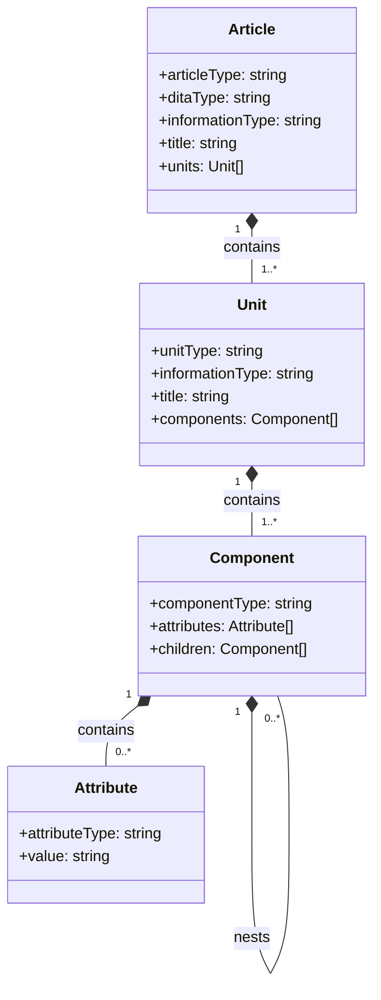
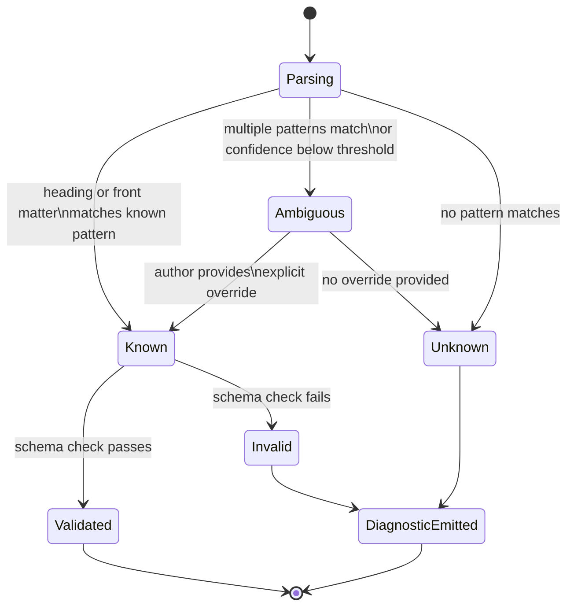

# The Structured Markdown Pattern Language

Structured Markdown gives ordinary Markdown files a semantic identity without changing a single character of their syntax. It does this by imposing a classification system from outside the source file — reading authoring conventions, matching them against a formal pattern language, and producing a classified document model that downstream tools can process. This page describes what that pattern language is, how its four-level hierarchy works, and what the parser produces when classification succeeds or fails.

## What Structured Markdown Is

Structured Markdown is a pattern language that maps the structural conventions of Markdown to a formal hierarchy of Articles, Units, Components, and Attributes. It is not a new Markdown dialect, a custom parser fork, or a Markdown extension that requires special syntax — it is a classification system imposed by a parser on ordinary Markdown that any compliant renderer can still process without modification. The pattern language is defined by JSON schemas in the `model/` directory, which serve as the authoritative contract for what correctly classified content at each level looks like.

The distinction matters because it determines what authors must learn. A Markdown dialect like GitHub Flavored Markdown requires authors to learn new syntax — alert blockquotes, task list checkboxes, table pipes. A Markdown extension like MDX requires authors to embed JSX components in their prose. Structured Markdown requires neither: it asks authors to follow heading naming conventions and provide a small number of front matter fields, both of which are natural Markdown authoring habits. The contract is enforced by the parser reading the document, not by syntax the author must produce.

The JSON schemas in `model/` are the ground truth for classification rules. Each article type has a dedicated schema that specifies which unit types the article may or must contain. Each unit type constrains which component types are meaningful within it. This layered schema structure means the pattern language is not hard-coded in the parser logic — it is a data-driven contract that can be extended, versioned, and audited independently of the parser implementation.

## The Four-Level Hierarchy

The hierarchy has four levels — Article, Unit, Component, and Attribute — each with a defined scope and a direct mapping from Markdown constructs. The levels move from the file level down to the inline level, matching the natural nesting of Markdown document structure.

An Article corresponds to one Markdown file or one HTML page. It carries article-level metadata — `articleType`, `ditaType`, `informationType`, and `title` — and contains an ordered sequence of Units. The article type governs which unit types are permitted and which are required; a `concept` article schema permits `unitConcept` and `unitPrinciple` units but does not require procedure or reference units. Front matter fields drive article-level classification, with the parser reading `articleType`, `article_type`, or `type` to determine the article schema to apply.

A Unit corresponds to a logical section of the article, typically bounded by an H2 heading and extending to the next H2 heading or the end of the document. It carries a `unitType` and `informationType`, and contains an ordered sequence of Components. Unit type is inferred primarily from the text of the H2 heading: "Prerequisites" maps to `unitPrerequisites`, "Next Steps" maps to `unitLinkNextstep`, headings containing "step" or "procedure" map to `unitProcedure`. Units are the primary rhetorical containers — they correspond to Robert Horn's information types — and their boundaries are the chunk boundaries used when the document is ingested for retrieval-augmented generation.

A Component corresponds to a block-level Markdown construct within a Unit. Paragraphs, fenced code blocks, ordered lists, unordered lists, tables, alert blockquotes, and headings from H1 through H6 each map to a dedicated component type. Alert blockquotes specialize further: `[!NOTE]` produces `compAlertNote`, `[!WARNING]` produces `compAlertWarning`, and so on. Components are the rendering atoms — the level at which a transformation pipeline decides how to present content.

An Attribute corresponds to an inline construct within a Component. Text, bold (`**text**`), italic (`*text*`), inline code (`` `code` ``), links, images, anchors, and other inline constructs each map to a named attribute type. Attributes carry the leaf-level content of the document: the actual character data and the formatting signals applied to it.

The hierarchy is strictly nested: Attributes exist only inside Components, Components exist only inside Units, and Units exist only inside Articles. A parser that encounters a Component that does not belong to any classified Unit assigns that Component to a `unitUnknown` container rather than attaching it directly to the Article. This invariant ensures that every piece of content in the source file appears somewhere in the output model, regardless of classification success.

## Article Types and Their Schemas

Each article type has a dedicated JSON schema that constrains which unit types are permitted and which are required. The schema acts as the semantic contract for that article type: a `howto` article that contains no `unitProcedure` violates its schema and produces a diagnostic, even if every heading and paragraph in the document is individually well-formed.

| Article Type | DITA Type | Horn Information Type | Required Units |
|---|---|---|---|
| `concept` | concept | concept | unitConcept |
| `howto` | howto | procedure | unitProcedure (any representation) |
| `reference` | reference | fact | unitReference |
| `troubleshooting` | troubleshooting | process | unitTroubleshooting |
| `glossary` | glossary | fact | unitGlossentry |
| `glossentry` | glossentry | fact | unitGlossentry |
| `overview` | concept | concept | unitConcept |
| `quickstart` | howto | procedure | unitProcedure |
| `tutorial` | howto | procedure | unitProcedure |
| `topic` | topic | mixed | any known unit |
| `unknown` | (none) | unknown | (no constraint) |

The `topic` article type is the most permissive: it accepts any known unit type without requiring any particular unit, making it suitable for content that combines multiple information types without fitting a single rhetorical purpose. The `unknown` article type places no constraint at all and is the fallback when the parser cannot infer or locate an `articleType` declaration in front matter. An article classified as `unknown` can still be fully parsed — all its units, components, and attributes are classified normally — but the article-level semantic contract is absent, which downstream transformation tools must account for.

The schema files in `model/` encode these constraints as JSON Schema documents, which means they are both human-readable specifications and machine-executable validation rules. The parser loads the schema corresponding to the inferred article type and runs a Pydantic-based validation pass on the classified content. Validation results — pass, fail, or pass-with-warnings — appear in the `ParsedDocument.validation_result` field.

## The Tradeoff — Feedback Over Format

Because Structured Markdown does not alter the source format, the contract can only be enforced by feeding diagnostic information back to the author, and that pipeline dependency is the defining tradeoff of the approach. A DITA-aware XML editor enforces the schema at authoring time: when an author attempts to insert a `<steps>` element inside a `<concept>` body, the editor rejects the action immediately. The schema validation is synchronous with the act of writing. An author cannot save an invalid DITA file to disk, because the editor will not permit it.

In Structured Markdown, the source file itself remains plain Markdown that any text editor can save in any state. Only the parser enforces the contract, and the parser runs outside the editor, in a separate pass. An author who writes a `howto` article with no procedure section, ignores the resulting SP-nnn diagnostic, and publishes the document anyway has produced non-conforming content that no format mechanism prevented. The approach therefore assumes a pipeline: parse, classify, validate, emit diagnostics, feed back to the author, revise. The pipeline is what converts a voluntary convention into an enforced contract.

Enforcement can occur at several points in a development workflow. In a CI/CD pipeline, the parser runs on every commit and blocks publication when diagnostic severity exceeds a configured threshold. In an IDE extension, the parser runs on save and surfaces diagnostics as inline annotations, matching the authoring-time feedback of an XML editor. As a pre-commit hook, the parser runs before a commit is recorded and can block commits that introduce classification failures. Each deployment mode recovers a different fraction of the enforcement that schema-first formats provide natively, and teams can choose the mode that matches their toolchain and workflow.

## The Fallback Model

When classification fails, the model preserves content under Unknown types rather than discarding it, making uncertainty explicit without losing information. This design principle applies at every level of the hierarchy: `artUnknown` at the article level, `unitUnknown` at the unit level, `compUnknown` at the component level, and `attUnknown` at the attribute level. Every source construct that the parser cannot confidently classify produces a named Unknown node in the output model rather than a parse error or a dropped element.

A document with five H2 sections where one section heading matches no known unit-type keyword produces a `ParsedDocument` with four classified units and one `unitUnknown` — not a parsing failure. All of the components within the unclassified unit are still parsed and attached to the `unitUnknown` node. The `unitUnknown` node carries a diagnostic reference to SP-040, which reports what heading text was encountered and why it did not match any known pattern. The author can read the diagnostic, rename the heading to a recognized pattern, and reparse to obtain a classified unit.

This fallback design makes the parser safe to run on any Markdown file, including files that make no attempt to conform to the pattern language. A repository of ad-hoc Markdown notes, blog posts, or scratch files can be passed to the parser without error. The output will contain mostly `artUnknown` articles with `unitUnknown` units, and the diagnostic list will be long, but no content will be lost and no process will fail. This property matters for incremental adoption: teams can run the parser across an existing corpus, inspect the diagnostic output to understand how far the content is from the pattern language, and prioritize conformance work without committing to a big-bang migration.

The state diagram reflects the triage logic at each classification decision point. Content moves to Known when the parser finds a confident match, to Ambiguous when multiple interpretations are possible or the signal is weak, and to Unknown when no interpretation succeeds. Ambiguous content can be resolved by the author providing an explicit front matter override — setting `articleType` directly bypasses inference for article classification, and future heading-level overrides can similarly resolve unit ambiguity. Unknown content with an emitted diagnostic is a stable terminal state: the content is preserved, the uncertainty is named, and the author has the information needed to decide whether to correct the source.

## What the Parser Produces

The parser produces a `ParsedDocument` Pydantic model containing the classified content, diagnostics, references, and transform-readiness assessments, and that output model is the interface between the parser and every downstream tool. The `StructuredContent` field carries the full classification result: `article_type`, `dita_type`, `information_type`, and a `content` list of Unit objects. Each Unit carries its own `unit_type`, `information_type`, `title`, and `content` list of Component objects. Each Component carries its component type, child components (for nested structures like list items within lists), and a list of Attribute objects for inline content.

Diagnostics appear as a list of `Diagnostic` objects, each carrying an SP-NNN code, a severity level (error, warning, or info), a human-readable message, and a location reference. SP-040 reports content classified as unknown; SP-041 reports an unknown article type. The full diagnostic code space covers classification ambiguity, missing required units, schema validation failures, and reference resolution failures. Diagnostics are structured rather than plain text, making them parseable by IDE extensions and CI tooling without string matching.

The `references` field lists every link and image found in the document, each with a resolution state: resolved (the target was found and accessible), unresolved (the target was not found), or external (the target is an external URL that was not checked). The `transform_readiness` field carries a map of downstream transformation targets — DITA output, Schema.org markup, RAG ingestion — each annotated with a readiness level and a list of blocking issues. A document with an unknown article type is not ready for DITA transformation but may still be ready for RAG ingestion, because RAG chunking relies on unit boundaries rather than article-level schema compliance. The readiness map expresses these distinctions explicitly, so downstream tools know exactly what they can rely on.
