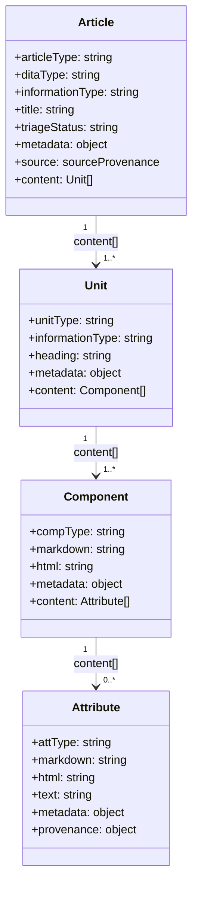

# Model Overview

The model is a JSON Schema-based pattern language that defines valid Structured Markdown content. It is the authoritative contract that the `structure_parser` package targets when it parses Markdown files and HTML pages into typed, validated Python objects. Every schema constraint in the model has a direct counterpart in the parser's classification logic: the model defines what is valid, and the parser determines which schema a given piece of content satisfies.

## Four-Level Hierarchy

Structured Markdown content is organized into four nested levels. Each level has a distinct scope, a distinct set of allowed children, and its own shared base contract.

**Article** is the top-level container — one article corresponds to one Markdown file or one HTML page. It declares the article type, classification metadata, title, and an ordered array of units that constitute the body.

**Unit** is a logical section of an article, bounded by an H2 heading. Each unit has a `unitType` that encodes its rhetorical function (introduction, procedure, reference, and so on) and an `informationType` that encodes its Horn information classification. A unit contains an ordered array of components.

**Component** is a block-level construct: a paragraph, a code block, a list, a table, an alert, or a heading. Each component maps to one or more Markdown block elements or HTML5 block elements. Text-bearing components contain an ordered array of attributes.

**Attribute** is an inline element within a text-bearing component. Attributes are the leaf nodes of the hierarchy — they carry the actual text content, links, images, and inline formatting such as bold, emphasis, and inline code.

## Two Classification Dimensions

Each article and each unit carries two independent classification fields.

**ditaType** maps the content to a DITA 1.3 specialization type: `topic`, `concept`, `task` (rendered as `howto`), `reference`, `troubleshooting`, `glossary`, or `glossentry`. This dimension captures the structural intent of the content and enables downstream toolchains that consume DITA-aligned metadata.

**informationType** maps the content to a Horn information type: `concept`, `procedure`, `fact`, `process`, or `principle`. The Horn classification is orthogonal to DITA — it captures the rhetorical purpose of the content independently of its structural form. Together, the two dimensions let classifiers and validators cross-check consistency: a `ditaType: reference` article is expected to carry `informationType: fact`, and a mismatch signals a classification error.

## Schema Directory Structure

The model schemas are organized in a directory hierarchy that mirrors the content hierarchy.

| Directory | Purpose |
|---|---|
| `model/articles/` | Article-level schemas (`artConcept.schema.json`, `artHowto.schema.json`, etc.) |
| `model/articles/units/` | Unit-level schemas (`unitConcept.schema.json`, `unitProcedure.schema.json`, etc.) |
| `model/articles/units/components/` | Component-level schemas (`compParagraph.schema.json`, `compTable.schema.json`, etc.) |
| `model/articles/units/components/attributes/` | Attribute-level schemas (`attText.schema.json`, `attLink.schema.json`, etc.) |

The root article union schema (`artArticle.schema.json`) is a `oneOf` that references all concrete article schemas. Validators can use it as the single entry point for validating any article.

## Fallback Model

Content that cannot be classified into a known type is preserved rather than discarded. Each level of the hierarchy provides a dedicated fallback schema:

- `artUnknown` — article whose type cannot be determined
- `unitUnknown` — unit whose rhetorical function cannot be determined
- `compUnknown` — block construct that does not match any known component type
- `attUnknown` — inline construct that does not match any known attribute type

The fallback types allow the parser to produce a complete, structurally valid output even when classification is partial. Downstream tools can identify unknowns by their type field and route them for human review without losing any source content.

## Shared Contracts

Each level of the hierarchy defines a shared base schema that all concrete schemas at that level inherit from.

**`sharedArticle.schema.json`** defines the fields common to every article: `schema`, `version`, `articleId`, `articleType`, `ditaType`, `informationType`, `title`, `triageStatus`, `metadata`, `source`, and `content`. Concrete article schemas extend this base by adding constraints on `content` (required unit types, minimum item counts).

**`unitShared.schema.json`** defines the fields common to every unit: `unitType`, `informationType`, `heading`, `metadata`, and `content`. The `unitMetadata.schema.json` companion defines the open metadata object for units.

**`componentShared.schema.json`** defines the fields common to every component: `compType`, `markdown`, `html`, and `metadata`. The `sharedBlockElementProperties.schema.json` companion defines the shared block-element property definitions.

**`attributeShared.schema.json`** defines the `attributeBase` contract: `attType`, `markdown`, `html`, `text`, `metadata`, and `provenance`. The `sharedInLineElementProperties.schema.json` companion defines shared inline property definitions.

## Ordered Content Arrays

At every level, `content` is an array, not an object map. The array preserves the source order of the original Markdown document: units appear in the order their H2 headings appear, components appear in the order their block elements appear, and attributes appear in the order their inline spans appear. Preserving order matters for round-tripping content back to Markdown, for diff-based review workflows, and for any downstream renderer that must produce output faithful to the author's original sequence.

## Open Metadata Hooks

Every level of the hierarchy carries a `metadata` object that is intentionally open by schema design — it uses `additionalProperties: true` rather than an exhaustive property list. This openness allows parsers and downstream tools to attach arbitrary provenance data, product metadata, review state, or workflow annotations without modifying the structural grammar. A CI pipeline might write a `validatedAt` timestamp into article metadata; a product taxonomy tool might write a `productLine` tag into unit metadata; a linter might write `lintWarnings` into component metadata. None of these extensions invalidate the structural contract. The grammar remains stable while the metadata layer evolves freely.
