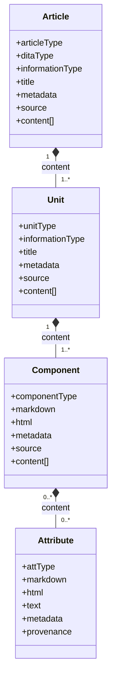

# Structured Markdown Model

The Structured Markdown model is the semantic layer for this project. It defines the
machine-readable meaning that the parser assigns to Markdown or rendered HTML after the
source has been read, segmented, classified, and validated.

The model is a semantic contract between source content and downstream tools. It states
what an article, unit, component, and attribute must look like so validators,
transforms, repository pipelines, RAG ingestion jobs, and authoring tools can consume
parsed content without reinterpreting raw Markdown.

The model is not the parser. The parser reads source files and produces structured
output; the model defines the JSON Schema target that structured output should satisfy.

## Semantic Layer

The semantic layer gives ordinary Markdown a stable content vocabulary. Markdown syntax
can say that a line is a heading or a block is a list, but the model can say that a file
is a how-to article, a section is a procedure unit, a block is an ordered-list component,
and inline content is a link attribute.

The semantic layer preserves source order while adding meaning. Articles contain ordered
units, units contain ordered block components, and text-bearing components contain
ordered inline attributes.

The semantic layer keeps uncertainty explicit. Unknown article, unit, component, and
attribute schemas preserve source content when the parser cannot classify something
safely.

## Semantic Contract

The semantic contract is expressed as JSON Schema. Each schema defines allowed fields,
required fields, child relationships, fallback types, and shared metadata hooks.

The semantic contract separates core classification from open metadata. Fields such as
`articleType`, `ditaType`, `informationType`, `unitType`, `componentType`, and `attType`
belong to the core model, while `metadata` remains open for provenance, product data,
review state, publishing hints, and downstream annotations.

The semantic contract gives downstream systems reliable expectations. A DITA transform
can inspect article and unit types, a RAG pipeline can use units as chunk boundaries, a
CSV inventory can report parser diagnostics, and an authoring tool can point a writer to
unknown or invalid structures.

## Model Shape

The model is organized as an Article to Unit to Component to Attribute hierarchy.

The article level represents one Markdown file or rendered HTML page. Article schemas
define broad document shapes such as topic, concept, how-to, reference,
troubleshooting, glossary, quickstart, tutorial, and unknown.

The unit level represents a logical section inside an article. Unit schemas represent
semantic blocks such as introduction, concept, procedure, principle, process, fact,
reference, troubleshooting, prerequisites, glossary, related links, next-step links, and
unknown.

The component level represents block-level Markdown or HTML constructs. Component
schemas represent paragraphs, headings, ordered lists, unordered lists, list items,
tables, table rows, table cells, code blocks, block quotes, alerts, links, includes,
videos, metadata blocks, and unknown blocks.

The attribute level represents inline constructs inside text-bearing components.
Attribute schemas represent text, links, anchors, bold, strong, italic, emphasis, inline
code, images, spans, subscript, superscript, and unknown inline content.

## Information Types

The model uses information types to describe rhetorical function. The current schemas
and parser use Horn-inspired values such as `concept`, `procedure`, `principle`,
`process`, `fact`, `mixed`, and `unknown`.

The model uses DITA-inspired article shape to describe publishing intent. The `ditaType`
field identifies broad downstream shapes such as `topic`, `concept`, `howto`,
`reference`, `troubleshooting`, `glossary`, and `glossentry`.

The model keeps information type and article shape separate. A how-to article may
contain conceptual introduction units, factual prerequisite units, procedural step
units, and related-link units while still remaining a how-to article overall.

## Related Documents

The model overview explains the model at a conceptual level. See
[model-overview.md](model-overview.md) for the layered view, article type matrix,
fallback model, and implementation notes.

The schema index lists the major schema files. See [schema-index.md](schema-index.md)
for article schemas, shared contracts, and dependency rules.

The schema construction note explains how the Pattern Object Model is built. See
[construction-of-schema.md](construction-of-schema.md) for the Article to Unit to
Component to Attribute design, classification layers, root article schemas, unit
schemas, component dependencies, metadata hooks, and parser contract guidance.

The article schemas define root document contracts. See [articles/](articles/) for
concrete article, unit, component, and attribute JSON Schema files.

## How to Use This Folder

Use `artArticle.schema.json` when a validator should accept any known article type. This
root union schema is the broadest article-level validation entry point.

Use a concrete article schema when a workflow expects a specific article type. For
example, use `artHowto.schema.json` when a CI gate requires procedural content to match
the how-to contract.

Use shared schemas to understand common fields across model levels. Shared article,
unit, component, and attribute schemas define the common contract that concrete schemas
extend.

Use unknown schemas to preserve content during triage. Unknown schemas are not failures
by themselves; they are explicit markers that parser confidence was low or that a
structure needs human review.
