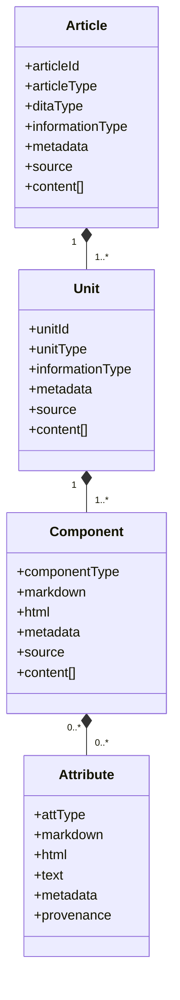
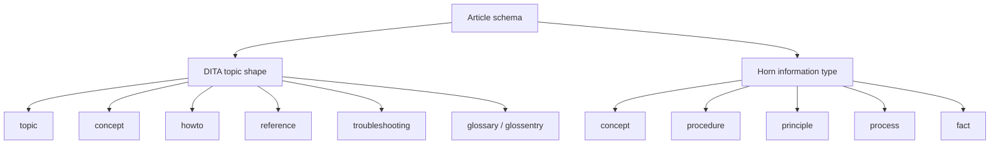
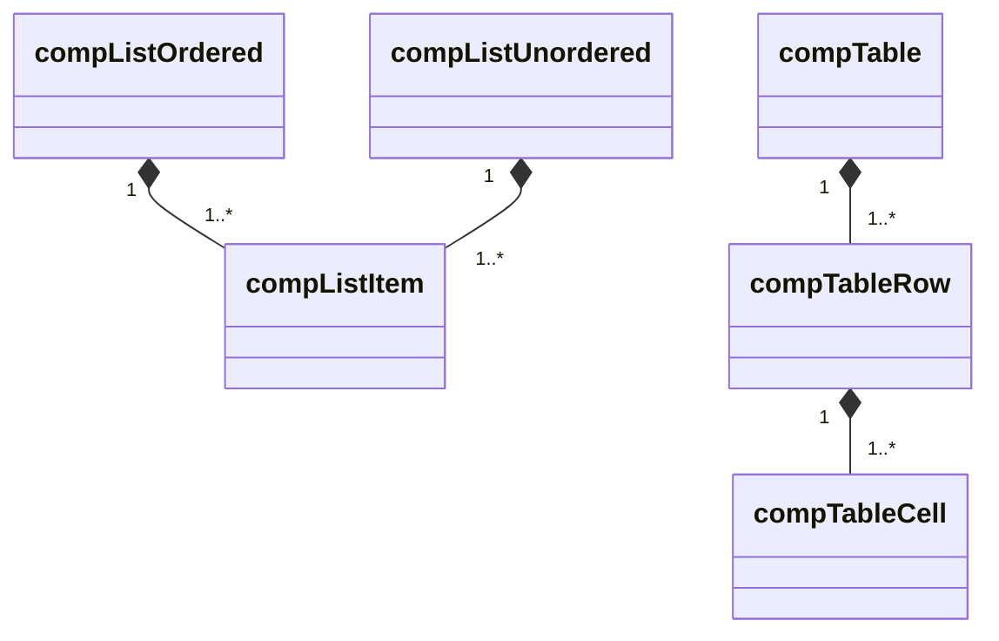

# Construction of the Structured Markdown Pattern Object Model

The Pattern Object Model (POM) is a JSON Schema pattern language for Markdown that is intended to render as HTML5. It is not the parser. It is the concrete validation target that the parser produces after reading Markdown or rendered HTML.

The parser should preserve source structure and provenance, classify references and metadata, expose diagnostics, and emit normalized output that conforms to this model when the source can be classified.

## Model Shape

The model has four structural levels:

Article is a single Markdown file or HTML5 page. Unit is a logical chunk inside the article, often introduced by a heading. Component maps to block-level Markdown and HTML5 constructs. Attribute maps to inline constructs such as text, links, code spans, emphasis, and images.

## Two Classification Layers

The article level carries two explicit classification layers:

| Field | Purpose | Values |
|---|---|---|
| `ditaType` | Publication/topic shape inspired by DITA 1.3. | `topic`, `concept`, `howto`, `reference`, `troubleshooting`, `glossary`, `glossentry` |
| `informationType` | Rhetorical function inspired by Robert Horn information mapping. | `concept`, `procedure`, `principle`, `process`, `fact`, `mixed`, `unknown` |

`articleType` names the concrete root-level schema, such as `concept`, `howto`, `reference`, `troubleshooting`, `glossary`, `glossentry`, `quickstart`, or `tutorial`.

The unit level also carries `informationType`. This lets a single article contain multiple information blocks. For example, a how-to article can contain an introductory concept, prerequisite facts, a procedure, reference facts, and related links.

## Root Article Schemas

The root-level article schemas live in `model/articles`.

| Schema | Role |
|---|---|
| `artArticle.schema.json` | Union of all article root schemas. |
| `artTopic.schema.json` | Generic known-topic container. |
| `artConcept.schema.json` | Conceptual explanation. |
| `artHowto.schema.json` | Task-oriented procedure. |
| `artReference.schema.json` | Lookup-oriented facts, tables, options, or examples. |
| `artTroubleshooting.schema.json` | Symptoms, causes, diagnostics, and fixes. |
| `artGlossary.schema.json` | Multiple glossary entries. |
| `artGlossentry.schema.json` | One glossary term and definition. |
| `artOverview.schema.json` | Specialized concept article. |
| `artQuickstart.schema.json` | Specialized how-to article. |
| `artTutorial.schema.json` | Specialized how-to teaching article. |
| `artUnknown.schema.json` | Fallback when triage is not possible. |

`topic` is the generic known article container. `unknown` is the fallback for content the parser cannot classify safely.

## Unit Schemas

Unit schemas live in `model/articles/units`.

The core information-mapping units are:

| Unit | Information type | Meaning |
|---|---|---|
| `unitConcept` | `concept` | Explains an idea or thing. |
| `unitProcedure` | `procedure` | Describes steps to accomplish a goal. |
| `unitPrinciple` | `principle` | States a rule, policy, or design constraint. |
| `unitProcess` | `process` | Describes how something works over time. |
| `unitFact` | `fact` | Records lookup facts, values, or parameters. |

Additional structural units include introduction, prerequisites, reference, troubleshooting, glossary, glossentry, next-step links, related links, and unknown.

Units use ordered `content` arrays so the parser can preserve source order. This avoids the ambiguity of object property bags, where ordering is not the main contract.

## Component and Attribute Syntax

Component schemas live in `model/articles/units/components`. Attributes live in `model/articles/units/components/attributes`.

Components describe block-level Markdown and HTML5 syntax. Attributes describe inline syntax.

Dependent components are intentionally not allowed directly inside units:

- `compListItem` is valid inside `compListOrdered` or `compListUnordered`.
- `compTableRow` is valid inside `compTable`.
- `compTableCell` is valid inside `compTableRow`.

This makes component dependency explicit in the schema language.

## Metadata Hooks

Each level may contain a `metadata` object. The model keeps core classification fields outside the metadata bag:

- Article classification: `articleType`, `ditaType`, `informationType`
- Unit classification: `unitType`, `informationType`
- Component classification: `componentType`
- Attribute classification: `attType`

Metadata hooks are open by design so parsers, validators, and downstream tools can attach provenance, product metadata, publishing metadata, review state, or diagnostics without changing the structural grammar.

## Parser Contract Guidance

A parser that targets this model should:

1. Preserve source order in `content` arrays.
2. Prefer known schemas when classification is clear.
3. Use `artUnknown`, `unitUnknown`, `compUnknown`, or `attUnknown` when classification is ambiguous.
4. Preserve Markdown source strings where practical.
5. Add HTML5 render information when available.
6. Preserve source path, line spans, and query paths in `source` or `provenance` hooks.
7. Emit diagnostics outside the model or in metadata hooks rather than silently discarding unsupported semantics.

The schemas describe the words of the pattern language. The nesting rules describe its syntax.
