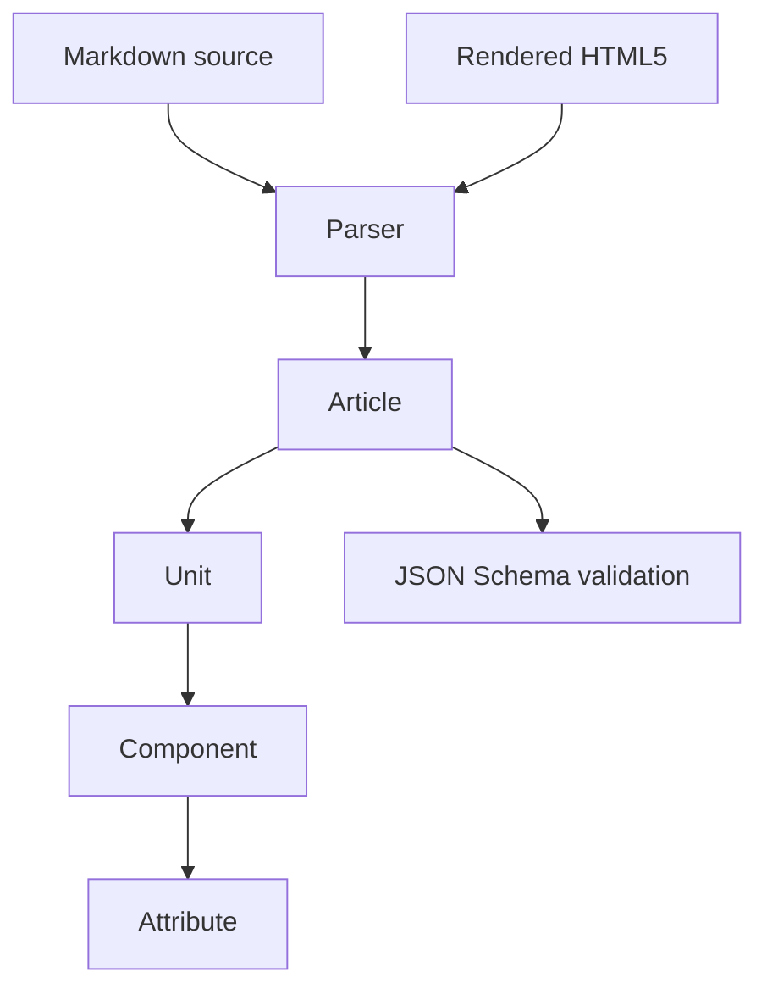
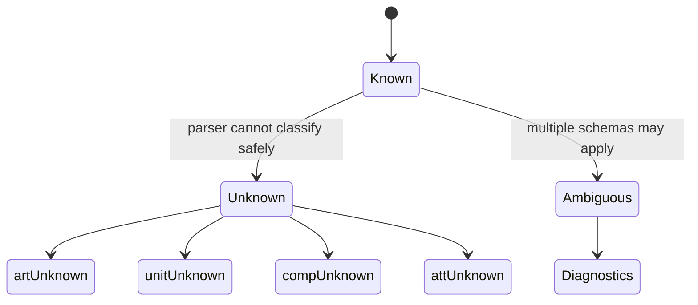

# Structured Markdown Model Overview

This model is a machine-readable pattern language for structured Markdown. It gives a parser a concrete target and gives validators a stable contract.

## Layered View

## Article Type Matrix

| Article schema | DITA shape | Horn type | Primary unit expectation |
|---|---|---|---|
| `artTopic` | `topic` | mixed or selected | Any known unit |
| `artConcept` | `concept` | `concept` | `unitConcept` |
| `artHowto` | `howto` | `procedure` | `unitProcedure` |
| `artReference` | `reference` | `fact` | `unitReference` |
| `artTroubleshooting` | `troubleshooting` | `process` | `unitTroubleshooting` |
| `artGlossary` | `glossary` | `fact` | `unitGlossentry` |
| `artGlossentry` | `glossentry` | `fact` | `unitGlossentry` |

## Fallback Model

Unknown objects are not parser failures. They preserve content while making uncertainty explicit for diagnostics, validation, and downstream review.

## Implementation Notes

- Use `artArticle.schema.json` when any valid article type is acceptable.
- Use a concrete article schema when a validator expects a specific article type.
- Use ordered arrays for `content` at article, unit, and component levels.
- Keep row and item dependencies nested under their parent component.
- Keep metadata open, but do not hide core classification fields in metadata.
